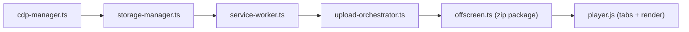
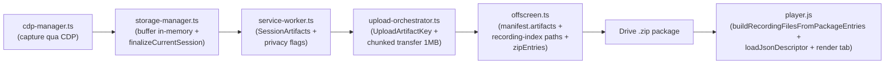
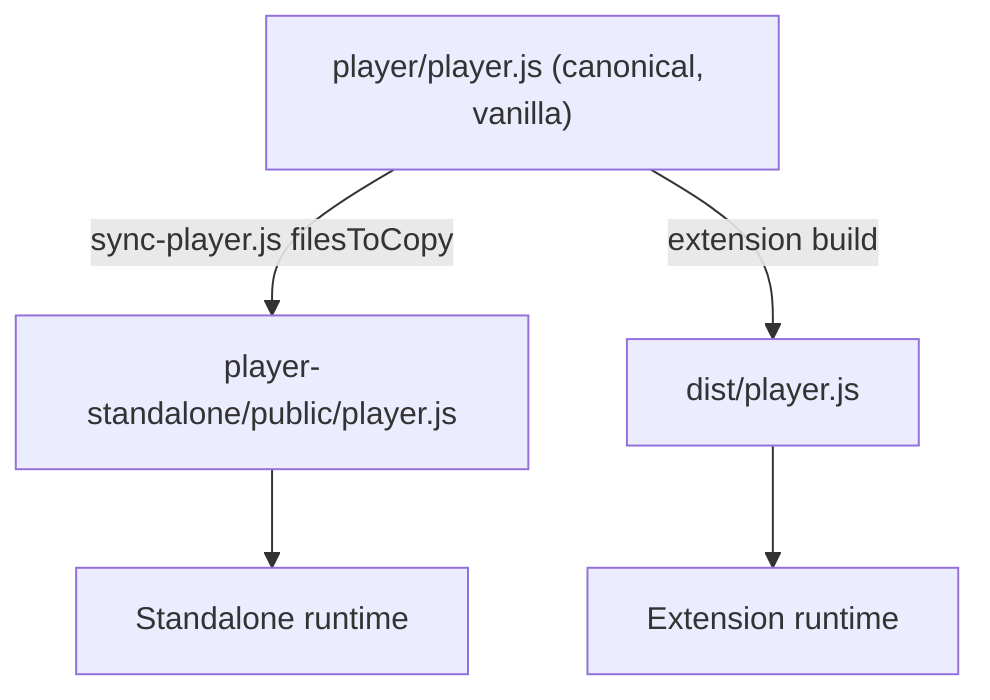
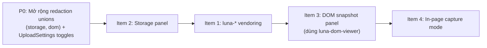
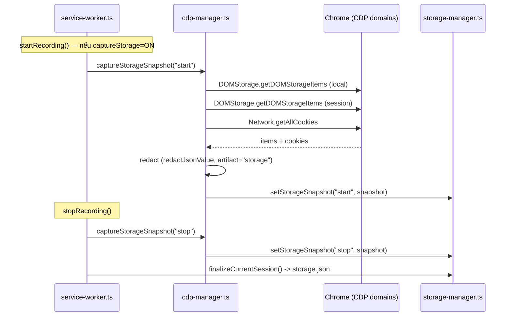
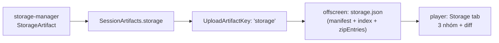
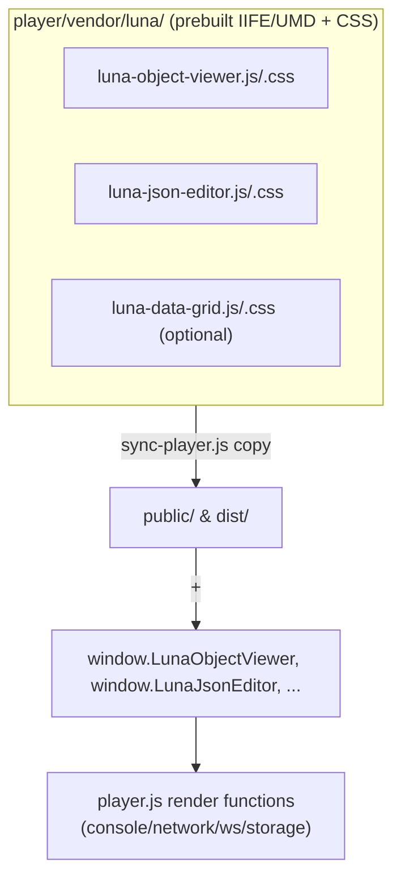
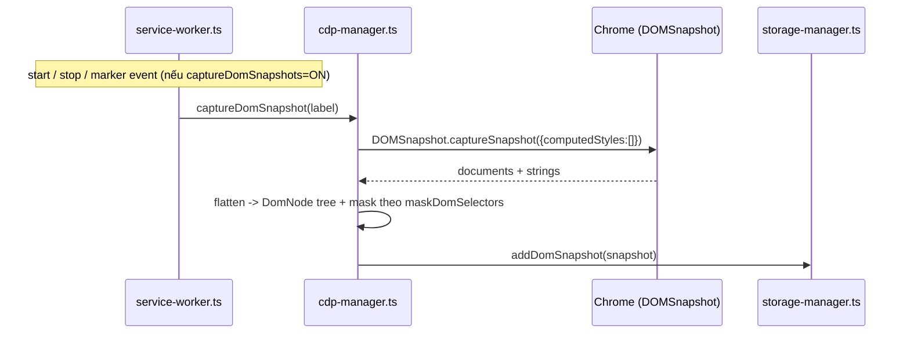
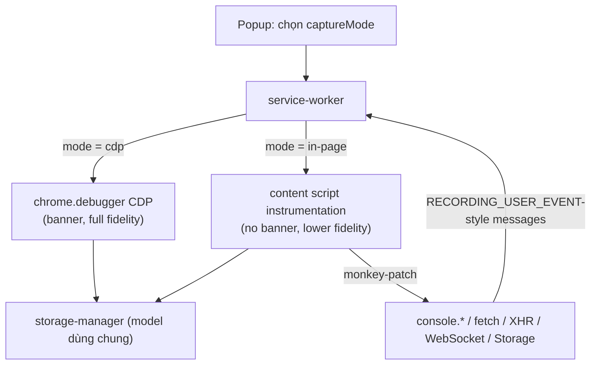

# Design Document: Player Inspector Enhancements

## Overview

Tài liệu này thiết kế 4 hạng mục mở rộng năng lực debug theo phong cách [eruda](https://github.com/liriliri/eruda) / [chii](https://github.com/liriliri/chii) cho hệ thống GN Tracing (extension MV3 + standalone replay player). Mục tiêu là đưa thêm các "panel" inspector vào player và mở rộng pipeline capture của extension, trong khi vẫn tôn trọng kiến trúc artifact pipeline hiện có, ràng buộc bundling của `player.js`, và hệ thống redaction/privacy đã có sẵn.

Bốn hạng mục, theo thứ tự triển khai khuyến nghị:

| Thứ tự | Hạng mục | Mô tả ngắn | ROI / Rủi ro |
| --- | --- | --- | --- |
| 1 (làm trước) | **Item 2 — Resources/Storage panel** | Snapshot localStorage/sessionStorage/cookies tại start & stop, artifact `storage.json`, tab "Storage" với diff start↔stop | ROI cao nhất, rủi ro thấp nhất |
| 2 | **Item 1 — luna-\* UI components** | Vendor prebuilt `luna-object-viewer` / `luna-json-editor` / `luna-data-grid` để thay rendering tay | ROI cao, rủi ro trung bình (bundling) |
| 3 | **Item 3 — Elements/DOM snapshot panel** | Snapshot DOM tĩnh qua `DOMSnapshot.captureSnapshot` tại start/stop/markers, artifact `dom.json`, cây inspectable | ROI trung bình, rủi ro trung bình |
| 4 (dài hạn) | **Item 4 — Low-friction capture mode** | Instrumentation in-page kiểu chobitsu, KHÔNG có banner `chrome.debugger`, opt-in, fidelity thấp hơn | ROI dài hạn, rủi ro cao |

Toàn bộ code/type/identifier giữ nguyên tiếng Anh để đồng bộ với codebase. Phần diễn giải dùng tiếng Việt.

> **Lưu ý ngôn ngữ kỹ thuật**: Các ví dụ code dùng TypeScript cho phần extension (`src/**`) và vanilla JavaScript cho phần player (`player/player.js`), khớp với ngôn ngữ thực tế của từng surface.

## Architecture

Kiến trúc tổng thể được mô tả đầy đủ trong **PHẦN A — Foundations**: artifact pipeline xuyên suốt (A.1), ràng buộc bundling của player (A.2), mở rộng privacy/redaction (A.3), license compatibility (A.4) và sequencing (A.5). Mỗi hạng mục (PHẦN B–E) có sơ đồ component/data-flow riêng. Tóm tắt:



## Components and Interfaces

Các component và interface chi tiết theo từng hạng mục:

- **Item 2 — Storage** (PHẦN B.2): `CdpManager.captureStorageSnapshot`, `StorageManager.setStorageSnapshot`, `SessionArtifacts.storage`, render tab `renderStorageTab`/`diffStorageGroups`.
- **Item 1 — luna components** (PHẦN C.2): adapter `renderObjectValue`/`renderJsonReadonly` quanh global `window.LunaObjectViewer`/`window.LunaJsonEditor`.
- **Item 3 — DOM** (PHẦN D.2): `CdpManager.captureDomSnapshot`, `StorageManager.addDomSnapshot`, render `renderDomTree`.
- **Item 4 — In-page** (PHẦN E.2): `installInPageCapture` (MAIN world), `captureMode` switch trong service-worker.

## Data Models

Toàn bộ model mới được thêm vào `src/types/recording.ts` và `src/types/messages.ts`. Chi tiết: `StorageKeyValue`/`CookieRecord`/`StorageSnapshot`/`StorageArtifact` (PHẦN B.1), `DomNode`/`DomSnapshot`/`DomArtifact` (PHẦN D.1), mở rộng `RedactionArtifact` + `UploadSettings` toggles (PHẦN A.3), `CaptureMode` (PHẦN E.1).

## Correctness Properties

Correctness properties được liệt kê theo từng hạng mục: PHẦN B.3 (Storage), C.3 (luna), D.3 (DOM), E.3 (In-page). Tổng hợp các property nền tảng (chi tiết và per-item ở các phần tương ứng):

### Property 1: Capture gating theo toggle

Khi toggle capture (`captureStorage` / `captureDomSnapshots`) = false thì KHÔNG tạo artifact tương ứng: `settings.captureStorage === false ⟹ sessionArtifacts[id].storage === undefined` (tương tự cho `dom`).

**Validates: Requirements 1.2, 1.3**

### Property 2: Redaction/masking bắt buộc

Mọi key/value/attribute khớp sensitive pattern (`classifyKey`) hoặc `maskDomSelectors` đều bị che trước khi vào artifact: `classifyKey(item.key) ≠ null ⟹ item.value === REDACTED_VALUE`.

**Validates: Requirements 1.4, 1.5**

### Property 3: Round-trip serialize

Mọi artifact mới giữ nguyên dữ liệu qua serialize→parse: `parse(JSON.stringify(artifact)) deep_equals artifact`.

**Validates: Requirements 2.5**

### Property 4: Diff completeness (Storage)

Mọi key xuất hiện ở start hoặc stop có đúng 1 row diff: `∀ key ∈ (keys(start) ∪ keys(stop)): exactly_one_row(diff, key)`.

**Validates: Requirements 5.2**

### Property 5: Tree well-formed (DOM)

Cây DOM flatten hợp lệ (mỗi node ≤ 1 parent, không cycle): `isTree(snapshot.root) === true`.

**Validates: Requirements 7.2**

### Property 6: Cleanup an toàn (In-page)

Sau STOP, mọi global đã monkey-patch được khôi phục: `console.log === origLog ∧ window.fetch === origFetch`.

**Validates: Requirements 9.4**

## Error Handling

| Tình huống lỗi | Điều kiện | Xử lý | Phục hồi |
| --- | --- | --- | --- |
| Lệnh CDP thất bại (DOMStorage/DOMSnapshot/getAllCookies) | Target detach, origin sai, iframe cross-origin | `try/catch` quanh `#sendCommand`, bỏ qua snapshot lỗi, ghi `limitations` vào privacy summary | Recording vẫn tiếp tục; artifact thiếu phần đó nhưng không hỏng |
| Artifact quá lớn (dom.json) | Vượt giới hạn size | Bỏ `computedStyles`, giới hạn depth; nếu vẫn lớn thì skip + ghi limitation | Package vẫn upload được |
| Global luna chưa nạp | Vendoring/version lỗi | Adapter fallback về legacy renderer (C.2.2) | Player vẫn render bằng renderer cũ |
| MAIN-world injection bị CSP chặn (Item 4) | Trang có CSP nghiêm ngặt | Báo limitation, đề xuất dùng `captureMode: "cdp"` | Người dùng chuyển mode |
| Capture toggle OFF | `captureStorage`/`captureDomSnapshots` = false | Không gọi CDP, không tạo artifact | Không lỗi (đường đi mặc định) |

---

# PHẦN A — FOUNDATIONS (nền tảng dùng chung cho cả 4 hạng mục)

Mọi hạng mục đều phải đi qua các nền tảng dưới đây. Đây là phần BẮT BUỘC đọc trước khi thiết kế từng item.

## A.1 Artifact Pipeline — đường đi của một artifact mới

Mỗi artifact mới (ví dụ `storage.json`, `dom.json`) phải "chạm" vào toàn bộ chuỗi sau. Nếu thiếu một mắt xích, artifact sẽ không tới được player.



### Các touch point cụ thể (checklist cho mọi artifact mới)

1. **`src/background/cdp-manager.ts`** — gọi lệnh CDP để capture dữ liệu thô, áp redaction, đẩy vào `StorageManager`.
2. **`src/background/storage-manager.ts`** — buffer in-memory (mảng/đối tượng), serialize trong `finalizeCurrentSession()` trả về chuỗi JSON. Mở rộng interface `FinalizedRecordingArtifacts`.
3. **`src/background/service-worker.ts`** — thêm field vào `interface SessionArtifacts`, gán giá trị trong `stopRecording()`, thêm vào `buildPrivacyArtifactFlags()`/`buildPrivacySummary()`.
4. **`src/background/upload-orchestrator.ts`** — thêm key vào union `UploadArtifactKey` và vào hàm guard `isUploadArtifactKey()` (transfer chunked 1MB qua `getUploadArtifactChunk`).
5. **`src/offscreen/offscreen.ts`** — 3 vị trí:
   - `interface RecordingManifest["artifacts"]` + object `artifacts` (khoảng dòng 1000) — thêm field path.
   - `recordingIndex.artifacts` (khoảng dòng 1063) — thêm `xxxPath`.
   - mảng `zipEntries` (khoảng dòng 1080) — push entry blob. Cũng cần `interface ZipData`, `GoogleDriveUploadData.artifactKeys`, và `type UploadArtifactKey` cục bộ của offscreen.
6. **`player/player.js`**:
   - `buildRecordingFilesFromPackageEntries()` (dòng ~2573) — đọc path từ `indexJson.artifacts.xxxPath` / `manifestJson.artifacts.xxx`, gắn vào object `resolved`.
   - chuỗi load (dòng ~2999+) — `loadJsonDescriptor(recordingFiles.xxx, "xxx.json", ...)`.
   - `showLogsTab()` (dòng ~677), HTML tab bar, hàm render tab mới.
7. **`player-standalone/scripts/sync-player.js`** — chỉ cần đụng nếu thêm file tĩnh mới (xem A.2 cho vendoring luna).
8. **`src/types/recording.ts`** — thêm các interface model mới (`StorageSnapshot`, `DomSnapshot`, ...).

> Cặp đường dẫn artifact dùng 2 nguồn: `manifest.json` (`artifacts.<name>`) và `recording-index.json` (`artifacts.<name>Path`). Player ưu tiên `indexJson` rồi fallback `manifestJson`. Giữ nguyên quy ước này.

## A.2 Player Bundling Constraint (chìa khóa của Item 1)

**Sự thật quan trọng**: `player/player.js` là ~4500 dòng **vanilla, KHÔNG bundled** JS. Nó là nguồn canonical trong `/player/`, được:
- sync bởi `player-standalone/scripts/sync-player.js` (mảng `filesToCopy = ["player.css", "player.js"]`) vào `player-standalone/public/`,
- và build vào `dist/` của extension,
- nạp qua thẻ `<script src="/player.js">` thuần (trong extension, `main.ts` chỉ inject thẻ script).



**Hệ quả**: KHÔNG thể `import` các module npm `luna-*` trực tiếp vào `player.js` (không có bước bundle ES). 

### Hướng dẫn (Phase A — khuyến nghị, in-scope)

Vendor các bản **prebuilt standalone (IIFE/UMD)** của luna + CSS:

1. Tạo thư mục `player/vendor/luna/` chứa các file đã build sẵn, ví dụ:
   - `luna-object-viewer.js` + `luna-object-viewer.css`
   - `luna-json-editor.js` + `luna-json-editor.css`
   - (tùy chọn) `luna-data-grid.js` + `.css`, `luna-dom-viewer.js` + `.css` (cho Item 3).
2. Thêm các file này vào `filesToCopy` (hoặc một vòng copy thư mục `vendor/`) trong `sync-player.js` để chúng được mirror vào `public/` và `dist/`.
3. Nạp qua `<link rel="stylesheet">` + `<script>` trong cả `player-standalone/index.html` và `player/player.html` (file HTML mà extension dùng), ĐẶT TRƯỚC thẻ nạp `player.js`. Các bundle UMD sẽ export global (ví dụ `window.LunaObjectViewer`).
4. **Pin version** chính xác (ghi vào một file `player/vendor/luna/VERSIONS.md` hoặc comment header) để build tái lập được.
5. Ghi license/attribution: luna là **MIT**. Thêm `player/vendor/luna/LICENSE` (copy từ upstream) và ghi chú trong `docs/compliance/`.

### Phase B (out-of-scope, nặng — chỉ ghi nhận)

Refactor `player.js` thành một ES bundle qua Vite (cho phép `import` trực tiếp npm `luna-*`). Đây là thay đổi lớn về build, không thuộc phạm vi 4 item này; chỉ nêu như lựa chọn dài hạn.

## A.3 Privacy / Redaction Extension (BẮT BUỘC làm trước tiên)

Hệ thống redaction đã tồn tại tại `src/shared/privacy-redaction.ts`, điều khiển bởi `PrivacyRedactionSettings`, với union `RedactionArtifact` và `RedactionClass` trong `src/types/recording.ts`. Capture mới (storage, dom) **mở rộng đáng kể bề mặt PII** nên BẮT BUỘC đi qua redaction.

### A.3.1 Mở rộng union (prerequisite chung của Item 2 & 3)

```typescript
// src/types/recording.ts
export type RedactionArtifact =
  | "headers" | "url" | "body" | "console" | "websocket"
  | "events" | "report" | "visual"
  | "storage"   // MỚI — Item 2
  | "dom";      // MỚI — Item 3
```

### A.3.2 Tái dùng cơ chế sẵn có

- **`redactJsonValue(value, settings, artifact, field, target)`** — đã có sẵn, đi sâu (deep-walk) object/array, áp `classifyKey` theo tên field + redact text. Dùng cho storage values và cookie values. Truyền `artifact = "storage"` / `"dom"`.
- **Sensitive-name patterns** — `classifyKey()` đã nhận diện `password|token|secret|api-key|authorization|session|...`. Tái dùng để redact key của localStorage/cookie name.
- **`maskDomSelectors` / `normalizeMaskDomSelectors`** — đã dùng cho visual blur trong `recording-events.ts`; với Item 3, các node DOM khớp selector này phải được mask (xóa textContent/attribute value) trong snapshot.

### A.3.3 UploadSettings toggles mới (mặc định AN TOÀN)

```typescript
// src/types/messages.ts — thêm vào interface UploadSettings
captureStorage: boolean;          // Item 2, default OFF
redactStorageValues: boolean;     // Item 2, default ON (strong redact)
captureDomSnapshots: boolean;     // Item 3, default OFF
redactDomTextContent: boolean;    // Item 3, default ON (strong redact)
```

Mặc định: capture OFF (privacy-first), redact ON. Khi `captureStorage`/`captureDomSnapshots` = false thì không gọi lệnh CDP tương ứng và không tạo artifact.

### A.3.4 RecordingPrivacySummary

Thêm cờ vào `artifactFlags` và đếm hit trong `counts`:

```typescript
// RecordingPrivacySummary.artifactFlags — thêm:
storage: boolean;   // có capture storage không
dom: boolean;       // có capture dom snapshot không
```

`buildPrivacyArtifactFlags()` trong `service-worker.ts` set các cờ này; redaction hit dùng `artifact: "storage" | "dom"` để hiển thị count trong panel privacy summary của player.

## A.4 Licensing Compatibility

| Thành phần | License | Tương thích với repo (GPL-3.0)? |
| --- | --- | --- |
| eruda | MIT | ✅ |
| luna-* | MIT | ✅ |
| chii | MIT | ✅ |
| chobitsu | MIT | ✅ |
| DevTools frontend | BSD-3-Clause | ✅ |

MIT và BSD-3-Clause đều permissive và tương thích GPL-3.0. Yêu cầu: giữ nguyên copyright notice + license text của upstream khi vendoring (xem A.2 bước 5). Item 4 chỉ lấy **ý tưởng** instrumentation từ chobitsu (không vendor code), nhưng nếu vendor bất kỳ phần nào thì kèm license.

## A.5 Sequencing & Shared Prerequisites



- **P0 (prerequisite)**: Mở rộng `RedactionArtifact` (`storage`, `dom`) và thêm các toggle `UploadSettings` TRƯỚC, để Item 2 và Item 3 build trên nền chung.
- **Item 2 trước**: Đặt nền artifact pipeline đầy đủ (capture→buffer→upload→package→render) với rủi ro thấp.
- **Item 1 sau Item 2**: Khi đã có panel mới, áp luna components để nâng cấp rendering cho cả console/network/ws/storage cùng lúc.
- **Item 3 dùng lại** luna (`luna-dom-viewer`) đã vendor ở Item 1.
- **Item 4 cuối**: Tách biệt, opt-in, dùng lại model storage/console đã định nghĩa.

---

# PHẦN B — ITEM 2: Resources/Storage Panel (làm trước)

## B.1 High-Level Design

**Mục tiêu**: Snapshot `localStorage` + `sessionStorage` + cookies tại thời điểm **recording start** VÀ **recording stop**, đóng gói thành artifact `storage.json`, hiển thị tab "Storage" trong player với 3 nhóm và diff start↔stop. Capture mặc định **OFF** vì lý do privacy.



### Data flow tới player



### Data Models (thêm vào `src/types/recording.ts`)

```typescript
export interface StorageKeyValue {
  key: string;
  value: string;          // đã redact nếu redactStorageValues=ON
  redacted?: boolean;     // đánh dấu giá trị đã bị che
}

export interface CookieRecord {
  name: string;
  value: string;          // đã redact
  domain: string;
  path: string;
  expires?: number;       // -1 nếu session cookie
  size?: number;
  httpOnly?: boolean;
  secure?: boolean;
  sameSite?: "Strict" | "Lax" | "None";
  redacted?: boolean;
}

export interface StorageSnapshot {
  phase: "start" | "stop";
  capturedAt: number;            // epoch ms
  localStorage: StorageKeyValue[];
  sessionStorage: StorageKeyValue[];
  cookies: CookieRecord[];
}

export interface StorageArtifact {
  schemaVersion: 1;
  snapshots: StorageSnapshot[];  // [start?, stop?]
}
```

## B.2 Low-Level Design

### B.2.1 `cdp-manager.ts` — capture

Bật domain và thêm method capture. `DOMStorage` cần enable; cookies lấy qua `Network.getAllCookies` (Network đã enable sẵn cho networking capture).

```typescript
// cdp-manager.ts

interface CdpDomStorageItemsResult {
  entries?: [string, string][];   // [key, value][]
}
interface CdpCookiesResult {
  cookies?: Array<{
    name: string; value: string; domain: string; path: string;
    expires: number; size: number; httpOnly: boolean;
    secure: boolean; sameSite?: string;
  }>;
}

/**
 * Capture localStorage/sessionStorage/cookies snapshot tại 1 phase.
 * Pre: this.#attached === true; captureStorage toggle đã bật ở caller.
 * Post: snapshot đã redact được đẩy vào StorageManager.setStorageSnapshot.
 */
async captureStorageSnapshot(phase: "start" | "stop"): Promise<void> {
  if (!this.#tabId) return;
  const origin = await this.#resolveSecurityOrigin();   // từ tab url
  const debuggee = { tabId: this.#tabId };

  const [local, session, cookies] = await Promise.all([
    this.#getDomStorage(debuggee, origin, false),  // isLocalStorage=false? xem ghi chú
    this.#getDomStorage(debuggee, origin, true),
    this.#sendCommand(debuggee, "Network.getAllCookies") as Promise<CdpCookiesResult>,
  ]);

  const snapshot: StorageSnapshot = {
    phase,
    capturedAt: Date.now(),
    localStorage: this.#redactStorageItems(local, "storage.localStorage"),
    sessionStorage: this.#redactStorageItems(session, "storage.sessionStorage"),
    cookies: this.#redactCookies(cookies.cookies ?? []),
  };
  this.#storage.setStorageSnapshot(snapshot);
}

async #getDomStorage(
  debuggee: chrome.debugger.Debuggee,
  securityOrigin: string,
  isLocalStorage: boolean,
): Promise<[string, string][]> {
  // DOMStorage cần Enable trước (gọi một lần khi attach hoặc lazily ở đây).
  const result = (await this.#sendCommand(debuggee, "DOMStorage.getDOMStorageItems", {
    storageId: { securityOrigin, isLocalStorage },
  })) as CdpDomStorageItemsResult;
  return result.entries ?? [];
}

#redactStorageItems(entries: [string, string][], fieldPrefix: string): StorageKeyValue[] {
  return entries.map(([key, value]) => {
    // Tái dùng redactJsonValue: bao value trong object {key: value} để classifyKey bắt theo tên key
    const r = redactJsonValue({ [key]: value }, this.#privacySettings, "storage", fieldPrefix, "body");
    const redactedValue = (r.value as Record<string, unknown>)[key];
    if (r.applied.length) this.#recordRedactionHits(r.applied);
    return {
      key,
      value: typeof redactedValue === "string" ? redactedValue : String(redactedValue),
      redacted: r.applied.length > 0 || undefined,
    };
  });
}

#redactCookies(cookies: CdpCookiesResult["cookies"]): CookieRecord[] { /* tương tự, redact name+value */ }
```

> **Ghi chú DOMStorage**: Cờ `isLocalStorage` của CDP: `true` → localStorage, `false` → sessionStorage. Khi gọi `#getDomStorage(..., false)` cho session và `true` cho local — cần đảo lại đúng theo CDP semantics; comment ở trên để cài đặt kiểm chứng khi code. `DOMStorage.enable` được gọi trong `#enableDomains()`.

### B.2.2 `storage-manager.ts` — buffer + finalize

```typescript
export class StorageManager {
  #storageSnapshots: StorageSnapshot[] = [];   // MỚI

  beginSession(): void {
    /* ...existing resets... */
    this.#storageSnapshots = [];               // MỚI
  }

  setStorageSnapshot(snapshot: StorageSnapshot): void {   // MỚI
    this.#storageSnapshots.push(snapshot);
  }

  finalizeCurrentSession(): FinalizedRecordingArtifacts {
    /* ...existing... */
    const storage: StorageArtifact | undefined =
      this.#storageSnapshots.length > 0
        ? { schemaVersion: 1, snapshots: this.#storageSnapshots }
        : undefined;
    const artifacts: FinalizedRecordingArtifacts = {
      /* ...existing fields... */
      storageSnapshots: storage ? JSON.stringify(storage) : undefined,   // MỚI
    };
    this.beginSession();
    return artifacts;
  }
}

// Mở rộng interface FinalizedRecordingArtifacts:
interface FinalizedRecordingArtifacts {
  /* ...existing... */
  storageSnapshots?: string;   // MỚI
}
```

### B.2.3 `service-worker.ts` — wiring

```typescript
export interface SessionArtifacts {
  /* ...existing... */
  storage?: string;   // MỚI
}

// trong startRecording(), sau cdp.attach():
if (settings.captureStorage) {
  await cdp.captureStorageSnapshot("start");
}

// trong stopRecording(), trước storage.finalizeCurrentSession():
if (activeRecording.recordingSettings?.captureStorage) {
  await cdp.captureStorageSnapshot("stop");
}
// ...
sessionArtifacts[sessionId] = {
  /* ...existing... */
  storage: finalizedArtifacts.storageSnapshots,   // MỚI
};

// buildPrivacyArtifactFlags(): thêm
storage: Boolean(finalizedArtifacts.storageSnapshots),
```

### B.2.4 `upload-orchestrator.ts`

```typescript
export type UploadArtifactKey =
  | "consoleLogs" | "networkRequests" | "webSocketLogs"
  | "report" | "userEvents" | "privacy" | "diagnostics"
  | "storage";   // MỚI

export function isUploadArtifactKey(key: string): key is UploadArtifactKey {
  return ( /* ...existing... */ || key === "storage" );
}
```

### B.2.5 `offscreen.ts` — 3 vị trí

```typescript
// 1) interface RecordingManifest["artifacts"] + interface ZipData + GoogleDriveUploadData.artifactKeys + UploadArtifactKey cục bộ: thêm "storage"/"storagePath"

// 2) const storageBlob = (data.artifactKeys?.storage || data.storage)
//      ? await createArtifactBlob(sessionId, "storage", data.storage) : null;

// 3a) artifacts object (manifest):
...(storageBlob ? { storage: "storage.json" } : {}),
// 3b) recordingIndex.artifacts:
...(storageBlob ? { storagePath: "storage.json" } : {}),
// 3c) zipEntries:
if (storageBlob) zipEntries.push({ name: "storage.json", blob: storageBlob });
```

### B.2.6 `player/player.js` — load + render

```javascript
// buildRecordingFilesFromPackageEntries(): thêm
const storagePath = indexJson?.artifacts?.storagePath || manifestJson?.artifacts?.storage;
const storageEntry = storagePath ? getPackageEntry(entries, storagePath, false) : null;
resolved.storage = storageEntry ? { blob: storageEntry } : null;

// chuỗi load:
recordingFiles.storage
  ? loadJsonDescriptor(recordingFiles.storage, "storage.json", {
      onProgress: createLoadingProgressReporter("storage", "other", "storage.json"),
    }).then((storageJson) => { state.storage = storageJson; })
  : Promise.resolve(),

// showLogsTab(): thêm isStorage và toggle #storage-tab / #storage-viewer
function showLogsTab(tabName) {
  const isStorage = tabName === "storage";
  /* ...existing toggles... */
  elements.storageTab?.classList.toggle("active", isStorage);
  elements.storageViewer?.classList.toggle("hidden", !isStorage);
}

// renderStorageTab(): với mỗi nhóm (local/session/cookies) render bảng key/value,
// và tính diff start↔stop: added / removed / changed.
function diffStorageGroups(startItems, stopItems) {
  const startMap = new Map(startItems.map((it) => [it.key, it.value]));
  const stopMap = new Map(stopItems.map((it) => [it.key, it.value]));
  const rows = [];
  for (const [key, value] of stopMap) {
    if (!startMap.has(key)) rows.push({ key, status: "added", value });
    else if (startMap.get(key) !== value) rows.push({ key, status: "changed", from: startMap.get(key), to: value });
    else rows.push({ key, status: "unchanged", value });
  }
  for (const [key, value] of startMap) {
    if (!stopMap.has(key)) rows.push({ key, status: "removed", value });
  }
  return rows;
}
```

HTML (`player/player.html` + `player-standalone/index.html`): thêm `<button id="storage-tab" class="tab-btn">Storage</button>` vào `.tab-bar`, và `<div id="storage-viewer" class="viewer-container hidden">...</div>`.

## B.3 Correctness Properties (Item 2)

```typescript
// P1: Khi captureStorage = OFF, không tạo artifact storage.
∀ recording: settings.captureStorage === false ⟹ sessionArtifacts[id].storage === undefined

// P2: Diff đầy đủ — mọi key xuất hiện ở start hoặc stop đều có đúng 1 row diff.
∀ key ∈ (keys(start) ∪ keys(stop)): exactly_one_row(diff, key)

// P3: Redaction — khi redactStorageValues=ON, mọi value khớp sensitive pattern đều bị che.
∀ item: classifyKey(item.key) ≠ null ⟹ item.value === REDACTED_VALUE ∧ item.redacted === true

// P4: Round-trip — StorageArtifact serialize→parse giữ nguyên dữ liệu.
parse(JSON.stringify(artifact)) deep_equals artifact
```

## B.4 Effort / Risk

- **Effort**: Trung bình (~chạm 6 file + 2 HTML + render). Nền tảng cho các item sau.
- **Risk**: Thấp. CDP `DOMStorage`/`Network.getAllCookies` ổn định; snapshot tĩnh không ảnh hưởng timing video.
- **Cạm bẫy**: `getAllCookies` trả cookie toàn browser (không chỉ origin) → cân nhắc filter theo domain của tab để giảm PII; `securityOrigin` phải khớp origin thực tế của tab (lưu ý iframe cross-origin nằm ngoài scope phase đầu).

---

# PHẦN C — ITEM 1: Reuse luna-* UI Components

## C.1 High-Level Design

**Mục tiêu**: Thay rendering object/JSON "tay" trong player bằng các component luna chuẩn:
- `luna-object-viewer` → render console args (`SerializedRemoteObject`/`ObjectPreview`).
- `luna-json-editor` (read-only) → render network response bodies, WS payloads, storage values.
- (tùy chọn) `luna-data-grid` → bảng network/storage.



Vì ràng buộc bundling (A.2), đây là vendoring prebuilt + global, KHÔNG import npm.

## C.2 Low-Level Design

### C.2.1 Vendoring + sync

```javascript
// player-standalone/scripts/sync-player.js
// Cách 1: thêm explicit vào filesToCopy
const filesToCopy = ["player.css", "player.js"];
// + copy đệ quy vendor/
const vendorSrc = path.join(sourceDir, "vendor");
const vendorDest = path.join(targetDir, "vendor");
copyDirRecursive(vendorSrc, vendorDest);   // helper mới, copy luna js/css + LICENSE
```

```html
<!-- player-standalone/index.html & player/player.html — TRƯỚC <script src="/player.js"> -->
<link rel="stylesheet" href="/vendor/luna/luna-object-viewer.css">
<link rel="stylesheet" href="/vendor/luna/luna-json-editor.css">
<script src="/vendor/luna/luna-object-viewer.js"></script>
<script src="/vendor/luna/luna-json-editor.js"></script>
```

### C.2.2 Render adapter trong `player.js`

Tạo lớp adapter mỏng để dễ fallback nếu global chưa nạp được.

```javascript
// Pre: window.LunaObjectViewer có thể undefined (vendoring lỗi) -> fallback renderer cũ.
function renderObjectValue(container, value) {
  const ObjectViewer = window.LunaObjectViewer;
  if (!ObjectViewer) return renderObjectValueLegacy(container, value); // giữ hàm cũ làm fallback
  const viewer = new ObjectViewer(container);
  viewer.set(value);
  return viewer;
}

function renderJsonReadonly(container, jsonValue) {
  const JsonEditor = window.LunaJsonEditor;
  if (!JsonEditor) return renderJsonLegacy(container, jsonValue);
  const editor = new JsonEditor(container, { readOnly: true });
  editor.set(jsonValue);
  return editor;
}
```

Áp dụng tại: render console entry args, network response body preview (`toggle-json-preview`), WS frame payload, và storage value cell (Item 2).

## C.3 Correctness Properties (Item 1)

```typescript
// P1: Fallback an toàn — khi global luna không tồn tại, renderer cũ vẫn chạy (không throw).
window.LunaObjectViewer === undefined ⟹ renderObjectValue dùng legacy ∧ không ném lỗi

// P2: Read-only — luna-json-editor không cho chỉnh sửa (player chỉ replay).
∀ jsonEditor: editor.options.readOnly === true

// P3: Parity — output luna phủ mọi type mà legacy phủ (string/number/object/array/null/undefined/function preview).
```

## C.4 Effort / Risk

- **Effort**: Trung bình–cao (chủ yếu là build/vendor + tích hợp render points). Cần xác minh API global chính xác của bản luna đã chọn.
- **Risk**: Trung bình. Rủi ro chính là bundling/version mismatch và CSS xung đột theme. Mitigation: giữ legacy renderer làm fallback, scope CSS, pin version.

---

# PHẦN D — ITEM 3: Elements/DOM Snapshot Panel

## D.1 High-Level Design

**Mục tiêu**: Snapshot DOM tĩnh qua `DOMSnapshot.captureSnapshot` tại **start / stop / markers**, artifact `dom.json`, render cây inspectable trong player (cân nhắc `luna-dom-viewer`). **Scope = snapshot tĩnh tại marker, KHÔNG phải replay liên tục kiểu rrweb.**



### Data Models (`src/types/recording.ts`)

```typescript
export interface DomNode {
  nodeType: number;
  nodeName: string;
  nodeValue?: string;            // text đã mask nếu cần
  attributes?: Record<string, string>;  // value nhạy cảm đã redact
  children?: DomNode[];
  masked?: boolean;
}

export interface DomSnapshot {
  label: "start" | "stop" | string;   // marker id
  capturedAt: number;
  documentUrl: string;
  root: DomNode;
}

export interface DomArtifact {
  schemaVersion: 1;
  snapshots: DomSnapshot[];
}
```

## D.2 Low-Level Design

### D.2.1 `cdp-manager.ts`

```typescript
/**
 * Pre: captureDomSnapshots=ON; this.#attached.
 * Post: 1 DomSnapshot đã flatten + mask đẩy vào StorageManager.addDomSnapshot.
 */
async captureDomSnapshot(label: string): Promise<void> {
  if (!this.#tabId) return;
  const debuggee = { tabId: this.#tabId };
  const result = (await this.#sendCommand(debuggee, "DOMSnapshot.captureSnapshot", {
    computedStyles: [],          // không cần style cho cây tĩnh
    includePaintOrder: false,
    includeDOMRects: false,
  })) as CdpDomSnapshotResult;

  const root = this.#flattenDomSnapshot(result);              // dựng cây từ documents+strings
  const masked = this.#maskDomTree(root, this.#privacySettings.maskDomSelectors); // mask + redact attrs
  this.#storage.addDomSnapshot({
    label,
    capturedAt: Date.now(),
    documentUrl: this.#tabUrlForSnapshot(),
    root: masked,
  });
}
```

- `#flattenDomSnapshot`: CDP `DOMSnapshot.captureSnapshot` trả về cấu trúc dạng index-array (`documents`, `strings`); cần dựng lại cây cha-con.
- `#maskDomTree`: với node khớp `maskDomSelectors` → thay `nodeValue`/attribute values bằng `REDACTED_VALUE`, set `masked=true`; với attribute tên nhạy cảm dùng `classifyKey` (tái dùng).

### D.2.2 → D.2.5 Pipeline (giống Item 2)

- `storage-manager.ts`: `#domSnapshots: DomSnapshot[]`, `addDomSnapshot()`, finalize → `domSnapshots?: string` (DomArtifact).
- `service-worker.ts`: `SessionArtifacts.dom?: string`; gọi `cdp.captureDomSnapshot("start"|"stop")` và tại marker event; `artifactFlags.dom`.
- `upload-orchestrator.ts`: `UploadArtifactKey | "dom"` + guard.
- `offscreen.ts`: 3 vị trí cho `dom.json` (`{ dom: "dom.json" }`, `{ domPath: "dom.json" }`, `zipEntries.push`).
- `player.js`: load `recordingFiles.dom`, tab `#elements-tab`/`#elements-viewer`, render cây.

### D.2.6 Player render

```javascript
function renderDomTree(container, snapshot) {
  const DomViewer = window.LunaDomViewer;   // vendor ở Item 1 (tùy chọn)
  if (DomViewer) { const v = new DomViewer(container, { node: snapshot.root }); return v; }
  return renderDomTreeFallback(container, snapshot.root); // <details>/<summary> tree
}
```

Nếu có nhiều snapshot (start/stop/markers) → dropdown chọn snapshot theo label/time.

## D.3 Correctness Properties (Item 3)

```typescript
// P1: Capture gating
settings.captureDomSnapshots === false ⟹ sessionArtifacts[id].dom === undefined

// P2: Masking — mọi node khớp maskDomSelectors có masked=true và không lộ text gốc.
∀ node matches maskDomSelector: node.masked === true ∧ node.nodeValue !== originalText

// P3: Tree well-formed — flatten ra cây hợp lệ (mỗi node ≤ 1 parent, không cycle).
isTree(snapshot.root) === true

// P4: Snapshot tĩnh — số snapshot = số marker capture (start + stop + N markers), không liên tục.
count(snapshots) === capturedMarkers.length
```

## D.4 Effort / Risk

- **Effort**: Cao. Phần khó là flatten cấu trúc index-array của `DOMSnapshot.captureSnapshot` thành cây và masking chính xác.
- **Risk**: Trung bình–cao. `dom.json` có thể lớn → cần giới hạn (bỏ computedStyles, giới hạn depth/size). PII surface lớn → masking BẮT BUỘC. Cross-origin iframe có thể không snapshot được đầy đủ.

---

# PHẦN E — ITEM 4: Low-Friction In-Page Capture Mode (dài hạn, opt-in)

## E.1 High-Level Design

**Mục tiêu**: Chế độ capture "ít ma sát" kiểu chobitsu — instrumentation **in-page** (mở rộng pattern `content/recording-events.ts`) để bắt console/network/storage **KHÔNG cần banner `chrome.debugger`**. Đây là chế độ thứ cấp, fidelity thấp hơn (không có response body cross-origin, không source map thật). Thêm `captureMode: "cdp" | "in-page"`.



```typescript
// src/types/messages.ts
export type CaptureMode = "cdp" | "in-page";
// UploadSettings: thêm
captureMode: CaptureMode;   // default "cdp"
```

## E.2 Low-Level Design

Mở rộng `src/content/recording-events.ts` (hoặc file content mới `recording-inpage-capture.ts` cùng pattern inject/cleanup) để monkey-patch trong **MAIN world** (cần `world: "MAIN"` khi `chrome.scripting.executeScript`, vì console/fetch của page không thấy được từ isolated world).

```typescript
// pseudocode instrumentation (MAIN world), cleanup được như recording-events.ts
function installInPageCapture(sessionId, privacySettings) {
  const origLog = console.log; // ...warn/error/info/debug
  console.log = (...args) => { send(sessionId, toConsoleEntry("log", args)); return origLog(...args); };

  const origFetch = window.fetch;
  window.fetch = async (...a) => {
    const res = await origFetch(...a);
    send(sessionId, toNetworkEntry(a, res));   // KHÔNG đọc body cross-origin
    return res;
  };

  patchXHR();        // wrap XMLHttpRequest.open/send
  patchWebSocket();  // wrap WebSocket send/onmessage
  patchStorage();    // wrap localStorage/sessionStorage setItem/removeItem (optional)

  return () => { console.log = origLog; window.fetch = origFetch; /* unpatch... */ };
}
```

- Tái dùng model `ConsoleEntry` / `NetworkEntry` / `WebSocketEntry` / `StorageSnapshot` đã có để artifact tương thích player (player không cần biết nguồn capture).
- Redaction: áp `redactConsoleEntry`/`redactJsonValue` phía service-worker khi nhận message (như flow `RECORDING_USER_EVENT` hiện tại).
- Service-worker: khi `captureMode === "in-page"` thì KHÔNG gọi `cdp.attach()`; thay vào đó inject script capture và route message vào `StorageManager`.

## E.3 Correctness Properties (Item 4)

```typescript
// P1: Không banner — mode in-page không gọi chrome.debugger.attach.
captureMode === "in-page" ⟹ chrome.debugger.attach KHÔNG được gọi

// P2: Artifact tương thích — entry từ in-page khớp schema mà player đang đọc.
∀ entry(in-page): validagainst(ConsoleEntry | NetworkEntry | WebSocketEntry)

// P3: Cleanup — sau STOP, mọi global đã patch được khôi phục nguyên trạng.
console.log === origLog ∧ window.fetch === origFetch ∧ ...

// P4: Fidelity declared — limitations được ghi vào RecordingPrivacySummary.limitations
//     (no cross-origin response bodies, no real source maps).
```

## E.4 Effort / Risk

- **Effort**: Cao nhất. Monkey-patch MAIN world an toàn + cleanup + tương thích schema.
- **Risk**: Cao. Rủi ro: patch gây side-effect trên page, race với code page, MAIN-world injection bị CSP chặn, fidelity thấp gây hiểu nhầm. Vì vậy opt-in, mặc định `cdp`, và phải khai báo rõ limitations.

---

## Testing Strategy

# PHẦN F — Testing Strategy (chung)
- **Unit (vitest)**: redaction cho storage/dom (`redactJsonValue` với `artifact="storage"/"dom"`), `diffStorageGroups`, flatten DOM tree, guard `isUploadArtifactKey`.
- **Property-based**: round-trip serialize/parse artifact; diff completeness (P2 Item 2); tree well-formed (P3 Item 3). Thư viện: `fast-check` (hệ sinh thái JS/TS của repo).
- **Integration**: load player với package chứa `storage.json`/`dom.json` mẫu, kiểm tra tab render và privacy counts.
- **Manual**: xác minh flow record→stop→upload→replay trên Chromium thật (theo DEVELOPER.md), đặc biệt khi đụng manifest permissions và player loading.

# PHẦN G — Dependencies

- **CDP domains**: `DOMStorage`, `Network.getAllCookies` (Item 2), `DOMSnapshot` (Item 3) — đều có sẵn qua `chrome.debugger` đã dùng.
- **luna prebuilt bundles** (Item 1/3): `luna-object-viewer`, `luna-json-editor`, optional `luna-data-grid`, `luna-dom-viewer` — vendored vào `player/vendor/luna/`, MIT license.
- **fast-check** (test) — nếu chưa có trong devDependencies thì thêm.
- Không thêm runtime npm dependency cho player (giữ ràng buộc non-bundled).
