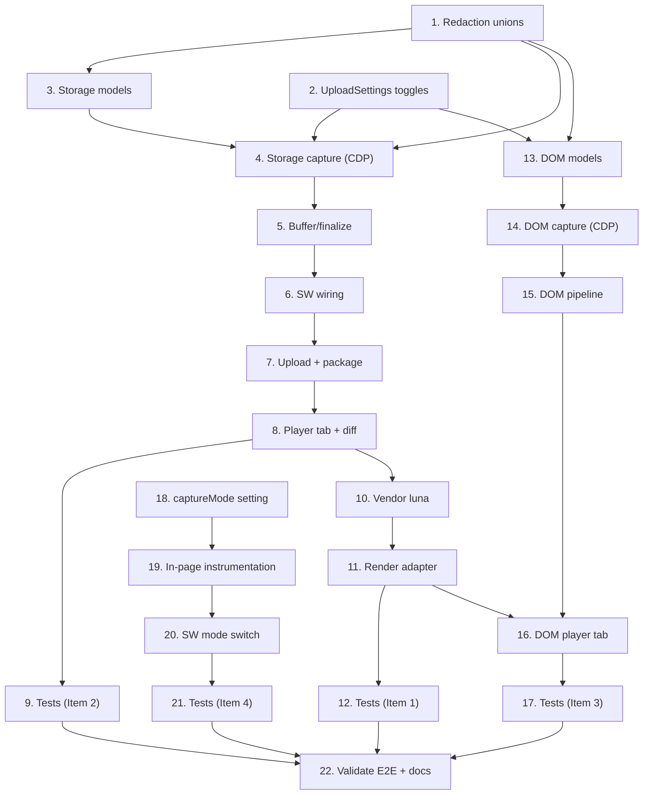

# Implementation Plan

## Overview

Kế hoạch triển khai cho `player-inspector-enhancements`, suy ra từ `design.md` và `requirements.md`. Thứ tự: **P0 (prerequisite) → Item 2 → Item 1 → Item 3 → Item 4**. Mỗi item đi trọn artifact pipeline (capture → buffer → upload → package → render) trước khi sang item kế.

Mỗi task con ghi `Requirements:` tham chiếu acceptance criteria (`R<req>.<criterion>`).

## Task Dependency Graph



Wave definitions (các task trong cùng wave có thể chạy song song nếu đã thỏa dependency):

```json
{
  "waves": [
    { "wave": 1, "tasks": ["1", "2", "18"] },
    { "wave": 2, "tasks": ["3", "19"] },
    { "wave": 3, "tasks": ["4", "20"] },
    { "wave": 4, "tasks": ["5", "21"] },
    { "wave": 5, "tasks": ["6"] },
    { "wave": 6, "tasks": ["7"] },
    { "wave": 7, "tasks": ["8"] },
    { "wave": 8, "tasks": ["9", "10"] },
    { "wave": 9, "tasks": ["11"] },
    { "wave": 10, "tasks": ["12", "13"] },
    { "wave": 11, "tasks": ["14"] },
    { "wave": 12, "tasks": ["15"] },
    { "wave": 13, "tasks": ["16"] },
    { "wave": 14, "tasks": ["17"] },
    { "wave": 15, "tasks": ["22"] }
  ]
}
```

## Tasks

### P0 — Foundations (prerequisite cho Item 2 & 3)

- [x] 1. Mở rộng redaction unions và privacy summary
  - Thêm `"storage"` và `"dom"` vào union `RedactionArtifact` trong `src/types/recording.ts`
  - Thêm `storage` và `dom` vào `RecordingPrivacySummary.artifactFlags`
  - Cập nhật type guard / chỗ dùng `RedactionArtifact` nếu trình biên dịch báo thiếu nhánh
  - Chạy `task typecheck` để xác nhận không vỡ kiểu
  - _Requirements: R1.6, R1.7_

- [x] 2. Thêm UploadSettings toggles với mặc định an toàn
  - Thêm `captureStorage` (default `false`), `redactStorageValues` (default `true`), `captureDomSnapshots` (default `false`), `redactDomTextContent` (default `true`) vào `interface UploadSettings` trong `src/types/messages.ts`
  - Cập nhật default settings store và migration trong `src/background/settings-store.ts`
  - Thêm UI control + i18n string vào `src/settings/settings.ts` (gồm cảnh báo privacy/size)
  - _Requirements: R1.1, R1.2, R1.3_

### Item 2 — Resources/Storage panel

- [x] 3. Định nghĩa data models cho storage artifact
  - Thêm `StorageKeyValue`, `CookieRecord`, `StorageSnapshot`, `StorageArtifact` vào `src/types/recording.ts`
  - _Requirements: R4.6_

- [x] 4. Capture storage qua CDP trong `cdp-manager.ts`
- [x] 4.1 Bật domain và thêm method capture
  - Bật `DOMStorage` trong `#enableDomains()` (Network đã enable sẵn)
  - Thêm `captureStorageSnapshot(phase: "start" | "stop")` gọi `DOMStorage.getDOMStorageItems` (local + session, đúng cờ `isLocalStorage`) và `Network.getAllCookies`
  - Resolve `securityOrigin` từ tab URL; cân nhắc filter cookie theo domain tab để giảm PII
  - _Requirements: R4.1, R4.2, R4.3_
- [x] 4.2 Áp redaction và xử lý lỗi capture
  - Thêm `#redactStorageItems` và `#redactCookies` dùng `redactJsonValue` với `artifact = "storage"`; đánh dấu `redacted`
  - Bọc lệnh CDP trong `try/catch`; khi lỗi thì ghi `limitations` và tiếp tục recording
  - _Requirements: R4.4, R4.5, R1.4_

- [x] 5. Buffer + finalize trong `storage-manager.ts`
  - Thêm `#storageSnapshots: StorageSnapshot[]`, reset trong `beginSession()`
  - Thêm `setStorageSnapshot(snapshot)`
  - Mở rộng `FinalizedRecordingArtifacts` với `storageSnapshots?: string`; serialize `StorageArtifact` trong `finalizeCurrentSession()`
  - _Requirements: R2.1, R2.5, R4.6_

- [x] 6. Wiring trong `service-worker.ts`
  - Thêm `storage?: string` vào `interface SessionArtifacts`
  - Gọi `cdp.captureStorageSnapshot("start")` sau attach và `("stop")` trước finalize, gated bởi `captureStorage`
  - Gán `sessionArtifacts[id].storage` và set `artifactFlags.storage` trong `buildPrivacyArtifactFlags()`
  - _Requirements: R1.2, R1.7, R4.1, R4.2_

- [x] 7. Đưa artifact qua upload + package
- [x] 7.1 `upload-orchestrator.ts`
  - Thêm `"storage"` vào union `UploadArtifactKey` và vào `isUploadArtifactKey()`
  - _Requirements: R2.2_
- [x] 7.2 `offscreen.ts` — 3 vị trí packaging
  - Thêm `storage`/`storagePath` vào `RecordingManifest["artifacts"]`, `ZipData`, `GoogleDriveUploadData.artifactKeys`, và `UploadArtifactKey` cục bộ
  - Tạo `storageBlob`; thêm `{ storage: "storage.json" }` (manifest), `{ storagePath: "storage.json" }` (recording-index), và push vào `zipEntries`
  - _Requirements: R2.3_

- [x] 8. Player: load + render tab Storage
- [x] 8.1 Load artifact
  - Trong `buildRecordingFilesFromPackageEntries()` đọc `storagePath` (index ưu tiên, fallback manifest); thêm vào chuỗi `loadJsonDescriptor` + `registerLoadingEntry("storage", ...)`
  - _Requirements: R2.4_
- [x] 8.2 Render UI + diff
  - Thêm `<button id="storage-tab">` và `<div id="storage-viewer">` vào `player/player.html` và `player-standalone/index.html`
  - Cập nhật `showLogsTab()` cho tab storage; ẩn tab khi không có `storage.json`
  - Viết `renderStorageTab()` (3 nhóm) và `diffStorageGroups()` (added/removed/changed/unchanged) đảm bảo mỗi key có đúng 1 row
  - _Requirements: R5.1, R5.2, R5.3, R5.4_

- [x] 9. Tests cho Item 2
  - Unit (vitest): `diffStorageGroups` (diff completeness), redaction storage với `classifyKey`, `isUploadArtifactKey("storage")`
  - Property-based (`fast-check`): round-trip serialize/parse `StorageArtifact`; mỗi key có đúng 1 row diff
  - _Requirements: R2.5, R4.4, R5.2_

### Item 1 — luna-* UI components

- [x] 10. Vendor prebuilt luna bundles
  - Tạo `player/vendor/luna/` chứa `luna-object-viewer.{js,css}`, `luna-json-editor.{js,css}` (prebuilt IIFE/UMD), pin version trong `VERSIONS.md`, copy `LICENSE` upstream
  - Thêm copy thư mục `vendor/` vào `sync-player.js` để mirror sang `public/` và `dist/`
  - Nạp `<link>` + `<script>` trong `player/player.html` và `player-standalone/index.html`, ĐẶT TRƯỚC thẻ nạp `player.js`
  - _Requirements: R3.1, R3.2, R3.3, R6.1_

- [x] 11. Adapter render với fallback
  - Thêm `renderObjectValue()` (dùng `window.LunaObjectViewer`, fallback `renderObjectValueLegacy`) và `renderJsonReadonly()` (dùng `window.LunaJsonEditor` ở chế độ read-only, fallback legacy)
  - Áp vào render điểm: console args, network response body preview, WS payload, và storage value cell (Item 2)
  - _Requirements: R6.2, R6.3, R6.4, R6.5_

- [x] 12. Tests cho Item 1
  - Unit: adapter fallback khi global luna `undefined` không ném lỗi; xác nhận `readOnly === true`
  - Manual: kiểm tra theme dark/light không vỡ CSS với luna
  - _Requirements: R6.3, R6.4_

### Item 3 — Elements/DOM snapshot panel

- [x] 13. Định nghĩa data models cho DOM artifact
  - Thêm `DomNode`, `DomSnapshot`, `DomArtifact` vào `src/types/recording.ts`
  - _Requirements: R7.5_

- [x] 14. Capture DOM snapshot qua CDP trong `cdp-manager.ts`
- [x] 14.1 Capture + flatten
  - Bật `DOMSnapshot`; thêm `captureDomSnapshot(label)` gọi `DOMSnapshot.captureSnapshot({ computedStyles: [] })`
  - Viết `#flattenDomSnapshot()` dựng cây `DomNode` hợp lệ từ cấu trúc index-array (documents + strings)
  - _Requirements: R7.1, R7.2_
- [x] 14.2 Masking + giới hạn size
  - Viết `#maskDomTree()` mask node khớp `maskDomSelectors` (set `masked`), redact attribute nhạy cảm qua `classifyKey`
  - Giới hạn depth/size; nếu vượt thì skip snapshot và ghi `limitations`
  - _Requirements: R1.5, R7.3, R7.4_

- [x] 15. Pipeline DOM artifact (buffer → package)
  - `storage-manager.ts`: `#domSnapshots`, `addDomSnapshot()`, finalize `domSnapshots?: string` (DomArtifact)
  - `service-worker.ts`: `SessionArtifacts.dom`, gọi capture tại start/stop và marker event (gated bởi `captureDomSnapshots`), set `artifactFlags.dom`
  - `upload-orchestrator.ts`: `"dom"` vào union + guard
  - `offscreen.ts`: 3 vị trí cho `dom.json`
  - _Requirements: R1.3, R2.1, R2.2, R2.3, R7.1_

- [x] 16. Player: load + render tab Elements
  - Load `recordingFiles.dom` qua `loadJsonDescriptor`
  - Thêm tab `#elements-tab`/`#elements-viewer`; dropdown chọn snapshot theo label/time
  - `renderDomTree()` dùng `window.LunaDomViewer` nếu có, fallback tree `<details>/<summary>`
  - _Requirements: R2.4, R8.1, R8.2, R8.3_

- [x] 17. Tests cho Item 3
  - Unit: flatten cấu trúc index-array → cây hợp lệ; masking node khớp selector
  - Property-based: tree well-formed (≤ 1 parent, không cycle); round-trip serialize/parse `DomArtifact`
  - _Requirements: R7.2, R7.3, R2.5_

### Item 4 — Low-friction in-page capture mode (opt-in, dài hạn)

- [x] 18. Thêm `captureMode` setting
  - Thêm `type CaptureMode = "cdp" | "in-page"` và `captureMode` (default `"cdp"`) vào `src/types/messages.ts` + settings store + UI
  - _Requirements: R9.1_

- [x] 19. Instrumentation in-page (MAIN world)
  - Tạo content script (mở rộng pattern `recording-events.ts`) inject ở `world: "MAIN"`, monkey-patch `console.*`, `fetch`, `XMLHttpRequest`, `WebSocket`, storage
  - Map dữ liệu về `ConsoleEntry`/`NetworkEntry`/`WebSocketEntry`/`StorageSnapshot` để tương thích player
  - Trả về hàm cleanup khôi phục mọi global đã patch
  - _Requirements: R9.2, R9.3, R9.4_

- [x] 20. Service-worker switch theo `captureMode`
  - Khi `captureMode === "in-page"`: KHÔNG gọi `chrome.debugger.attach`; inject script capture và route message vào `StorageManager`
  - Áp redaction phía service-worker khi nhận message (như flow `RECORDING_USER_EVENT`)
  - Ghi limitations fidelity (no cross-origin bodies, no source maps) vào `RecordingPrivacySummary.limitations`; xử lý trường hợp CSP chặn MAIN-world và đề xuất chuyển `cdp`
  - _Requirements: R9.2, R9.5, R9.6_

- [x] 21. Tests cho Item 4
  - Unit: cleanup khôi phục `console.log`/`window.fetch`; entry in-page hợp lệ schema player
  - Manual: xác minh không có banner `chrome.debugger` ở mode in-page; kiểm tra trên site có CSP nghiêm ngặt
  - _Requirements: R9.2, R9.3, R9.4_

### Kiểm tra cuối

- [x] 22. Validate end-to-end và docs
  - Chạy `task typecheck`, `task lint`, `task player:typecheck`, và test suite
  - Manual: flow record → stop → upload → replay trên Chromium thật (theo DEVELOPER.md) với từng artifact mới
  - Cập nhật `docs/` (overview/modules) và `README` privacy controls cho các capture mới
  - _Requirements: R2.4, R3.1_

## Notes

- **Thứ tự ưu tiên**: P0 (task 1–2) BẮT BUỘC trước Item 2 và Item 3 vì mở rộng redaction unions và toggles là nền chung. Item 2 nên hoàn tất trước để làm "khuôn mẫu" artifact pipeline cho Item 3.
- **Privacy-first**: mọi capture mới mặc định OFF, redact ON. Không bật mặc định bất kỳ capture storage/dom nào.
- **Player non-bundled**: không thêm runtime npm dependency cho `player.js`; luna chỉ được vendor dưới dạng prebuilt bundle (task 10). Luôn sửa nguồn canonical `player/player.js` + `player/player.html`, rồi sync.
- **Item 1 phụ thuộc Item 2**: render adapter (task 11) áp luôn cho storage value cell, nên làm sau khi tab Storage đã có.
- **Item 4 độc lập, dài hạn**: opt-in, có thể tách thành đợt riêng; rủi ro cao (MAIN-world patch, CSP, fidelity).
- **Verify**: sau mỗi item chạy `task typecheck` + test liên quan; đụng manifest/permissions hoặc player loading thì verify thủ công trên Chromium (theo DEVELOPER.md).
- **Property-based tests** dùng `fast-check`; thêm vào devDependencies nếu chưa có.
