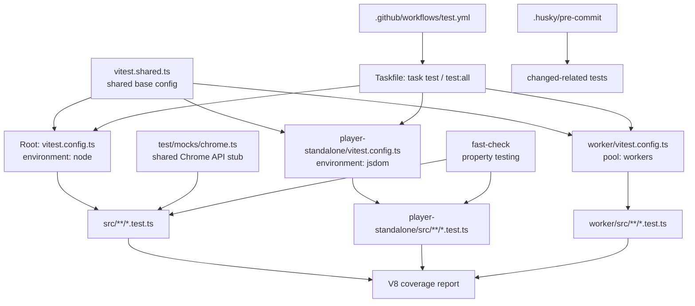
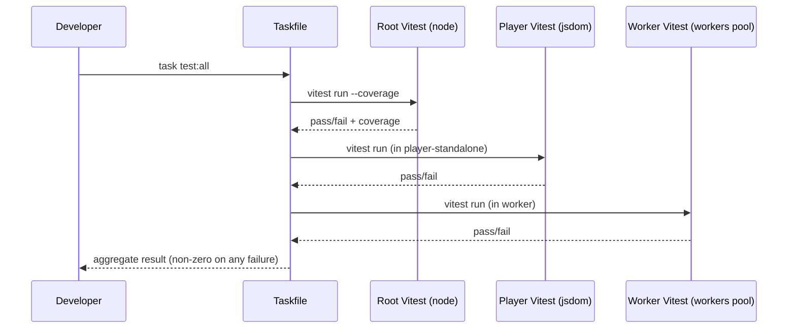
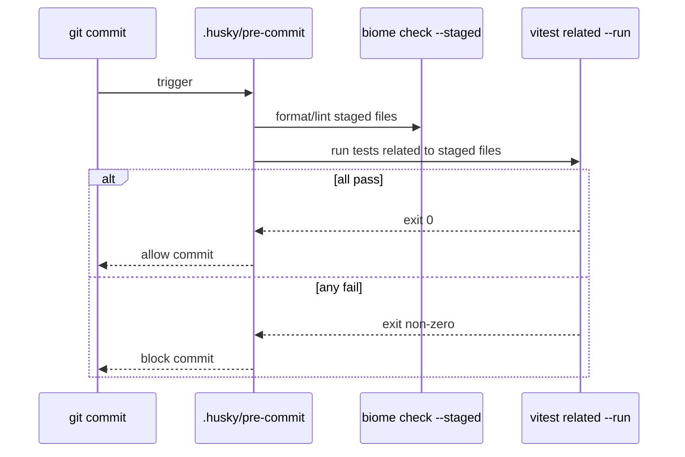
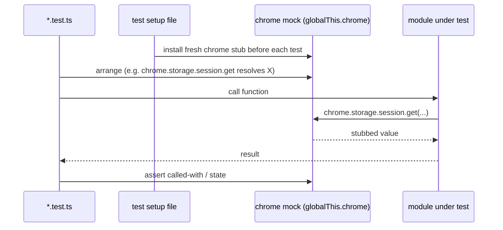

# Design Document: Testing Setup

## Overview

GN Tracing is a Manifest V3 Chrome extension plus two adjacent sub-projects (a Vite-based standalone replay player and a Cloudflare Worker OAuth proxy), all written in TypeScript. The repository has linting (Biome), type-checking (tsc), bundling (esbuild + Vite), and a release pipeline, but **no test framework is configured anywhere**. This design establishes a unified, low-friction testing setup across the monorepo.

The chosen approach standardizes on **Vitest** as the single test runner for all three TypeScript contexts. Vitest is selected because it shares the esbuild transform pipeline the root already uses, runs natively against the existing Vite config in `player-standalone/`, and has a first-party Cloudflare Workers pool (`@cloudflare/vitest-pool-workers`) for the Worker. A single tool keeps configuration, mental model, and CI wiring consistent while still letting each context use an environment-appropriate runtime (`node`, `jsdom`, or `workers`).

The setup covers: test runner selection and per-context configuration, test directory conventions (co-located `*.test.ts`), a shared Chrome extension API mock, coverage reporting via V8, property-based testing with `fast-check` for correctness-sensitive pure modules (privacy/redaction, recording-target validation, ZIP/CRC parsing), and integration of tests into the Taskfile, the Husky pre-commit hook, and a new CI workflow. The design deliberately prioritizes testing **pure, framework-independent logic** first (the redaction policy is explicitly implemented without Chrome API dependencies precisely so it can be tested), then layers in mock-backed unit tests for Chrome-dependent orchestration.

## Architecture

The testing setup mirrors the existing three-context structure of the repo. Each context owns a Vitest config tuned to its runtime, but all configs derive from a shared base to avoid drift.



The test runner sits alongside the existing quality gates rather than replacing them. The full local and CI quality pipeline becomes: Biome check → tsc typecheck → Vitest (unit + property) → existing build/dist validation.


## Sequence Diagrams

### Local test run across all contexts (`task test:all`)



### Pre-commit fast feedback



### Chrome-API-dependent unit test with mock



## Components and Interfaces

### Component 1: Shared Vitest base config

**Purpose**: Single source of truth for coverage settings, reporters, globals, and include/exclude globs so the three contexts stay aligned.

**Interface**:
```typescript
// vitest.shared.ts
import type { UserConfig } from "vitest/config";

export const sharedTestConfig: UserConfig["test"];
// - globals: true
// - coverage: { provider: "v8", reporter: ["text", "html", "lcov"], thresholds }
// - include: ["**/*.{test,spec}.ts"]
// - exclude: ["**/node_modules/**", "**/dist/**", "**/.wrangler/**"]
```

**Responsibilities**:
- Define coverage provider, reporters, and thresholds once.
- Define the canonical test file glob and shared excludes.
- Be spread into each per-context config so contexts only declare their environment/pool.

### Component 2: Root extension Vitest config

**Purpose**: Run unit and property tests for `src/**` in a Node environment with the shared Chrome mock installed globally.

**Interface**:
```typescript
// vitest.config.ts
export default defineConfig({
  test: {
    ...sharedTestConfig,
    environment: "node",
    setupFiles: ["./test/setup.ts"], // installs chrome mock + resets between tests
  },
});
```

**Responsibilities**:
- Provide a `node` runtime for pure logic and service-worker-style modules.
- Load the global setup file that installs and resets the Chrome mock.
- Own coverage collection for `src/**`.

### Component 3: Standalone player Vitest config

**Purpose**: Test player parsing/UX logic that touches DOM and browser globals.

**Interface**:
```typescript
// player-standalone/vitest.config.ts
export default defineConfig({
  test: {
    ...sharedTestConfig,
    environment: "jsdom",
  },
});
```

**Responsibilities**:
- Provide a `jsdom` runtime for DOM-dependent player logic.
- Reuse the existing Vite resolve/plugins so imports behave like production.

### Component 4: Worker Vitest config

**Purpose**: Test the OAuth token-exchange Worker in a Workers-compatible runtime.

**Interface**:
```typescript
// worker/vitest.config.ts
import { defineWorkersConfig } from "@cloudflare/vitest-pool-workers/config";

export default defineWorkersConfig({
  test: {
    ...sharedTestConfig,
    poolOptions: { workers: { wrangler: { configPath: "./wrangler.toml" } } },
  },
});
```

**Responsibilities**:
- Execute Worker tests inside the actual `workerd` runtime via the workers pool.
- Allow `fetch`-style handler tests with realistic `Request`/`Response`/env bindings.

### Component 5: Shared Chrome extension API mock

**Purpose**: Provide a controllable, reset-between-tests stub of the `chrome.*` namespaces the extension uses (`storage.session`, `storage.local`, `runtime`, `tabs`, `alarms`, `debugger`, `action`, `offscreen`, `scripting`).

**Interface**:
```typescript
// test/mocks/chrome.ts
export interface ChromeMock {
  storage: { session: MockStorageArea; local: MockStorageArea };
  runtime: { sendMessage: Mock; onMessage: MockEvent; getURL: Mock; lastError?: { message: string } };
  tabs: { query: Mock; get: Mock; sendMessage: Mock };
  alarms: { create: Mock; clear: Mock };
  debugger: { attach: Mock; detach: Mock; sendCommand: Mock; onEvent: MockEvent };
  action: { setBadgeText: Mock };
}

export function createChromeMock(): ChromeMock;
export function installChromeMock(): ChromeMock; // assigns to globalThis.chrome
export function resetChromeMock(): void;          // clears state/calls between tests
```

**Responsibilities**:
- Back storage areas with an in-memory map so reads observe prior writes within a test.
- Track calls (spies) for assertion of orchestration behavior.
- Reset all state and call records between tests for isolation.

### Component 6: Test data factories

**Purpose**: Construct valid domain objects (`RecordingTabLike`, privacy settings, console/network entries, ZIP fixtures) so tests stay readable and property generators have building blocks.

**Interface**:
```typescript
// test/factories.ts
export function makeTab(overrides?: Partial<RecordingTabLike>): RecordingTabLike;
export function makePrivacySettings(profile?: PrivacyProfile): PrivacyRedactionSettings;
export function makeHeaderMap(overrides?: Record<string, string>): Record<string, string>;
```

**Responsibilities**:
- Centralize valid default fixtures.
- Provide override hooks for edge-case construction.

## Data Models

### Model 1: Test placement convention

```typescript
interface TestPlacement {
  // Co-located with the module under test, same directory.
  // src/shared/privacy-redaction.ts  -> src/shared/privacy-redaction.test.ts
  // worker/src/index.ts              -> worker/src/index.test.ts
  unitTest: `${string}.test.ts`;
  // Shared helpers live under a top-level test/ dir per context.
  sharedHelpers: "test/setup.ts" | "test/mocks/*.ts" | "test/factories.ts";
}
```

**Validation Rules**:
- Every `*.test.ts` sits next to the source file it covers.
- No test file imports another context's source (contexts are isolated).
- Cross-cutting helpers live in `test/` of the owning context, never in `src/`.

### Model 2: Coverage thresholds

```typescript
interface CoverageThresholds {
  // Applied repo-wide as a floor; correctness-sensitive modules tracked separately.
  lines: number;     // initial: 60, ratchet upward over time
  functions: number; // initial: 60
  branches: number;  // initial: 55
  statements: number;// initial: 60
  // Pure logic modules expected to reach higher in practice.
  perFileFocus: ["src/shared/privacy-redaction.ts", "src/shared/recording-target.ts"];
}
```

**Validation Rules**:
- Thresholds start modest to avoid blocking adoption, then ratchet up.
- A failing threshold fails the `vitest run` exit code in CI.

### Model 3: Test scripts surface

```typescript
interface TestScripts {
  // package.json (root)
  "test": "vitest run";
  "test:watch": "vitest";
  "test:coverage": "vitest run --coverage";
  // Taskfile aggregates across contexts
  "task test": "root only";
  "task test:all": "root + player + worker";
}
```

**Validation Rules**:
- `test` always runs once and exits (no watch) for CI/hook safety.
- Watch mode is a separate, explicitly named script.

## Algorithmic Pseudocode

### Aggregate test run across contexts

```pascal
ALGORITHM runAllTests()
OUTPUT: exitCode (0 = all passed, non-zero = at least one failed)

BEGIN
  contexts ← ["root", "player-standalone", "worker"]
  overallExit ← 0

  FOR each ctx IN contexts DO
    ASSERT hasVitestConfig(ctx) = true

    result ← runVitest(ctx, mode := "run")

    IF result.exitCode ≠ 0 THEN
      overallExit ← result.exitCode
      // Continue running remaining contexts so the developer sees all failures,
      // but remember that the aggregate must fail.
    END IF
  END FOR

  RETURN overallExit
END
```

**Preconditions:**
- Each context has dependencies installed and a Vitest config present.

**Postconditions:**
- Returns 0 if and only if every context's test run returned 0.
- Every context is attempted even if an earlier one fails.

**Loop Invariants:**
- `overallExit ≠ 0` once any context has failed, and never resets to 0 afterward.

### Chrome mock lifecycle per test

```pascal
ALGORITHM chromeMockLifecycle()
INPUT: a test suite with N tests
OUTPUT: each test observes an isolated chrome stub

BEGIN
  // Registered in setup.ts
  beforeEach DO
    mock ← createChromeMock()
    globalThis.chrome ← mock
  END

  FOR each test t IN suite DO
    ASSERT globalThis.chrome is fresh (no prior calls recorded)
    runTest(t)        // arranges, acts, asserts against globalThis.chrome
  END FOR

  afterEach DO
    resetChromeMock() // clear in-memory storage + call records
  END
END
```

**Preconditions:**
- `setup.ts` is registered as a `setupFile` in the root config.

**Postconditions:**
- No test observes call records or storage state created by another test.

**Loop Invariants:**
- At the start of each test, every mock spy has zero recorded calls.

## Key Functions with Formal Specifications

### Function 1: createChromeMock()

```typescript
function createChromeMock(): ChromeMock
```

**Preconditions:**
- None (callable in any environment).

**Postconditions:**
- Returns a fresh `ChromeMock` with empty in-memory storage areas.
- All spy functions exist and have zero recorded calls.
- `storage.session.get(k)` resolves to `{}` for any key never set.

**Loop Invariants:** N/A (no loops).

### Function 2: MockStorageArea.set / get round-trip

```typescript
interface MockStorageArea {
  get(keys?: string | string[] | null): Promise<Record<string, unknown>>;
  set(items: Record<string, unknown>): Promise<void>;
  remove(keys: string | string[]): Promise<void>;
  clear(): Promise<void>;
}
```

**Preconditions:**
- `items` passed to `set` is a plain serializable object.

**Postconditions:**
- After `set({k: v})`, `get("k")` resolves to `{k: v}`.
- After `remove("k")`, `get("k")` resolves to `{}` for that key.
- After `clear()`, `get()` resolves to `{}`.

**Loop Invariants:**
- When reading multiple keys, every already-processed key in the result reflects the latest stored value.

### Function 3: runVitest(context, mode)

```typescript
function runVitest(context: string, mode: "run" | "watch"): { exitCode: number }
```

**Preconditions:**
- `context` resolves to a directory containing a Vitest config.

**Postconditions:**
- In `"run"` mode the process terminates (never watches).
- `exitCode === 0` if and only if all tests and coverage thresholds in that context passed.

**Loop Invariants:** N/A.

## Example Usage

### Property test for the redaction policy (root, `fast-check`)

```typescript
// src/shared/privacy-redaction.test.ts
import { describe, it, expect } from "vitest";
import fc from "fast-check";
import { redactHeaderMap, getPrivacyProfileSettings } from "./privacy-redaction";

describe("redactHeaderMap", () => {
  it("never emits a raw sensitive header value", () => {
    fc.assert(
      fc.property(
        fc.string({ minLength: 1 }), // secret value
        (secret) => {
          const settings = getPrivacyProfileSettings("standard");
          const { headers } = redactHeaderMap({ authorization: secret }, settings, /* ctx */);
          // Property: the secret never survives verbatim in any header value.
          expect(Object.values(headers)).not.toContain(secret);
        },
      ),
    );
  });
});
```

### Property test for recording-target validation (root)

```typescript
// src/shared/recording-target.test.ts
import { describe, it, expect } from "vitest";
import fc from "fast-check";
import { getRecordingTabTarget } from "./recording-target";

describe("getRecordingTabTarget", () => {
  it("accepts only http/https/file URLs and always returns exactly one of url|error", () => {
    fc.assert(
      fc.property(fc.webUrl(), (url) => {
        const result = getRecordingTabTarget({ id: 1, url });
        // Exactly one of url/error is non-null (mutual exclusivity).
        expect((result.url === null) !== (result.error === null)).toBe(true);
      }),
    );
  });
});
```

### Mock-backed unit test for Chrome-dependent code (root)

```typescript
// src/background/settings-store.test.ts
import { describe, it, expect, beforeEach } from "vitest";
// chrome mock installed globally via test/setup.ts
import { loadSettings } from "./settings-store";

describe("loadSettings", () => {
  it("returns persisted settings from session storage", async () => {
    await chrome.storage.session.set({ gn_tracing_state: { phase: "idle" } });
    const state = await loadSettings();
    expect(state.phase).toBe("idle");
  });
});
```

### Worker handler test (worker, workers pool)

```typescript
// worker/src/index.test.ts
import { describe, it, expect } from "vitest";
import worker from "./index";

describe("OAuth token proxy", () => {
  it("rejects non-POST requests", async () => {
    const res = await worker.fetch(new Request("https://x/", { method: "GET" }), {} as Env, {} as ExecutionContext);
    expect(res.status).toBe(405);
  });
});
```

## Correctness Properties

These are the universally-quantified properties the property-based tests will enforce. They target pure, deterministic modules.

### Property 1: Redaction never leaks secrets

∀ header maps `h` and sensitive value `v` ∈ `h`, `redactHeaderMap(h, settings).headers` contains no value equal to `v` when the rule for that key is enabled.

**Validates: Requirements 5.2**

### Property 2: Redaction is idempotent

∀ input `x`, `redact(redact(x)) = redact(x)` (re-redacting already-redacted output produces no further change).

**Validates: Requirements 5.3**

### Property 3: Redaction preserves structure

∀ JSON value `j`, `redactJsonValue(j)` has the same key set and shape as `j` (only leaf values may change).

**Validates: Requirements 5.4**

### Property 4: Profile monotonicity

∀ inputs, the set of redaction rules enabled under `strict` ⊇ the set enabled under `standard`.

**Validates: Requirements 5.5**

### Property 5: Target validation totality

∀ tab-like inputs `t`, `getRecordingTabTarget(t)` returns a result where exactly one of `url`/`error` is non-null.

**Validates: Requirements 5.6**

### Property 6: Target validation soundness

∀ accepted results (`url ≠ null`), the URL's protocol ∈ {`http:`, `https:`, `file:`} and the host is not a Chrome Web Store host.

**Validates: Requirements 5.7**

### Property 7: Selector normalization stability

∀ selector lists `s`, `normalizeMaskDomSelectors(normalizeMaskDomSelectors(s)) = normalizeMaskDomSelectors(s)` (idempotent normalization).

**Validates: Requirements 5.8**

### Property 8: Mock storage round-trip

∀ key `k` and serializable value `v`, after `set({[k]: v})` then `get(k)` resolves to `{[k]: v}`.

**Validates: Requirements 4.5, 4.8**

### Property 9: ZIP/CRC parsing safety (player)

∀ byte buffers, the central-directory parser either returns a valid entry list or a typed error, and never throws an uncaught exception.

**Validates: Requirements 5.9**

## Error Handling

### Error Scenario 1: Missing test dependencies in a context

**Condition**: `task test:all` runs but a context has not had `npm ci` applied.
**Response**: Vitest fails fast with a clear module-resolution error; the aggregate task returns non-zero.
**Recovery**: CI installs dependencies for all three contexts (root, player-standalone, worker) before running tests, mirroring the existing release workflow's multi-`npm ci` pattern.

### Error Scenario 2: Chrome API used but not mocked

**Condition**: A module under test calls a `chrome.*` API not present in the mock.
**Response**: Accessing an undefined namespace throws a descriptive `TypeError`; the test fails with a stack pointing at the missing API.
**Recovery**: Extend `createChromeMock()` to add the namespace/method; the mock is the single place to grow coverage of platform APIs.

### Error Scenario 3: Flaky/async leakage between tests

**Condition**: A test leaves a timer, listener, or storage entry that affects the next test.
**Response**: `resetChromeMock()` in `afterEach` clears mock state; Vitest isolation runs each test file in its own module context.
**Recovery**: Fake timers (`vi.useFakeTimers()`) for `chrome.alarms`/timeout logic; assert no pending timers at teardown for time-sensitive suites.

### Error Scenario 4: Coverage threshold regression

**Condition**: A change drops coverage below the configured floor.
**Response**: `vitest run --coverage` exits non-zero; CI marks the job failed.
**Recovery**: Add tests or, with reviewer agreement, adjust the threshold deliberately rather than silently.

## Testing Strategy

### Unit Testing Approach

Co-located `*.test.ts` files exercise individual modules. Priority order for first tests:
1. `src/shared/privacy-redaction.ts` — pure, no Chrome deps, high correctness value.
2. `src/shared/recording-target.ts` — pure validation with clear boundaries.
3. `src/shared/google-drive-folder.ts`, `src/shared/player-host.ts` — pure helpers.
4. `src/background/settings-store.ts`, `storage-manager.ts` — mock-backed Chrome storage logic.
5. `worker/src/index.ts` — request validation, method handling, error responses.

Coverage goal: start at a 60% repo floor, ratchet up as suites mature. Pure modules are expected to far exceed the floor.

### Property-Based Testing Approach

`fast-check` drives the correctness properties listed above. Property tests are reserved for deterministic, pure functions where invariants are clearer than example tables: the redaction policy, target validation, selector normalization, and ZIP/CRC parsing in the player.

**Property Test Library**: `fast-check` (works natively under Vitest, TypeScript-first, supports shrinking and reproducible seeds).

Conventions:
- Each property uses `fc.assert(fc.property(...))` and lives in the module's co-located test file.
- Failing runs print the shrunk counterexample and seed for reproduction.
- Generators are built from the shared factories where domain shapes are non-trivial.

### Integration Testing Approach

- **Worker**: `@cloudflare/vitest-pool-workers` runs handler tests in the real `workerd` runtime with `Request`/`Response`/env bindings, validating the OAuth proxy contract (method rejection, missing-secret handling, upstream error mapping) without hitting Google.
- **Player**: `jsdom`-based tests parse representative ZIP fixtures (stored + DEFLATE entries, optional artifacts present/absent) and assert tolerant loading per the replay-player module contract.
- Full end-to-end browser automation (loading the unpacked extension in Chrome) is **out of scope** for this setup; it is noted as a future extension via Playwright if needed.

## Performance Considerations

- Vitest reuses the esbuild transform pipeline, so cold start and incremental runs stay fast; no separate Babel/ts-jest transform layer.
- Pre-commit uses `vitest related --run` to run only tests affected by staged files, keeping commit latency low.
- The workers pool has higher startup cost than `node`; the Worker suite is small, and CI runs contexts in parallel jobs where practical.
- Coverage uses the V8 provider (native, low overhead) rather than instrumentation-based Istanbul. The worker Context is the one exception: the `workerd` runtime used by `@cloudflare/vitest-pool-workers` cannot run V8 coverage (no `node:inspector`), so per Cloudflare's guidance it uses the Istanbul provider. Each sibling Context (player, worker) re-scopes only `coverage.exclude` to drop its own directory from the shared cross-context exclude list (so it measures its own source), inheriting every other coverage setting from the shared base.

## Security Considerations

- Tests must never use real OAuth secrets or Drive tokens. Worker tests use placeholder env bindings; `.dev.vars` real values are not loaded in tests.
- Redaction property tests strengthen the privacy guarantees the product depends on (no secret leakage into artifacts), aligning with the Google API Limited Use posture documented in the privacy module.
- Fixtures containing realistic-looking PII use synthetic/generated values only.
- The Chrome mock never performs real network or storage I/O, so tests cannot exfiltrate data.

## Dependencies

New dev dependencies (pinned, added per context as needed):

**Root (`package.json`)**:
- `vitest` — test runner.
- `@vitest/coverage-v8` — coverage provider.
- `fast-check` — property-based testing.
- (Chrome mock is a local module under `test/`; optionally `@types/chrome` already present supplies types.)

**player-standalone (`player-standalone/package.json`)**:
- `vitest`, `@vitest/coverage-v8` — reuses existing `vite` (^7) for config/resolve.
- `jsdom` — DOM environment.

**worker (`worker/package.json`)**:
- `vitest`, `@cloudflare/vitest-pool-workers` — Workers-runtime test pool (version aligned with existing `wrangler` ^3).
- `@vitest/coverage-istanbul` — coverage provider for the worker Context. The Workers pool runs tests inside the real `workerd` runtime, which has no `node:inspector` module, so the V8 provider cannot run there; per Cloudflare's guidance the worker uses the instrumented Istanbul provider instead. This is the single, documented exception to the V8-everywhere default and is the only Shared_Config coverage setting the worker overrides.

**Tooling integration (no new deps)**:
- `Taskfile.yml` — add `test`, `test:all`, per-context `*:test` tasks.
- `.husky/pre-commit` — append `vitest related --run` for staged files.
- `.github/workflows/test.yml` — new workflow running typecheck + tests with coverage on push/PR.
- `biome.json` — `coverage/` is already excluded; confirm `*.test.ts` are linted.
