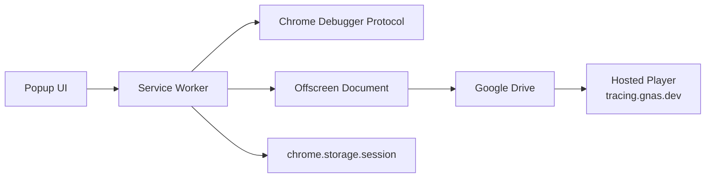

# Developer Guide

This document is for contributors working on the GN Tracing codebase. The main [README](./README.md) stays user-facing; this guide focuses on architecture, local development, and release mechanics.

## Repository map

- `src/background/`: MV3 service worker and capture orchestration
- `src/offscreen/`: offscreen document for tab recording and Google Drive upload
- `src/popup/`: popup UI for recording, auth, and upload state
- `src/drive-auth/`: Google Drive auth page opened in a normal tab
- `src/shared/`: shared helpers such as player host URL building
- `src/types/`: shared message and recording types
- `player/`: source of the in-extension player assets
- `player-standalone/`: hosted standalone player app for replay links
- `dist/`: built unpacked extension output
- `.github/workflows/release.yml`: tag-based GitHub release workflow

## Core runtime model

GN Tracing is a Manifest V3 extension. The capture flow is split across three runtime surfaces:

1. Popup
   The popup starts and stops recording, shows lightweight live stats, and lets the user connect Google Drive or upload a finished capture.

2. Service worker
   The service worker coordinates the session. It attaches Chrome Debugger Protocol to the active tab, tracks runtime state, syncs state into `chrome.storage.session`, and brokers messages between the popup and offscreen document.

3. Offscreen document
   The offscreen document owns media capture and upload work. It records the tab stream with `MediaRecorder`, stores the captured blob in memory, uploads artifacts to Google Drive, and emits upload progress back to the service worker and popup.

At a high level:



## What gets captured

- Tab video and tab audio via `MediaRecorder`
- Console API events and runtime exceptions
- Network requests and responses collected through CDP
- WebSocket connections and frames
- Source-map-enhanced locations when source maps can be resolved before finalization

Important implementation details:

- Response bodies are fetched only for supported text-like content types.
- The current response body capture limit is about `1 MB` per response.
- Recording payloads are kept in memory, not persisted to durable local storage.
- If the extension runtime restarts mid-session, an in-memory recording or upload can be interrupted.

## Local development

### Requirements

- Node.js 18+
- Chrome or Edge

### Install dependencies

Root extension app:

```bash
npm install
```

Standalone player:

```bash
cd player-standalone
npm install
```

### Useful scripts

From the repository root:

```bash
npm run build
npm run dist
npm run watch
npm run typecheck
npm run build:all
npm run dist:all
npm run watch:all
```

What they do:

- `npm run build`: build the extension into `dist/` with the development environment
- `npm run dist`: build the extension into `dist/` with the production environment
- `npm run watch`: rebuild the extension on source changes
- `npm run typecheck`: run root TypeScript checks
- `npm run build:all`: build the extension and standalone player with the development environment
- `npm run dist:all`: build the extension and standalone player with the production environment
- `npm run watch:all`: run extension watch and standalone player dev mode together

From `player-standalone/`:

```bash
npm run dev
npm run build
npm run dist
npm run typecheck
```

## Loading the extension locally

1. Run `npm run build`.
2. Open `chrome://extensions` or `edge://extensions`.
3. Turn on `Developer mode`.
4. Click `Load unpacked`.
5. Select the repository `dist/` folder.

When you update extension code, rebuild and reload the unpacked extension.

## Build and asset sync model

The extension and the standalone player intentionally share player assets.

- `player/` is the source of truth for the player runtime used by the extension build.
- `player-standalone/scripts/sync-player.js` copies `player/` assets into `player-standalone/public/`.
- `npm run player:sync` should be run before building or deploying the standalone player when player assets have changed.

The root build uses `esbuild.config.mjs` to:

- bundle service worker and UI entry points
- generate `dist/manifest.json` from `manifest.template.json`
- copy static popup, auth, icon, and player assets into `dist/`

## Google Drive replay model

After a successful upload:

- the offscreen document creates a Drive folder
- video is uploaded in parts when needed
- `metadata.json` is generated during upload
- optional artifacts such as `console.json`, `network.json`, and `websocket.json` are uploaded when present
- all uploaded files are made readable by link
- the extension generates a replay URL using `https://tracing.gnas.dev/`

The hosted player expects:

- `videos`
- `metadata`

Optional query params:

- `console`
- `network`
- `websocket`

Those links are generated by the extension; contributors normally should not construct them by hand unless debugging the player directly.

## Main code paths to know

### Recording lifecycle

- `src/popup/popup.ts`: user actions and popup rendering
- `src/background/service-worker.ts`: start/stop orchestration and persisted popup state
- `src/background/recorder-manager.ts`: service-worker-side recording state flags
- `src/offscreen/offscreen.ts`: actual media capture and upload implementation

### Debug signal collection

- `src/background/cdp-manager.ts`: CDP attach, event handling, source map fetching, and network/body capture
- `src/background/storage-manager.ts`: in-memory console/network/WebSocket storage and export

### Replay

- `player/player.js`: main player runtime
- `player/player.html`: player shell and intro state
- `player-standalone/src/`: standalone player bootstrapping and Drive adapter setup

## Working safely in this codebase

- Preserve message contracts across popup, service worker, and offscreen unless you update all participants together.
- Be careful with MV3 lifecycle assumptions. Service workers can restart, so UI state should continue to derive from `chrome.storage.session` and runtime probing.
- Keep user-facing claims aligned with the actual upload and replay flow. The current primary user flow is `record -> stop -> upload to Google Drive -> open replay link`.
- If you change player assets in `player/`, sync and rebuild the standalone player before considering the work complete.
- If you change manifest permissions, auth flow, or Drive behavior, test in both Chrome and Edge where possible.

## Release flow

Release is tag-driven.

1. Commit and push changes to `main`.
2. Create and push a tag matching `v*`, for example `v1.0.4`.
3. GitHub Actions runs `.github/workflows/release.yml`.
4. The workflow installs dependencies, runs `npm run release:ci`, and publishes a GitHub release.

Current release artifact behavior:

- `npm run release:build` builds the extension with the production environment
- `npm run release:artifact` zips the `dist/` directory
- the published release artifact is intended to be extracted and loaded from `dist/`

## Testing checklist

There is no full automated test suite yet, so manual verification matters.

Before shipping changes, verify the parts you touched:

- start and stop recording on a normal page
- popup state recovery after reopening the popup
- Google Drive connect and disconnect flow
- upload progress and final replay link generation
- replay loading in the hosted player
- player search, filters, and expanded detail views if player code changed

## Related docs

- [README](./README.md)
- [Specs overview](./specs/overview.md)
