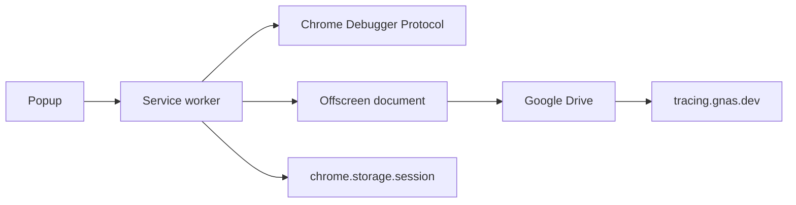

# Developer Guide

This guide is for contributors working on GN Tracing. The main [README](./README.md) stays user-facing; this file keeps the developer notes short and practical.

## Project Map

- `src/background/`: MV3 service worker, session orchestration, Chrome Debugger Protocol capture
- `src/offscreen/`: tab media recording and Google Drive upload work
- `src/popup/`: extension popup UI and capture controls
- `src/drive-auth/`: Google Drive auth page opened in a normal tab
- `src/history/`: upload history page
- `src/shared/`: shared Drive, player URL, and history helpers
- `src/types/`: shared message and recording contracts
- `player/`: player assets used by the extension build
- `player-standalone/`: hosted replay player app
- `dist/`: generated unpacked extension output
- `docs/`: architecture, module, compliance, and sync notes

## Runtime Shape

GN Tracing is a Manifest V3 extension with three main surfaces:

1. The popup starts and stops recording, shows state, and exposes Drive/upload controls.
2. The service worker coordinates capture, attaches CDP to the active tab, and stores live UI state in `chrome.storage.session`.
3. The offscreen document records tab media, uploads artifacts to Google Drive, and reports progress.


```mermaid
flowchart LR
  Popup["Popup"] --> SW["Service worker"]
  SW --> CDP["Chrome Debugger Protocol"]
  SW --> Offscreen["Offscreen document"]
  SW --> Session["chrome.storage.session"]
  Offscreen --> Drive["Google Drive"]
  Drive --> Player["tracing.gnas.dev"]
```

## Setup

Requirements:

- Node.js 18+
- Chrome or Edge
- Task, if you want to use the documented `task` commands

Install dependencies:

```bash
npm install
cd player-standalone
npm install
```

## Common Commands

From the repository root:

```bash
task build          # Build extension into dist/ for development
task dist           # Build extension into dist/ for production
task watch          # Rebuild extension on source changes
task typecheck      # Type-check root extension code
task build:all      # Build extension and standalone player
task dist:all       # Production build for extension and player
task watch:all      # Extension watch plus player dev server
```

Standalone player:

```bash
task player:dev
task player:sync
task player:build
task player:dist
task player:typecheck
```

## Load Locally

1. Run `task build`.
2. Open `chrome://extensions` or `edge://extensions`.
3. Enable `Developer mode`.
4. Click `Load unpacked`.
5. Select this repository's `dist/` folder.

Rebuild and reload the unpacked extension after source changes.

## Upload And Replay Model

After upload, GN Tracing writes one Drive zip package directly into the configured upload folder. The package contains recording artifacts such as `metadata.json`, `manifest.json`, `recording-index.json`, optional log files, and ordered `video.part-XXX.webm` files.

The public replay URL uses the zip file ID:

```text
https://tracing.gnas.dev/<zip-file-id>
```

The hosted player downloads that zip through the Cloudflare Pages Drive proxy, unpacks it locally, and reads the embedded recording index and artifacts.

## Development Notes

- Preserve message contracts across popup, service worker, and offscreen code unless all participants are updated together.
- Treat MV3 service worker restarts as normal. UI state should recover from `chrome.storage.session` and runtime checks.
- Keep user-facing docs aligned with the current flow: record, stop, upload to Google Drive, open replay link.
- Run `task player:sync` before building or deploying the standalone player when `player/` changes.
- If manifest permissions, auth, Drive upload, or player loading changes, manually verify the affected browser flow.
- Keep source comments in English and focused on runtime boundaries, browser API constraints, async lifecycle, or non-obvious contracts.

## Release

Releases are tag-driven through `.github/workflows/release.yml`.

1. Commit changes to `main`.
2. Push a tag matching `v*`, for example `v1.0.4`.
3. GitHub Actions runs `task release:ci`.
4. The release publishes `gn-tracing-extension-${tag}.zip`, which extracts to `gn-tracing-extension-${tag}/`.

Production release builds use repository secrets for extension identity and OAuth:

- `GOOGLE_CLIENT_ID`
- `CHROME_EXTENSION_ID`
- `CHROME_EXTENSION_PUBLIC_KEY`
- `CHROME_EXTENSION_PRIVATE_KEY`

Local production builds can provide the same names in `.env`.

## Store Package Check

Before Chrome Web Store upload, run:

```bash
task store:check
task store:zip
```

`task store:check` type-checks the extension and player, runs production build validation, and checks the generated store package.

## Useful Docs

- [Docs overview](./docs/overview.md)
- [Recording runtime](./docs/modules/recording-runtime.md)
- [Drive and player](./docs/modules/drive-and-player.md)
- [Chrome Web Store notes](./docs/compliance/chrome-web-store-submission.md)
