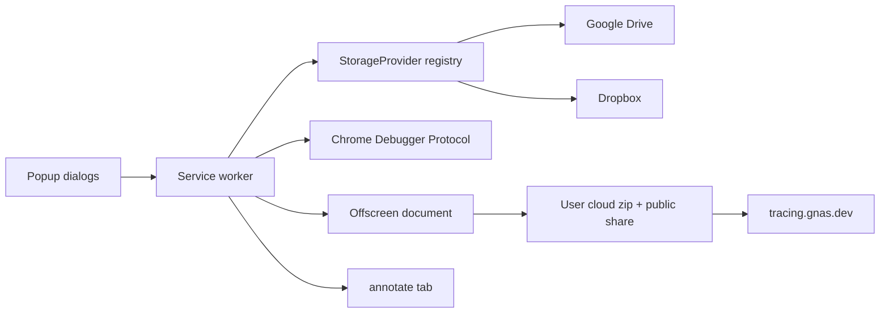

# Developer Guide

This guide is for contributors working on GN Tracing. The main [README](./README.md) stays user-facing; this file keeps the developer notes short and practical.

## Project Map

- `src/background/`: MV3 service worker composition root, multi-cloud auth, storage provider registry, settings store, capture environment normalization, upload orchestrator, message router, CDP capture, recorder, storage
- `src/background/storage/`: `StorageProvider` adapters (Google Drive, Dropbox)
- `src/offscreen/`: tab media recording and cloud package upload work
- `src/popup/`: extension popup UI — capture controls, settings / history / manage-clouds / Instant Replay dialogs (cloud connect runs OAuth via the service worker)
- `src/annotate/`: screenshot annotation editor page (state model + page wiring; full tab — not a popup dialog)
- `src/shared/`: settings form UI, storage provider helpers, cloud API helpers, player URL, history helpers
- `src/types/`: extension message contracts; recording and privacy models re-export from `packages/replay-core/src/schema/`
- `player/`: hosted replay player (tracing.gnas.dev) — production shell is **vanilla JS** (`public/player.js`), with domain logic owned by `src/shared/*` and compiled into `window.gnCore`; cloud download proxies under `functions/`. A Solid/TypeScript rewrite exists under `player/src/` (`main.tsx`, `App.tsx`, `components/`, `panels/`) but is experimental and archived — not production, not feature-parity, do not extend it for product work (see `player/README.md`)
- `worker/`: optional Google OAuth token-exchange Worker (secret injection) + remote MCP route (`POST /mcp`)
- `packages/replay-core/`: the recording format itself, shared by every producer and reader
  - `schema/`: artifact taxonomy, capture models, privacy settings — the single source of truth
  - `write/`: ZIP writer, package builder, `agent-summary.json` builder
  - `redact/`: the privacy policy every producer applies before buffering
  - `capture/`: in-page instrumentation (`console`/`fetch`/XHR/`WebSocket`), DOM snapshots, and the instant-replay rolling buffer — all free of `chrome.*`
  - `annotate/`: screenshot annotation model, SVG renderer, prose descriptions, and the redaction baker
  - reading: `zip-reader`, `artifacts`, `query`, `views`, `summarize`, `report`
- `packages/sdk/`: in-page recorder for browsers that cannot run the extension (all mobile). Writes the same package format with `producer: "sdk"` and a narrower `capabilities` list
- `plugins/gn-tracing/`: the published Claude Code plugin (investigation skill + MCP server declaration), catalogued by `.claude-plugin/marketplace.json`
- `mcp/`: the `gn-tracing-mcp` npm package and its `server.json` registry manifest
- `dist/`: generated unpacked extension output
- `docs/`: architecture, module, compliance, and sync notes

## Runtime Shape

GN Tracing is a Manifest V3 extension with three main surfaces:

1. The popup starts and stops recording, shows state, and hosts settings / history / manage-clouds dialogs (cloud connect uses `STORAGE_CONNECT` → `chrome.identity` in the service worker).
2. The service worker coordinates capture, attaches CDP to the active tab, and stores live UI state in `chrome.storage.session`.
3. The offscreen document records tab media, uploads packages to the active cloud provider, and reports progress.
4. Screenshot / Instant Replay annotation still opens the dedicated `annotate/` tab (too large for the popup shell).


```mermaid
flowchart LR
  Popup["Popup dialogs"] --> SW["Service worker"]
  SW --> Registry["StorageProvider registry"]
  Registry --> G["Google Drive"]
  Registry --> D["Dropbox"]
  SW --> CDP["Chrome Debugger Protocol"]
  SW --> Offscreen["Offscreen document"]
  SW --> Annotate["annotate tab"]
  Offscreen --> Cloud["User cloud zip + public share"]
  Cloud --> Player["tracing.gnas.dev"]
```

## Setup

Requirements:

- Node.js 22+ (see `.nvmrc`; builds use `--experimental-strip-types`)
- A Chromium browser for Chrome/Edge/Opera packages, and/or Firefox 128+
- Task, if you want to use the documented `task` commands

Install dependencies:

```bash
npm install
cd player
npm install
```

Copy `.env.example` to `.env` and fill OAuth client ids as needed (see [OAuth apps](#oauth-apps-all-providers) below).

## Common Commands

From the repository root:

```bash
task build          # Build extension into dist/ for development
task dist           # Build extension into dist/ for production
task watch          # Rebuild extension on source changes
task typecheck      # Type-check root extension code
task lint           # Run Biome lint checks for supported sources
task format         # Format Biome-supported repository sources
task check          # Run Biome checks plus docs hygiene validation
task build:all      # Chrome + Edge + Opera + Firefox (development)
task dist:all       # Chrome + Edge + Opera + Firefox (production)
task player:build   # Standalone player (dev)
task player:dist    # Standalone player (production)
task dev            # Full local stack (Chrome + Firefox default): extension watch + player (Vite) + Worker (:63972)
task dev BROWSER=both      # Explicit Chrome + Firefox default

task dev BROWSER=chrome    # One target (also: edge|opera|firefox, or task dev:<browser>)
task dev BROWSER=all       # All four browser watchers + player + Worker (alias: task dev:all)
task dev:all        # Same as BROWSER=all
task worker:dev     # Local Worker only (also included in `task dev`)
task worker:sync-dev-vars  # Sync worker/.dev.vars from root .env (run automatically by task dev / worker:dev)
task typecheck:all  # Type-check every context (root, replay-core, SDK, MCP, player, worker)
```

### Testing

```bash
task test           # Root Vitest (extension + packages + colocated tests)
task test:all       # Root + player + worker unit suites
npm run test:coverage
npm run test:e2e:player   # Playwright player e2e (install once: npx playwright install chromium)
task test:e2e             # Same as test:e2e:player
```

**Unit vs e2e:** pure/integration tests live next to code (`*.test.ts`) and under `test/`. Player browser e2e lives in `e2e/` and exercises `window.gnCore.network` against a static `player/` server. If browsers cannot run, use `src/shared/player-e2e-acceptance.test.ts` plus network filter/body unit suites as the gating bar. Full strategy: [docs/build-from-scratch/16-testing-strategy.md](./docs/build-from-scratch/16-testing-strategy.md).

Agent integration:

```bash
task mcp:build      # Bundle the local MCP server into mcp/dist/gn-tracing-mcp.mjs
task mcp:typecheck  # Type-check mcp/
task mcp:check      # Verify the npm package, server.json, and plugin manifests agree
task mcp:pack       # Build and inspect the npm tarball without publishing
task core:typecheck # Type-check packages/replay-core
task sdk:typecheck  # Type-check packages/sdk
task agent:sync     # Mirror plugins/*/skills into .claude/skills and .agents/skills
```

Releasing the MCP server (npm + MCP Registry) is automated: bump `mcp/package.json` and both version
fields in `mcp/server.json`, then push a `mcp-v<version>` tag. See
[docs/modules/agent-integration.md](./docs/modules/agent-integration.md#phát-hành) for the one-time setup.

See [docs/modules/agent-integration.md](./docs/modules/agent-integration.md) for the MCP tool surface, the
`agent-summary.json` artifact, and the `gn-tracing-replay` skill. The skill is edited in
`plugins/gn-tracing/skills/` — that directory is what ships to users — and mirrored into `.claude/`
and `.agents/` by `task agent:sync`. Those two are git-ignored, so editing them directly loses the
change and ships nothing.

Standalone player:

```bash
task player:dev
task player:sync
task player:build
task player:dist
task player:typecheck
```

## Load Locally

### Chrome

1. Run `task build` (outputs `dist/chrome/`).
2. Open `chrome://extensions`.
3. Enable `Developer mode`.
4. Click `Load unpacked`.
5. Select `dist/chrome/`.

Chrome uses CDP + tabCapture + offscreen; Google Drive prefers `getAuthToken` when brand detection says Google Chrome.

### Microsoft Edge

1. Run `task build:edge` (outputs `dist/edge/`).
2. Open `edge://extensions`.
3. Enable `Developer mode`.
4. Click `Load unpacked`.
5. Select `dist/edge/`.

Edge uses the same Chromium capture path as Chrome (CDP + tabCapture + offscreen). Google Drive auth uses the web PKCE flow (not `getAuthToken`). Optional `EDGE_EXTENSION_PUBLIC_KEY` (falls back to `CHROME_EXTENSION_PUBLIC_KEY`).

### Opera

1. Run `task build:opera` (outputs `dist/opera/`).
2. Open `opera://extensions`.
3. Enable `Developer mode`.
4. Click `Load unpacked`.
5. Select `dist/opera/`.

Opera matches the Edge Chromium path (CDP + web PKCE). Optional `OPERA_EXTENSION_PUBLIC_KEY` (falls back to `CHROME_EXTENSION_PUBLIC_KEY`).

### Firefox

1. Run `task build:firefox` (outputs `dist/firefox/`).
2. Open `about:debugging#/runtime/this-firefox`.
3. Click **Load Temporary Add-on…**.
4. Select `dist/firefox/manifest.json`.

Firefox has no `debugger` / `offscreen` / `tabCapture`. Console and network use in-page capture (same-origin bodies), injected as an ISOLATED bridge plus a `world: "MAIN"` patcher. `world: "MAIN"` needs **Firefox 128+**.

Two Firefox behaviours make that injection fragile, and both bit us:

- **A resolved `executeScript` is not proof the script ran.** Per MDN, "in Firefox and Safari, partial lack of host permissions can result in a successful execution (with the partial results in the resolved promise)". `src/shared/inject-script.ts` inspects each `InjectionResult` so a failed injection fails the recording start instead of shipping an empty `console.json`.
- **A navigation destroys the injected scripts.** The `tabs.onUpdated` re-arm covers all three surfaces — user events, drawing overlay, and `reinjectEvidenceCapture` on the runtime (a no-op on Chromium, whose CDP survives navigation).

Host permissions are the remaining gap: Firefox MV3 treats every entry in `host_permissions` as **optional and not granted**, so on a site outside the manifest the only access is `activeTab` — granted on the popup click and revoked as soon as another tab becomes active. Full-record requests `permissions.request` for `http://*/*` + `https://*/*` **after** the OS share stream is live (a permission dialog during `getDisplayMedia` cancels the picker on Firefox). When access is already held, `request()` resolves true with no prompt. Without the grant, video still records but console/network re-injection after navigation is unreliable. Users can also grant in about:addons → the add-on → Permissions.

Video prefers **getDisplayMedia from the Start click**: the toolbar popup opens the OS share picker in the same user gesture (no intermediate "Choose what to share" panel). The media host (`offscreen/offscreen.html`) is parked only after the stream is live, for MediaRecorder handoff. If popup capture is blocked, the media host auto-starts the picker with the arm panel hidden, and only shows the share button when a gesture in that document is required. Tab-frame snapshots (`tabs.captureTab` → canvas) remain a last-resort fallback when display capture is unavailable (not after an explicit user cancel). Firefox still cannot offer a single tab in the share picker — pick the Firefox window.

Set `FIREFOX_EXTENSION_ID` (default `gn-tracing@gnas.dev`) and register the redirect URI `https://<id>.extensions.allizom.org/` on OAuth apps. Google additionally accepts the mozoauth2 loopback (`http://127.0.0.1/mozoauth2/<sha1-of-id>`) which the extension uses for Drive; Dropbox rejects `http://` on any host but `localhost`, so Dropbox must get the `allizom` URI. Run `node scripts/check-oauth-domain-console.mjs` to print both.

Rebuild and reload the unpacked extension after source changes. After changing OAuth client ids or token proxy URLs, always rebuild so esbuild defines and `host_permissions` are regenerated.

### Multi-browser build commands

```bash
task build            # Chrome → dist/chrome
task build:edge       # Edge → dist/edge
task build:opera      # Opera → dist/opera
task build:firefox    # Firefox → dist/firefox
task build:all        # all four (development)
task dist:all         # all four (production)
task store:zip        # Chrome Web Store zip
task store:zip:edge
task store:zip:opera
task store:zip:firefox
```

## Upload And Replay Model

After upload, GN Tracing writes one zip package into the configured folder on the **active** cloud provider. The package contains recording artifacts such as `metadata.json`, `manifest.json`, `recording-index.json`, optional log files, and ordered `video.part-XXX.webm` files.

Replay URLs are namespaced by provider:

```text
https://tracing.gnas.dev/gdrive/<file-id>
https://tracing.gnas.dev/dropbox/<shared-link-id>
```

Legacy Google Drive bare-id links (`https://tracing.gnas.dev/<file-id>`) remain parseable.

The hosted player downloads the zip through the matching same-origin proxy (`/api/drive` or `/api/dropbox`), unpacks it locally, and reads the embedded recording index and artifacts. The extension player may use an OAuth token for authenticated download when available.

Upload **hard-fails** if public share creation fails — no broken replay links.

## OAuth Apps (All Providers)

Use **public clients + PKCE (S256)** when the vendor allows it so the extension never needs a client secret. Secrets belong only in optional Workers, never in the extension bundle.

**PKCE implementation (Google native-app Steps 1–5):** shared module `src/shared/oauth-pkce.ts` — `createPkcePair`, `buildGoogleAuthorizationUrl`, `parseOAuthAuthorizationRedirect`, `buildPkceAuthorizationCodeTokenParams`, `buildRefreshTokenParams`, `grantedScopesInclude`. Google Drive web flow and Dropbox both call these helpers; unit tests include the RFC 7636 Appendix B S256 vector.

### Google OAuth domain ownership policy

Must follow [Google OAuth 2.0 Policies — domains](https://developers.google.com/identity/protocols/oauth2/policies#domains):

| Rule | GN Tracing practice |
|------|---------------------|
| Only use domains you own | Redirect URIs are **only** platform extension hosts (`*.chromiumapp.org`, `*.extensions.allizom.org`) from `chrome.identity.getRedirectURL()`. Never register `tracing.gnas.dev`, `workers.dev`, or arbitrary web callbacks as OAuth redirect URIs. |
| Homepage on verified domain | Consent-screen homepage: `https://tracing.gnas.dev/app/` (owned product domain). |
| Privacy / Terms links | `https://tracing.gnas.dev/privacy/`, `https://tracing.gnas.dev/terms/`. |
| Secure redirects | Code validates redirect URIs (`src/shared/oauth-redirect-policy.ts`); Worker rejects `authorization_code` exchanges with non-extension `redirect_uri`. |
| Minimal scopes | Google Drive: `drive.file` only (manifest `oauth2.scopes` + web flow). |

**Cloud Console checklist**

1. Prefer a **Chrome Extension** OAuth client for Chrome Store builds (`getAuthToken`).
2. For Edge / Opera / Firefox / Chrome web PKCE: a **Web application** client may be used only if Authorized redirect URIs are exactly the extension identity URLs (below) — not custom website paths.
3. Authorized JavaScript origins: leave empty for pure extension flows, or only domains you own if a web surface needs them.
4. Branding name must match the product: **GN Tracing**.
5. Production vs dev: separate Cloud projects when shipping (policy: separate testing and production projects).

Redirect URI for Chromium providers (from `chrome.identity.getRedirectURL()`):

```text
https://<extension-id>.chromiumapp.org/
```

Firefox (AMO / temporary add-on):

```text
https://<addon-id-or-uuid>.extensions.allizom.org/
```

Use the Store extension id for production, or the unpacked id printed in `chrome://extensions` for local dev. Rebuild after changing client ids. The extension **refuses** to launch web auth if the identity redirect host is not an allowed platform domain.

### Google Drive

| Item | Value |
|------|--------|
| Console | Google Cloud → OAuth client (Chrome extension and/or Web application) |
| Env | `GOOGLE_CLIENT_ID` |
| Optional secret proxy | `GOOGLE_TOKEN_PROXY_URL` → existing Google-shaped Worker in `worker/` |
| Dev proxy default | `GOOGLE_TOKEN_PROXY_URL_DEV` → `http://localhost:63972` when unset (`task dev` / watch) |
| Scopes | Drive `drive.file` (create/access files the app creates or the user opens with it) |
| Extension auth | Chrome: `getAuthToken`; other Chromium: web auth PKCE + refresh cache |
| Host permissions | `https://oauth2.googleapis.com/`, `https://www.googleapis.com/`, optional Worker origin |

Also required for production extension identity: `CHROME_EXTENSION_ID`, `CHROME_EXTENSION_PUBLIC_KEY` (and private key for CRX tooling if used).

When the Google OAuth client is a **Web application** type that requires `client_secret`, deploy `worker/` and set `GOOGLE_TOKEN_PROXY_URL`. Public/installed clients can leave the proxy empty and call Google directly.

See [docs/modules/oauth-token-proxy.md](./docs/modules/oauth-token-proxy.md).

### Dropbox

| Item | Value |
|------|--------|
| Console | [Dropbox App Console](https://www.dropbox.com/developers/apps) → Scoped access |
| Env | `DROPBOX_CLIENT_ID` (app key) |
| Optional secret proxy | `DROPBOX_TOKEN_PROXY_URL` → multi-issuer Worker path `/token/dropbox` |
| Dev proxy default | `DROPBOX_TOKEN_PROXY_URL_DEV` → `http://localhost:63972/token/dropbox` when unset |
| Scopes | `files.content.write`, `files.content.read`, `sharing.write`, `sharing.read`, `account_info.read` (or Full Dropbox) |
| Extension auth | `launchWebAuthFlow` + PKCE preferred |
| Replay | `/dropbox/<canonical-shared-link-id>`; standalone `/api/dropbox?id=...` |

**Token proxy:** Deploy `worker/` once (`task worker:deploy`). Confidential Dropbox apps set `DROPBOX_CLIENT_SECRET` (Worker secret only) and `DROPBOX_TOKEN_PROXY_URL=https://<worker>/token/dropbox`. Public PKCE clients can leave the proxy URL empty.

The Dropbox proxy only accepts relative shared-link ids (`s/`, `scl/`, `sh/`, `sm/`). Absolute URLs are rejected (SSRF prevention).


### Local full stack (`task dev`)

`task dev` starts a development reload coordinator, extension watchers, the standalone Player, and the local Worker. `BROWSER=both` is the default, so it watches Chrome and Firefox. The shared services are Player at `:5176` and Worker at `:63972`.

| Process | Port / path | Role |
|---------|-------------|------|
| Development reload | `:63973` | Tells development extension builds to reload after a safe rebuild |
| Extension watch | esbuild → `dist/<browser>/` | Injects local Worker proxies instead of production Worker URLs |
| Standalone Player | Vite `:5176` | Replay UI plus `/api/drive` and `/api/dropbox` download proxies |
| Multi-issuer Worker | Wrangler `:63972` | OAuth token exchange and optional `POST /feedback` |

Choose a browser set with `BROWSER`:

```bash
task dev                    # Chrome + Firefox (default)
task dev BROWSER=both       # explicit default
task dev BROWSER=chrome
task dev BROWSER=edge
task dev BROWSER=opera
task dev BROWSER=firefox
BROWSER=firefox task dev    # env form also works
task dev BROWSER=all        # all four watchers + reload + Player + Worker
task dev:all                # alias for BROWSER=all
```

`task watch` accepts one browser only: `chrome`, `edge`, `opera`, or `firefox`. `task dev` also accepts `both` and `all`; an unsupported value fails before a long-running process starts.

The Player and Worker are per-repository rather than per-browser. `player:dev` and `worker:dev` reuse a process already serving their port, so a second `task dev` stack can share them.

```
[player:dev] http://localhost:5176 is already serving — reusing it.
[worker:dev] GN Tracing OAuth Worker is already serving http://localhost:63972 — reusing it.
```

Before Wrangler starts, `task worker:sync-dev-vars` copies client ids, secrets, and optional `GITHUB_FEEDBACK_TOKEN` from root `.env` into git-ignored `worker/.dev.vars`. Leave `*_TOKEN_PROXY_URL_DEV` and `FEEDBACK_PROXY_URL_DEV` empty to use the localhost defaults: `http://localhost:63972`, `/token/dropbox`, and `/feedback`.

The Worker is required for local confidential OAuth clients and in-extension Feedback submit. Run `task worker:dev` alone if only the Worker is needed.

### Env var summary

From `.env.example`:

```text
GOOGLE_CLIENT_ID=
GOOGLE_CLIENT_SECRET=          # Worker only, never extension
GOOGLE_TOKEN_PROXY_URL=
GOOGLE_TOKEN_PROXY_URL_DEV=
DROPBOX_CLIENT_ID=
DROPBOX_TOKEN_PROXY_URL=
DROPBOX_TOKEN_PROXY_URL_DEV=
CHROME_EXTENSION_ID=
CHROME_EXTENSION_PUBLIC_KEY=
```

## Development Notes

- Preserve message contracts across popup, service worker, and offscreen code unless all participants are updated together. Prefer generic `STORAGE_*` messages; legacy `GOOGLE_DRIVE_*` aliases remain for compatibility.
- Treat MV3 service worker restarts as normal. UI state should recover from `chrome.storage.session` and runtime checks.
- Keep user-facing docs aligned with multi-cloud: record, stop, upload to the active provider, open namespaced replay link.
- Biome owns formatting, linting, and import organization for its supported source types. Markdown docs are covered by `npm run docs:check`. Quality gates run via **Husky** (no GitHub Actions): `pre-commit` is fast (Biome staged + docs + version:check + vitest related); `pre-push` runs the full gate (`typecheck:all`, `check`, `test:all`). Hooks **never** deploy Worker or Player. Scripts: `npm run hooks:pre-commit`, `npm run quality:gate`. Skip push gate with `SKIP_HOOKS=1 git push`. Optional player e2e: `RUN_E2E=1 git push`.
- `task player:dev` runs the vanilla player shell on port 5176. `task player:build` / `player:dist` typecheck the TypeScript bootstrap and shared core (TypeScript 7) then Vite-build. Theme/icons still sync from root `shared/` via `task player:sync`.
- If manifest permissions, auth, cloud upload, or player loading changes, manually verify the affected browser × provider matrix.
- Keep source comments in English and focused on runtime boundaries, browser API constraints, async lifecycle, or non-obvious contracts.
- **Telemetry-free:** do not log OAuth tokens, refresh tokens, or package file bodies. High-level auth failure messages in `console.warn` / `console.error` are acceptable (network errors, HTTP status, OAuth `error` / `error_description` strings). Auth error logs must never include full token-endpoint response JSON or grant payloads.

## Release

Player and OAuth Worker production releases are versioned and immutable. Player artifacts are stored in R2 and served by `gn-tracing-player-router`; versioned Worker services are reached through `gn-tracing-oauth-proxy`. Do not use `task player:deploy` for `tracing.gnas.dev`: that command targets obsolete Cloudflare Pages hosting.

Follow [Versioned Player and Worker Deployment](./docs/modules/versioned-player-worker-deployment.md) for local URLs, environment prerequisites, the required source-commit/registry ordering, immutable deployment commands, smoke checks, Chrome Web Store submission, and tag-driven GitHub Release verification.

Commit hooks run quality checks only. They never deploy edge services.

## Store Package Check

Before Chrome Web Store upload, run:

```bash
task store:check
task store:zip
```

`task store:check` type-checks the extension and player, runs production build validation, and checks the generated store package.

`task store:zip` writes `gn-tracing-store.zip` with `manifest.key` removed. Chrome Web Store rejects packages that include `key` (that field is only for stable unpacked extension IDs). Local `dist/manifest.json` still keeps `key` after the zip step.

## Useful Docs

- [Docs overview](./docs/overview.md)
- [Cloud storage and player](./docs/modules/drive-and-player.md)
- [OAuth token proxy (Google)](./docs/modules/oauth-token-proxy.md)
- [Recording runtime](./docs/modules/recording-runtime.md)
- [Chrome Web Store notes](./docs/compliance/chrome-web-store-submission.md)
- [Multi-cloud plan](./docs/specs/planning/multi-cloud-storage-providers.md)
