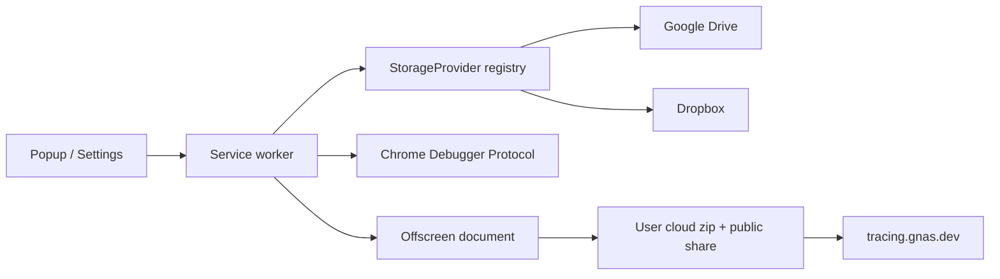

# Developer Guide

This guide is for contributors working on GN Tracing. The main [README](./README.md) stays user-facing; this file keeps the developer notes short and practical.

## Project Map

- `src/background/`: MV3 service worker composition root, multi-cloud auth, storage provider registry, settings store, capture environment normalization, upload orchestrator, message router, CDP capture, recorder, storage
- `src/background/storage/`: `StorageProvider` adapters (Google Drive, Dropbox)
- `src/offscreen/`: tab media recording and cloud package upload work
- `src/popup/`: extension popup UI and capture controls
- `src/drive-auth/`: Google Drive auth page opened in a normal tab
- `src/settings/`: Settings page (storage provider, folder, privacy, capture profile)
- `src/history/`: upload history page
- `src/shared/`: storage provider URL helpers, cloud API helpers, player URL, history helpers
- `src/types/`: shared message and recording contracts
- `player/`: player assets used by the extension build
- `player-standalone/`: hosted replay player app + per-provider download proxies
- `worker/`: optional Google OAuth token-exchange Worker (secret injection)
- `dist/`: generated unpacked extension output
- `docs/`: architecture, module, compliance, and sync notes

## Runtime Shape

GN Tracing is a Manifest V3 extension with three main surfaces:

1. The popup starts and stops recording, shows state, and exposes cloud storage/upload controls.
2. The service worker coordinates capture, attaches CDP to the active tab, and stores live UI state in `chrome.storage.session`.
3. The offscreen document records tab media, uploads packages to the active cloud provider, and reports progress.


```mermaid
flowchart LR
  Popup["Popup / Settings"] --> SW["Service worker"]
  SW --> Registry["StorageProvider registry"]
  Registry --> G["Google Drive"]
  Registry --> D["Dropbox"]
  SW --> CDP["Chrome Debugger Protocol"]
  SW --> Offscreen["Offscreen document"]
  Offscreen --> Cloud["User cloud zip + public share"]
  Cloud --> Player["tracing.gnas.dev"]
```

## Setup

Requirements:

- Node.js 18+
- A Chromium-based browser (Chrome, Edge, Brave, Vivaldi, Opera, etc.)
- Task, if you want to use the documented `task` commands

Install dependencies:

```bash
npm install
cd player-standalone
npm install
```

Copy `.env.example` to `.env` and fill OAuth client ids as needed (see [OAuth apps](#oauth-apps-all-providers) below).

## Common Commands

From the repository root:

```bash
task build          # Build extension into dist/ for development
task dist           # Build extension into dist/ for production
task watch          # Rebuild extension on source changes
task typecheck      # Type-check root extension code
task lint           # Run Biome lint checks for supported sources
task format         # Format Biome-supported repository sources
task check          # Run Biome checks plus docs hygiene validation
task build:all      # Build extension and standalone player
task dist:all       # Production build for extension and player
task dev            # Full local stack: extension watch + player (Vite proxies) + multi-issuer Worker (:8787 OAuth + /feedback)
task worker:dev     # Local Worker only (also included in `task dev`)
task worker:sync-dev-vars  # Sync worker/.dev.vars from root .env (run automatically by task dev / worker:dev)
```

Standalone player:

```bash
task player:dev
task player:sync
task player:build
task player:dist
task player:typecheck
```

## Load Locally

1. Run `task build`.
2. Open `chrome://extensions` or `edge://extensions`.
3. Enable `Developer mode`.
4. Click `Load unpacked`.
5. Select this repository's `dist/` folder.

Rebuild and reload the unpacked extension after source changes. After changing OAuth client ids or token proxy URLs, always rebuild so esbuild defines and `host_permissions` are regenerated.

## Upload And Replay Model

After upload, GN Tracing writes one zip package into the configured folder on the **active** cloud provider. The package contains recording artifacts such as `metadata.json`, `manifest.json`, `recording-index.json`, optional log files, and ordered `video.part-XXX.webm` files.

Replay URLs are namespaced by provider:

```text
https://tracing.gnas.dev/gdrive/<file-id>
https://tracing.gnas.dev/dropbox/<shared-link-id>
```

Legacy Google Drive bare-id links (`https://tracing.gnas.dev/<file-id>`) remain parseable.

The hosted player downloads the zip through the matching same-origin proxy (`/api/drive` or `/api/dropbox`), unpacks it locally, and reads the embedded recording index and artifacts. The extension player may use an OAuth token for authenticated download when available.

Upload **hard-fails** if public share creation fails — no broken replay links.

## OAuth Apps (All Providers)

Use **public clients + PKCE** when the vendor allows it so the extension never needs a client secret. Secrets belong only in optional Workers, never in the extension bundle.

Redirect URI for all providers (from `chrome.identity.getRedirectURL()`):

```text
https://<extension-id>.chromiumapp.org/
```

Use the Store extension id for production, or the unpacked id printed in `chrome://extensions` for local dev. Rebuild after changing client ids.

### Google Drive

| Item | Value |
|------|--------|
| Console | Google Cloud → OAuth client (Chrome extension and/or Web application) |
| Env | `GOOGLE_CLIENT_ID` |
| Optional secret proxy | `GOOGLE_TOKEN_PROXY_URL` → existing Google-shaped Worker in `worker/` |
| Dev proxy default | `GOOGLE_TOKEN_PROXY_URL_DEV` → `http://localhost:8787` when unset (`task dev` / watch) |
| Scopes | Drive `drive.file` (create/access files the app creates or the user opens with it) |
| Extension auth | Chrome: `getAuthToken`; other Chromium: web auth PKCE + refresh cache |
| Host permissions | `https://oauth2.googleapis.com/`, `https://www.googleapis.com/`, optional Worker origin |

Also required for production extension identity: `CHROME_EXTENSION_ID`, `CHROME_EXTENSION_PUBLIC_KEY` (and private key for CRX tooling if used).

When the Google OAuth client is a **Web application** type that requires `client_secret`, deploy `worker/` and set `GOOGLE_TOKEN_PROXY_URL`. Public/installed clients can leave the proxy empty and call Google directly.

See [docs/modules/oauth-token-proxy.md](./docs/modules/oauth-token-proxy.md).

### Dropbox

| Item | Value |
|------|--------|
| Console | [Dropbox App Console](https://www.dropbox.com/developers/apps) → Scoped access |
| Env | `DROPBOX_CLIENT_ID` (app key) |
| Optional secret proxy | `DROPBOX_TOKEN_PROXY_URL` → multi-issuer Worker path `/token/dropbox` |
| Dev proxy default | `DROPBOX_TOKEN_PROXY_URL_DEV` → `http://localhost:8787/token/dropbox` when unset |
| Scopes | `files.content.write`, `files.content.read`, `sharing.write`, `sharing.read`, `account_info.read` (or Full Dropbox) |
| Extension auth | `launchWebAuthFlow` + PKCE preferred |
| Replay | `/dropbox/<canonical-shared-link-id>`; standalone `/api/dropbox?id=...` |

**Token proxy:** Deploy `worker/` once (`task worker:deploy`). Confidential Dropbox apps set `DROPBOX_CLIENT_SECRET` (Worker secret only) and `DROPBOX_TOKEN_PROXY_URL=https://<worker>/token/dropbox`. Public PKCE clients can leave the proxy URL empty.

The Dropbox proxy only accepts relative shared-link ids (`s/`, `scl/`, `sh/`, `sm/`). Absolute URLs are rejected (SSRF prevention).


### Local full stack (`task dev`)

`task dev` runs **three** processes together (extension + player + **local Worker**):

| Process | Port / path | Role |
|---------|-------------|------|
| Extension watch | esbuild → `dist/` | Injects **local** Worker proxies (not production Worker URLs) |
| Standalone player | Vite `:5176` | Replay UI + `/api/drive`, `/api/dropbox` download proxies |
| Multi-issuer Worker | wrangler `:8787` | OAuth token exchange (Google `/`, Dropbox `/token/dropbox`) + optional `POST /feedback` |

Before wrangler starts, `task worker:sync-dev-vars` copies client ids/secrets and optional `GITHUB_FEEDBACK_TOKEN` from root `.env` into `worker/.dev.vars` (git-ignored). Keep `*_TOKEN_PROXY_URL_DEV` / `FEEDBACK_PROXY_URL_DEV` empty to use the localhost defaults (`http://localhost:8787`, `/token/dropbox`, `/feedback`); set them only to override.

The Worker is **required** for local confidential OAuth clients and for in-extension Feedback submit. Run `task worker:dev` alone if you only need the Worker.

### Env var summary

From `.env.example`:

```text
GOOGLE_CLIENT_ID=
GOOGLE_CLIENT_SECRET=          # Worker only, never extension
GOOGLE_TOKEN_PROXY_URL=
GOOGLE_TOKEN_PROXY_URL_DEV=
DROPBOX_CLIENT_ID=
DROPBOX_TOKEN_PROXY_URL=
DROPBOX_TOKEN_PROXY_URL_DEV=
CHROME_EXTENSION_ID=
CHROME_EXTENSION_PUBLIC_KEY=
```

## Development Notes

- Preserve message contracts across popup, service worker, and offscreen code unless all participants are updated together. Prefer generic `STORAGE_*` messages; legacy `GOOGLE_DRIVE_*` aliases remain for compatibility.
- Treat MV3 service worker restarts as normal. UI state should recover from `chrome.storage.session` and runtime checks.
- Keep user-facing docs aligned with multi-cloud: record, stop, upload to the active provider, open namespaced replay link.
- Biome owns formatting, linting, and import organization for its supported source types. Markdown docs are covered by `npm run docs:check`, and the Husky pre-commit hook runs Biome over staged supported files plus the docs check before re-staging safe fixes.
- `task player:build`, `task player:dist`, and `task player:deploy` sync shared player assets automatically. Use `task player:sync` only when you need to refresh the mirrored standalone assets without building.
- If manifest permissions, auth, cloud upload, or player loading changes, manually verify the affected browser × provider matrix.
- Keep source comments in English and focused on runtime boundaries, browser API constraints, async lifecycle, or non-obvious contracts.
- **Telemetry-free:** do not log OAuth tokens, refresh tokens, or package file bodies. High-level auth failure messages in `console.warn` / `console.error` are acceptable (network errors, HTTP status, OAuth `error` / `error_description` strings). Auth error logs must never include full token-endpoint response JSON or grant payloads.

## Release

Releases are tag-driven through `.github/workflows/release.yml`.

1. Commit changes to `main`.
2. Push a tag matching `v*`, for example `v1.0.4`.
3. GitHub Actions runs `task release:ci`.
4. The release publishes `gn-tracing-extension-${tag}.zip`, which extracts to `gn-tracing-extension-${tag}/`.

Production release builds use repository secrets for extension identity and OAuth:

- `GOOGLE_CLIENT_ID`
- `CHROME_EXTENSION_ID`
- `CHROME_EXTENSION_PUBLIC_KEY`
- `CHROME_EXTENSION_PRIVATE_KEY`
- plus `DROPBOX_CLIENT_ID` (and optional proxy URL) when shipping multi-cloud Store builds

Local production builds can provide the same names in `.env`.

## Store Package Check

Before Chrome Web Store upload, run:

```bash
task store:check
task store:zip
```

`task store:check` type-checks the extension and player, runs production build validation, and checks the generated store package.

`task store:zip` writes `gn-tracing-store.zip` with `manifest.key` removed. Chrome Web Store rejects packages that include `key` (that field is only for stable unpacked extension IDs). Local `dist/manifest.json` still keeps `key` after the zip step.

## Useful Docs

- [Docs overview](./docs/overview.md)
- [Cloud storage and player](./docs/modules/drive-and-player.md)
- [OAuth token proxy (Google)](./docs/modules/oauth-token-proxy.md)
- [Recording runtime](./docs/modules/recording-runtime.md)
- [Chrome Web Store notes](./docs/compliance/chrome-web-store-submission.md)
- [Multi-cloud plan](./docs/specs/planning/multi-cloud-storage-providers.md)
