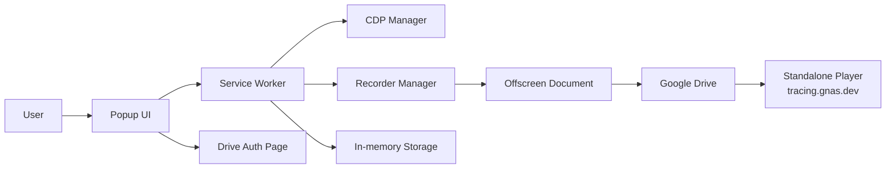

# GN Tracing

GN Tracing là extension Chrome/Edge dùng để quay lại một tab và gom toàn bộ tín hiệu debug quan trọng vào cùng một phiên: video, console, network, WebSocket, rồi tùy chọn upload lên Google Drive để mở lại bằng player chia sẻ.

<p align="center">
  
</p>

## What It Does

- Ghi video tab kèm audio.
- Thu console logs, exceptions, network requests/responses và WebSocket frames.
- Resolve stack trace qua source map để dễ đọc hơn khi debug.
- Upload artifacts lên Google Drive và trả về link mở player tại `https://tracing.gnas.dev/`.

## Flow Overview



## Main Parts

- `src/background/`: service worker và các manager điều phối recording.
- `src/offscreen/`: quay media và upload Drive.
- `src/popup/`: giao diện điều khiển recording, auth, upload.
- `drive-auth/`: trang OAuth cho Google Drive.
- `player/`: runtime player được đồng bộ sang app standalone.
- `player-standalone/`: web player đọc lại artifacts từ Drive qua proxy `/api/drive`.

## Quick Start

### Requirements

- Node.js 18+
- Google Chrome hoặc Microsoft Edge

### Install

```bash
npm install
npm run build
```

Sau khi build xong, load thư mục `dist/` trong `chrome://extensions` bằng chế độ `Developer mode` -> `Load unpacked`.

## Development

```bash
npm run watch
npm run typecheck
npm run build:all
npm run watch:all
```

## Typical Usage

1. Mở popup của extension.
2. Chọn `Start Recording` trên tab cần theo dõi.
3. Thực hiện flow cần debug.
4. Chọn `Stop Recording`.
5. Upload lên Google Drive nếu muốn chia sẻ hoặc replay bằng player.

## Google Drive Replay

- Auth diễn ra trên tab riêng để tránh popup bị đóng giữa chừng.
- Player host là cố định: `https://tracing.gnas.dev/`.
- Replay URL dùng trực tiếp các file ID của Drive cho `videos`, `metadata` và các artifact tùy chọn như `console`, `network`, `websocket`.

## Notes

- Dữ liệu recording được giữ trong memory của extension runtime.
- Service worker được giữ sống bằng `chrome.alarms` trong lúc recording.
- Response body chỉ lưu với các nội dung text phù hợp và có giới hạn kích thước.
- Standalone player tải artifacts Drive thông qua proxy cùng origin để tránh vấn đề CORS/CORP.

## License

Private
