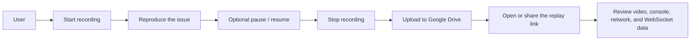

# GN Tracing

GN Tracing is a Chrome/Edge extension for capturing a single browser tab and bundling the most useful debugging signals into one shareable session.

Instead of sending only a screen recording, you can capture:

- tab video, with tab audio when available
- pause and resume during capture
- console logs and runtime exceptions
- network requests and responses
- WebSocket activity
- a replay link that opens the uploaded session in the GN Tracing player

  

## Why teams use it

GN Tracing is useful when a bug is hard to describe, hard to reproduce, or needs more context than a plain video can provide.

- A reporter can capture what happened without manually collecting DevTools evidence.
- Engineers can review video and technical artifacts in one place.
- QA, support, product, and engineering teams can share a clearer debugging package instead of a loosely written bug report.

## Best-fit use cases

GN Tracing works well for:

- UI bugs that only appear after a longer interaction flow
- API failures that need request and response context
- WebSocket issues that depend on message timing
- internal bug reports that need a replay link for quick handoff

## What the extension records

- Video from the selected tab
- Tab audio when the tab is producing audio
- Console API output and runtime exceptions
- Network activity captured through Chrome DevTools Protocol
- WebSocket connections and frames
- Source-map-resolved locations where available, to make stack traces easier to inspect

## What the player shows

After upload, the replay link opens the GN Tracing player at [tracing.gnas.dev](https://tracing.gnas.dev/).

The player can:

- replay the recorded video
- sync console and network entries to the recording timeline
- show WebSocket activity alongside network inspection
- search and filter console and network data
- inspect request details, headers, payloads, and available response bodies
- copy cURL and response content from the network viewer

## Important limits

- GN Tracing records one tab at a time.
- `chrome://` pages cannot be recorded.
- Response bodies are only captured for supported text-based content types.
- Large response bodies are not always stored. The current network body capture limit is about `1 MB` per response body.
- Recording data stays in the extension runtime until it is uploaded. If the extension runtime restarts, an unfinished local recording may be interrupted.

## Install

GN Tracing is currently distributed as a packaged release artifact from this repository.

1. Download the latest release `.zip` from GitHub Releases.
2. Extract the archive.
3. Open `chrome://extensions` or `edge://extensions`.
4. Turn on `Developer mode`.
5. Click `Load unpacked`.
6. Select the extracted `dist/` folder.

## Quick start

1. Open the tab you want to capture.
2. Click the `GN Tracing` extension icon.
3. Click `Start Recording`.
4. Reproduce the issue.
5. Optionally pause and resume while reproducing the issue.
6. Click `Stop Recording`.
7. If Google Drive is connected, GN Tracing uploads automatically after stop.
8. Copy or open the generated replay link from the popup history or result block.

## Google Drive upload and replay

GN Tracing uploads the recording artifacts to your Google Drive and then generates a replay URL for the web player.

- Google authentication runs in a separate tab so the popup does not get interrupted during auth.
- You can configure a target upload folder in the popup by pasting a Drive folder ID or folder link. Leaving it blank uses the Drive root.
- The generated replay link points to the hosted player and includes the artifact references needed to load the recording.
- The replay link now uses a single uploaded index file id in the form `https://tracing.gnas.dev/<id>`.
- The uploaded folder and files are made readable by link so teammates can open the replay URL directly.
- Each upload also writes a `recording-index.json` file containing the uploaded artifact ids; the player loads that file first, then fetches the referenced artifacts.
- Upload history is stored locally and synced as `gn-tracing-upload-history.json` into the configured upload folder.

## Typical flow

## Who this is for

GN Tracing is a strong fit for internal workflows where QA, support, product, or developers need a better bug report than “here is a video and a short description.”

## License

GPL-3.0-or-later. See [LICENSE](./LICENSE).

## For developers

If you are contributing to the codebase, see the developer guide at [DEVELOPER.md](./DEVELOPER.md).
