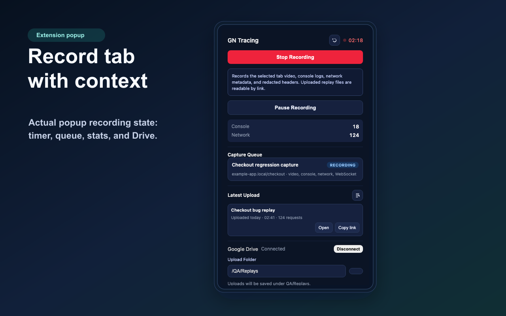
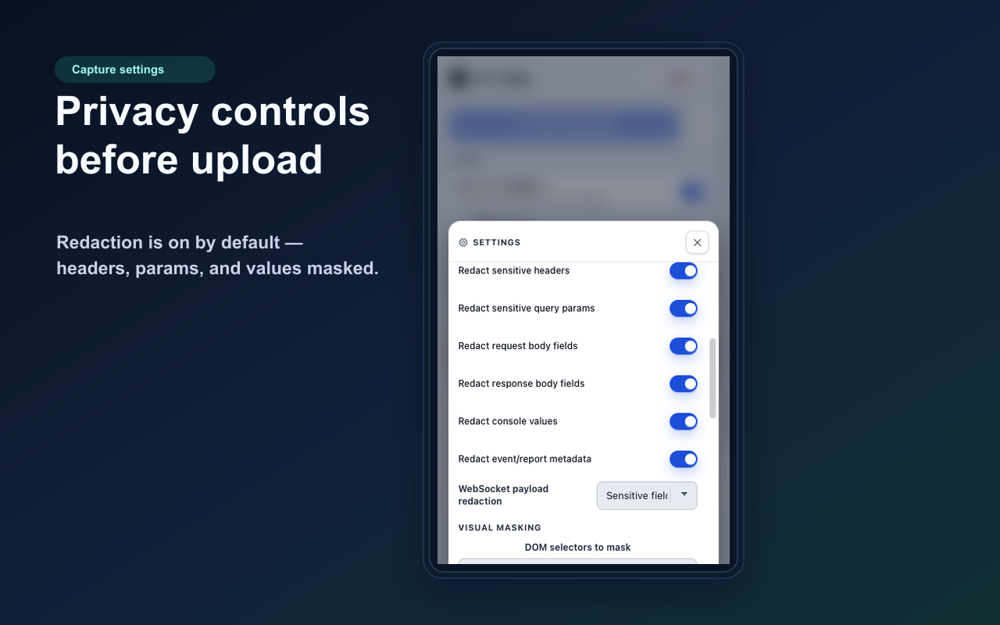
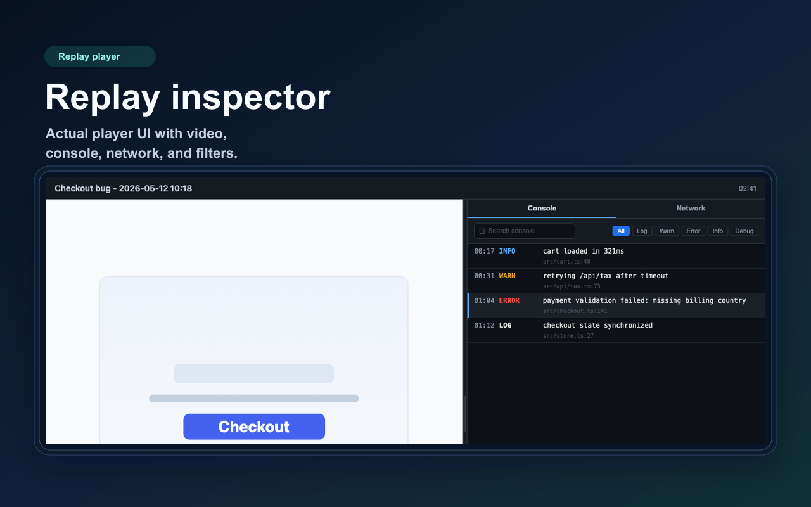
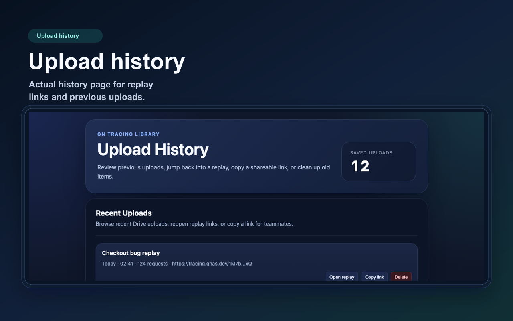

# GN Tracing

GN Tracing is a Chromium-based browser extension that records one browser tab and packages the useful debugging evidence into a shareable replay. It works on Chrome, Edge, Brave, Vivaldi, Opera, and other Chromium-based browsers.

It captures:

- tab video and audio
- console logs and runtime errors
- network requests and responses
- WebSocket activity
- optional storage snapshots (localStorage, sessionStorage, cookies) and static DOM snapshots
- annotated screenshots — capture a page, draw arrows, boxes and notes on it, and redact anything private
- Instant Replay: opt-in rolling DOM lookback; capture after a bug without re-recording
- an optional upload to your cloud storage (Google Drive or Dropbox) with a replay link

## Screenshots

### Extension popup



### Privacy and cloud storage settings



### Replay player



### Upload history



## When to use it

Use GN Tracing when a bug is easier to show than explain, especially when engineers need more than a screen recording.

Good fits:

- UI bugs across longer flows
- API failures that need request and response context
- WebSocket issues where message timing matters
- QA, support, product, and engineering handoffs

## Quick Start

1. Install the extension.
2. Open the tab you want to record.
3. Click the `GN Tracing` extension icon.
4. Click `Start Recording`.
5. Reproduce the issue.
6. Click `Stop Recording`.
7. Open or share the replay link after upload.

If cloud storage is connected, GN Tracing uploads automatically after recording stops.

## Install

GN Tracing is distributed as a packaged release from this repository.

1. Download the latest release `.zip`.
2. Extract it.
3. Open your browser's extensions page:
   - Chrome: `chrome://extensions` → load unpacked `dist/chrome/` (or the Chrome release zip)
   - Edge: `edge://extensions` → load unpacked `dist/edge/` (`task build:edge`)
   - Firefox: `about:debugging#/runtime/this-firefox` → temporary add-on → `dist/firefox/manifest.json` (`task build:firefox`)
4. Turn on `Developer mode` (Chromium) and load the matching package folder.

## Replay Links

Uploaded sessions open in the hosted player at [tracing.gnas.dev](https://tracing.gnas.dev/).

The player lets you review the video together with console, network, and WebSocket data. You can search, filter, inspect request details, copy cURL, and copy available response content.

## Use it with a coding agent

A replay link is evidence an AI agent can read. Point one at your codebase and it can trace the
failure to a file and line, because console stacks are already mapped back to original sources.

Install into your project — this adds the MCP server **and** the investigation skill:

```bash
/plugin marketplace add gnasdev/gn-tracing
/plugin install gn-tracing@gn-tracing
```

Or add just the MCP server to any client:

```bash
claude mcp add gn-tracing -- npx -y gn-tracing-mcp
```

Then paste a replay link and ask what went wrong:

```text
https://tracing.gnas.dev/gdrive/1AbCd… — checkout breaks when applying a coupon
```

The agent reads the ranked summary, finds the first distinct error and the request that failed just
before it, and opens the matching file in your repository. A recording is mostly video, and none of it
is downloaded — only the JSON artifacts the agent actually asks for.

Other clients (Cursor, Windsurf, Codex, Claude Desktop), the no-install hosted endpoint, and the
`--allow-dir` flag for downloaded `.zip` packages are covered in
[mcp/README.md](./mcp/README.md).

## Screenshot Reports

Not every bug needs a video. Click `Screenshot` in the popup to capture the current tab and open the
annotation editor: arrows, boxes, circles, freehand, notes, highlight, and redaction. Saving packages
it and uploads it like any other recording, so the same replay link, MCP tools, and agent skills work.

**Redaction destroys pixels.** A redacted region is pixelated in the stored image before the package is
written — it is not an overlay the viewer draws. Nobody who opens the zip can recover it, which is the
only version of "redacted" worth having.

## Instant Replay

Instant Replay is **opt-in always-on lookback** (jam.dev-style), not a Record session.

1. Enable **Instant Replay** in the popup (grants optional host permission for the DOM content
   script on http/https pages).
2. **Add allowed domains** (popup: “Add this site”). Console/network use **CDP** only on those
   hosts — you will see the Chrome debugger banner while the focused tab matches the allowlist.
3. Keep browsing on an allowlisted site. GN Tracing holds a rolling **DOM** buffer plus **CDP
   console / network / websocket / storage** for the last N seconds (default **120s**,
   **15–300s**) **locally** — not screen video, not uploaded until you capture.
4. When a bug happens, click **Instant Replay**. The extension packages the lookback (plus a
   current-tab still when available) and uploads a no-video replay with `instant-replay.json` and
   `console.json` / `network.json` when CDP captured rows.

Starting **Record** on the same tab hands off the debugger to the full recording; stopping Record
re-attaches Instant Replay CDP if the site is still allowlisted. Full **Record** remains the path
for tab video and the full session timeline.

## Privacy Controls

Sensitive request and response headers are redacted by default.

Request bodies, response bodies, and WebSocket message payloads are captured by default (full recording). You can turn individual surfaces off in Settings. Response body capture is limited to supported text-based content types; byte limits are unbounded by default (`null`) and can be capped in Settings. Sensitive fields are redacted by default via per-surface redaction toggles (no privacy profile presets).

### Storage and DOM capture

Two additional evidence sources are available in Settings. Both default to **on** for full recording and ship with redaction **on**:

- `captureStorage` — snapshots `localStorage`, `sessionStorage`, and cookies at recording start and stop, packaged as `storage.json` and shown in the player `Storage` tab with a start↔stop diff. `redactStorageValues` (default on) replaces values whose key matches a sensitive pattern (password, token, secret, and similar) with a redacted placeholder before the snapshot is buffered.
- `captureDomSnapshots` — captures a static DOM tree at start, stop, and key marker events (not a continuous recording), packaged as `dom.json` and shown in the player `Elements` tab. `redactDomTextContent` (default on) masks text and attribute values for nodes matching your DOM mask selectors. Oversized snapshots are reduced or skipped, and any skipped capture is noted in the recording's privacy limitations.

Both expand the captured surface of personal data; keep redaction on unless you deliberately need raw values for debugging.

Full **Record** sessions collect console, network, WebSocket, and optional storage/DOM evidence through the Chrome Debugger Protocol (CDP). While recording, Chrome may show a "debugging this tab" banner. (Instant Replay evidence and the browser SDK use separate page instrumentation; they are not alternate Record capture modes.)

### Third-party components and attribution

The replay player renders objects and JSON with vendored, prebuilt [luna](https://github.com/liriliri/luna) components (`luna-object-viewer`, `luna-json-editor`) under `player/public/vendor/luna/`. These are MIT-licensed; the upstream license is kept at [`player/public/vendor/luna/LICENSE`](./player/public/vendor/luna/LICENSE) and pinned versions are recorded in `player/public/vendor/luna/VERSIONS.md`. The player falls back to its built-in renderers if a component is unavailable.

## Limits

- Records one tab at a time.
- Cannot record browser system pages, extension pages, Chrome Web Store pages, DevTools/internal URLs, or tabs without a normal `http:`, `https:`, or `file:` URL.
- Keeps unfinished recording data in extension memory until upload.
- A browser or extension restart can interrupt an unfinished local recording.
- On non-Chrome Chromium browsers, some OAuth access tokens expire after approximately one hour and may require silent refresh or reconnection depending on the provider. Brave Shields may block the OAuth popup; disable Shields for the extension page if cloud storage connect fails.

## Developers

See [DEVELOPER.md](./DEVELOPER.md) for local setup, architecture notes, build tasks, and release guidance.

## License

GPL-3.0-or-later. See [LICENSE](./LICENSE).
