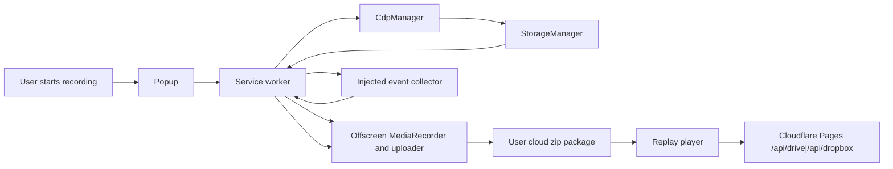

# GN Tracing Docs Overview

## Meta

- Trạng thái: active
- Phạm vi: product scope, documentation boundaries, and architecture guardrails
- Nguồn code: `src/`, `popup/`, `offscreen/`, `drive-auth/`, `player/`, `player-standalone/`
- Tuân thủ: Không áp dụng
- Links: [Recording Runtime](./modules/recording-runtime.md), [Cloud Storage And Player](./modules/drive-and-player.md), [Privacy And Redaction](./modules/privacy-and-redaction.md), [Replay Player](./modules/replay-player.md), [Extension Surfaces](./features/extension-surfaces.md), [Project Context](./shared/project-context.md)

## Goal

GN Tracing is a Chrome/Edge Manifest V3 extension for capturing a browser tab session as synchronized artifacts:
- tab video/audio recording
- console logs and exception traces
- network requests, responses, and WebSocket traffic
- optional upload to the user's cloud storage (Google Drive or Dropbox) with a namespaced player URL for replay

## Reader Journey

A new reader should understand GN Tracing in this order:

1. Product purpose and the capture-to-replay happy path.
2. Runtime topology: service worker, offscreen document, CDP collector, injected event collector, and thin UI clients.
3. Shared data contracts: messages, recording state, settings, recording artifacts, and replay package layout.
4. Recording lifecycle and target-tab restrictions.
5. Evidence taxonomy: media, console, network, WebSocket, report, events, privacy, diagnostics, screenshot, storage, and DOM-snapshot artifacts.
6. Privacy/redaction behavior, capture-depth profiles, and the opt-in `cdp` vs `in-page` capture mode.
7. Multi-cloud authentication, folder targeting, package upload, public share, and optional ZIP password semantics.
8. Replay player modes, package loading, inspection UX, and standalone per-provider proxies.
9. Release packaging, Chrome Web Store disclosure, and privacy compliance.

## Runtime Topology

## In Scope

- MV3 extension runtime under `src/`, `popup/`, `offscreen/`, `drive-auth/`, `player/`
- capture orchestration via service worker, offscreen document, and Chrome Debugger API
- multi-cloud authentication and upload (Google Drive and Dropbox)
- built-in replay player and standalone player integration under `player-standalone/`
- shared privacy/redaction policy, event timeline capture, replay report artifacts, and source-map diagnostics
- popup, Settings, auth, and upload-history extension surfaces
- build pipeline that emits the unpacked extension into `dist/`

## Out Of Scope

- backend/server-side storage or processing of recording packages
- OneDrive / Microsoft Graph (removed; personal OneDrive cannot reliably serve anonymous player downloads)
- SharePoint / site drives and other non-Drive/Dropbox clouds
- local persistence for captured recording payloads beyond in-memory runtime state
- backward compatibility with removed modules or deprecated message contracts
- non-Chromium browser implementations beyond the current Chrome/Edge-specific handling already in code

## Current Scope Guard

The current codebase is centered on session capture and replay distribution. New docs should stay within:
- browser capture/runtime behavior
- multi-cloud upload/share flows
- player hosting and playback integration
- privacy, redaction, evidence quality, and compliance semantics for captured artifacts
- build/distribution mechanics for the extension and standalone player
