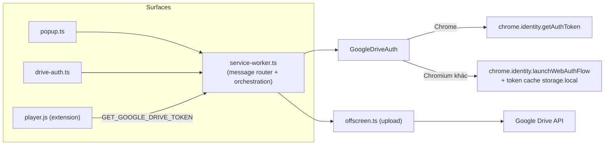

# Tổng Quát Hóa Auth Cho Chromium Và Dọn Dẹp Codebase

## Bối Cảnh

GN Tracing là extension Manifest V3 với các surface chính: popup, service
worker, offscreen document, content script, trang drive-auth/history/settings,
player nhúng trong extension và player standalone trên Cloudflare Pages.

Ba nhóm vấn đề tồn tại song song:

1. **Auth chỉ chạy đúng trên Chrome và Edge.** `GoogleDriveAuth` phân nhánh
   bằng UA sniffing `navigator.userAgent.includes("Edg/")`. Mọi browser không
   phải Edge — gồm Brave, Vivaldi, Opera, Arc, Chromium thuần — rơi vào nhánh
   mặc định dùng `chrome.identity.getAuthToken()`, API phụ thuộc tích hợp
   Google account chỉ tồn tại đầy đủ trong Google Chrome chính hãng. Trên các
   Chromium khác, API này lỗi hoặc trả rỗng, khiến kết nối Drive thất bại dù
   phần còn lại của extension (tabCapture, offscreen, debugger) là API Chromium
   chuẩn.
2. **Dead export và dead flow tích tụ.** Scan sơ bộ cho thấy nhiều export
   trong `src/shared/theme.ts`, `src/shared/privacy-redaction.ts`,
   `src/types/messages.ts`, `src/types/recording.ts`,
   `src/shared/player-host.ts` không được import ở bất kỳ file nào khác —
   một phần chỉ dùng nội bộ (export keyword thừa), một phần nghi là dead
   thật. Repo chưa có công cụ phát hiện unused export trong CI.
3. **Service worker là god module.** `src/background/service-worker.ts`
   (~2.300 dòng) trộn lẫn message routing, normalize settings, persist
   settings/history, điều phối recording, điều phối upload, check update
   GitHub, và build capture environment trong một file phẳng.

Ràng buộc quan trọng: worktree đang có thay đổi chưa commit thực thi plan
`record-sourcemap-player-gaps.md` (chạm `storage-manager.ts`,
`player/player.js`, `player-standalone/public/*`, docs modules,
`.env.example`). Kế hoạch này **không chạm** các diff đó.

## Nguyên Nhân Và Lý Do Thiết Kế

### Auth

Nguyên nhân gốc rễ không phải "thiếu support Edge" (đã có nhánh
`launchWebAuthFlow`) mà là **chọn chiến lược theo brand thay vì theo
capability**:

- Nhánh web-auth-flow bị viết như đặc thù Edge (`EDGE_ACCESS_TOKEN_KEY`,
  `isEdgeBrowser()`), trong khi về bản chất nó là đường đi tổng quát cho mọi
  Chromium — `chrome.identity.launchWebAuthFlow()` và redirect
  `https://<id>.chromiumapp.org/` là API chuẩn Chromium.
- Nhánh `getAuthToken` được mặc định cho "mọi browser còn lại", trong khi nó
  mới là nhánh đặc thù (chỉ Chrome chính hãng).
- Một số Chromium (Vivaldi) giả UA/brand giống hệt Chrome, nên **mọi cách
  detect theo brand đều không đủ** — cần fallback runtime: thử
  `getAuthToken`, lỗi thì chuyển sang web-auth-flow.

### Dead code và tổ chức

- Export được khai báo rộng rãi theo thói quen, không có ranh giới public
  API cho từng module; không có tool (knip/ts-prune) chặn unused export.
- Service worker phình to vì mọi handler mới đều thêm vào cùng file; chưa có
  điểm gãy buộc tách module.

## Góc Nhìn Tổng Quan Và Phạm Vi Tập Trung

Mọi consumer token đều đi qua `GoogleDriveAuth` trong service worker (popup,
drive-auth page, extension player qua message, offscreen qua handler upload).
Vì vậy thay đổi auth **khu trú trong một file** cộng điểm gọi không đổi —
contract `getAuthToken/launchOAuthFlow/disconnect/getStatus` giữ nguyên.

Phạm vi tập trung theo thứ tự ưu tiên:

1. `src/background/google-drive-auth.ts` — tổng quát hóa Chromium.
2. Dead export cleanup có kiểm chứng bằng tool trên `src/` và
   `player-standalone/src/`.
3. Tách `service-worker.ts` thành module theo trách nhiệm (move-only).

## Mục Tiêu

1. Kết nối, upload, disconnect Google Drive hoạt động trên Chromium nói chung
   (Chrome, Edge, Brave, Vivaldi, Opera, Chromium) với cùng UX hiện tại;
   Chrome vẫn ưu tiên `getAuthToken` (UX mượt hơn, tự refresh).
2. Token web-auth-flow có quản lý hạn dùng (`expires_at`), giảm gọi mạng
   verify mỗi lần mở popup.
3. Loại bỏ dead export/dead flow đã được kiểm chứng; export chỉ-dùng-nội-bộ
   bị hạ xuống private; có tool unused-export chạy được lặp lại.
4. `service-worker.ts` tách thành các module trách nhiệm đơn, không đổi hành
   vi, không đổi message contract.
5. Docs (`README.md`, `DEVELOPER.md`, `docs/modules/drive-and-player.md`,
   docs index) phản ánh hỗ trợ Chromium tổng quát và cấu trúc module mới.

## Ngoài Phạm Vi

- Diff đang dở trong worktree (sourcemap enrichment + player render) — không
  chạm, không revert.
- Viết lại kiến trúc `player/player.js` (4.5k dòng JS thuần) — rủi ro cao,
  để giai đoạn riêng; chỉ ghi nhận.
- Tách nhỏ `popup.ts`, `settings.ts`, `cdp-manager.ts`, `offscreen.ts` — chỉ
  làm nếu cleanup dead code mở ra cơ hội rõ ràng; không phải mục tiêu chính.
- Firefox/Safari (không phải Chromium).
- Đổi OAuth sang authorization-code + refresh token (cần backend giữ secret
  hoặc client type khác) — implicit flow giữ nguyên, chỉ quản lý expiry tốt
  hơn.
- Phát hành store, đổi `client_id`, đổi manifest `key`.

## Logic Nghiệp Vụ

- **Chọn chiến lược auth theo capability, có fallback runtime:**
  - Connect (interactive): nếu browser nhận diện là Google Chrome chính hãng
    (qua `navigator.userAgentData.brands` chứa "Google Chrome" và không chứa
    brand khác như "Microsoft Edge", "Brave", "Opera"; fallback UA khi
    `userAgentData` vắng) → thử `getAuthToken({interactive: true})`. Nếu API
    lỗi/trả rỗng (trường hợp Vivaldi giả brand Chrome) → fallback
    `launchWebAuthFlow`. Browser không phải Chrome → đi thẳng
    `launchWebAuthFlow`.
  - Chiến lược thành công được ghi nhớ (`gn_tracing_auth_strategy` trong
    `storage.local`) để các lần `getAuthToken` non-interactive sau không lặp
    lại nhánh fail.
- **Token web-auth-flow:** lưu `{ token, expiresAt }` (tính từ `expires_in`
  trong redirect hash, trừ buffer ~60s). `getAuthToken()` trả token còn hạn
  mà không gọi mạng; token hết hạn coi như chưa kết nối → UI hiển thị nút
  Connect như hiện tại (trang drive-auth đã có sẵn flow reconnect).
- **Migration:** lần đọc đầu nếu thấy key cũ `gn_tracing_edge_access_token`
  thì chuyển sang key mới (không có `expiresAt` → verify một lần rồi gán hạn
  ngắn) và xóa key cũ.
- **Disconnect:** revoke + clear cache theo chiến lược đang dùng, giữ semantics
  hiện tại (luôn trả về success-style sau best-effort cleanup).
- **Authorization scope không đổi:** vẫn chỉ `drive.file`; redirect URI
  `https://<extension-id>.chromiumapp.org/` ổn định nhờ manifest `key` nên
  cùng một OAuth client dùng được trên mọi Chromium.

## Cấu Trúc Giải Pháp

### 1. Auth — Strategy pattern trong `src/background/google-drive-auth.ts`

Tách hai chiến lược sau cùng interface `TokenProvider`:

- `ChromeIdentityProvider`: bọc `getAuthToken`, `removeCachedAuthToken`,
  `clearAllCachedAuthTokens` (logic Chrome hiện tại, giữ nguyên).
- `WebAuthFlowProvider`: bọc `launchWebAuthFlow` + token cache có
  `expiresAt` trong `storage.local` (tổng quát hóa nhánh Edge hiện tại,
  đổi tên key, thêm expiry, thêm migration).

`GoogleDriveAuth` giữ nguyên public API và trở thành facade chọn provider:
detect brand → thứ tự ưu tiên provider → fallback khi provider đầu fail →
persist lựa chọn. Lỗi từng provider được log để chẩn đoán.

### 2. Dead code cleanup — có kiểm chứng

- Chạy `npx knip` (hoặc `ts-prune`) trên root tsconfig và
  `player-standalone/`; đối chiếu với scan sơ bộ. Quy tắc xử lý:
  - Symbol không dùng ở đâu cả → xóa.
  - Symbol chỉ dùng nội bộ file → bỏ `export`.
  - Type nằm trong contract artifact (vd `types/recording.ts` mô tả schema
    JSON mà `player.js` thuần JS đọc) → **giữ lại**, vì player không qua
    TypeScript; đánh dấu bằng comment ngắn nếu cần.
- Bằng chứng "grep không thấy" là bằng chứng yếu: mỗi xóa phải pass
  `task typecheck`, `task build`, `task player:typecheck`, và grep bổ sung
  trên `*.html`, `player/player.js` trước khi chốt.
- Rà dead flow ứng viên đã thấy: hằng `EDGE_ACCESS_TOKEN_KEY` (thay bởi key
  mới sau migration), export thừa trong `theme.ts` (chỉ
  `attachThemeToggle` được import ngoài), `PLAYER_HOST_URL`,
  `POPUP_UPLOAD_HISTORY_LIMIT`.

### 3. Tách service worker — move-only refactor

`src/background/service-worker.ts` giữ vai trò composition root (khởi tạo
singleton, đăng ký listener), phần thân tách thành module mới trong
`src/background/`:

| Module mới | Trách nhiệm chuyển sang |
| --- | --- |
| `settings-store.ts` | normalize/persist upload settings, capture profile, privacy defaults, upload history |
| `capture-environment.ts` | `parseBrowserFromUserAgent`, normalize environment/user events |
| `update-checker.ts` | `checkForExtensionUpdate` + GitHub Releases API |
| `upload-orchestrator.ts` | upload session sang Drive, artifact chunking, progress patch |
| `message-router.ts` | hai `onMessage` listener + `handleMessage` switch, ủy quyền về các module |

Nguyên tắc: chỉ di chuyển code và nắn import, không đổi logic, không đổi
message contract, không đổi key `chrome.storage`. Mỗi module export tối
thiểu — áp dụng luôn bài học từ mục dead export.

### 4. Docs

- `README.md`: "Chrome and Edge extension" → Chromium-based browsers, cập
  nhật mục Install/Limits nếu cần.
- `docs/modules/drive-and-player.md`: mô tả strategy + fallback + token
  expiry + migration key.
- `DEVELOPER.md` + `docs/_index.md`: project map theo module mới của
  background, ghi chú verify matrix browser.

## Hướng Tiếp Cận Đề Xuất

Làm theo bốn phase độc lập, mỗi phase một commit, theo thứ tự:

1. **Auth Chromium** (giá trị user cao nhất, khu trú một file + docs).
2. **Dead export cleanup** (làm trước khi tách file để không di chuyển code
   chết sang module mới).
3. **Tách service worker** (move-only, dễ review khi codebase đã sạch).
4. **Docs sync** (có thể gộp từng phần vào phase tương ứng).

Phase 2 và 3 không phụ thuộc phase 1; nếu cần giảm phạm vi, có thể duyệt
riêng phase 1.

## Chi Tiết Triển Khai

### Auth

- Detect brand trong service worker context: `navigator.userAgentData?.brands`
  (Chromium 90+, luôn có trên minimum Chrome 120); fallback regex UA cho an
  toàn. Edge/Brave/Opera tự khai brand riêng; Vivaldi có thể giả Chrome →
  được đỡ bởi fallback runtime ở connect.
- Redirect hash parse thêm `expires_in`; lưu
  `{ accessToken, expiresAt }` dưới key `gn_tracing_webauth_token`.
- `getStatus()` với token còn hạn: trả `isConnected: true` không gọi mạng;
  chỉ verify qua mạng ngay sau connect và trong migration. Với
  `ChromeIdentityProvider` giữ verify hiện tại (Chrome tự quản refresh nên
  tần suất thấp).
- Thông điệp lỗi khi cả hai chiến lược fail phải nêu rõ browser không cấp
  được token và hướng dẫn thử lại — hiển thị qua trang drive-auth sẵn có.

### Cleanup

- Thêm script dev `npm run deadcode` (knip với config nhỏ, ignore
  `player/player.js`, `dist/`, artifact contract types) để tái chạy được;
  không bắt buộc gắn vào CI trong phase này.

### Tách service worker

- Module mới nhận dependency qua tham số khởi tạo đơn giản (function +
  closure hoặc class nhẹ theo phong cách hiện tại của repo — các manager đã
  là class), tránh thêm framework DI.
- State runtime (`activeRecording`, `sessions`, `googleDriveState`) ở module
  sở hữu tương ứng, expose accessor thay vì biến global chia sẻ chéo.

## Công Việc Cần Làm

1. Refactor `google-drive-auth.ts` thành facade + 2 provider, brand
   detection + runtime fallback, token expiry, migration key Edge cũ, persist
   chiến lược.
2. Cập nhật thông điệp lỗi auth và xác nhận trang drive-auth/popup hiển thị
   đúng trạng thái reconnect khi token web-flow hết hạn.
3. Chạy knip/ts-prune, lập danh sách xóa/un-export có phân loại (xóa thật /
   hạ private / giữ vì contract), thực thi và kiểm chứng từng nhóm.
4. Tách `service-worker.ts` thành 5 module nêu trên, move-only, build +
   typecheck xanh sau mỗi bước tách.
5. Cập nhật docs: README, DEVELOPER, `drive-and-player.md`, `_index.md`.
6. Verify matrix thủ công theo mục Kiểm Chứng.

## Rủi Ro Và Ràng Buộc

- **OAuth client phải chấp nhận redirect `chromiumapp.org`**: client id hiện
  tại đã dùng cho nhánh Edge nên khả năng cao đã đăng ký; cần xác nhận trước
  khi merge (nếu thiếu, chỉ cần thêm redirect URI trong Google Cloud Console,
  không đổi code).
- **Implicit token sống ~1h, không refresh**: trên non-Chrome user sẽ phải
  reconnect theo chu kỳ; chấp nhận trong phạm vi này (đã ghi Ngoài Phạm Vi),
  UI phải thể hiện trạng thái hết hạn rõ ràng thay vì lỗi upload khó hiểu.
- **Brave shields / popup blocker** có thể chặn cửa sổ `launchWebAuthFlow`;
  cần ghi chú trong README troubleshooting nếu verify gặp.
- **Capture stack trên Chromium khác** (`tabCapture`, `offscreen`,
  `debugger`) là API chuẩn nhưng chưa từng verify chính thức ngoài
  Chrome/Edge — verify matrix sẽ cho biết giới hạn thật; nếu một browser
  fail ở capture (ngoài auth), ghi nhận vào Limits thay vì cố sửa trong
  phạm vi này.
- **Xóa nhầm contract type**: types mô tả JSON artifact được player JS thuần
  đọc — quy tắc phân loại ở Cấu Trúc Giải Pháp mục 2 là bắt buộc.
- **Tách service worker đụng diff dở của `storage-manager.ts`**: các module
  mới không chạm `storage-manager.ts`; nếu user commit diff sourcemap trước
  thì không còn xung đột — khuyến nghị commit worktree hiện tại trước khi
  bắt đầu phase 3.
- Hai listener `onMessage` trong service worker là chủ đích (router chính +
  intercept `UPLOAD_PROGRESS` của offscreen) — gộp vào router khi tách
  nhưng giữ nguyên semantics return `true/false`.

## Kiểm Chứng

1. `task typecheck`, `task check`, `task build`, `task player:typecheck`,
   `task player:build` xanh sau từng phase.
2. `npm run deadcode` không còn finding thuộc nhóm đã xử lý.
3. Verify matrix thủ công (mỗi browser: connect → record ngắn → upload →
   mở replay link → disconnect):
   - Chrome (nhánh `getAuthToken`).
   - Edge (web-auth-flow + migration từ key cũ nếu có token cũ).
   - Brave hoặc Chromium thuần (web-auth-flow, đường mới).
   - Vivaldi nếu sẵn có (kiểm fallback runtime khi brand giả Chrome).
4. Kiểm tra token hết hạn: chỉnh `expiresAt` về quá khứ trong
   `storage.local`, mở popup → trạng thái disconnected, reconnect thành công.
5. Sau phase tách module: diff hành vi bằng smoke test record/stop/upload
   trên Chrome, xác nhận message contract không đổi (popup, drive-auth,
   history, player nhúng hoạt động như trước).
