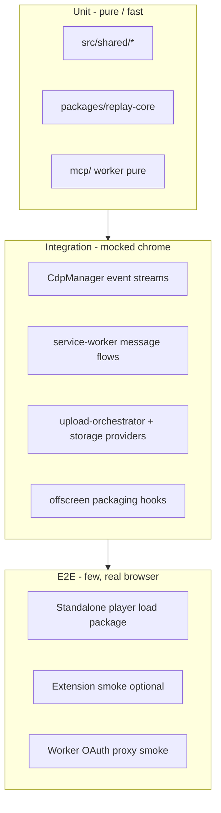

# Unit Test Và E2E Toàn Diện Cho GN Tracing

## Bối Cảnh

Repo hiện đã có **~700 unit test Vitest** trên ba context (`root`, `player`, `worker`) và quality gate `task test:all` + coverage floor 60%/55%. Hạ tầng mock Chrome (`test/mocks/chrome.ts`), factories, và fast-check đã có. Replay-core/MCP/SDK được cover khá tốt.

Tuy nhiên “toàn diện” chưa đạt vì:

1. **Các bề mặt rủi ro cao gần như không test hành vi** — `cdp-manager.ts` (~2.5k LOC), `service-worker.ts` (~2.6k), `popup.ts` / `settings.ts` / `offscreen.ts`, và `player/player.js` (~8.5k IIFE).
2. **Không có e2e** — không Playwright/Puppeteer; CI GitHub gần như chỉ publish MCP, không chạy `task test:all` trên mỗi PR.
3. **Coverage lệch** — shared helpers và replay-core cao; auth providers, CDP, SW, UI surfaces thấp hoặc 0%.
4. **Player monolith** — logic quan trọng (filter, body, zip load, timeline) nằm trong IIFE; test hiện chủ yếu structural/i18n, chưa mô phỏng user path.

## Nguyên Nhân Gốc Rễ

| Triệu chứng | Nguyên nhân gốc |
| --- | --- |
| “Thiếu test toàn diện” | Test theo file đã extract (pure helpers), không theo **user journey** và **domain risk** |
| God files khó test | Logic I/O + orchestration + DOM trộn; private methods không export; không fixture CDP event stream |
| Không e2e | MV3 extension + offscreen + OAuth + cloud khó automate; chưa chọn harness và smoke path tối thiểu |
| Coverage floor 60% | Đủ “có test”, chưa đủ “hành vi critical không regress” |
| CI mỏng | Chỉ `publish-mcp.yml`; regression không bị chặn trước merge |

Gốc rễ thiết kế: **chưa có test strategy theo kim tự tháp + risk map**, nên effort rơi vào chỗ dễ test thay vì chỗ hay vỡ.

## Góc Nhìn Tổng Quan



Ba context Vitest hiện tại **giữ nguyên**. E2E là context thứ tư (`e2e/`) chạy Playwright, opt-in trên CI (hoặc job riêng).

## Mục Tiêu

1. **Risk-first unit/integration**: mọi invariant capture → package → replay có regression test trên code shipped.
2. **Player**: classifier/body/timeline/package load testable qua pure modules + (nếu cần) jsdom harness; không “test theater” reimplement logic.
3. **E2E mỏng nhưng thật**: 5–15 scenario critical chạy trên browser thật, fixture package có sẵn, không phụ thuộc OAuth user thật trong CI.
4. **CI**: `task test:all` (+ coverage gate) trên PR; e2e smoke nightly hoặc `workflow_dispatch` / PR label.
5. **Tài liệu**: một trang strategy trong `docs/build-from-scratch/` hoặc DEVELOPER.md — khi nào unit vs e2e.

## Ngoài Phạm Vi

- Refactor lớn god files chỉ vì coverage (trừ extract pure helper **cần thiết** để test).
- Live OAuth Google/Dropbox với account thật trên CI (dùng mock/proxy stub).
- Visual regression pixel-perfect toàn UI.
- 100% line coverage cho `player.js` / popup / settings.
- Load/perf/fuzz production network.

## Chiến Lược Kiểm Thử

### Kim tự tháp

| Tầng | Tỷ lệ effort mục tiêu | Công cụ | Tốc độ |
| --- | ---: | --- | --- |
| Unit pure | ~60% | Vitest node | &lt; 1s/file |
| Integration mock | ~30% | Vitest + chrome mock + fixtures | vài giây |
| E2E browser | ~10% | Playwright | 1–5 phút suite |

### Risk map (ưu tiên P0 → P2)

| P | Domain | File / surface | Loại test cần |
| --- | --- | --- | --- |
| **P0** | CDP network body + detach + console/WS capture | `cdp-manager.ts`, `network-response-body.ts` | Integration: inject CDP events → assert `StorageManager` entries |
| **P0** | Recording start/stop lifecycle | `service-worker.ts` (handlers extractable) | Message contract tests: START/STOP → state transitions |
| **P0** | Package write/read round-trip | `replay-core` write + zip + player load path | Đã có write round-trip; bổ sung fixture zip → player parse helpers |
| **P0** | Privacy redaction parity | `packages/replay-core/src/redact` | Mở rộng property + case matrix (root re-export không cần cover riêng) |
| **P0** | Network filter + body UI | shared + gnCore | Đã ship một phần; giữ matrix + wiring |
| **P1** | Upload multi-cloud | `upload-orchestrator`, storage providers | Mock fetch/Drive/Dropbox APIs |
| **P1** | Auth token refresh | `google-drive-auth`, `dropbox-auth` | Unit + refresh path (đã có một phần Dropbox) |
| **P1** | Player package load + filters + empty body | `player.js` via gnCore / extract | jsdom smoke + e2e fixture |
| **P1** | MCP tools | `mcp/src/tools` | Mở rộng query edge cases (đã có base) |
| **P2** | Popup/settings UI pure | extract presenters | Unit on pure state mappers only |
| **P2** | Extension e2e full record | Playwright + unpacked `dist/` | Smoke optional, non-blocking CI ban đầu |
| **P2** | Worker OAuth SSRF/CORS | `worker` | Bổ sung matrix origin/method (đã có base) |

### Nguyên tắc chống test theater

- Gọi **entry point shipped** (`getNetworkFilterType`, `CdpManager` public API, `openRecordingPackage`, message router handlers).
- Fixture **tối thiểu thật** (JSON network entry, zip bytes, CDP param objects) — không hard-code expected bằng cách copy implementation.
- Structural/source-scan chỉ **bổ sung** wiring, không thay thế hành vi.
- E2E assert DOM/visible text/network list, không assert implementation detail private.

## Cấu Trúc Giải Pháp

### 1. Hạ tầng test (P0 foundation)

```text
test/
  fixtures/                 # NEW: JSON/zip/minimal WebM stubs
    packages/               # gn-tracing fixture zips (tiny)
    cdp/                    # recorded CDP event sequences (JSON)
    network/                # sample network.json / console.json
  factories.ts              # mở rộng makeNetworkEntry, makeConsoleEntry
  mocks/chrome.ts           # bổ sung debugger.sendCommand default bodies
e2e/                        # NEW Playwright project
  playwright.config.ts
  fixtures/
  specs/
    player-load-package.spec.ts
    player-network-filter.spec.ts
    player-response-body.spec.ts
    worker-oauth-reject.spec.ts   # optional against local wrangler
```

Scripts:

```json
"test:all": "task test:all",
"test:e2e": "playwright test",
"test:e2e:player": "playwright test e2e/specs/player-*.spec.ts"
```

Taskfile:

```yaml
test:e2e:
  desc: Playwright e2e (requires build/sync + browsers)
  cmds:
    - npm run test:e2e
```

### 2. Unit — lấp lỗ pure (P0–P1)

| Module | Việc |
| --- | --- |
| `message-router.ts` | Unit: map action → handler; unknown action; dual STORAGE_/GOOGLE_DRIVE_ aliases |
| `recording-target` (đã có) | Giữ; thêm URL edge cases nếu thiếu |
| Storage providers | Mock `fetch`/Drive API: upload path, error mapping, share link shape |
| `google-drive-auth` / `dropbox-auth` | Token refresh success/fail/network; không call network thật |
| `feedback-submit` | Body format + SW message shape |
| `key-event`, `drawing` pure | Matrix privacy-safe keys / stroke normalize |
| `offscreen` pure extract | Zip entry list / part order nếu extract được; không MediaRecorder e2e ở unit |
| Player pure (đã có filter/body) | Giữ; thêm seek/timeline property nếu còn gap |

**Không** bắt buộc unit DOM popup/settings full — extract pure “view model” chỉ khi cần cho bug cụ thể.

### 3. Integration CDP + Storage (P0, quan trọng nhất)

Mục tiêu: mô phỏng stream CDP **không** browser:

```ts
// Pseudo
const storage = new StorageManager();
const cdp = new CdpManager(storage);
// attach with mock chrome.debugger
// emit Network.requestWillBeSent / responseReceived / loadingFinished
// assert storage.finalize() network entry has responseBody when eligible
// assert detach order (đã có helper test) + body present after delayed getResponseBody
```

Cần:

- Mở rộng chrome mock: `sendCommand` routing theo method (`Network.getResponseBody`, `Network.enable`, …).
- Public test hooks **tối thiểu** nếu private quá chặt: ưu tiên fire qua `chrome.debugger.onEvent.emit` sau `attach`, không export private.
- Fixture sequences: happy path JSON API; missing mime + Content-Type header; body fetch slow then detach; loadingFailed; WebSocket frames; console exception + stack.

Nếu `attach` quá nặng (domains enable), có thể:

1. Extract `NetworkCollector` class (align plan `repo-code-quality-cleanup`) **chỉ khi** test CDP không khả thi khác — coi là optional refactor trong phase CDP tests.
2. Hoặc package-private test seam: `cdp.handleDebuggerEventForTests(method, params)` — chấp nhận một seam, document rõ.

**Đề xuất:** ưu tiên seam `handleDebuggerEventForTests` / dùng event emit sau attach mock — tránh big-bang split CDP trong plan test.

### 4. Integration service worker (P0–P1)

- Không load cả SW blob: test **handlers đã extract** hoặc inject dependencies.
- Thực tế hiện tại SW là composition root dày → phase:

  1. Test message-router + settings-store + upload-orchestrator (đã một phần).
  2. Extract `recording-session` lifecycle (start/stop state machine) nếu test SW full quá đắt — **optional**, không block pure CDP tests.
  3. Contract tests: với mock `cdp`/`recorder`/`storage`, gọi `stopRecording` logic assert order: stop media → flush maps → drain bodies → detach.

### 5. Player unit/jsdom (P1)

| Approach | Khi dùng |
| --- | --- |
| Pure via `gnCore` / `src/shared` | Filter, body display, presentation mode, timeline seek — **ưu tiên** |
| jsdom load `player.html` + stub video | Tab switch, filter button active set, expand row shows empty body text |
| E2E Playwright | Full zip load + UI assertion |

jsdom harness tối thiểu:

- Serve/static open `player/player.html` với query fixture (direct-file mode nếu còn) hoặc inject `networkLogs` qua test hook.
- **Tránh** rewrite player chỉ để test; nếu cần hook: `window.__GN_TRACING_TEST__` guarded.

### 6. E2E Playwright (P1–P2)

#### 6.1 Standalone player (bắt buộc trước)

Điều kiện: `task player:build` hoặc `vite preview` + fixture zip public.

Scenarios:

1. Load intro state khi không có params.
2. Load fixture package (file local / `?` direct descriptors) → hiện player shell.
3. Network tab: filter **JS** chỉ hiện script; XHR JSON không vào JS.
4. Expand request có body → text visible; request không body → “No response body”.
5. Console filter error/warn.
6. Seek video (nếu fixture có webm tối thiểu) hoặc skip video assert duration metadata only.
7. Password package wrong password → error; correct → unlock (optional fixture).

Fixture: commit **tiny** `e2e/fixtures/sample-recording/` (metadata + console + network, optional 1-frame webm hoặc no-video sdk-logs mode để tránh binary lớn).

#### 6.2 Worker (khuyến nghị)

- `wrangler dev` hoặc Vitest pool workers đã có → e2e HTTP optional.
- Bổ sung unit/integration đủ cho SSRF reject absolute Dropbox URL; e2e chỉ nếu cần cross-runtime.

#### 6.3 Extension unpacked (P2, optional)

Playwright Chromium:

```ts
launchPersistentContext(..., {
  args: [`--disable-extensions-except=${dist}`, `--load-extension=${dist}`],
});
```

Smoke:

1. Extension service worker starts.
2. Open popup page URL `chrome-extension://<id>/popup/popup.html` — UI renders, start disabled without auth.
3. **Không** full tab record trên CI (flaky + permissions) trừ nightly có flag.

Document manual checklist cho full record path (vẫn cần human).

### 7. CI

```yaml
# .github/workflows/test.yml
on: [pull_request, push]
jobs:
  unit:
    runs-on: ubuntu-latest
    steps:
      - checkout, setup-node, npm ci (root + player + worker)
      - task test:all
      - npm run test:coverage (root) với threshold hiện có
  e2e-player:
    needs: unit
    if: github.event_name == 'push' || contains(github.event.pull_request.labels.*.name, 'e2e')
    steps:
      - player:sync + build preview
      - playwright install --with-deps chromium
      - npm run test:e2e:player
```

Pre-commit: giữ `vitest related` — **không** chạy e2e trên pre-commit.

### 8. Coverage policy

- Giữ floor global 60/55.
- **Thêm** per-path soft targets (document, không cứng CI ngay):

  | Path | Target lines |
  | --- | ---: |
  | `packages/replay-core` | ≥ 85% |
  | `src/shared` (non-reexport) | ≥ 80% |
  | `src/background` excl. SW/CDP monoliths | ≥ 60% |
  | `cdp-manager` after integration suite | ≥ 40% hành vi critical (không 80% LOC) |
  | `player/player.js` | không đo LOC; đo pure modules + e2e scenarios |

## Phased Roadmap

### Phase 0 — Foundation (0.5–1 PR)

- [x] `test/fixtures/` skeleton + factories `makeNetworkEntry` / `makeCdpLoadingFinished`
- [x] Chrome mock: `sendCommand` dispatcher for Network.getResponseBody (+ `onDetach`)
- [x] Playwright scaffold `e2e/` + npm scripts + Taskfile
- [x] `.github/workflows/test.yml` chạy `task test:all`
- [x] Doc ngắn `docs/build-from-scratch/16-testing-strategy.md` + DEVELOPER testing section

### Phase 1 — P0 unit + CDP integration (1–2 PR)

- [x] CDP event sequence tests: body happy path, Content-Type fallback, size limit, failed load, detach drain
- [ ] Console + WebSocket minimal capture → storage (backlog; network body path locked)
- [x] message-router unit
- [x] Storage provider unit với mock fetch/XHR
- [x] Auth refresh unit (Dropbox cache/refresh paths; Drive identity-env guarded)

### Phase 2 — Player e2e + jsdom (1 PR)

- [x] Fixture cases for filter matrix + sample network entries
- [x] Playwright: load shell, network filter JS matrix, response body empty/text
- [x] Pure acceptance suite mirrors e2e fixtures (gating when browsers unavailable)
- [x] CI job e2e-player (label `e2e` or push)

### Phase 3 — Upload/offscreen/MCP harden (1 PR)

- [ ] Upload orchestrator error paths
- [ ] Offscreen packaging pure parts / zip order
- [ ] MCP tools edge cases (truncation, failedOnly network)
- [ ] Worker origin matrix nếu thiếu

### Phase 4 — Extension smoke optional (backlog)

- [ ] Playwright load unpacked `dist/`
- [ ] Popup renders; settings page opens
- [ ] Nightly only; manual full record checklist trong docs

## Logic Nghiệp Vụ Test Phải Khóa

1. **Body capture**: eligible MIME + header fallback; detach không cắt body; mode off không fetch.
2. **Filter JS**: Script + Other+JS → js; XHR/Fetch+.js → fetch; `.map` → other.
3. **Privacy**: redaction không leak raw secrets vào artifact; limitations recorded.
4. **Package contract**: zip có recording-index/manifest/metadata; optional artifacts fail-open.
5. **Player presentation**: recording / screenshot / sdk-logs shells đúng evidence.
6. **Upload**: provider share link shape; fail public share hard-fail theo docs hiện tại.
7. **MCP**: read-only; body opt-in truncated.

## Rủi Ro Và Giảm Thiểu

| Rủi ro | Giảm thiểu |
| --- | --- |
| E2E flaky | Ít scenario; fixture tĩnh; retry 1; trace on failure |
| CDP class private | Event emit / thin test seam; không snapshot private fields |
| Binary video lớn trong git | sdk-logs mode hoặc 1-frame tiny webm &lt; 50KB |
| Thời gian CI | Unit parallel; e2e job tách; cache Playwright browsers |
| Scope creep “test hết popup” | Chỉ pure extract + e2e smoke; không 80% LOC UI |
| Dual player.js | Test SoT `player/` + assert sync job; e2e trên standalone public |

## Acceptance Criteria

- [ ] `task test:all` green; PR CI chạy unit contexts.
- [ ] Suite CDP integration ≥ 8 cases body/console/ws critical; body detach regress locked.
- [ ] Network filter matrix + player wiring vẫn green; e2e player filter + body empty/text green.
- [ ] Playwright project documented; `npm run test:e2e:player` documented trong DEVELOPER.
- [ ] Không thêm test reimplement production logic; review checklist trong strategy doc.
- [ ] Coverage global không tụt dưới floor; replay-core/shared không regress đáng kể.

## Impact Nghiệp Vụ

- Giảm regression im lặng trên capture body / filter network — đúng pain user đã gặp.
- PR an toàn hơn trước release Store.
- E2E player = tin cậy replay link public (`tracing.gnas.dev`) không chỉ unit rời.

## Thứ Tự PR Gợi Ý

| PR | Nội dung |
| --- | --- |
| PR1 | Foundation fixtures + chrome mock + CI test.yml + e2e scaffold |
| PR2 | CDP/storage integration P0 |
| PR3 | Auth/providers/message-router unit |
| PR4 | Player e2e + fixture package |
| PR5 | Upload/MCP/worker harden + strategy doc finalize |

---

**Trạng thái:** chờ phê duyệt trước khi triển khai.

**Ghi chú phạm vi:** “Toàn diện” = **risk-complete** theo map trên, không = 100% LOC mọi file UI. Phases 0–2 là minimum shippable test posture; 3–4 là harden.
