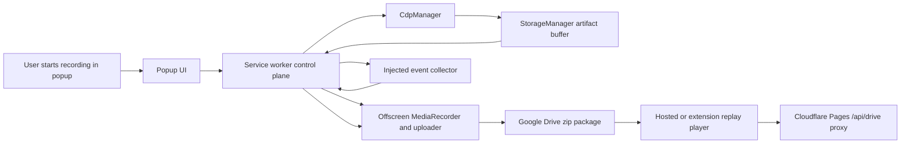

# Domain And Project Aspect Map

## Meta

- Trạng thái: approved
- Phạm vi: aspect map cho người mới đọc GN Tracing và kế hoạch cập nhật docs tương ứng
- Nguồn code: `src/`, `player/`, `player-standalone/`, `manifest.template.json`, `Taskfile.yml`, `scripts/`
- Tuân thủ: Không áp dụng
- Links: [Overview](../../overview.md), [Docs Index](../../_index.md), [Recording Runtime](../../modules/recording-runtime.md), [Drive And Player](../../modules/drive-and-player.md), [Shared Data Models](../../shared/data-models.md), [API Conventions](../../shared/api-conventions.md), [Project Context](../../shared/project-context.md)

## Bối Cảnh

GN Tracing là một Chrome/Edge Manifest V3 extension dùng để ghi lại một tab trình duyệt, thu thập bằng chứng debug đi kèm, đóng gói thành một recording zip trên Google Drive, rồi mở lại bằng hosted replay player tại `https://tracing.gnas.dev/`.

Một người mới cần hiểu dự án theo các khía cạnh domain thay vì theo cây thư mục đơn thuần. Codebase có nhiều vùng lớn đan với nhau: service worker điều phối recording, offscreen document giữ `MediaRecorder` và upload, Chrome Debugger Protocol thu console/network/WebSocket, shared privacy policy redacts dữ liệu, content script ghi timeline sự kiện, player đọc package replay, standalone player proxy Drive qua Cloudflare Pages, còn popup/settings/history/auth là các UI client mỏng.

Docs hiện tại đã có overview, hai module lớn, shared models/conventions, release/update feature và compliance docs. Tuy vậy, vì nhiều behavior quan trọng đang nằm gộp trong `recording-runtime` hoặc `drive-and-player`, người mới vẫn khó nhìn thấy từng aspect như privacy policy, source-map diagnostics, player internals, settings UX, upload history, Store compliance và build/deploy như các chủ đề riêng.

## Tín Hiệu Từ Graph Và Sync State

- Knowledge graph có 498 nodes, 1246 edges và 28 communities. God nodes nổi bật: `CdpManager`, `StorageManager`, `handleMessage()`, `loadRecordingFilesFromIndex()`, `loadRecordingData()`, `GoogleDriveAuth`, `stopRecording()`, `unlockEncryptedRecordingPackage()`.
- Các community lớn khớp với các aspect chính: popup/session state, CDP capture, source-map resolver, zip package/crypto, Drive download/cache, player rendering, Settings UI, upload history, standalone Drive proxy.
- `docs/_sync.md` đang ghi synced commit `a35e4b89df0f5f13775b4d899f10c79148df4154` cộng working-tree context, trong khi HEAD hiện tại là `9b91168704d2847259bbf2e29643ff15b4f9ba9b`. Worktree sạch, nhưng sync metadata nên được chuẩn hóa lại khi bước update docs được duyệt.
- Commit gần nhất tập trung vào source-map replay cho logged Error object stack frames: `SerializedRemoteObject.stackTrace` được parse từ V8 string stacks, source-map resolve, redaction và player rendering.

## Nguyên Nhân Và Lý Do Thiết Kế

Vấn đề docs hiện tại không phải thiếu hoàn toàn, mà là thiếu một lớp định hướng domain. Người mới có thể đọc `recording-runtime.md` hoặc `drive-and-player.md`, nhưng các module đó đang chứa nhiều concept khác nhau:

- recording lifecycle, runtime state, CDP evidence, source maps, event timeline và privacy artifact cùng nằm trong một module runtime
- Drive auth, upload packaging, replay URLs, player internals, standalone player và release automation cùng nằm trong một module Drive/player
- các UI surface quan trọng như Settings, Auth page, History page và popup state chỉ xuất hiện như chi tiết phụ
- compliance docs đã có nhưng chưa được nối rõ vào privacy/runtime/package rules như một reader journey

Aspect map này chia dự án thành các chủ đề người mới cần nắm, đồng thời chỉ ra docs nào nên được cập nhật hoặc tách riêng sau khi kế hoạch được duyệt.

## Tổng Quan Runtime

## Danh Sách Aspect Cần Hiểu

| Aspect | Người mới cần hiểu gì | Nguồn chính | Docs hiện có | Hành động docs đề xuất |
| --- | --- | --- | --- | --- |
| 1. Product purpose và single purpose | GN Tracing ghi một tab để tạo replay debug gồm video, logs, network, WebSocket, report và Drive link. | `README.md`, `docs/overview.md`, `manifest.template.json` | `overview.md`, compliance Store notes | Cập nhật overview thành reader journey ngắn hơn cho người mới. |
| 2. MV3 runtime topology | Service worker là control plane; offscreen giữ media/upload; popup/auth/settings/history là UI client; content script chỉ inject theo recording. | `src/background/service-worker.ts`, `src/offscreen/offscreen.ts`, `src/content/recording-events.ts` | `modules/recording-runtime.md`, `_index.md` | Thêm sơ đồ topology trong overview hoặc module runtime. |
| 3. Recording target rules | Chỉ record tab có URL `http:`, `https:` hoặc `file:`; chặn Chrome Web Store, internal pages, extension pages và tab thiếu URL. | `src/shared/recording-target.ts`, `src/popup/popup.ts`, `src/background/service-worker.ts` | `recording-runtime.md` | Làm nổi rõ rule này trong feature/workflow docs. |
| 4. Recording lifecycle | Start tạo session, attach CDP và offscreen capture; stop dừng content script, media, source-map flush, screenshot, artifact finalize và auto-upload nếu Drive connected. | `startRecording()`, `stopRecording()`, `RecorderManager`, `CdpManager`, `StorageManager` | `recording-runtime.md` | Tách thành section lifecycle có sequence rõ. |
| 5. Runtime state và persistence | Truth ở service worker; snapshot UI trong `chrome.storage.session`; settings/history trong local storage; artifacts tạm thời trong memory/session storage; restart recovery best-effort. | `src/background/service-worker.ts`, `src/types/messages.ts` | `recording-runtime.md`, `data-models.md` | Bổ sung invariant về ephemeral artifact lifecycle và restart behavior. |
| 6. Evidence artifact taxonomy | Artifact gồm media parts, metadata, manifest, recording-index, console, network, websocket, report, events, privacy, diagnostics, screenshot. | `src/types/recording.ts`, `src/offscreen/offscreen.ts`, `player/player.js` | `data-models.md`, `drive-and-player.md` | Tạo hoặc mở rộng shared artifact schema summary. |
| 7. CDP capture model | CDP collect Network, Runtime, Log, Debugger; auto-attach child targets; handles extra-info ordering, bodies, redirects, cache, WebSocket frames. | `src/background/cdp-manager.ts` | `recording-runtime.md` | Tách capture model khỏi generic lifecycle để dễ đọc. |
| 8. Capture profiles và advanced settings | `lean`, `balanced`, `full`, `custom` quyết định độ sâu console/network/WebSocket; blank byte limits nghĩa là không giới hạn. | `src/settings/settings.ts`, `src/background/service-worker.ts`, `src/types/messages.ts` | `recording-runtime.md`, `data-models.md` | Tạo feature doc cho Settings/capture controls hoặc mở rộng existing docs. |
| 9. Privacy profiles và redaction policy | Shared policy versioned, redacts headers/query/body/console/WebSocket/events/report/source snippets; tracks redaction counts without raw secrets. | `src/shared/privacy-redaction.ts`, `src/types/recording.ts` | `privacy-policy.md`, `recording-runtime.md`, `data-models.md` | Tách `privacy-and-redaction` thành module/shared doc riêng. |
| 10. Visual masking và page event privacy | Content script records sanitized navigation/click/focus/submit summaries, not raw typed input; DOM masks selectors best-effort and records limitations. | `src/content/recording-events.ts`, `src/background/service-worker.ts` | `recording-runtime.md`, `privacy-policy.md` | Bổ sung docs về collector lifecycle và limitations. |
| 11. Report and environment metadata | Report artifact stores title/page/time/duration/environment; optional screenshot is stop-time, visible-tab, size-limited and non-blocking. | `buildRecordingReport()`, `captureVisibleTabScreenshot()`, `src/types/recording.ts` | `recording-runtime.md`, `data-models.md` | Ghi rõ report vs privacy vs event artifact trong artifact taxonomy. |
| 12. Source-map enrichment | Inline/external maps load through CDP, not page fetch; resolver stores compact mappings, source snippets bounded; diagnostics explain unresolved frames. | `src/background/cdp-manager.ts`, `src/background/sourcemap-resolver.ts`, `src/background/storage-manager.ts` | `recording-runtime.md`, `drive-and-player.md`, `data-models.md` | Tạo section riêng về source-map diagnostics và replay behavior. |
| 13. Logged Error object stacks | Error remote object descriptions can be parsed into `SerializedRemoteObject.stackTrace`, resolved by sourcemaps, redacted and rendered separately from raw Error description. | `src/background/cdp-manager.ts`, `src/background/storage-manager.ts`, `player/player.js`, `src/shared/privacy-redaction.ts` | `data-models.md`, `recording-runtime.md`, `drive-and-player.md` | Đảm bảo docs sync rõ behavior hiện tại ở HEAD. |
| 14. Google Drive auth | Chrome dùng `chrome.identity.getAuthToken`; Edge dùng `launchWebAuthFlow` và local token cache; disconnect returns success-style even for stale invalid state. | `src/background/google-drive-auth.ts`, `src/drive-auth/drive-auth.ts` | `drive-and-player.md`, `api-conventions.md` | Giữ trong Drive doc, thêm reader note cho browser split. |
| 15. Drive folder targeting | User nhập `/path`, folder id, folder URL hoặc query id; upload resolves/creates folder path and shares generated package. | `src/shared/google-drive-folder.ts`, `src/offscreen/offscreen.ts`, `src/settings/settings.ts` | `drive-and-player.md`, `data-models.md` | Bổ sung rõ default `/gn-tracing` và root behavior. |
| 16. Upload package pipeline | Offscreen creates one `gn-tracing-*.zip`, compresses JSON/text with DEFLATE when useful, stores media, uploads package, then makes file link-readable. | `src/offscreen/offscreen.ts`, `src/background/service-worker.ts` | `drive-and-player.md`, `data-models.md` | Giữ package schema là source of truth; tránh mô tả legacy split upload như path chính. |
| 17. ZIP password protection | Optional password protects ZIP entry payloads; Drive file vẫn link-readable; player prompts and decrypts in browser; forgotten passwords unrecoverable. | `src/offscreen/offscreen.ts`, `player/player.js`, `src/settings/settings.ts` | `drive-and-player.md`, `privacy-policy.md` | Gắn rõ security semantics giữa module và compliance docs. |
| 18. Replay URL and player modes | Current replay URL is `https://tracing.gnas.dev/<zip-file-id>`; extension player may use OAuth token; standalone uses `/api/drive`; legacy query params still parse. | `src/shared/player-host.ts`, `player/player.js`, `player-standalone/src/*` | `drive-and-player.md`, `api-conventions.md` | Tách replay/player internals thành module riêng nếu muốn reader journey rõ hơn. |
| 19. Player loading and compatibility | Player reads zip package, protected ZIP, legacy encrypted payload and legacy direct-file params; optional artifacts tolerant-load; video parts load with bounded concurrency. | `player/player.js` | `drive-and-player.md`, `data-models.md` | Bổ sung compatibility matrix cho package versions. |
| 20. Player inspection UX | Player syncs video with console/network/WebSocket/events, supports search/filter/detail panes, response preview, JSON pretty toggle, source snippets, diagnostics, layout state. | `player/player.js`, `player/player.css` | `drive-and-player.md` | Candidate: new `docs/modules/replay-player.md`. |
| 21. Standalone Cloudflare proxy | Pages Function proxies public Drive downloads, preserves range/content headers, resolves Drive confirmation pages, rejects HTML confirmation artifacts as non-cacheable errors. | `player-standalone/functions/api/drive.js`, `player-standalone/src/drive-adapter.ts` | `drive-and-player.md`, `api-conventions.md` | Keep as part of replay-player or Drive/player doc. |
| 22. Popup, Settings, Auth, History surfaces | Popup gates capture until Drive connected; Settings owns capture/privacy/Drive/password; Auth page protects OAuth from popup close; History renders local upload history. | `src/popup/popup.ts`, `src/settings/settings.ts`, `src/drive-auth/drive-auth.ts`, `src/history/history.ts` | `recording-runtime.md`, `drive-and-player.md` | Candidate: `docs/features/extension-surfaces.md` or Settings feature doc. |
| 23. Upload history | Upload history is local-only, recent-first, not written to Drive; popup shows latest, history page shows full list with replay/copy/folder/delete actions. | `src/shared/upload-history-ui.ts`, `src/history/history.ts`, `src/background/service-worker.ts` | `drive-and-player.md`, `data-models.md` | Add explicit local-only privacy invariant. |
| 24. Release, install and update checks | Build emits unpacked extension; release zip is for manual install; popup checks GitHub Releases but never self-installs. | `Taskfile.yml`, `scripts/check-store-package.mjs`, `src/background/service-worker.ts`, `src/popup/popup.ts` | `features/release-and-update-checks.md` | Sync versions and clarify Store vs GitHub release flows. |
| 25. Chrome Web Store and privacy compliance | Permissions are purpose-bound; no broad host permissions; privacy policy must disclose recording, Drive link sharing, password semantics and local storage. | `manifest.template.json`, `docs/compliance/*`, `scripts/check-store-package.mjs` | compliance docs | Update only if behavior/docs split changes. |
| 26. Build and developer tooling | Root esbuild owns extension; standalone Vite owns hosted player; Taskfile wraps build/check/deploy; Biome handles formatting/lint. | `package.json`, `esbuild.config.mjs`, `Taskfile.yml`, `player-standalone/vite.config.ts` | `_index.md`, `project-context.md`, `drive-and-player.md` | Add developer docs only if user wants onboarding beyond domain docs. |
| 27. Shared data and message contracts | `MessageAction`, `PopupState`, `UploadSettings`, recording payload models and replay artifact models are the contracts across runtime boundaries. | `src/types/messages.ts`, `src/types/recording.ts` | `data-models.md`, `api-conventions.md` | Keep as central reference; update when aspect docs link to contracts. |
| 28. Legacy compatibility and deprecated paths | Player keeps direct-file query parser, old index layouts and legacy encrypted payload support; docs should name these as compatibility paths, not primary architecture. | `player/player.js`, `docs/_sync.md`, `drive-and-player.md` | `drive-and-player.md`, `data-models.md` | Add a compact compatibility note in replay/player docs. |

## Aspect Theo Reader Journey

Một người mới nên đọc theo thứ tự này:

1. Product purpose, single purpose và happy path capture-to-replay.
2. Runtime topology: service worker, offscreen, CDP, content script và UI clients.
3. Data contracts: messages, recording state, settings, artifacts.
4. Capture lifecycle và target restrictions.
5. Evidence taxonomy: media, logs, report, events, privacy, diagnostics, screenshot.
6. Privacy/redaction và capture-depth profiles.
7. Drive auth, folder targeting, upload package và ZIP password.
8. Replay player modes, package loading, inspection UX và standalone proxy.
9. Release/update/check/store compliance.

## Docs Update Tương Ứng Sau Khi Được Duyệt

Sau khi user duyệt file này, bước `//ru update docs` nên cập nhật docs theo phạm vi nhỏ nhất sau:

- `docs/overview.md`: thêm reader journey ngắn và topology cấp cao cho người mới.
- `docs/_index.md`: bổ sung navigation theo aspect nếu thêm docs mới.
- `docs/modules/recording-runtime.md`: chuẩn hóa lifecycle, target validation, event collector, screenshot/report/privacy/diagnostics, source-map/Error stack behavior.
- `docs/modules/drive-and-player.md`: giữ Drive auth/upload/package rules, nhưng giảm tải nếu tạo replay-player doc riêng.
- `docs/shared/data-models.md`: đảm bảo artifact taxonomy, `SerializedRemoteObject.stackTrace`, `SourceMapFrameStatus`, privacy summary và package semantics khớp HEAD.
- `docs/shared/api-conventions.md`: làm rõ internal message boundaries, CDP/Drive/Cloudflare/GitHub external APIs và no broad host permissions.
- `docs/shared/project-context.md`: thêm onboarding lens cho domain và module boundaries.
- Candidate new doc `docs/modules/privacy-and-redaction.md`: shared policy, profiles, redaction hits, masking limitations và compliance bridge.
- Candidate new doc `docs/modules/replay-player.md`: player modes, package loading, password unlock, source-map diagnostics rendering, response preview và layout UX.
- Candidate new doc `docs/features/extension-surfaces.md`: popup, Settings, Auth page, History page, local upload history và UI ownership.
- `docs/features/release-and-update-checks.md`: kiểm tra lại version/package/update wording sau HEAD.
- `docs/compliance/privacy-policy.md` và `docs/compliance/chrome-web-store-submission.md`: chỉ cập nhật nếu module docs thay đổi wording về data collection, sharing, permissions hoặc password semantics.
- `docs/_sync.md`: cập nhật sync snapshot về HEAD sau khi docs chính phản ánh trạng thái hiện tại.

## Rủi Ro Và Ràng Buộc

- Không nên update docs bằng cách copy lại toàn bộ aspect table này vào mọi file; mỗi doc chỉ nhận phần thuộc boundary của nó.
- Không nên biến legacy direct-file replay hoặc legacy encrypted-payload paths thành primary architecture.
- Không nên mô tả zip password như Drive access control. Password bảo vệ package contents, còn Drive file vẫn link-readable.
- Không nên mô tả content script như always-on. Nó chỉ inject khi user bắt đầu recording và cleanup khi stop/remove/session reset.
- Không nên nói source maps được fetched trong replay. Source-map enrichment xảy ra lúc capture stop; player chỉ đọc artifact đã được enrich và diagnostics.

## Tiêu Chí Chấp Nhận Cho Bước Update Docs

- Người mới đọc `overview.md` và `_index.md` biết nên bắt đầu từ đâu.
- Mỗi aspect có ít nhất một docs home rõ ràng, tránh bị chôn trong module lớn.
- Docs mô tả trạng thái hiện tại, không ghi lịch sử commit hoặc migration notes.
- `docs/_sync.md` phản ánh HEAD hiện tại sau khi update.
- `git diff --check` sạch cho các docs đã chỉnh.
