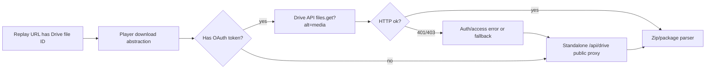

# Drive API Alt Media Cho Player Download

## Bối Cảnh

Player hiện tải recording package từ Google Drive bằng public download endpoint (`drive.usercontent.google.com`) hoặc same-origin proxy `/api/drive` trong standalone player. Cách này phù hợp với replay link public-by-link, nhưng vẫn phụ thuộc vào hành vi download web của Google Drive. Với file lớn, Drive có thể trả về trang HTML xác nhận thay vì bytes của zip package, khiến player nhận sai định dạng và không thể parse `recording-index.json` hoặc zip.

Google Drive API có luồng tải blob chính thức qua `files.get` với tham số `alt=media`. Theo tài liệu Google, endpoint `files.get` lấy metadata hoặc content theo file ID, và việc thêm `alt=media` báo cho server rằng client đang yêu cầu nội dung file thay vì metadata. Request này cần OAuth scope phù hợp, trong đó có `https://www.googleapis.com/auth/drive.file` mà extension hiện đang dùng.

Nguồn tham khảo chính thức:

- [Google Drive API `files.get`](https://developers.google.com/workspace/drive/api/reference/rest/v3/files/get)
- [Download blob file content bằng `files.get?alt=media`](https://developers.google.com/workspace/drive/api/guides/manage-downloads)

## Nguyên Nhân Và Lý Do Thiết Kế

Triệu chứng là player đôi khi tải về HTML confirmation page thay vì recording package bytes. Nguyên nhân trực tiếp là replay download đang đi qua download web endpoint của Drive, nơi Google có quyền chen thêm bước xác nhận virus-scan/large-file. Nguyên nhân gốc rễ là contract replay hiện dựa vào một public web download surface không ổn định bằng Drive API chính thức.

Hướng `files.get?alt=media` giải quyết đúng lớp vấn đề hơn vì player yêu cầu blob content qua API, kèm `Authorization: Bearer <OAuth token>`, thay vì mô phỏng hành vi tải file public trong browser. Tuy nhiên, token OAuth không thể được truyền bừa qua replay URL hoặc Cloudflare proxy: access token là credential của người dùng, phải giữ trong bộ nhớ runtime và không ghi vào URL, localStorage, uploaded artifact, log hoặc server-side cache.

## Góc Nhìn Tổng Quan Và Phạm Vi Tập Trung

Phạm vi trọng tâm là đường tải recording package trong player:

- built-in extension player có thể lấy token qua `chrome.runtime.sendMessage({ action: "GET_GOOGLE_DRIVE_TOKEN" })` vì service worker đã có `GoogleDriveAuth.getAuthToken()`.
- hosted standalone player tại `https://tracing.gnas.dev/<file-id>` không tự có token của extension. Nếu muốn dùng OAuth ở hosted web, player phải có một web OAuth flow riêng, hoặc phải fallback về proxy public hiện tại.
- Cloudflare `/api/drive` không nên nhận OAuth token của user trong thiết kế mặc định, vì như vậy backend/proxy sẽ trở thành bên xử lý credential Google API.

Vì vậy hướng an toàn là triển khai theo lớp:

1. Ưu tiên Drive API `files.get?alt=media` khi player có token hợp lệ.
2. Giữ `/api/drive` proxy làm fallback cho hosted public replay không có OAuth.
3. Chỉ thêm hosted web OAuth nếu mục tiêu sản phẩm là yêu cầu viewer đăng nhập Google để xem replay.

## Mục Tiêu

- Cho player tải zip package qua Drive API bằng URL:

```text
https://www.googleapis.com/drive/v3/files/<fileId>?alt=media&supportsAllDrives=true
```

- Gửi token bằng header:

```text
Authorization: Bearer <access-token>
```

- Không đặt token vào replay URL, query string, uploaded zip, cache key công khai, console log hoặc proxy request mặc định.
- Giữ replay link hiện tại vẫn hoạt động cho viewer không có OAuth bằng fallback `/api/drive`.
- Tách rõ lỗi auth (`401`, `403`) khỏi lỗi file/package để UI hướng dẫn đúng: cần connect Drive, không có quyền đọc file, hoặc file/package hỏng.

## Ngoài Phạm Vi

- Không đổi storage contract của recording package.
- Không đổi upload packaging, password-protected zip hoặc source-map snippet schema.
- Không bắt buộc chuyển toàn bộ hosted player sang chế độ OAuth-only trong bước đầu.
- Không đưa OAuth token qua Cloudflare Function nếu chưa có quyết định bảo mật riêng.
- Không đổi scope OAuth từ `drive.file` sang `drive.readonly`/`drive` nếu chưa có kiểm chứng và nhu cầu rõ ràng.

## Logic Nghiệp Vụ

- Nếu player chạy trong extension context và Google Drive đã connect, download nên thử Drive API trước.
- Nếu Drive API trả `401`, token có thể hết hạn hoặc bị revoke; player cần clear đường thử hiện tại và báo cần reconnect/refresh auth.
- Nếu Drive API trả `403`, user hiện tại không có quyền đọc file bằng scope/token đang dùng; player có thể fallback public proxy nếu replay file đang link-readable, hoặc báo thiếu quyền nếu fallback cũng thất bại.
- Nếu không có token, hosted standalone tiếp tục tải qua `/api/drive`.
- Nếu package được password-protected, việc dùng OAuth chỉ thay đổi cách tải outer zip; giải mã inner zip vẫn diễn ra trong browser như hiện tại.
- Cache API không được dùng chung giữa response OAuth và public response nếu cache key có thể lẫn quyền truy cập. Response tải bằng OAuth nên hoặc không cache, hoặc cache theo key nội bộ không chứa token và có TTL ngắn.

## Cấu Trúc Giải Pháp



## Hướng Tiếp Cận Đề Xuất

### Giai đoạn 1: Token-aware download trong shared player

Thêm một lớp download source trong `player/player.js` thay vì để `getDownloadUrl()` luôn trả public URL. Lớp này quyết định theo thứ tự:

1. Nếu `window.GN_DRIVE_ADAPTER.loadBlob` hỗ trợ OAuth-aware load, gọi adapter.
2. Nếu đang trong extension context, lấy token qua message `GET_GOOGLE_DRIVE_TOKEN` và gọi Drive API `files.get?alt=media`.
3. Nếu không có token hoặc Drive API bị từ chối quyền, fallback về public/proxy path hiện có.

Điểm quan trọng là không làm parser zip/index biết về OAuth. Parser chỉ nhận `Blob`/`Response` như hiện tại.

### Giai đoạn 2: Extension token provider

Service worker hiện đã hỗ trợ `GET_GOOGLE_DRIVE_TOKEN`, và `MessageResponse` đã có `token?: string | null`. Có thể tái sử dụng contract này cho built-in player.

Cần thêm helper phía player:

- kiểm tra `chrome.runtime?.sendMessage` tồn tại.
- gọi `GET_GOOGLE_DRIVE_TOKEN` không interactive.
- chỉ giữ token trong biến cục bộ ngắn hạn trong quá trình fetch.
- không log token và không append token vào URL.

Với Chrome, `chrome.identity.getAuthToken({ interactive: false })` có thể refresh token được Chrome quản lý. Với Edge, token hiện được lưu trong `chrome.storage.local` và được `GoogleDriveAuth.verifyToken()` kiểm tra.

### Giai đoạn 3: Standalone adapter có fallback rõ ràng

`player-standalone/src/drive-adapter.ts` hiện chỉ gọi `/api/drive`. Có hai lựa chọn:

- mặc định giữ nguyên `/api/drive` cho public replay, không cần viewer login.
- nếu muốn hosted OAuth, thêm một optional `getAccessToken()`/`connectDrive()` trong `GN_DRIVE_ADAPTER` và dùng Google Identity Services hoặc OAuth web flow riêng cho domain `tracing.gnas.dev`.

Khuyến nghị bước đầu là không thêm hosted OAuth flow ngay. Lý do: replay link hiện được thiết kế để người nhận mở được nhờ file link-readable. Bắt viewer connect Google Drive sẽ đổi UX chia sẻ, scope compliance, và có thể làm replay public-by-link mất tính tiện lợi.

### Giai đoạn 4: Error handling và fallback

Drive API branch cần phân loại lỗi:

- `401`: token invalid/expired, báo cần reconnect hoặc retry auth.
- `403`: token không có quyền đọc file hoặc scope không đủ, fallback public proxy nếu có thể.
- `404`: file không tồn tại hoặc user không thấy file, không nên fallback vô hạn.
- response `text/html`: xem là sai contract, không parse JSON/zip.

Fallback từ OAuth sang `/api/drive` chỉ nên chạy một lần cho mỗi file để tránh vòng lặp lỗi.

### Giai đoạn 5: Scope và quyền truy cập

Extension hiện dùng `https://www.googleapis.com/auth/drive.file`. Scope này phù hợp với file do app tạo/mở qua tương tác của user và là scope tối thiểu đang được privacy/compliance docs mô tả.

Trước khi đổi scope, cần test các case:

- owner mở replay package vừa upload bằng cùng account.
- viewer khác có file link-readable nhưng token thuộc account khác.
- viewer chưa connect Drive mở hosted replay.
- replay package trong Shared Drive nếu sau này hỗ trợ.

Nếu `drive.file` không đủ cho viewer-token download một file public/link-readable không do app tạo, cân nhắc:

- giữ `drive.file` và chỉ dùng OAuth branch cho owner/uploader extension player.
- hoặc đổi sang `drive.readonly` nếu sản phẩm thật sự cần authenticated viewer download mọi file user có quyền đọc. Đổi scope này cần cập nhật manifest, auth copy, privacy policy, Chrome Web Store disclosure và quy trình verification.

## Chi Tiết Triển Khai

- Thêm helper tạo Drive API media URL:

```text
https://www.googleapis.com/drive/v3/files/${encodeURIComponent(fileId)}?alt=media&supportsAllDrives=true
```

- Thêm helper fetch:

```text
fetch(url, {
  headers: { Authorization: `Bearer ${token}` },
})
```

- Refactor `fetchDriveFileWithCache()` để nhận download strategy hoặc `RequestInfo` + headers, thay vì chỉ nhận URL từ `getDownloadUrl()`.
- Không cache OAuth response trong Cache API ở bước đầu, hoặc thêm cache namespace riêng cho OAuth response có TTL ngắn.
- Mở rộng `GN_DRIVE_ADAPTER` type để có thể cung cấp `loadBlob(fileId, options)` OAuth-aware trong tương lai, nhưng không bắt buộc hosted player phải có token.
- Giữ `/api/drive` Cloudflare Function làm fallback và backward-compatible path.
- Sync `player/player.js` sang `player-standalone/public/player.js` bằng `task player:sync` sau khi triển khai.

## Công Việc Cần Làm

1. Thêm download strategy trong shared player để hỗ trợ OAuth Drive API và fallback public/proxy.
2. Thêm extension token helper trong player, dùng message action hiện có `GET_GOOGLE_DRIVE_TOKEN`.
3. Điều chỉnh progress/error handling để Drive API response vẫn báo bytes và lỗi rõ ràng.
4. Cập nhật standalone adapter types để không chặn OAuth-aware adapter sau này.
5. Giữ proxy `/api/drive` hiện tại cho public replay và các browser không có token.
6. Cập nhật docs `drive-and-player`, `api-conventions`, `data-models` nếu behavior được triển khai.

## Rủi Ro Và Ràng Buộc

- `drive.file` có thể không đủ cho mọi viewer nếu file không nằm trong phạm vi app/user token. Đây là rủi ro quyền truy cập cần test trước khi đổi UX hosted player.
- Hosted player không thể tự lấy Chrome extension OAuth token. Nếu cần OAuth trên `tracing.gnas.dev`, đó là một web auth feature riêng.
- Gửi OAuth token qua Cloudflare proxy làm tăng trách nhiệm bảo mật backend; mặc định nên tránh.
- Cache response tải bằng OAuth có thể gây nhầm quyền nếu cache key không được cô lập.
- Nếu fallback proxy vẫn gặp Drive confirmation page, nhánh xử lý confirmation hiện tại vẫn cần được giữ và kiểm chứng.

## Kiểm Chứng

- Chạy `task typecheck`.
- Chạy `task player:typecheck`.
- Chạy `task player:sync` và kiểm tra `player/player.js` khớp `player-standalone/public/player.js`.
- Chạy `git diff --check`.
- Test thủ công với recording zip lớn từng gây HTML confirmation page:
  - extension/built-in player có Drive connected tải được qua Drive API.
  - hosted standalone không login vẫn tải được qua `/api/drive` fallback.
  - token invalid trả lỗi auth dễ hiểu.
  - password-protected package vẫn unlock và load bình thường.
- Test case viewer khác account nếu muốn mở rộng OAuth branch ra hosted player.
