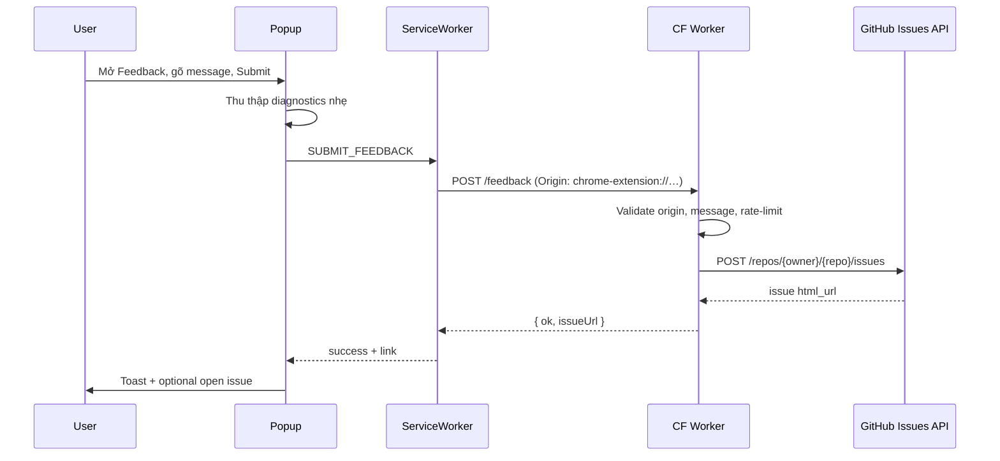
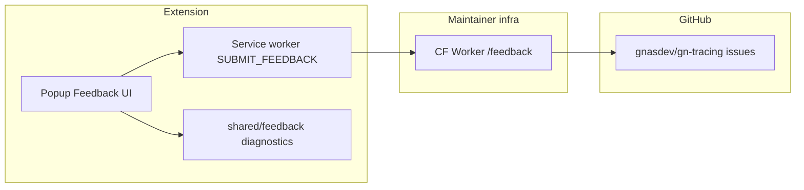

# Thu Thập Feedback Và Tạo GitHub Issue

## Bối Cảnh

Hiện popup chỉ có nút **Contribute** mở `https://github.com/gnasdev/gn-tracing/issues` — người dùng phải tự viết issue trên GitHub. Không có form trong extension, không có endpoint server, không có luồng “gửi feedback một chạm”.

Sản phẩm chủ trương **không telemetry**, **không backend lưu recording**, và **host_permissions hẹp** (OAuth/cloud + optional Worker origin). Worker hiện tại (`worker/`) chỉ làm OAuth token-exchange (Google/Dropbox), đã có CORS + origin lock theo `chrome-extension://`.

## Nguyên Nhân Và Lý Do Thiết Kế

- **Triệu chứng:** Nút Contribute chỉ là deep-link; friction cao (đăng nhập GitHub, tự điền version/browser).
- **Nguyên nhân gốc:** Chưa có surface thu thập + kênh submit có kiểm soát.
- **Lý do chọn Worker proxy (theo yêu cầu):** User không cần tài khoản GitHub; extension không ship `GITHUB_TOKEN`; tái sử dụng Worker origin đã có trong `host_permissions` khi token proxy được cấu hình — không cần `api.github.com` trên extension.
- **Lý do diagnostics nhẹ:** Đủ để triage (version, browser, OS, locale); không gửi URL tab, token, recording package, hay settings nhạy cảm — giữ tinh thần “no product telemetry”.

## Góc Nhìn Tổng Quan Và Phạm Vi Tập Trung



**Phạm vi tập trung:** popup UI, message contract, service worker submit, Worker `/feedback`, secret deploy, privacy wording, tests.

## Mục Tiêu

1. Thay nút **Contribute** bằng **Feedback**.
2. Click Feedback → hiện **textarea + nút Submit** trong popup (không bắt buộc trang Settings).
3. Submit → Worker tạo GitHub issue trên `gnasdev/gn-tracing` với body gồm message + diagnostics nhẹ.
4. Thành công: toast + link mở issue; thất bại: message lỗi rõ, không mất text đã gõ (trừ khi user đóng panel).

## Ngoài Phạm Vi

- Đính kèm recording package, screenshot tab, hay upload history.
- GitHub OAuth cho user (issue tạo bằng bot/PAT phía server).
- Form feedback trên Settings / player / standalone site.
- Analytics/telemetry ngoài nội dung feedback user chủ động gửi.
- Hệ thống triage (auto-label theo keyword, duplicate detection).
- Pre-filled `issues/new` fallback phức tạp (chỉ giữ link Issues tĩnh khi service unavailable).

## Logic Nghiệp Vụ

| Quy tắc | Chi tiết |
|--------|----------|
| Opt-in | Chỉ gửi khi user bấm Submit; không gửi ngầm. |
| Message bắt buộc | Trim; rỗng → lỗi client-side, không gọi Worker. |
| Độ dài | Client + server: tối đa **4000** ký tự message. |
| Diagnostics | Chỉ: `extensionVersion`, `browserName`, `browserVersion`, `os`, `locale`. Client tự build từ `chrome.runtime.getManifest()`, `navigator.userAgent`, `navigator.language`. |
| Issue title | `Feedback: ` + 60 ký tự đầu của message (một dòng, strip newline). |
| Issue body | Markdown: section Feedback + section Diagnostics (key/value). Footer ghi nguồn `GN Tracing extension`. |
| Labels | Mặc định `feedback` (cấu hình được qua env Worker). Label phải tồn tại sẵn trên repo hoặc Worker bỏ label khi API từ chối (ưu tiên tạo issue thành công). |
| Origin lock | Giống OAuth: chỉ `ALLOWED_EXTENSION_ORIGINS` / `chrome-extension://`. |
| Rate limit | Server: tối đa **5** request/IP/giờ (Cache API key theo IP hash + hour bucket). Vượt → `429`. |
| Secret | `GITHUB_FEEDBACK_TOKEN` chỉ trên Worker; extension không bao giờ thấy token. |
| Không log body | Worker không `console.log` message/token; chỉ status cấp cao nếu cần. |
| Privacy | Cập nhật privacy policy: feedback opt-in đi qua Worker tới GitHub (issue **public** trên repo). |

## Cấu Trúc Giải Pháp

### 1. Popup UI

- `popup/popup.html`:
  - Đổi `#contribute-link-btn` → `#feedback-toggle-btn` (label Feedback).
  - Thêm panel `#feedback-panel` (hidden mặc định): textarea `#feedback-message`, button `#feedback-submit-btn`, hint ngắn.
- `popup/popup.css`: style panel gọn (gap, min-height textarea, disabled state khi đang gửi).
- `src/popup/popup.ts`:
  - Toggle panel.
  - Submit → `sendMessage({ action: "SUBMIT_FEEDBACK", data: { message, diagnostics } })`.
  - Loading/disable, toast success (kèm open issue URL), toast/error trên fail.

### 2. Shared diagnostics + validation

- `src/shared/feedback.ts` (+ test):
  - `buildFeedbackDiagnostics(): FeedbackDiagnostics`
  - `validateFeedbackMessage(message): { ok, error? }`
  - `formatFeedbackIssueBody(message, diagnostics): string` (dùng đối chiếu test; Worker có thể format lại server-side để không tin client body HTML).
  - Parse OS từ UA ở mức thô: `macOS` / `Windows` / `Linux` / `Chrome OS` / `Android` / `iOS` / `Unknown`.

### 3. Message contract + service worker

- `src/types/messages.ts`: thêm action `SUBMIT_FEEDBACK`.
- `src/background/message-router.ts` + handler trong service worker path:
  - Validate message.
  - `POST` JSON tới `__FEEDBACK_PROXY_URL__` (define esbuild).
  - Trả `{ ok, issueUrl? , error? }`.
- Nếu `__FEEDBACK_PROXY_URL__` rỗng: `{ ok: false, error: "Feedback service is not configured." }` và popup gợi ý mở Issues URL tĩnh hiện có.

### 4. Build / env

- `esbuild.config.mjs`:
  - Derive feedback URL:
    - Ưu tiên `FEEDBACK_PROXY_URL` / `FEEDBACK_PROXY_URL_DEV` nếu set.
    - Không thì: `origin(GOOGLE_TOKEN_PROXY_URL hoặc DROPBOX_TOKEN_PROXY_URL) + "/feedback"`.
    - Dev default: `http://localhost:8787/feedback` khi worker dev default bật.
  - `define.__FEEDBACK_PROXY_URL__`.
  - `host_permissions`: origin của feedback URL đã nằm trong logic append token-proxy origin hiện có **nếu cùng Worker**. Nếu `FEEDBACK_PROXY_URL` khác origin → append origin đó (và nới `check-store-package.mjs` allowlist “optional proxy origins” nếu cần, tối đa vẫn hợp lý).
- `.env.example`: document `FEEDBACK_PROXY_URL`, `FEEDBACK_PROXY_URL_DEV`, `GITHUB_FEEDBACK_TOKEN` (Worker-only).

### 5. Cloudflare Worker

- Route mới: `POST /feedback` (và optionally alias không cần).
- `resolveProviderFromPath` **không** nuốt `/feedback` (giữ null cho OAuth path; router chính nhánh feedback trước).
- `Env`:
  - `GITHUB_FEEDBACK_TOKEN` (secret, required cho route).
  - `GITHUB_REPO_OWNER` (default `gnasdev`)
  - `GITHUB_REPO_NAME` (default `gn-tracing`)
  - `GITHUB_FEEDBACK_LABELS` (default `feedback`)
- Validate body JSON: `message` string, optional `diagnostics` object với field allow-list; bỏ field lạ.
- Gọi `https://api.github.com/repos/{owner}/{repo}/issues` với `Authorization: Bearer …`, `User-Agent: gn-tracing-feedback-proxy`, `Accept: application/vnd.github+json`.
- Response thành công: `{ ok: true, issueUrl: html_url, issueNumber }`.
- Lỗi upstream: map 401/403/422/5xx → JSON error ổn định, **không** leak token.
- `GET /health`: thêm `feedback: Boolean(env.GITHUB_FEEDBACK_TOKEN)`.
- `deploy.sh` + `.dev.vars.example`: put secret `GITHUB_FEEDBACK_TOKEN`; vars owner/repo/labels nếu cần.
- Tests trong `worker/src/index.test.ts`: origin reject, empty message, success path (stub fetch), rate limit, missing token.

### 6. Privacy / docs

- `docs/compliance/privacy-policy.md` (+ HTML mirror nếu có `player-standalone/public/privacy/`): section ngắn “Optional product feedback”.
- `docs/features/extension-surfaces.md`: mô tả Feedback panel.
- `docs/modules/oauth-token-proxy.md` (hoặc section Feedback trong cùng module vì cùng deployable): route `/feedback`, secrets, rate limit.
- Không đổi “No Product Telemetry” thành có telemetry; chỉ bổ sung kênh feedback **opt-in, user-authored**.

## Mô Hình C4



## Hướng Tiếp Cận Đề Xuất

1. **Tái sử dụng Worker multi-issuer** thay vì deploy service mới — cùng origin lock, deploy, CORS.
2. **Submit qua service worker** thay vì `fetch` trực tiếp từ popup — một chỗ sở hữu network contract (giống storage/auth outbound).
3. **Server-side format issue body** từ field đã validate — không tin raw HTML/markdown độc hại từ client (escape/wrap plain text trong fenced block nếu cần).
4. **Label `feedback`**: document rằng maintainer nên tạo label sẵn trên repo; nếu API fail vì label → retry không labels để không mất feedback.

## Chi Tiết Triển Khai

### Client request

```ts
// conceptual
{
  action: "SUBMIT_FEEDBACK",
  data: {
    message: string,
    diagnostics: {
      extensionVersion: string,
      browserName?: string,
      browserVersion?: string,
      os?: string,
      locale?: string,
    }
  }
}
```

### Worker → GitHub

```http
POST /repos/gnasdev/gn-tracing/issues
{
  "title": "Feedback: …",
  "body": "## Feedback\n\n```\n…plain message…\n```\n\n## Diagnostics\n\n- Extension: …\n- Browser: …\n- OS: …\n- Locale: …\n\n---\nSubmitted from the GN Tracing browser extension.",
  "labels": ["feedback"]
}
```

### UX states

| State | UI |
|-------|-----|
| Idle | Nút Feedback; panel ẩn |
| Open | Textarea + Submit + hint privacy ngắn |
| Submitting | Submit disabled, spinner/label Sending… |
| Success | Toast + clear textarea + collapse panel optional; link “View issue” |
| Error | Giữ text; toast/error slot; nếu unconfigured → hint mở Issues URL |

## Công Việc Cần Làm

1. Shared `feedback` helpers + unit tests.
2. Message type + SW handler + router.
3. esbuild define + `.env.example` + (nếu cần) store package allowlist.
4. Popup HTML/CSS/TS: Contribute → Feedback panel.
5. Worker: `POST /feedback`, health, deploy secret, tests.
6. Privacy policy + feature/module docs.
7. Kiểm chứng: unit tests worker + shared; manual dev với `task worker:dev` + PAT test trên repo (hoặc stub).

## Rủi Ro Và Ràng Buộc

| Rủi ro | Giảm thiểu |
|--------|------------|
| Spam / abuse mở issue | Origin lock + rate limit IP; message length cap; có thể thêm turnstile sau (ngoài scope). |
| Token leak | Secret chỉ Worker; never log Authorization; fine-grained PAT chỉ `issues:write` trên đúng repo. |
| Issue public lộ PII user tự gõ | Hint UI + privacy policy: “Do not include secrets/passwords”; body bọc plain text. |
| Production thiếu `FEEDBACK_PROXY_URL` / token | Graceful error + link Issues; health flag `feedback: false`. |
| Store host_permissions | Cùng Worker origin với OAuth proxy → không thêm host lạ. Origin riêng cần cập nhật `check-store-package.mjs`. |
| Label không tồn tại | Retry create without labels. |
| Phá vỡ “telemetry-free” narrative | Chỉ opt-in feedback; docs tách rõ với recording telemetry. |

## Kiểm Chứng

- [ ] Unit: `buildFeedbackDiagnostics` / validate / format body.
- [ ] Unit Worker: forbidden origin, empty message, success stub GitHub, 429 rate limit, missing token → 503/500.
- [ ] Manual: bật panel, submit, thấy issue trên GitHub với diagnostics đúng.
- [ ] Manual: message rỗng không gọi network; network fail giữ textarea.
- [ ] Production build: `__FEEDBACK_PROXY_URL__` trỏ `/feedback` đúng origin Worker; `host_permissions` không phình ngoài allowlist.
- [ ] Privacy HTML/docs có đoạn optional feedback.

## Impact Nghiệp Vụ / Acceptance

1. User mở popup → bấm **Feedback** → thấy textarea + Submit (không còn nút Contribute).
2. User gửi message hợp lệ khi Worker + token cấu hình đúng → issue public xuất hiện trên repo, toast có link.
3. Diagnostics trên issue chỉ gồm version, browser, OS, locale (không URL tab / token / recording).
4. User không đăng nhập GitHub vẫn gửi được.
5. Privacy policy mô tả đúng luồng opt-in này.

## Quyết Định Đã Chốt Với User

- Submit qua **Worker proxy tự tạo issue** (không pre-fill `issues/new`).
- Entry: **thay Contribute** bằng Feedback; click hiện textarea + submit trong popup.
- Diagnostics: **nhẹ** (version + browser + OS + locale).
