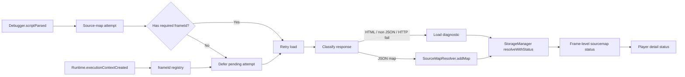

# Fix Generated-Only Sourcemap Replay

## Trạng Thái

Đã triển khai phần runtime/player: retry source-map attempts thiếu frame id, phân loại response `.map` HTML hoặc non-JSON trước khi parse, thêm resolver status, serialize `sourceMapStatus` theo frame, và để player ưu tiên frame-level status trước `diagnostics.json`.

## Bối Cảnh

Người dùng vẫn thấy request call stack trong player hiển thị generated bundle location, ví dụ:

```text
https://devlocal.viclass.vn/classrooms/packages_portal_viclass_portal_classrooms_src_bootstrap_ts.1aebf86ea.js:34641:17
```

Plan trước đã triển khai phần nền: source-map diagnostics, load external `.map` qua CDP protocol, URL alias trong resolver, raw internal URL lookup trước redaction, và player đọc `diagnostics.json`. Triệu chứng mới cho thấy phần đó chưa đủ để bảo đảm người dùng nhìn thấy nguyên nhân cụ thể trong player hoặc nhận được `original*` fields.

Kiểm tra trực tiếp URL devlocal cho thấy file JS có `sourceMappingURL` trỏ tới:

```text
packages_portal_viclass_portal_classrooms_src_bootstrap_ts.1aebf86ea.js.map
```

Nhưng request GET hiện tại tới URL `.js.map` có thể trả HTML app shell thay vì JSON sourcemap. Đây là một failure mode khác với 404: CDP có thể coi network load là thành công, nhưng runtime parse JSON fail và không tạo mapping table.

## Nguyên Nhân Và Lý Do Thiết Kế

### Triệu chứng

- Player vẫn render `url:line:column` generated trong call stack.
- Nếu artifact không có `originalSource`, player không thể tự suy ra source gốc.
- Nếu `diagnostics.json` không match frame URL chính xác, player cũng không hiển thị lý do.

### Nguyên nhân trực tiếp có khả năng cao

1. **Source-map URL trả nội dung không phải sourcemap JSON.**
   Với devlocal, `.js.map` route có thể trả HTML app shell. Runtime hiện phân loại riêng `html-fallback` hoặc `non-json-response` trước khi thử parse JSON để player có thể hiển thị lý do cụ thể.
2. **Map acquisition vẫn là one-shot.**
   `Debugger.scriptParsed` có thể đến trước khi `Runtime.executionContextCreated` cung cấp `frameId`. Khi đó page/frame target bị ghi `missing-frame-id` và không retry, dù frame id có thể xuất hiện ngay sau đó.
3. **Diagnostics hiện là load-level, chưa phải frame-level.**
   Player đang tra diagnostic bằng exact `diagnostic.generatedUrl === frame.url`. Nếu URL đã qua serializer/redaction, khác hash/query, hoặc diagnostic thuộc source map load nhưng frame lookup fail ở bước khác, player có thể không hiển thị status.
4. **Resolver chưa giải thích vì sao resolve trả `null`.**
   `SourceMapResolver.resolve(...)` chỉ trả location hoặc `null`; `StorageManager` không biết đó là `no-map-for-url`, `no-line`, `no-segment`, hay `no-original-segment`.

### Nguyên nhân gốc rễ

Pipeline hiện thiếu một contract chẩn đoán đi xuyên suốt từ source-map load đến từng frame được render. Diagnostics đang mô tả attempt tải map, còn player lại cần trạng thái theo generated frame cụ thể. Khi hai lớp này nối bằng exact URL matching ở player, lỗi vẫn dễ bị che mất.

## Mục Tiêu

- Nếu `.map` trả HTML, 404, quá lớn, parse fail, thiếu frame id, hoặc network fail, player phải hiển thị lý do rõ ràng ở console/network detail.
- Nếu map load thành công nhưng một frame vẫn generated, artifact phải phân biệt được `no-map`, `no-line`, `no-segment`, và `no-original-segment`.
- Nếu `Runtime.executionContextCreated` đến sau `Debugger.scriptParsed`, runtime phải retry source-map load khi có đủ `frameId`.
- Player không được fetch `.map` hoặc parse sourcemap trong replay path.
- Không serialize raw sensitive URL chỉ để phục vụ lookup; raw URL chỉ được dùng nội bộ trước khi ghi artifact.

## Ngoài Phạm Vi

- Không tự sửa server devlocal hoặc bắt app under test publish sourcemap đúng.
- Không thêm local sourcemap upload từ máy dev.
- Không bật page-context `fetch(...)` mặc định.
- Không làm old recordings có source-mapped locations nếu artifact cũ không chứa dữ liệu cần thiết.

## Logic Nghiệp Vụ

- Một frame chỉ được coi là source-mapped khi có `originalSource` và `originalLine`.
- Source-map load success không đồng nghĩa frame resolve success.
- Non-JSON `.map` response là failure hợp lệ và phải được phân loại riêng với 404/network fail.
- Player ưu tiên frame-level diagnostic đã serialize trong artifact; chỉ fallback sang load-level `diagnostics.json` bằng URL alias khi frame chưa có trạng thái riêng.

## Cấu Trúc Giải Pháp



## Hướng Tiếp Cận Đề Xuất

### 1. Biến acquisition thành retryable pending attempt

`CdpManager` nên lưu pending source-map attempts theo `sessionId + executionContextId + scriptUrl`.

- Khi `scriptParsed` thiếu `frameId` cho page/frame target, ghi status `pending-frame-id` thay vì fail hẳn.
- Khi `Runtime.executionContextCreated` bổ sung `frameId`, retry các attempt cùng context.
- Có timeout ngắn hoặc flush-time retry trước `cdp.flushSourceMaps()` để không bỏ sót scriptParsed/context event race.
- Với root page, có thể dùng `Page.getFrameTree` làm fallback để lấy root frame id nếu context registry vẫn thiếu.

### 2. Phân loại response `.map` rõ hơn

`#fetchAndRegisterSourceMap` cần phân loại nội dung trước khi `JSON.parse`:

- lưu `contentType` hoặc header nếu CDP trả được;
- kiểm tra ký tự non-whitespace đầu tiên;
- nếu bắt đầu bằng `<`, ghi `html-fallback`;
- nếu không bắt đầu bằng `{` hoặc `[`, ghi `non-json-response`;
- nếu JSON parse fail dù looks-like JSON, ghi `json-parse-failed`;
- giới hạn preview diagnostic bằng một nhãn an toàn, không lưu body.

Với URL devlocal hiện tại, expected diagnostic là `html-fallback` hoặc `non-json-response`, không phải chỉ generated stack im lặng.

### 3. Thêm resolver status thay vì `null` đơn thuần

`SourceMapResolver` nên có API mới, ví dụ `resolveWithStatus(url, line, column)`, trả:

- `mapped`;
- `no-map-for-generated-url`;
- `no-generated-line`;
- `no-segment-for-column`;
- `no-original-segment`;
- `unsupported-map`;

API này vẫn trả `ResolvedLocation` khi có mapping thật, nhưng cũng đưa status để `StorageManager` annotate frame khi không mapped.

### 4. Serialize frame-level source-map status

Thêm model nhỏ cho console/network frames, ví dụ:

```ts
interface SourceMapFrameStatus {
  status: "mapped" | "unresolved";
  reason: string;
  sourceMapUrl?: string;
  httpStatusCode?: number;
}
```

`StorageManager.resolveSourceMaps(...)` gắn status này vào:

- `ConsoleEntry`;
- `StackFrame`;
- `NetworkInitiator`;
- `CdpCallFrame`.

Không serialize raw internal resolve URL. Nếu cần URL để hiển thị, dùng URL đã redacted từ diagnostic.

### 5. Player render theo frame status trước

Player built-in và standalone nên:

- ưu tiên `frame.sourceMapStatus` hoặc `initiator.sourceMapStatus`;
- fallback sang load-level `diagnostics.json` bằng canonical alias nếu artifact chưa có frame status;
- hiển thị các message ngắn:
  - `Source map response was HTML, not JSON`;
  - `Source map unavailable: missing frame id`;
  - `Source map loaded but no segment matched this generated column`;
  - `Source map unavailable: HTTP 404`;
- giữ replay cũ không có status như hiện tại.

### 6. Bổ sung probe fixture

Tạo fixture/probe nhỏ cho ba trạng thái quan trọng:

- `.js.map` hợp lệ có `sourcesContent` và frame map được;
- `.js.map` URL trả HTML fallback;
- map load thành công nhưng generated line/column không có segment.

Probe này nên chạy ở unit-level hoặc script-level, không phụ thuộc devlocal luôn ổn định.

## Chi Tiết Triển Khai

1. Mở rộng `SourceMapDiagnosticReason` với `pending-frame-id`, `html-fallback`, `non-json-response`, `no-map-for-generated-url`, `no-generated-line`, `no-segment-for-column`, và `no-original-segment`.
2. Thêm pending attempt registry trong `CdpManager`.
3. Retry attempt khi `#onExecutionContextCreated(...)` nhận frame id hoặc trước `flushSourceMaps()`.
4. Ghi response classification trước `JSON.parse`.
5. Thêm `SourceMapResolver.resolveWithStatus(...)`; giữ `resolve(...)` làm wrapper nếu cần compatibility nội bộ.
6. Thêm frame-level status fields vào `src/types/recording.ts`.
7. Cập nhật `StorageManager.resolveSourceMaps(...)` để annotate unresolved frames bằng status redacted/an toàn.
8. Cập nhật player built-in và standalone để render status từ frame trước, diagnostic artifact sau.
9. Sync `player/player.js` và `player-standalone/public/player.js`.
10. Cập nhật docs liên quan sau khi implementation được duyệt.

## Công Việc Cần Làm

- Kiểm tra lại capture với URL devlocal đang trả HTML ở `.js.map`: player phải hiển thị `html-fallback` hoặc `non-json-response`.
- Kiểm tra capture với `.js.map` JSON hợp lệ: request call stack phải có `originalSource/originalLine/originalColumn`.
- Kiểm tra race `scriptParsed` trước `executionContextCreated`: diagnostic ban đầu pending, sau đó retry và không fail cứng `missing-frame-id` khi frame id xuất hiện.
- Kiểm tra player cũ không có `diagnostics.json` hoặc frame status vẫn load bình thường.

## Rủi Ro Và Ràng Buộc

- Server devlocal có thể thay đổi behavior giữa các lần build/reload; validation phải dựa trên artifact captured tại thời điểm test, không chỉ `curl` sau đó.
- CDP `Network.loadNetworkResource` không bảo đảm header/body classification đầy đủ trên mọi Chrome version.
- Frame-level status làm artifact lớn hơn; cần giữ payload nhỏ bằng status/reason ngắn, không lưu body response.
- Nếu alias quá rộng, có nguy cơ gắn nhầm diagnostic cho frame khác cùng bundle name; alias phải conservative.

## Kiểm Chứng

- `npx tsc --noEmit`
- `npx biome check` cho các file chạm, hoặc `--diagnostic-level=error` với player nếu còn warning pre-existing.
- `cmp -s player/player.js player-standalone/public/player.js`
- Fixture/probe sourcemap hợp lệ phải resolve line/column trong stack mẫu.
- Fixture/probe HTML fallback phải serialize diagnostic rõ và player hiển thị đúng message.
