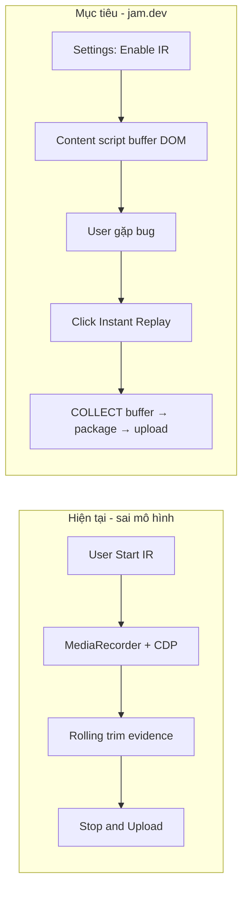
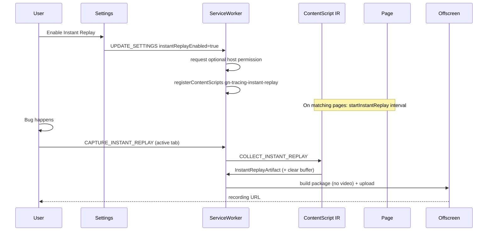

# Plan: Refactor Instant Replay theo mô hình jam.dev

## Mục tiêu

Đổi Instant Replay của extension từ **“session Record có rolling window”** sang **buffer always-on kiểu jam.dev**: bật một lần → giữ rolling DOM (và sau đó console/network) local → khi bug xảy ra mới bấm capture → package & share. Không cần Start recording trước khi bug xuất hiện, không dùng MediaRecorder/CDP banner cho luồng IR.

Sau khi duyệt plan này, file sẽ được mirror vào `docs/specs/planning/instant-replay-jam-style.md` khi implementation bắt đầu.

## Nguyên nhân gốc rễ

| Hiện trạng (extension) | jam.dev / design gốc trong repo |
| --- | --- |
| IR = `START_RECORDING` với `sessionKind: "instant-replay"` | IR = opt-in, chạy nền khi browse |
| User phải **Start trước** bug, Stop sau | User **capture sau** bug |
| Tab video + CDP/in-page full stack + rolling trim evidence | DOM session replay (snapshot HTML), **không** screen video |
| Badge `IR`, reuse StorageManager rolling window | Buffer page-local, purge định kỳ, disable khi trang nặng |
| `instantReplayEnabled` bị force `false`; content script đã gỡ | Setting bật → register content script + host permission |

Repo **đã có** nền đúng hướng jam:

- `packages/replay-core/src/capture/instant-replay.ts` — buffer time+byte, interval snapshot, auto-disable khi overrun (comment còn nhắc jam).
- SDK (`packages/sdk`) đã wire `startInstantReplay` khi report.
- Artifact `instant-replay.json` + player summary card + MCP `get_instant_replay`.
- Commit lịch sử (`e992074`) từng ship content script + `syncInstantReplayRegistration` + `COLLECT_INSTANT_REPLAY` gắn vào screenshot report — sau đó bị thay bằng “session IR” và only-unregister legacy.

**Triệu chứng:** nút Instant Replay chỉ là Record với retention. **Gốc:** product model lệch jam; core library vẫn đúng.

## Phạm vi

### Trong phạm vi

1. **Product model jam-style** cho extension Instant Replay.
2. Khôi phục / hiện đại hóa always-on DOM buffer (content script + registration + optional host permission).
3. Nút **Instant Replay** = capture-after-the-fact (không Start/Stop session record).
4. Gỡ `sessionKind: "instant-replay"` khỏi stack Record (Start/Stop, rolling retention policy, badge IR session, package timeline phase-1 IR).
5. Wire collect buffer vào package (standalone IR package và/hoặc screenshot report).
6. Settings + popup UX, docs, tests.

### Ngoài phạm vi (phase sau hoặc không làm)

- Player iframe DOM scrubber đầy đủ như jam (hiện chỉ summary card) — có thể phase 3.
- Always-on CDP / debugger banner trên mọi tab.
- Continuous tab video / MediaRecorder nền.
- Site blocklist UI chi tiết kiểu jam (có thể phase 2 nhẹ: settings toggle + disable-on-heavy đã có trong core).
- Đổi package schema `InstantReplayArtifact` (giữ v1).

## Thiết kế đề xuất

### 1. Mô hình sản phẩm (align jam)

| Hạng mục | Quyết định |
| --- | --- |
| Default | **Off** (opt-in) |
| Enable | Settings → Instant Replay toggle; request `optional_host_permissions` `http://*/*`, `https://*/*` |
| Buffer | Rolling DOM snapshots in-page; default **window 120s** (jam 2 phút), interval ~1s, max bytes (core default 8MB) |
| Purge cứng | Clear buffer mỗi **120s** (như jam + script lịch sử) ngoài eviction theo window |
| Heavy page | Core auto-disable sau N overrun snapshot (đã có) |
| Capture trigger | Popup **Instant Replay** (và optional keyboard sau): collect buffer tab hiện tại → package → upload |
| Media | **Không** tab video trong package IR |
| Upload | Chỉ khi user bấm capture; buffer không rời máy trước đó |
| Record path | Giữ nguyên full Record; **không** còn mode IR-as-record |

### 2. Kiến trúc module

**Files chính**

| Layer | Path | Việc |
| --- | --- | --- |
| Core (giữ) | `packages/replay-core/src/capture/instant-replay.ts` | Reuse; có thể expose window/interval từ settings |
| Content | `src/content/instant-replay.ts` | **Restore** từ design `e992074`: `startInstantReplay`, purge 120s, `COLLECT_INSTANT_REPLAY`, clear sau handoff |
| Registration | `src/background/instant-replay-registration.ts` | **Restore** full register/unregister + permission (bỏ “always unregister”) |
| Session policy | `src/background/instant-replay-session.ts` | Đổi vai trò: helper collect/package policy; **gỡ** `sessionKind` retention cho recording |
| SW | `src/background/service-worker.ts` | Settings sync registration; `CAPTURE_INSTANT_REPLAY` / restore `collectInstantReplay`; gỡ IR-as-START_RECORDING |
| Screenshot path | save annotated screenshot | Attach IR artifact khi enabled (restore) |
| Settings store | `instantReplayEnabled` **thật** (không force false); window seconds |
| Popup | Nút IR = capture now; section enable/window; không Start session IR |
| Manifest | `optional_host_permissions: ["http://*/*","https://*/*"]` |
| Build | `esbuild` entry `content/instant-replay` |
| Package | Screenshot-style capabilities (no video) + `instant-replay.json` |

### 3. Luồng capture Instant Replay (popup)

1. User đã enable IR + đã grant host permission; buffer đang chạy trên tab.
2. Click **Instant Replay** (tab active recordable).
3. SW:
   - `collectInstantReplay(tabId)` → artifact hoặc null.
   - Optional: `captureVisibleTab` 1 frame làm screenshot context (tăng giá trị package; không bắt buộc phase 1).
   - **Không** attach debugger / MediaRecorder cho IR.
4. Package qua offscreen (reuse screenshot package path hoặc thin wrapper “IR package”):
   - `instant-replay.json` bắt buộc nếu có frames.
   - Không `video.part-*`.
   - Capabilities = extension minus `video` (như screenshot report).
5. Upload cloud như screenshot report; history entry bình thường.
6. Empty buffer / disabled recorder → toast lỗi rõ (“No lookback yet / disabled on this heavy page”), không tạo package rỗng giả.

### 4. Console / network (parity jam — phased)

Jam đính kèm console + network trong mọi Instant Replay. Always-on **không** dùng CDP.

| Phase | Nội dung |
| --- | --- |
| **Phase 1 (plan này)** | DOM buffer always-on + capture package + gỡ IR-as-record. Screenshot report cũng nhận IR. |
| **Phase 2** | Khi IR enabled, content script (hoặc sibling) giữ **ring buffer in-page** console/network (reuse patterns từ `in-page-capture` / SDK), trim theo cùng window; collect cùng `COLLECT_INSTANT_REPLAY` hoặc message riêng. **Status: implemented** — MAIN `instant-replay-evidence` + package artifacts. |
| **Phase 3** | Player DOM frame scrubber (iframe stitch) thay vì chỉ summary list. **Status: implemented** — `hydrateDomNodeToHtml` + player `#dom-stage` scrubber when no-video + hasDom. |

Phase 1 đã đủ “không phải Record” và đúng privacy/performance jam. Phase 2 là fidelity kỹ thuật.

### 5. Gỡ session-as-record IR

Xóa / thu hẹp:

- `SessionKind = "instant-replay"` trên recording active (có thể giữ type deprecated một release hoặc xóa hẳn nếu không có package field phụ thuộc).
- Popup `startCaptureSession("instant-replay")`.
- `applySessionRetentionPolicy` / `setRollingWindowMs` chỉ vì IR session (rolling helper trong StorageManager có thể giữ cho use case khác hoặc test).
- Badge `IR` khi “recording” session.
- Docs README / recording-runtime section “IR reuses Start/Stop”.
- Tests: `instant-replay-session` retention-as-recording, popup/message-router sessionKind IR start.

`StorageManager.setRollingWindowMs` **không bắt buộc xóa** nếu còn test value; chỉ ngừng product path ghi IR session.

### 6. Settings & privacy copy

- Settings (hoặc popup section):
  - Toggle **Enable Instant Replay**
  - Window (15–300s hoặc presets; default **120** để gần jam; hiện default 60 — đề xuất đổi default 120 khi restore always-on).
  - Hint: off by default; asks host permission; local only; purge 2 phút; auto-disable heavy pages; nothing uploaded until capture.
- `instantReplayEnabled: false` default; **không** force false on save.
- Boot SW: `syncInstantReplayRegistration(settings.instantReplayEnabled)`.

### 7. Permissions / CWS

- Thêm lại `optional_host_permissions` (không broad host ở install time).
- Request chỉ khi user bật toggle (user gesture từ Settings/popup).
- Privacy policy / compliance docs: nêu buffer DOM local, purge, opt-in — cập nhật khi `//u` hoặc trong cùng PR docs.

## Impact nghiệp vụ / acceptance

1. User bật Instant Replay một lần → browse bình thường **không** thấy debugger banner / REC.
2. Gặp bug → bấm Instant Replay → nhận link package có `instant-replay.json` với `coveredMs` ≤ `windowMs`, frames relativeMs đúng.
3. Tắt setting → content script unregister; tab mới không còn buffer.
4. Từ chối host permission → setting không bật (hoặc bật fail với error message), không register script.
5. Trang quá nặng → recorder disable; capture báo disabledReason; trang không bị jank kéo dài.
6. Full **Record** không đổi behavior (video + console + network + events).
7. Screenshot report khi IR enabled đính kèm buffer (best-effort).
8. Không còn path Start session kind instant-replay.

## Kế hoạch triển khai (sau duyệt)

### Task 1 — Restore always-on plumbing

- `manifest.template.json`: `optional_host_permissions`.
- `esbuild.config.mjs`: entry `content/instant-replay`.
- Restore `src/content/instant-replay.ts` (dựa `e992074`, wire window từ message/settings nếu cần; phase 1 hardcode default core + purge 120s).
- Restore `syncInstantReplayRegistration` đầy đủ trong `instant-replay-registration.ts` + tests.

### Task 2 — Settings + SW lifecycle

- `settings-store`: `instantReplayEnabled` writable; default false; window normalize.
- Settings UI: toggle + hint (restore copy e992074 / jam-aligned).
- SW boot + `UPDATE_SETTINGS`: sync registration; fail → surface error, keep enabled false.

### Task 3 — Capture-after-fact API

- Message `CAPTURE_INSTANT_REPLAY` (hoặc reuse action name rõ nghĩa).
- `collectInstantReplay(tabId)`.
- Package path (screenshot-style, no video) + upload + history.
- Popup: IR button → capture (disable khi chưa enable / chưa permission / tab invalid).
- Screenshot save: attach IR khi enabled.

### Task 4 — Gỡ IR-as-record

- Remove sessionKind instant-replay start path, retention policy product use, UI dual-mode Start.
- Simplify `instant-replay-session.ts` to collect/package helpers or delete unused retention APIs after tests updated.
- Clean popup labels/timer that treat IR as recording session.

### Task 5 — Defaults & window

- Align default window **120s** (jam) trong `instant-replay-window.ts` / store; clamp giữ 15–300 hoặc siết max 120 nếu muốn parity cứng jam (đề xuất **giữ max 300**, default 120).

### Task 6 — Docs + tests

- `docs/modules/recording-runtime.md`, `docs/features/extension-surfaces.md`, `README.md` Instant Replay section.
- Unit: registration enable/disable, collect empty/disabled, settings persist, package has instantReplay no video.
- Regression: Record start/stop unchanged; legacy unregister still works when disabled.

### Task 7 (optional cùng PR nếu nhỏ) — Phase 2 kickoff note

- Chỉ ghi TODO / follow-up plan cho in-page console/network ring; không implement trừ khi scope được mở rộng khi duyệt.

## Rủi ro

| Rủi ro | Mitigation |
| --- | --- |
| Broad optional host permission lo ngại CWS/privacy | Opt-in + runtime request + clear copy; no install-time broad host |
| Memory/perf heavy SPA | Byte cap + time window + overrun auto-disable + hard purge 120s (đã trong core) |
| MV3 worker eviction vs content script | Buffer **in page**, không phụ thuộc SW memory; SW chỉ collect on demand |
| User expect video IR | Copy UI: “DOM session lookback, not screen recording” (jam wording) |
| Half-migrated sessionKind in flight sessions | On upgrade: treat only `recording`; unregister any dual semantics |
| Player only summary | Phase 1 accept; document; phase 3 scrubber |

## Kiểm chứng

- Unit tests registration + collect + package.
- Manual: enable → browse → click IR → open player → thấy instant-replay card/meta.
- Manual: disable → no script in `chrome.scripting.getRegisteredContentScripts`.
- Manual: Record full session still produces video package.
- `npm test` / task test scope liên quan.

## Câu hỏi chốt (nếu cần trước khi code)

Đề xuất mặc định trong plan — chỉ cần user confirm nếu muốn khác:

1. **Phase 1 scope:** DOM-only always-on + capture package (như trên). Console/network always-on = Phase 2.
2. **Default window:** 120s (jam), không 60s.
3. **Popup IR button:** tạo package IR standalone (và screenshot report vẫn attach buffer). Không bắt buộc mở annotate editor.

---

**Trạng thái:** chờ phê duyệt trước khi sửa source code.
