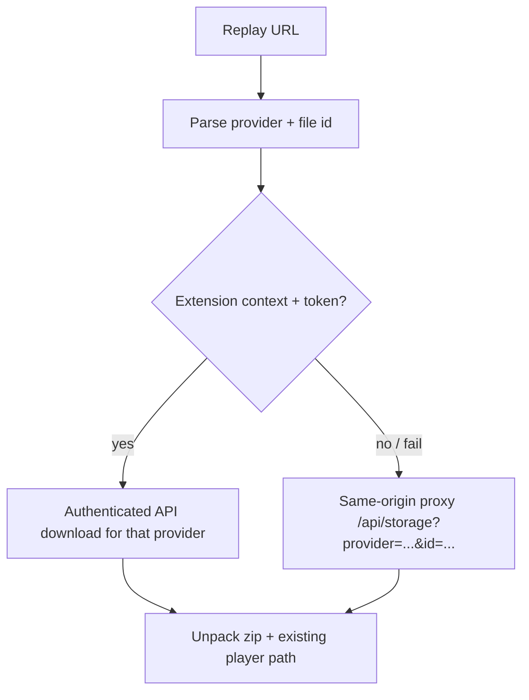
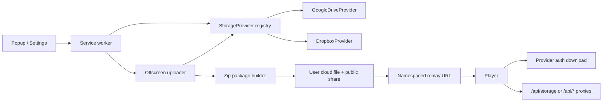

# Multi-Cloud Storage Providers (Google Drive + Dropbox)

> **Status: shipped (Drive + Dropbox only).**
> P0 abstraction + Google adapter and P1 Dropbox shipped. **OneDrive (P2) was implemented then removed** — personal OneDrive cannot reliably serve anonymous player downloads via Microsoft’s shares API. Product surface, registry, worker, player, and compliance copy are **Google Drive + Dropbox only**. Legacy `/onedrive/…` URLs fail closed without calling Microsoft hosts.

## Bối Cảnh

GN Tracing capture tab session rồi upload một zip package (`gn-tracing-*.zip`) lên cloud của user, tạo quyền đọc công khai theo link, và trả replay URL namespaced theo provider:

```text
https://tracing.gnas.dev/gdrive/<id>
https://tracing.gnas.dev/dropbox/<id>
```

Legacy Google bare-id URLs (`https://tracing.gnas.dev/<file-id>`) vẫn parse được. Standalone player tải package qua proxy same-origin `/api/drive` hoặc `/api/dropbox`. Extension player có thể tải bằng OAuth token của provider tương ứng khi có. Historical `/onedrive/…` paths are rejected (fail closed).

### Lịch sử (pre-P0 — không còn đúng)

Trước multi-cloud, auth/upload/share/player/proxy gắn cứng **Google Drive** only; không có Dropbox hay abstraction multi-provider. Phần **Nguyên Nhân Gốc Rễ** và thiết kế bên dưới mô tả vấn đề đó và cách đã chốt để mở rộng (Dropbox shipped; OneDrive later removed).

### Hiện trạng (product)

- Registry: `google-drive` | `dropbox` only (`src/background/storage/`).
- Settings: `activeStorageProvider` + folder per provider (Drive + Dropbox).
- Hard-fail public share so anonymous player download works.
- Docs/compliance/DEVELOPER: Drive + Dropbox only; OneDrive noted as removed.

**Nhu cầu gốc:** hỗ trợ cloud ngoài Google Drive — **Dropbox đã đáp ứng**. OneDrive không giữ vì không fit model public share + hosted player.

## Nguyên Nhân Gốc Rễ (vì sao chưa “bật được” ngay)

Không phải thiếu API OneDrive/Dropbox — cả Microsoft Graph và Dropbox API đều hỗ trợ upload file lớn + shared link public. Vấn đề là **product pipeline bị hard-wire vào một provider**:

1. **Auth:** `GoogleDriveAuth` + OAuth token proxy chỉ biết Google.
2. **Upload:** `uploadToGoogleDrive` trong offscreen gọi Drive v3 multipart / folder / `permissions anyone:reader`.
3. **Replay URL:** `buildExternalPlayerUrl(fileId)` không mang provider → player mặc định coi id là Google Drive file id.
4. **Player download:** `player/player.js` + `player-standalone/functions/api/drive.js` chỉ biết Google public download / Drive API.
5. **UI / settings / messages:** Connect/Disconnect, folder path, history, snapshot state đều “Google Drive”.
6. **Compliance:** privacy policy / CWS disclosure mô tả Google Drive OAuth + upload.

Package ZIP schema (metadata, manifest, video parts, optional artifacts) **đã gần provider-agnostic**; `metadata.storage.provider` đã có field nhưng hardcode `"google-drive"`. Đó là điểm bám để mở rộng.

## Mục Tiêu

1. User chọn **một storage provider** (Google Drive | Dropbox), connect OAuth, upload zip, nhận replay link mở được trên hosted player.
2. Google Drive **giữ hành vi hiện tại** (URL bare id vẫn hoạt động — backward compatible).
3. Standalone player resolve đúng provider từ URL và tải package (proxy per provider khi cần).
4. Extension player dùng token provider tương ứng khi có OAuth; fallback public/proxy khi không có token.
5. Settings/folder/history/UI phản ánh provider đang chọn; disconnect chỉ ảnh hưởng provider đó.
6. Không đưa OAuth client secret vào extension; tái dùng pattern token proxy Worker nếu Google/Dropbox app type yêu cầu secret.

## Ngoài Phạm Vi

- Backend/server-side storage riêng của GN Tracing (vẫn “user’s cloud”).
- Multi-provider upload đồng thời cho cùng một recording (một session → một provider).
- S3 / WebDAV / self-hosted generic storage.
- iCloud / Box / Mega.
- Thay đổi capture runtime, privacy redaction, zip package entry layout (trừ field `storage.provider` và URL namespace).
- Migrating bulk file từ Drive sang cloud khác.
- UI “chuyển provider giữa chừng khi đang upload” (cancel rồi đổi).

## Quyết Định Thiết Kế

### 1. Phased delivery (đã chốt)

| Phase | Nội dung | Lý do |
|-------|----------|--------|
| **P0** | Storage provider interface + extract Google Drive adapter; URL scheme có namespace; player router | Mở đường; default vẫn Drive |
| **P1** | Dropbox end-to-end (auth, upload, share, proxy, UI) | API/share-link đơn hơn; MVP cloud thứ hai |
| **P2** | ~~OneDrive end-to-end~~ — **removed from product** (anonymous share download not reliable on personal OD) | See status banner at top of this doc |
| **P3** | Docs / CWS / privacy / polish multi-provider | Compliance sau khi có ≥1 provider mới ship |

**Thứ tự ship (hiện tại):** P0 → Dropbox (P1) → polish (P3). OneDrive (P2) was tried then **removed**.

### 2. Provider id chuẩn

```ts
type StorageProviderId = "google-drive" | "dropbox"; // onedrive removed
```

Ghi vào `metadata.json` → `storage.provider` và settings `activeStorageProvider`.

### 3. Replay URL scheme

**Mới (namespaced):**

```text
https://tracing.gnas.dev/gdrive/<file-id>
https://tracing.gnas.dev/dropbox/<file-id-or-shared-id>
```

**Legacy (Google bare id — giữ mãi):**

```text
https://tracing.gnas.dev/<drive-file-id>
```

Parser:

1. Path segment đầu nếu ∈ `{gdrive, dropbox}` → provider + id phần còn lại. (`onedrive` fails closed.)
2. Ngược lại → `google-drive` + bare id (hành vi cũ).
3. Query legacy `?id=` giữ cho debug/cũ; mặc định coi là Google Drive trừ khi có `?provider=`.

Helper: mở rộng `buildExternalPlayerUrl(recordingId, provider?)` trong `src/shared/player-host.ts` và `normalizeRecordingUrl` để history cũ bare-id vẫn ổn.

**Đã chốt:** upload Google **mới** emit `/gdrive/<id>`; bare id chỉ để đọc legacy history/link cũ.

### 4. Interface `StorageProvider` (extension)

Contract tối thiểu (background/offscreen):

```ts
interface StorageProvider {
  readonly id: StorageProviderId;

  // Auth
  connect(): Promise<{ ok: boolean; error?: string }>;
  disconnect(): Promise<void>;
  getAuthToken(): Promise<string | null>;
  isConnected(): Promise<boolean>;

  // Folder (path / id / provider-specific link)
  parseFolderInput(raw: string): ParsedFolderTarget;
  resolveUploadFolder(authToken: string, target: ParsedFolderTarget): Promise<string | null>;

  // Package
  uploadPackage(args: {
    authToken: string;
    folderId: string | null;
    filename: string;
    blob: Blob;
    onProgress: (p: UploadProgress) => void;
  }): Promise<{ fileId: string }>;

  makePublicReadable(authToken: string, fileId: string): Promise<void>;

  // Replay
  buildReplayUrl(fileId: string): string;
  // Optional: authenticated media URL for extension player
  getAuthenticatedDownloadUrl?(fileId: string): string;
}
```

Registry:

```ts
const providers: Record<StorageProviderId, StorageProvider>;
// active provider từ settings
```

Google Drive adapter = extract logic hiện có từ `google-drive-auth.ts` + `uploadToGoogleDrive` + `google-drive-folder.ts` — **không rewrite hành vi**.

### 5. Player download strategy



- Giữ `/api/drive` cho backward compat.
- Standalone proxies: `/api/drive`, `/api/dropbox` (OneDrive proxy removed).
- Google bare URL và `/api/drive` không breaking.

### 6. Auth apps & secrets

| Provider | App registration | Extension flow | Secret handling |
|----------|------------------|----------------|-----------------|
| Google Drive | Giữ nguyên | `getAuthToken` / PKCE web | Optional existing Worker |
| Dropbox | Dropbox App Console (scoped access) | `launchWebAuthFlow` + PKCE nếu hỗ trợ / code flow | Secret → Worker path nếu bắt buộc; ưu tiên public client nếu Dropbox cho phép |
| ~~OneDrive~~ | **removed** — do not ship |

Build-time env (mở rộng `.env.example`):

- `DROPBOX_CLIENT_ID`, optional `DROPBOX_TOKEN_PROXY_URL`
- ~~`ONEDRIVE_CLIENT_ID` / `ONEDRIVE_TOKEN_PROXY_URL`~~ — removed from product env
- Giữ `GOOGLE_*` như hiện tại

Manifest `host_permissions`: Google + Dropbox fixed hosts only. Store review: narrow fixed hosts, không broad `<all_urls>`.

### 7. Share / public read semantics (bắt buộc cho standalone)

| Provider | Cách share | Rủi ro |
|----------|------------|--------|
| Google Drive | `permissions` type=anyone role=reader | Đã ổn |
| Dropbox | `sharing/create_shared_link_with_settings` (viewer) | Shared link id ≠ file id — **replay id phải là id player/proxy resolve được** (ưu tiên file id + proxy dùng token? **Không** — standalone không có user token). Vậy replay id = shared-link token/path hoặc file id nếu public link map 1-1. Cần chốt: lưu **canonical download id** sau `makePublicReadable` (thường là shared link path hoặc id Dropbox trả về). |
| ~~OneDrive~~ | **removed** — anonymous Graph share unreliable on personal OD |

**Quy tắc cứng (giữ như Drive):** upload hard-fail nếu không tạo được public-readable link — không trả replay URL gãy.

### 8. UI / settings

- Settings: **Storage provider** select (Google Drive / Dropbox).
- Chỉ hiện Connect/Disconnect + folder field cho provider đang active.
- Folder input parser per provider:
  - Drive: path `/a/b`, folder id, Drive folder URL (hiện có).
  - Dropbox: path `/Apps/...` hoặc folder id nếu API cho phép.
  - OneDrive: **removed** (not a connectable provider).
- Popup: không bắt buộc “Connect Google Drive” wording chung → “Connect storage” / tên provider.
- Recording gate: require `activeProvider.isConnected` (không hardcode Google).
- Auto-upload after stop: giữ nguyên khi token provider active còn valid.

### 9. Message / state contract

Mở rộng (không phá field cũ nếu có thể):

- Snapshot: `storage: { provider, isConnected }` (hoặc giữ `googleDrive` + thêm `storage` trong transition; **khuyến nghị migrate hẳn sang `storage`** với shim 1 release nếu cần).
- Messages: generic `STORAGE_CONNECT` / `STORAGE_DISCONNECT` / `STORAGE_STATUS` / `GET_STORAGE_TOKEN` + `provider` param; alias cũ `GOOGLE_DRIVE_*` map sang Google trong P0 để ít churn, deprecate sau.
- Upload history entry: thêm `provider: StorageProviderId` (optional default `google-drive` cho entry cũ).

## Kiến Trúc Mục Tiêu



### Module boundary đề xuất

| Module | Trách nhiệm |
|--------|-------------|
| `src/shared/storage-provider.ts` | types, id, URL parse/build |
| `src/background/storage/*` | registry, Google/Dropbox auth adapters |
| `src/shared/*-folder.ts` | parse folder input per provider |
| `src/offscreen/upload/*` | upload + share per provider; shared zip pipeline |
| `player/player.js` | parse provider; download strategy |
| `player-standalone/functions/api/*` | proxies |
| `worker/` | multi-issuer token exchange nếu cần |

Zip packaging (DEFLATE, password, video parts, progress) **ở chung**, không copy per provider.

## Logic Nghiệp Vụ Chi Tiết

### Upload happy path (mọi provider)

1. User chọn provider + connect OAuth.
2. Stop recording → offscreen build zip (như hiện tại).
3. `resolveUploadFolder` theo settings folder của provider đó.
4. `uploadPackage` zip.
5. `makePublicReadable`.
6. `buildReplayUrl(fileId)` namespaced — Google upload mới **luôn** emit `/gdrive/<id>`; bare id chỉ legacy.
7. Ghi history + `metadata.storage = { provider, folderId, package }`.

### Player load

1. Parse provider + id từ path.
2. Extension: `GET_STORAGE_TOKEN` cho provider đó → authenticated download nếu có API media endpoint.
3. Fail / no token → proxy path.
4. Zip unpack + password + existing inspection UX — không đổi.

### Disconnect

- Revoke token best-effort (mỗi provider API revoke khác nhau).
- Clear local token cache key riêng (`gn_tracing_tokens_google`, `_dropbox`).
- Không xóa file trên cloud.
- Không xóa upload history.

## Rủi Ro Và Mitigation

| Rủi ro | Mức | Mitigation |
|--------|-----|------------|
| Breaking bare Drive replay links | Cao | Parser legacy bare id → google-drive; tests URL normalize |
| Dropbox shared link id ≠ file id | Cao | Canonical “replay object id” do `makePublicReadable` trả về; document trong metadata |
| ~~OneDrive anonymous download~~ | — | **Resolved by removing OneDrive** |
| Dropbox app review + redirect URI cho extension | Trung bình | Dùng `chrome.identity.getRedirectURL()`; document setup trong DEVELOPER.md |
| CWS privacy / limited use (nếu Google-style policies) | Trung bình | Cập nhật privacy policy + single-purpose disclosure trước ship P1/P2 |
| Token proxy complexity multi-issuer | Trung bình | Route `/token/google`, `/token/dropbox` trên Worker; allow-list origins |
| Scope creep rewrite Drive | Trung bình | P0 chỉ extract adapter; golden tests hành vi Drive không đổi |
| Large file limits per cloud | Trung bình | Giữ chunk/part zip như hiện tại; map upload session API per provider |
| User confuse multi-connect | Thấp | Một active provider; UI rõ “đang dùng X” |

## Acceptance Criteria (user impact)

Verified against code/docs as of P3 completion (2026-07-24). Manual browser matrix still recommended before each multi-cloud Store ship.

- [x] User chỉ dùng Google Drive: connect, record, upload, replay; link bare id cũ vẫn mở (parser legacy + `/gdrive/<id>` cho upload mới).
- [x] User chọn Dropbox (P1): connect, chọn folder (hoặc root), upload, mở `.../dropbox/<id>` trên hosted player không cần login (`/api/dropbox`).
- [x] OneDrive (P2) **removed**: no connect/upload/player path; legacy `/onedrive/…` fails closed without Microsoft hosts.
- [x] Password-protected zip vẫn prompt password ở player (mọi provider) — shared zip pipeline.
- [x] Extension player với token provider active tải package không phụ thuộc proxy khi API cho phép (`GET_STORAGE_TOKEN`).
- [x] Disconnect provider A không xóa token provider B (per-provider token cache keys); active provider disconnect → UI “not connected”, chặn record/upload theo gate hiện tại.
- [x] Settings folder per provider được persist riêng (không đè path Drive lên Dropbox).
- [x] Privacy/docs nêu rõ cloud nào được upload và quyền OAuth tương ứng (privacy policy, terms, CWS, public HTML, DEVELOPER).

## Kế Hoạch Triển Khai Theo Phase

### Phase 0 — Abstraction + Google adapter (không ship cloud mới)

1. Thêm `StorageProviderId`, URL parse/build, tests cho legacy bare id + namespaced paths.
2. Extract `GoogleDriveProvider` từ auth + upload + folder helpers; registry chỉ đăng ký Google.
3. Settings `activeStorageProvider` default `"google-drive"`.
4. Messages generic + alias `GOOGLE_DRIVE_*`.
5. Player: parse provider; Google path giữ `/api/drive`.
6. `metadata.storage.provider` lấy từ active provider.
7. Regression: unit tests auth/folder/url; manual smoke Drive upload + bare + `/gdrive/` URL.

**Done when:** không đổi UX ngoài có thể emit `/gdrive/<id>`; mọi test Drive pass.

### Phase 1 — Dropbox

1. Dropbox app + env `DROPBOX_CLIENT_ID` + host_permissions.
2. `DropboxAuth` (web auth flow + token cache + refresh nếu API cho).
3. Upload (`/2/files/upload` hoặc session), folder resolve by path, `create_shared_link`.
4. Proxy `/api/dropbox` (hoặc generic storage) resolve shared/public content bytes.
5. UI provider select + Dropbox connect + folder hint.
6. Docs module + privacy draft cho Dropbox scopes.
7. E2E manual: connect → upload → open shared replay anonymous window.

### Phase 2 — OneDrive (**removed from product**)

> Superseded: personal OneDrive cannot reliably serve anonymous player downloads. Do not implement or ship. Remaining bullet points below are **historical design notes only**.

1. ~~Azure AD app registration + Graph scopes + env.~~
2. ~~Auth + token proxy Microsoft nếu cần secret.~~
3. ~~Upload session Graph, folder path, `createLink` anonymous view.~~
4. ~~Proxy `/api/onedrive`.~~
5. ~~UI + folder parser.~~
6. ~~Docs + privacy Microsoft Graph.~~
7. **Outcome:** feature removed; product remains Drive + Dropbox only.

### Phase 3 — Compliance & polish

1. Cập nhật `docs/modules/drive-and-player.md` → multi-cloud (Drive + Dropbox).
2. Privacy policy, terms, CWS listing, store assets copy (Drive + Dropbox only).
3. DEVELOPER.md setup for Google + Dropbox OAuth apps.
4. User-facing “Cloud storage” polish.
5. Telemetry-free: không log token/file content.
6. Strip OneDrive from product surface after anonymous-share evaluation failed.

**P3 done:** module docs + compliance + public legal HTML + DEVELOPER.md for Drive + Dropbox; OneDrive removed; telemetry-free guarantee documented.

## Kiểm Chứng

- Unit: URL parser (legacy + 3 providers), folder parsers, provider registry selection.
- Unit: zip metadata `storage.provider` đúng.
- Integration/mock: upload adapter mocks per provider (progress, share fail hard).
- Player: load fixture zip qua mock proxy per provider path.
- Manual matrix:

| Browser | Provider | Auth | Upload | Anonymous replay |
|---------|----------|------|--------|------------------|
| Chrome | Google | ✓ | ✓ | ✓ |
| Edge | Google web flow | ✓ | ✓ | ✓ |
| Chrome | Dropbox | ✓ | ✓ | ✓ |
| Chrome | OneDrive | — | — | **removed** (fail closed) |

- Regression: password zip, multi-part video, history copy link.

## Vùng Ảnh Hưởng Code (dự kiến)

| Khu vực | Mức độ |
|---------|--------|
| `src/background/google-drive-auth.ts` → storage adapters | Cao |
| `src/offscreen/offscreen.ts` upload | Cao |
| `src/shared/player-host.ts`, folder parsers | Trung bình |
| `src/popup/*`, `src/settings/*`, `drive-auth/*` | Trung bình–cao (UI) |
| `src/types/messages.ts`, settings-store | Trung bình |
| `player/player.js`, standalone functions | Cao |
| `worker/` OAuth proxy | Trung bình (P1/P2) |
| `manifest.template.json`, esbuild defines, `.env.example` | Trung bình |
| `docs/`, compliance | P3 |
| Capture/CDP/privacy runtime | Không đụng |

## Impact Nghiệp Vụ

- **QC / tester:** chọn Dropbox thay vì personal Google Drive khi cần; workflow record → share link không đổi.
- **Privacy:** file vẫn nằm trên cloud user; public-by-link vẫn là model (zip password vẫn bảo vệ nội dung).
- **Ops:** thêm secret/app registration per provider; release build cần env đủ nếu ship multi-cloud.
- **Support:** thêm failure modes OAuth per vendor; docs troubleshooting Shields/popup như Drive.

## Quyết Định Đã Chốt Với User

| # | Câu hỏi | Quyết định |
|---|---------|------------|
| 1 | Thứ tự ship sau P0 | **Dropbox (P1)**; OneDrive (P2) later **removed** |
| 2 | URL Google upload mới | **`/gdrive/<id>`**; bare id chỉ legacy |
| 3 | Folder OneDrive P2 | ~~Personal path/root only~~ — **not shipped** (OD removed) |
| 4 | Multi-token cache | **token cache per provider** (key riêng); UI chỉ active một provider |

## Tiêu Chí Duyệt Plan

Duyệt plan này nghĩa là đồng ý:

- Làm **P0 abstraction** trước khi thêm cloud mới.
- URL namespaced; Google mới `/gdrive/<id>`; legacy bare id vẫn parse.
- Hard-fail nếu không public-share được.
- Không backend lưu recording; vẫn user’s cloud.
- P1 Dropbox → P3 compliance; OneDrive (P2) removed from product after evaluation.

Sau duyệt: tạo file chính thức `docs/specs/planning/multi-cloud-storage-providers.md`, rồi triển khai P0 (hoặc full pipeline nếu user yêu cầu `//e` / `//rpe` tiếp).
