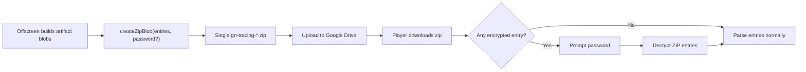

# Native Zip Password Protection

## Trạng Thái

Implemented. New password-protected uploads now use native ZIP encrypted entries. The player keeps legacy support for older `encrypted-payload.bin` packages.

## Bối Cảnh

Popup cho người dùng đặt "Zip Password" cho các upload mới. File `gn-tracing-*.zip` trên Google Drive phải là một ZIP có mật khẩu thật: tải về bằng công cụ unzip phổ biến thì công cụ đó hỏi password, còn GN Tracing player cũng dùng cùng password để mở replay.

Implementation hiện tại tạo một recording zip duy nhất và password-protect entry payloads trong chính ZIP đó. Player vẫn giữ đường đọc legacy cho các package cũ dạng `recording-index.json` cộng `encrypted-payload.bin`.

## Nguyên Nhân Gốc Rễ

Vấn đề cần tránh là đặt password ở một payload riêng bên trong outer ZIP thay vì đặt ở ZIP entries. Nguyên nhân trực tiếp của thiết kế cũ nằm ở boundary đóng gói:

- `src/offscreen/offscreen.ts` tạo `innerZipBlob` bằng `createZipBlob()`.
- Khi có `zipPassword`, code gọi `createEncryptedZipBlob()` để tạo outer package riêng.
- `player/player.js` nhận biết outer package qua encryption metadata, giải mã `encrypted-payload.bin`, rồi parse inner zip.

Nguyên nhân gốc rễ là password feature từng được thiết kế như GN Tracing encrypted package thay vì native ZIP encrypted entries. Contract hiện tại đặt password tại ZIP entry layer để tương thích với desktop unzip password prompts.

## Mục Tiêu

- Khi có password, upload đúng một file `gn-tracing-*.zip` với các artifact entries được password-protect theo ZIP format.
- Không upload outer zip chứa `encrypted-payload.bin` cho package mới.
- Player vẫn mở được replay protected package bằng cùng form unlock hiện có.
- Unprotected package giữ nguyên contract hiện tại.
- Plaintext password không xuất hiện trong replay URL, upload history, popup snapshot hoặc package metadata.

## Ngoài Phạm Vi

- Không đổi flow Google Drive auth, upload folder, sharing permission hoặc replay URL.
- Không đổi UI popup ngoài copy nếu cần làm rõ nghĩa setting.
- Không thiết kế schema network compact trong task này; nén ZIP được xử lý ở package writer và có thể chạy trước bước mã hóa ZIP entry.
- Không cố migrate hoặc rewrite các protected package cũ đã upload; player nên giữ khả năng đọc format cũ nếu chi phí thấp.

## Hướng Thiết Kế Đề Xuất

Dùng native ZIP entry encryption trong chính `createZipBlob()`.

Để giữ bundle dependency-free và tương thích rộng với desktop unzip tools, hướng triển khai nhỏ nhất là hỗ trợ ZIP traditional encryption tại entry layer:

- set general purpose bit `0x0001` cho encrypted entries và giữ UTF-8 bit `0x0800`;
- ghi 12-byte encryption header trước mỗi entry payload;
- mã hóa encryption header và entry bytes bằng thuật toán ZipCrypto;
- central directory và local headers vẫn ghi CRC-32, compressed size và uncompressed size đúng theo ZIP contract;
- compressed size của entry protected bao gồm 12-byte encryption header cộng encrypted entry payload bytes;
- compression method có thể là `0` cho stored entries hoặc `8` cho DEFLATE-compressed JSON/text entries.

Trade-off quan trọng: ZipCrypto là format ZIP password tương thích rộng nhưng không mạnh bằng AES-GCM hiện tại. Nếu mục tiêu bảo mật mạnh hơn compatibility, phương án thay thế là thêm một ZIP library hỗ trợ WinZip AES, nhưng phạm vi lớn hơn vì cần kiểm soát dependency, bundle size và parser player.

## Luồng Mới

## Chi Tiết Triển Khai

### Offscreen ZIP Writer

- Thay `createZipBlob(entries, modifiedAt)` bằng API nhận thêm optional password hoặc options object.
- Tách helper nhỏ cho ZIP entry preparation:
  - validate name;
  - read bytes;
  - calculate CRC-32;
  - optionally encrypt bytes;
  - return local header payload, central directory metadata, sizes, flags.
- Xóa path tạo outer encrypted package khỏi upload flow cho package mới:
  - không tạo clear outer `recording-index.json`;
  - không tạo `encrypted-payload.bin`;
  - progress copy nên đổi từ "Encrypting recording package..." thành "Protecting recording zip..." nếu vẫn cần step riêng.
- Giữ các constant Web Crypto cũ chỉ nếu player cần backward compatibility với old packages; nếu không cần thì xóa sau khi player path cũ bị bỏ.

### Player ZIP Parser

- `unzipStoredPackage()` cần đọc general purpose flag từ central directory.
- Nếu không encrypted: giữ behavior hiện tại.
- Nếu encrypted và chưa có password: báo signal riêng để caller hiện unlock form.
- Khi có password:
  - decrypt 12-byte header và entry payload;
  - kiểm tra password bằng byte cuối encryption header theo CRC high byte, rồi xác minh CRC-32 sau khi decrypt full payload;
  - nếu sai password hoặc CRC mismatch, giữ user trong unlock state với error rõ.
- Sau khi decrypt, `entries` map vẫn chứa Blob plaintext như hiện tại để phần `buildRecordingFilesFromPackageEntries()` không đổi.
- Giữ `unlockEncryptedRecordingPackage()` hoặc thay bằng `unlockPasswordProtectedZipPackage()`; nếu giữ backward compatibility, function này có thể xử lý cả old outer encrypted package và new native encrypted ZIP.

### Standalone Player Sync

- Sửa nguồn chính `player/player.js`, rồi chạy sync để cập nhật `player-standalone/public/player.js`.
- Nếu sync script chỉ copy static player assets, không sửa trực tiếp bản generated trừ khi cần hotfix tạm.

### Docs

- Cập nhật `docs/specs/planning/password-protected-recording-zip.md` từ implemented encrypted-payload contract sang native ZIP password contract.
- Cập nhật `docs/modules/drive-and-player.md`, `docs/shared/data-models.md`, `docs/compliance/privacy-policy.md`, và `docs/_sync.md`.
- Xóa các câu nói protected uploads không tương thích desktop unzip password prompts.

## Rủi Ro Và Ràng Buộc

- ZipCrypto tương thích rộng nhưng yếu hơn AES-GCM. Cần wording docs/privacy không hứa mức bảo mật mạnh như encryption package hiện tại.
- ZIP size fields phải tính theo encrypted payload size, nếu sai thì Google Drive upload vẫn thành công nhưng desktop unzip/player sẽ fail.
- Player cần phân biệt sai password với corrupted zip để UI không rơi vào lỗi generic.
- Cần giữ unprotected replay không regression.
- Old protected packages có thể đang tồn tại; nếu bỏ parser cũ, replay cũ sẽ không mở được. Khuyến nghị giữ backward compatibility ít nhất một release.

## Kiểm Chứng

- `npx tsc --noEmit`
- `node esbuild.config.mjs --env development`
- `task player:sync` nếu có thay đổi `player/player.js`
- Manual package inspection:
  - upload protected recording;
  - tải ZIP từ Drive;
  - xác nhận desktop unzip hỏi password và mở được khi nhập đúng password;
  - xác nhận không còn `encrypted-payload.bin`.
- Player validation:
  - unprotected replay vẫn load;
  - protected replay nhập sai password báo lỗi và vẫn ở unlock form;
  - protected replay nhập đúng password load đủ video, metadata, optional logs;
  - old encrypted-payload package vẫn load nếu giữ compatibility.
