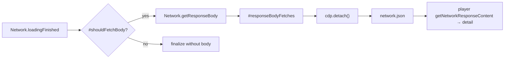
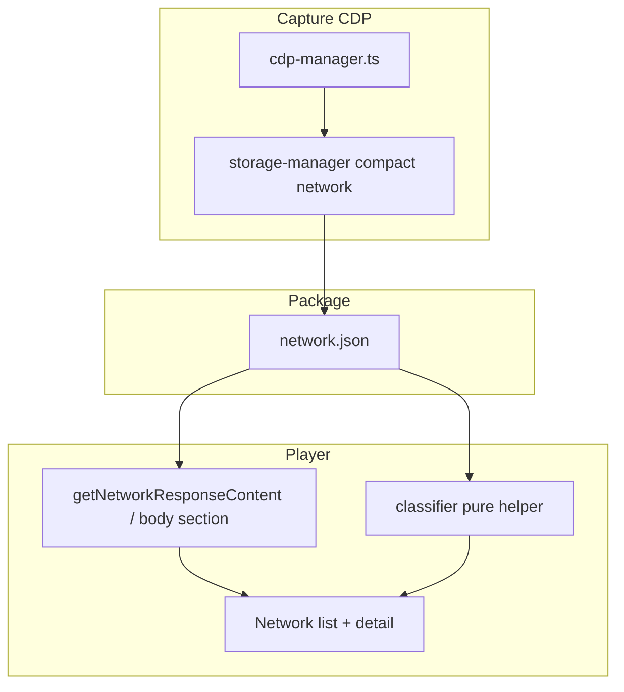

# Response Body Network Item Và JS Filter Trong Player

## Bối Cảnh

Hai lỗ hổng quan sát được trên pipeline network evidence:

1. **Thiếu response body trong network item** — expand một request trong tab Network nhưng không thấy body dù capture profile bật response bodies (`eligible` / full debug) và request là JSON/text.
2. **Filter `JS` trong player không đúng** — bấm nút filter `JS` trên thanh network filters không phản ánh đúng tập resource script; một số script biến mất hoặc bị xếp nhầm loại. Logic hiện nằm trong `player/player.js` (`getNetworkFilterType` / `detectNetworkFilterFromUrlAndMime`) và **không có unit test**.

Player source of truth: `player/player.js` (extension + standalone qua `task player:sync`). Capture body: `src/background/cdp-manager.ts` → `StorageManager` → `network.json`.

## Nguyên Nhân Gốc Rễ

### A. Response body thiếu

Không phải một bug UI đơn lẻ. Body đi qua ba chặng; mỗi chặng có lỗ hổng độc lập:



| # | Nguyên nhân | Vị trí | Hậu quả |
| --- | --- | --- | --- |
| A1 | **Thứ tự detach sai** | `CdpManager.detach()`: gọi `chrome.debugger.detach` **trước** `Promise.allSettled(#responseBodyFetches)` | Mọi `getResponseBody` còn in-flight fail im lặng (`catch {}`); entry finalize với `responseBody: null` |
| A2 | **Gate mimeType quá cứng** | `#shouldFetchBody`: `if (!entry.mimeType) return false` | Request có body nhưng CDP để `mimeType` rỗng (hoặc chỉ có `Content-Type` trong headers) → không fetch body |
| A3 | **Khớp MIME `eligible` bằng `startsWith` hẹp** | `textTypes.some((t) => mime.startsWith(t))` | Bỏ lỡ subtype phổ biến: `application/problem+json`, `application/graphql+json`, `application/*+json`; một số server trả `application/octet-stream` cho JSON/JS |
| A4 | **Player không phân biệt “không capture” vs “không có body”** | `buildResponseBodySection`: `if (!content.text) return ""` | Expand request → không có section body, không hint; dễ hiểu nhầm là bug render dù artifact đúng là null |
| A5 | **In-page mode (by design)** | `in-page-capture.ts` luôn `responseBody: null` | Không thuộc bug CDP; privacy/limitation đã ghi — không “sửa” để đọc body cross-origin trong plan này |

Thứ tự stop hiện tại (`service-worker.stopRecording`): media stop → `flushSourceMaps` → snapshot storage/DOM → **`cdp.detach()`**. Detach là chỗ chốt A1: body fetch phải xong **trước** khi debugger rời tab.

### B. JS filter sai

Classifier hiện tại (`getNetworkFilterType`):

1. Nếu `resourceType ∈ {xhr, fetch}` → **ưu tiên MIME/URL**, có thể trả `"js"` / `"css"` / … thay vì `"fetch"`.
2. Nếu `resourceType` có trong `typeMap` (gồm **`other`**) → **return ngay**, **không** refine bằng MIME/URL.
3. Chỉ khi type lạ/rỗng mới gọi `detectNetworkFilterFromUrlAndMime`.

Hệ quả:

| Case | Hành vi hiện tại | Kỳ vọng (DevTools-like) |
| --- | --- | --- |
| `resourceType: "Script"`, URL `.js` | `"js"` | `"js"` ✓ |
| `resourceType: "Other"`, URL `/app.chunk.js`, mime `application/javascript` | **`"other"`** (short-circuit typeMap) | **`"js"`** — filter JS phải hiện |
| `resourceType: "XHR"`, URL API JSON | `"fetch"` (mime json) | `"fetch"` ✓ |
| `resourceType: "Fetch"`, URL kết thúc `.js` hoặc mime JS | **`"js"`** | **`"fetch"`** — Fetch/XHR filter, không trộn sang JS |
| `resourceType: ""`, mime/URL JS | `"js"` | `"js"` ✓ |
| `resourceType: "Other"`, image URL | `"other"` | refine → `"img"` nếu MIME/URL rõ |

Gốc rễ: **precedence resourceType vs MIME/URL không nhất quán** — XHR/fetch bị over-refine, còn `Other`/unknown bị under-refine. Không có ma trận unit test nên regression không bị bắt.

Filter multi-select (`activeNetworkFilters` Set) và UI toggle (`setupFilterToggleGroup`) đúng semantics OR; bug nằm ở **nhãn `filterType` gán cho entry**, không phải event handler.

## Góc Nhìn Tổng Quan Và Phạm Vi



| Vùng | File chính | Việc |
| --- | --- | --- |
| Capture body | `src/background/cdp-manager.ts` | Fix A1–A3; test `#shouldFetchBody` + detach wait order |
| Player body UX | `player/player.js` | A4: empty/not-captured hint khi hợp lý |
| Player filter | pure helper + `player/player.js` | Fix precedence; unit test toàn diện |
| Sync | `task player:sync` | Mirror standalone |
| Docs | `docs/modules/recording-runtime.md`, `docs/modules/replay-player.md` | Ghi hành vi body best-effort + filter rule |

## Mục Tiêu

1. Với capture mode CDP + profile bật response body, request text/JSON/JS **đủ điều kiện** có `responseBody` trong `network.json` khi CDP còn cung cấp body (best-effort; vẫn chấp nhận eviction CDP).
2. `detach()` **không** cắt body fetch đang chạy: chờ fetch xong rồi mới `chrome.debugger.detach`, sau đó finalize pending.
3. Expand network item: hiện body khi có; khi không có, hiện trạng thái rõ (không capture / không lấy được / binary) thay vì im lặng.
4. Filter `JS` (và các filter type khác) khớp rule DevTools-like đã chốt; ma trận unit test cover các case biên.
5. Logic classifier **testable thuần** (không phụ thuộc DOM/player IIFE).

## Ngoài Phạm Vi

- Capture response body cho **in-page** mode (giới hạn cross-origin / stream).
- Đổi default capture profile, privacy redaction rules, hoặc max body bytes product defaults.
- Modularize toàn bộ `player.js` (plan `repo-code-quality-cleanup` / `shared-package-extension-player`).
- HAR import fidelity ngoài việc body/filter của format native GN Tracing.
- Preview HTML/media lớn, syntax highlight JS nâng cao.

## Logic Nghiệp Vụ

### Response body capture

- `captureResponseBodyMode === "off"` → không fetch (giữ nguyên).
- `text` / `text-json` / `eligible` giữ semantics hiện tại nhưng **eligible** nới khớp MIME:
  - Giữ prefix text + application/javascript variants + xml/svg.
  - JSON: `includes("json")` hoặc subtype `+json` (RFC 6839), không chỉ `startsWith("application/json")`.
- Khi `mimeType` rỗng: fallback parse `Content-Type` từ `responseHeaders` / `responseHeadersExtra` (lấy media-type trước `;`).
- Giới hạn `maxResponseBodyBytes` so với `encodedDataLength` giữ nguyên; `null` = không giới hạn.
- Redaction body text (non-base64) giữ `#redactBodyValue` như hiện tại.
- Fail `getResponseBody` vẫn finalize entry **không** body (best-effort), nhưng không còn fail vì detach sớm.

### Network filter type (DevTools-like)

Precedence:

1. **Canonical CDP resource types** map 1–1 sang filter bucket:
   - `xhr` | `fetch` | `preflight` | `prefetch` | `eventsource` → `fetch`
   - `script` → `js`
   - `stylesheet` → `css`
   - `image` → `img`
   - `font` → `font`
   - `media` | `texttrack` → `media`
   - `document` | `manifest` | `signedexchange` → `doc`
   - `websocket` → `ws`
   - known noise (`ping`, `cspviolationreport`, `fedcm`, …) → `other`
2. **Không** reclassify `xhr`/`fetch` sang `js`/`css`/… theo URL/MIME (tránh trộn Fetch/XHR với Script).
3. Chỉ khi type **thiếu / `other` / không map được** → refine bằng MIME rồi extension URL (logic hiện có của `detectNetworkFilterFromUrlAndMime`, có thể tinh chỉnh `.map` → `other` hoặc giữ `js` — **chốt: source map `.map` → `other`** để filter JS = script thật).
4. Default cuối: `other`.

WebSocket list vẫn chỉ hiện khi filter rỗng hoặc có `ws` (giữ `getVisibleWebSocketEntries`).

### Player body display

- `getNetworkResponseContent` giữ dual schema: `response.content` (legacy/HAR) + `entry.responseBody` (native).
- Khi không có text body: nếu entry đã complete (status/error) và mode capture không phải “off” theo metadata package (nếu có) → section gọn “Body not captured” / “Binary or non-text body”; nếu package không mang signal → “No response body”.
- Không bịa body; không fetch lại từ mạng lúc replay.

## Cấu Trúc Giải Pháp

### 1. Capture — `cdp-manager.ts`

1. **`detach()` reorder**
   - `await Promise.allSettled(#responseBodyFetches)` (và optional short grace nếu cần)
   - finalize mọi `#pendingRequests` còn lại
   - **rồi** `chrome.debugger.detach`
   - clear maps
2. **`#shouldFetchBody` harden**
   - helper `#resolveMimeType(entry)` = `entry.mimeType` || parse Content-Type header
   - eligible: dùng MIME đã resolve; JSON via `includes("json")` / `+json`; JS via javascript/ecmascript prefixes
3. (Optional defensive) Nếu `loadingFinished` mà mime vẫn rỗng nhưng headers extra vừa tới sau — đã có `#applyPendingRequestMetadata`; đảm bảo metadata apply **trước** `shouldFetchBody`.

### 2. Pure classifier — extract để test

Tạo module pure (ưu tiên một trong hai, chốt khi implement theo path ít đụng build nhất):

**Hướng đề xuất:** `src/shared/network-filter-type.ts` (hoặc `packages/replay-core/src/network-filter.ts` nếu muốn MCP/agent dùng chung sau).

Export:

```ts
export type NetworkFilterBucket =
  | "fetch" | "js" | "css" | "img" | "doc" | "font" | "media" | "ws" | "other";

export function getNetworkFilterType(input: {
  resourceType?: string | null;
  url?: string | null;
  mimeType?: string | null;
}): NetworkFilterBucket;
```

Player gọi helper:

- Nếu đã có `window.gnCore`/vendor shared: expose qua core bundle; **hoặc**
- Duplicate tối thiểu: copy pure function vào `player/player.js` **chỉ khi** chưa wire shared — **tránh**. Ưu tiên vendor/sync path hiện có (`packages/replay-core` → `player/vendor/gn-core`) **nếu** cost rebuild chấp nhận được trong cùng PR; nếu không, extract sang file JS thuần trong `player/lib/network-filter-type.js` import bằng esbuild entry `player/core-entry` **chỉ khi** đã có sẵn pattern.

**Thực tế repo:** player là IIFE hand-written, không import TS. Pattern an toàn ngắn hạn:

1. Viết pure logic + test ở `src/shared/network-filter-type.ts` (extension/node tests).
2. Mirror cùng logic vào `player/player.js` **hoặc** generate vendor snippet nhỏ `player/vendor/network-filter-type.iife.js` từ shared (giống webm-seek-fix) nếu muốn single source.

**Chốt đề xuất triển khai:** single source `src/shared/network-filter-type.ts` + build/vendor IIFE nhỏ `window.gnNetworkFilterType` (hoặc gắn vào `gnCore`) + player gọi global với fallback inline copy **chỉ khi** global thiếu (giống luna). Nếu cost vendor quá lớn cho PR này: pure file + test extract-from-source (pattern `player-i18n.test.ts`) trên các function trong `player.js` sau khi refactor thành named functions dễ parse — **kém hơn**. Prefer vendor/shared.

Lựa chọn **ponytail cho PR này** (đủ đúng, ít đụng):

- Đưa pure functions vào `src/shared/network-filter-type.ts` + unit test đầy đủ.
- Trong `player/player.js`, thay thân `getNetworkFilterType` / `detectNetworkFilterFromUrlAndMime` bằng cùng algorithm (comment `// Keep in sync with src/shared/network-filter-type.ts`) **và** thêm test extract-or-import:
  - Test suite import shared module (source of truth).
  - Optional: snapshot/assert player.js contains same key decision table strings — nhẹ.

Không block ship vì dual-copy nếu vendor pipeline chưa sẵn; ghi note debt.

### 3. Player body section

- `buildResponseBodySection` / `buildResponseTabs`: empty state rõ ràng.
- Giữ decode base64 text kinds hiện có.

### 4. Tests

| Suite | Nội dung |
| --- | --- |
| `src/shared/network-filter-type.test.ts` | Ma trận resourceType × url × mime → bucket (ít nhất 25–40 cases) |
| `src/background/cdp-manager` body helpers (extract pure `#shouldFetchBody` / mime resolve nếu private khó test) | off/text/text-json/eligible; empty mime + Content-Type; size limit; +json |
| `cdp-manager` detach order | mock debugger: body fetch promise resolve after detach call order asserts wait-before-detach |
| Player (nếu empty-state) | unit nhỏ trên pure empty-state helper hoặc i18n key tồn tại |

Ma trận filter tối thiểu:

- Script + `.js` / `.mjs` / `.cjs`
- Other + JS mime / `.js` URL
- Other + image / font / css
- XHR/Fetch + JSON API (luôn `fetch`)
- XHR/Fetch + `.js` URL (vẫn `fetch`)
- Document / stylesheet / image / font / media / websocket
- Empty type + mime only / extension only
- `.map` → `other` (sau chốt)
- Query string / hash trên URL script
- Case-insensitive resourceType (`Script` vs `script`)

## Hướng Tiếp Cận Đề Xuất

Làm theo thứ tự dependency dữ liệu:

1. **Fix capture body (A1–A3)** — khôi phục dữ liệu trong artifact mới; không chỉ “che” bằng UI.
2. **Extract + fix filter + unit tests** — chặn regression classifier.
3. **Player empty-state body (A4)** — UX cho package cũ / body thật sự không có.
4. **Docs + `player:sync`**.

Không đổi schema `responseBody: { body, base64Encoded }`.

## Công Việc Cần Làm

1. Extract/test `resolveResponseMimeType` + `shouldFetchResponseBody(settings, entry)` (pure) từ logic cdp-manager; wire lại private methods.
2. Sửa `detach()`: wait body fetches → finalize pending → debugger detach.
3. Extract/test `getNetworkFilterType` pure; cập nhật algorithm DevTools-like; wire player.
4. Player: empty body section + i18n en/vi keys.
5. `task player:sync` (hoặc quy trình build hiện có).
6. Cập nhật `docs/modules/recording-runtime.md` (detach/body best-effort) và `docs/modules/replay-player.md` (filter rule + empty body).
7. Chạy `vitest` liên quan + smoke manual: record full-debug page có XHR JSON + script tags → stop → mở player → expand XHR thấy body; filter JS chỉ còn script.

## Rủi Ro Và Giảm Thiểu

| Rủi Ro | Mức | Giảm thiểu |
| --- | --- | --- |
| Chờ body fetch làm stop chậm trên page nhiều request | Trung bình | `allSettled` chỉ cho fetch đã kick; không thêm timeout dài; CDP eviction vẫn fail-open |
| Dual-copy filter logic drift | Trung bình | Shared module là SoT + test; comment sync nếu chưa vendor |
| Đổi filter làm recording UI “khác trước” với user đã quen | Thấp | Behavior mới gần DevTools hơn; ghi trong release note ngắn |
| Package cũ không có body | Không phải regression | Empty-state copy; không pretend data |
| Test detach cần mock chrome.debugger | Trung bình | Dùng mock sẵn trong `test/mocks` / pattern cdp tests nếu có; không thì pure extract + integration light |

## Acceptance Criteria

- [ ] Stop recording (CDP, body mode ≠ off): XHR/fetch JSON đủ điều kiện có `responseBody.body` non-empty trong `network.json` khi CDP trả body.
- [ ] `detach` không gọi `chrome.debugger.detach` trước khi các `#responseBodyFetches` đã settle (assert bằng unit/integration).
- [ ] Filter `JS`: mọi entry `resourceType` script (và Other+JS mime/url) hiện; XHR/Fetch **không** bị kéo vào JS chỉ vì URL `.js`.
- [ ] Filter `Fetch/XHR`: mọi xhr/fetch, kể cả response JS mime.
- [ ] Suite unit classifier ≥ ma trận cases ở trên, green trong CI root vitest.
- [ ] Expand network không body: có copy trạng thái, không section trống im lặng.
- [ ] Standalone player mirror (`player:sync`) khớp behavior extension player.
- [ ] Docs modules cập nhật đúng hành vi.

## Impact Nghiệp Vụ (User)

- QA/dev xem replay sẽ **thấy được payload API** đã ghi (khi setting cho phép), giảm “mù” lúc debug lỗi backend/contract.
- Filter Network giống DevTools hơn → khoanh script lỗi / bundle nhanh hơn, ít false positive từ XHR.
- Package đã upload trước fix **không** tự có body mới; chỉ recording sau fix hưởng A1–A3. Empty-state giúp hiểu giới hạn package cũ.

## Thứ Tự PR Gợi Ý

| PR | Nội dung | Phụ thuộc |
| --- | --- | --- |
| PR1 | Capture body: shouldFetchBody + detach order + tests | — |
| PR2 | Network filter pure module + player wire + comprehensive tests | — (song song PR1 được) |
| PR3 | Player empty body UX + i18n + docs + sync | PR1/PR2 optional |

Có thể gộp PR1+PR2 một PR nếu muốn ship nhanh một “network evidence” fix.

---

**Trạng thái:** chờ phê duyệt trước khi sửa code.
