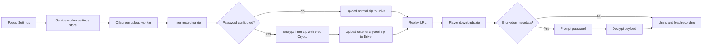

# Password Protected Recording Zip

## Bối Cảnh

GN Tracing hiện upload mỗi recording thành một file `gn-tracing-*.zip` công khai trên Google Drive. Player nhận replay URL theo file ID, tải zip về, giải nén bằng parser nội bộ và đọc `recording-index.json`, `manifest.json`, `metadata.json`, log JSON và các phần video.

Người dùng muốn thêm mật khẩu cho file zip khi upload. Mật khẩu được cấu hình trong phần Settings của popup. Khi mở replay link, player phải kiểm tra package có mật khẩu hay không; nếu có thì hiển thị ô nhập mật khẩu trước khi load recording.

Docs hiện đang sync ở commit `1a1e99489f04f49b87b8af9e58fa1a6941ba3e80`, còn HEAD hiện tại là `8094ba2d99f87e32a730a4b3e0aee40644aaf939`, nên kế hoạch này dùng docs làm bối cảnh và xác nhận lại bằng code hiện tại.

## Nguyên Nhân Và Lý Do Thiết Kế

Triệu chứng cần giải quyết là replay link hiện trỏ đến một Drive file được public-readable. Dù việc gom artifact thành zip đã làm recording trở thành một package nguyên tử, dữ liệu bên trong vẫn có thể được tải và đọc bởi bất kỳ ai có link.

Nguyên nhân trực tiếp là upload flow chỉ tạo zip store-method không mã hóa trong `src/offscreen/offscreen.ts`, còn player chỉ cần tải zip và unzip trong `player/player.js`. Nguyên nhân gốc rễ là storage contract đã ưu tiên chia sẻ replay thuận tiện qua public Drive link, nhưng chưa có lớp bảo vệ nội dung client-side.

Hướng thiết kế đề xuất là mã hóa payload recording bằng Web Crypto trước khi upload khi người dùng cấu hình mật khẩu. Cách này giữ được mô hình một Drive file, không cần backend, và player vẫn tự giải mã được sau khi người xem nhập mật khẩu. Đây không phải ZIP password native theo chuẩn công cụ giải nén desktop; đó là một GN Tracing encrypted zip package. Nếu bắt buộc tương thích với `unzip`/Finder/Windows Explorer password prompt, cần một hướng khác với thư viện ZIP AES hoặc triển khai chuẩn ZIP encryption, rủi ro và phạm vi lớn hơn.

## Góc Nhìn Tổng Quan Và Phạm Vi Tập Trung

Phạm vi tập trung gồm bốn ranh giới:

- Popup Settings: thêm cấu hình mật khẩu upload zip.
- Service worker: lưu settings, không trả plaintext password về UI snapshot, truyền mật khẩu vào upload task.
- Offscreen upload worker: tạo package thường như hiện tại, sau đó nếu có mật khẩu thì mã hóa inner package và upload outer zip chứa metadata mã hóa.
- Player: tải package, phát hiện metadata mã hóa, hỏi mật khẩu, giải mã, rồi load recording bằng flow unzip hiện có.

Không thay đổi Google Drive auth, target folder resolution, upload history, replay URL format, hoặc legacy direct query-param replay ngoài việc giữ chúng tương thích.

## Mục Tiêu

- Cho phép người dùng đặt, đổi và xóa mật khẩu zip trong Settings section của popup.
- Khi mật khẩu rỗng, upload và replay hoạt động như hiện tại.
- Khi mật khẩu được cấu hình, nội dung recording trong Drive package được mã hóa client-side trước khi upload.
- Player phát hiện package được bảo vệ và hiển thị form nhập mật khẩu trước khi parse metadata/log/video.
- Nhập đúng mật khẩu thì replay load bình thường; nhập sai mật khẩu thì báo lỗi rõ và cho nhập lại.
- Không đưa plaintext password vào replay URL, upload history, `recording-index.json`, `manifest.json`, hoặc log.

## Ngoài Phạm Vi

- Không hỗ trợ khôi phục mật khẩu đã quên.
- Không mã hóa tên file Drive hoặc bản thân replay URL.
- Không yêu cầu ZIP password native tương thích với công cụ giải nén ngoài GN Tracing Player trong vòng triển khai này.
- Không thêm backend hoặc API riêng để lưu key, password hint, hoặc metadata.
- Không bảo vệ legacy replay link dạng query params cũ vì các artifact cũ vốn đã public và không có metadata mã hóa.

## Logic Nghiệp Vụ

- Settings có mật khẩu khác rỗng nghĩa là mọi upload tiếp theo phải tạo encrypted package.
- Settings không nên trả plaintext password về popup state. UI chỉ cần biết có đang cấu hình mật khẩu hay không để hiển thị trạng thái `Password set` hoặc `No password`.
- Khi người dùng nhập password mới trong Settings, service worker lưu giá trị đó vào `chrome.storage.local`; khi người dùng clear password, upload quay lại zip thường.
- Mật khẩu chỉ được dùng để derive key tại thời điểm upload và replay. Plaintext không được ghi vào package hoặc truyền qua URL.
- Mỗi encrypted upload phải dùng salt và IV ngẫu nhiên riêng.
- Wrong password hoặc package hỏng phải được xử lý như lỗi unlock, không được rơi vào lỗi unzip mơ hồ.

## Cấu Trúc Giải Pháp

Package không mật khẩu giữ contract hiện tại:

```text
gn-tracing-*.zip
  recording-index.json
  manifest.json
  metadata.json
  video.part-000.webm
  ...
```

Package có mật khẩu dùng outer zip nhẹ để player đọc metadata mã hóa, còn nội dung thật nằm trong encrypted inner zip:

```text
gn-tracing-*.zip
  recording-index.json   # clear metadata tối thiểu, có encryption descriptor
  encrypted-payload.bin  # AES-GCM ciphertext của inner zip
```

Inner zip sau khi giải mã chính là package hiện tại:

```text
inner.zip
  recording-index.json
  manifest.json
  metadata.json
  video.part-000.webm
  ...
```

## Mô Hình C4



## Hướng Tiếp Cận Đề Xuất

Sử dụng Web Crypto với PBKDF2-SHA-256 và AES-GCM:

- `crypto.getRandomValues` tạo salt và IV riêng cho từng upload.
- `crypto.subtle.importKey` nhận password từ `TextEncoder`.
- `crypto.subtle.deriveKey` dùng PBKDF2-SHA-256 với iteration count đủ cao cho browser runtime.
- `crypto.subtle.encrypt` mã hóa bytes của inner zip.
- `crypto.subtle.decrypt` trong player giải mã payload; `OperationError` được xem là sai mật khẩu hoặc package bị hỏng.

Outer `recording-index.json` chỉ chứa metadata cần để unlock:

```json
{
  "schemaVersion": 3,
  "package": {
    "filename": "gn-tracing-2026-05-21T12-00-00.zip",
    "format": "zip",
    "encrypted": true
  },
  "encryption": {
    "version": 1,
    "algorithm": "AES-GCM",
    "kdf": "PBKDF2-SHA-256",
    "iterations": 250000,
    "salt": "<base64>",
    "iv": "<base64>",
    "payloadPath": "encrypted-payload.bin",
    "cleartext": "gn-tracing-recording-zip"
  }
}
```

Sau khi unlock, player parse inner `recording-index.json` và `manifest.json` như package không mật khẩu.

## Chi Tiết Triển Khai

### Data Model Và Message Contract

- Mở rộng `UploadSettingsStore` nội bộ trong `src/background/service-worker.ts` để có `zipPassword: string`.
- Mở rộng `UploadSettings` public trong `src/types/messages.ts` bằng `zipPasswordConfigured: boolean`, không thêm plaintext password vào snapshot.
- `UPDATE_SETTINGS` nhận thêm một trong các intent:
  - `zipPassword: string` để đặt hoặc đổi mật khẩu.
  - `clearZipPassword: true` để xóa mật khẩu.
- `GoogleDriveUploadData` trong `src/offscreen/offscreen.ts` nhận `zipPassword?: string | null`.
- `runSessionUpload` truyền `settings.zipPassword || null` sang offscreen cùng session artifact metadata.

### Popup Settings

- Thêm một Settings section cho Zip Password trong `popup/popup.html`.
- UI nên có input `type="password"` để đặt mật khẩu mới, nút save và nút clear khi password đã được cấu hình.
- Khi load state, popup chỉ hiển thị trạng thái dựa trên `zipPasswordConfigured`; không tự điền lại mật khẩu cũ vào input.
- Khi save password thành công, clear input để không giữ plaintext lâu trong DOM.
- Cập nhật `popup/popup.css` theo style hiện có của `.settings-section`, `.setting-label`, `.setting-hint`, `.privacy-toggle`, tránh thêm layout khác biệt.
- Cập nhật `src/popup/popup.ts` để gửi `UPDATE_SETTINGS`, disable controls khi đang save, rollback UI khi lỗi, và hiển thị toast rõ ràng.

### Offscreen Upload

- Tách helper build package hiện tại thành bước tạo normal recording package blob, dùng lại entries `recording-index.json`, `manifest.json`, `metadata.json`, video parts và optional logs.
- Nếu `zipPassword` rỗng, tiếp tục upload blob hiện tại.
- Nếu `zipPassword` có giá trị:
  - tạo inner zip bằng helper hiện có;
  - encrypt inner zip bytes bằng Web Crypto;
  - tạo outer zip bằng `createZipBlob` với `recording-index.json` clear và `encrypted-payload.bin`;
  - upload outer zip như hiện tại.
- Progress vẫn là một item `recording-zip`; trạng thái `Packaging recording...` có thể bao gồm cả bước encrypt.
- Không ghi plaintext password vào metadata, manifest, index, history hoặc console log.

### Player Unlock Và Load

- Thêm password state vào `player/player.html` và `player-standalone/index.html`, vì standalone index không được sync tự động.
- Thêm CSS tương ứng vào `player/player.css`, rồi sync sang `player-standalone/public/player.css`.
- Mở rộng `initElements`, state management và event listeners trong `player/player.js` để có `showPasswordPrompt`, submit password, clear error, retry unlock.
- Trong `loadRecordingFilesFromIndex`:
  - tải zip như hiện tại;
  - unzip outer package;
  - parse clear `recording-index.json`;
  - nếu có `encryption`, lấy `encrypted-payload.bin`, prompt password, decrypt inner zip, rồi gọi lại parser package hiện tại trên inner zip;
  - nếu không có `encryption`, chạy flow hiện tại.
- Wrong password phải giữ người dùng ở password state, không chuyển sang invalid params.
- Sau unlock thành công, xóa password khỏi biến tạm càng sớm càng thực tế.

### Standalone Player

- Vì `player-standalone/public/player.js` và `player-standalone/public/player.css` là mirror từ `player/`, sau khi sửa player shared asset cần chạy `task player:sync`.
- Vì `player-standalone/index.html` không nằm trong danh sách sync script, cần sửa markup password state thủ công để khớp với `player/player.html`.
- Cloudflare Pages Function `/api/drive` không cần đổi vì nó chỉ proxy public encrypted package bytes.

### Docs Và Compliance

- Sau khi triển khai, cập nhật docs liên quan:
  - `docs/modules/drive-and-player.md` cho encrypted package contract.
  - `docs/shared/data-models.md` cho `zipPasswordConfigured` và encrypted storage semantics.
  - `docs/compliance/privacy-policy.md` nếu cần nói rõ optional password bảo vệ nội dung replay nhưng password không được upload.
  - `docs/_sync.md` khi docs được sync theo workflow repo.

## Công Việc Cần Làm

1. Cập nhật message/settings type và service-worker settings persistence.
2. Thêm UI đặt/xóa mật khẩu trong popup Settings.
3. Truyền password từ service worker sang offscreen upload task.
4. Thêm helper Web Crypto encode/decode base64, derive key, encrypt/decrypt package.
5. Tách normal package builder trong offscreen và thêm encrypted outer package branch.
6. Thêm password prompt state trong built-in player và standalone player shell.
7. Mở rộng player loader để unlock encrypted package rồi load inner package.
8. Sync shared player assets sang standalone public output.
9. Cập nhật docs sau khi code hoàn tất.
10. Chạy validation mục tiêu và manual replay checks.

## Rủi Ro Và Ràng Buộc

- Password lưu trong `chrome.storage.local` là plaintext local setting. Đây là trade-off để giữ đúng yêu cầu “setting mật khẩu”; UI không nên trả lại plaintext vào popup state, nhưng máy người dùng có quyền đọc extension storage vẫn có thể truy cập.
- Nếu người dùng quên mật khẩu, recording đã upload không thể replay được.
- Encrypted package không tương thích với password prompt của công cụ unzip thông thường. Nếu yêu cầu đó là bắt buộc, cần đổi hướng sang thư viện ZIP AES hoặc chuẩn ZIP encryption.
- Player phải giữ backward compatibility cho zip thường và legacy `recording-index.json`.
- AES-GCM cần IV không trùng với cùng key; mỗi upload phải dùng IV ngẫu nhiên.
- Browser support phụ thuộc Web Crypto trong extension context và HTTPS standalone player, cả hai đều phù hợp với runtime hiện tại.

## Kiểm Chứng

- Chạy `npx tsc --noEmit` cho root extension code.
- Chạy `task player:sync`.
- Chạy `task player:typecheck`.
- Chạy `task build` nếu cần kiểm tra output extension.
- Manual test upload không password:
  - record, upload, mở replay link;
  - không thấy password prompt;
  - player load metadata, video, console/network/WebSocket như cũ.
- Manual test upload có password:
  - đặt password trong Settings;
  - record, upload;
  - mở replay link;
  - thấy password prompt;
  - nhập sai password thì nhận lỗi rõ và có thể nhập lại;
  - nhập đúng password thì recording load đầy đủ.
- Manual test clear password:
  - clear password trong Settings;
  - upload recording mới;
  - replay link mới không yêu cầu password.
- Kiểm tra package content:
  - zip không password vẫn có artifact trực tiếp như hiện tại;
  - zip có password chỉ lộ clear `recording-index.json` tối thiểu và `encrypted-payload.bin`, không lộ metadata URL/log/video plaintext.
