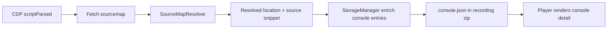

# Player Console Sourcemap Source Preview

## Bối Cảnh

Console log item trong player hiện đã có khả năng hiển thị vị trí source-map ở dạng nhãn file/dòng/cột. Luồng hiện tại là:

- `CdpManager` bắt `Debugger.scriptParsed`, tải sourcemap, parse JSON và đăng ký vào `SourceMapResolver`.
- Khi dừng recording, service worker gọi `flushSourceMaps()`, rồi `StorageManager.resolveSourceMaps(...)`, sau đó mới serialize `console.json` và `network.json`.
- `StorageManager` chỉ ghi `originalSource`, `originalLine`, `originalColumn`, `originalName` vào entry/frame.
- `player/player.js` dùng các field này để render source location và stack trace.

Vì vậy sourcemap đang được dùng để resolve vị trí gốc, nhưng chưa được dùng để mang nội dung source code gốc vào artifact replay.

Docs hiện hơi lệch HEAD: `docs/_sync.md` ghi synced commit `8094ba2d99f87e32a730a4b3e0aee40644aaf939`, trong khi HEAD lúc lập kế hoạch là `54411a0f93861605daf4bdd72f1a6cad3ad64f7d`. Phần kế hoạch này dựa trên docs hiện có kết hợp kiểm tra code trực tiếp.

## Nguyên Nhân Và Lý Do Thiết Kế

Triệu chứng: khi mở console log item, người dùng chỉ thấy message, source location và stack trace; chưa thấy nội dung file source gốc hoặc đoạn code quanh dòng gây log/error.

Nguyên nhân trực tiếp: `ResolvedLocation` hiện chỉ chứa `source`, `line`, `column`, `name`; `SourceMapResolver` parse `sources`/`names`/`mappings` nhưng bỏ qua `sourcesContent`; `ConsoleEntry` và `StackFrame` cũng chưa có field nào để chứa preview source code.

Nguyên nhân gốc rễ: enrichment được thiết kế tối thiểu cho nhãn vị trí, không phải source viewer. Sau khi stop recording, sourcemap cache bị release, còn player chỉ đọc artifact JSON. Nếu source content không được nhúng vào artifact tại capture-time, player gần như không thể tái dựng source code một cách đáng tin cậy, nhất là với replay được mở sau này, trang gốc đã deploy lại, file sourcemap private, hoặc Drive replay đang chạy cross-origin.

Hướng đúng nên là capture-time enrichment: lấy `sourcesContent` từ sourcemap khi còn có quyền/trạng thái tab gốc, tạo snippet có giới hạn kích thước, serialize vào `console.json`, rồi player chỉ render dữ liệu đã đóng gói. Không nên để player tự fetch sourcemap từ URL gốc khi replay vì dễ lỗi CORS/auth/version drift và làm replay không còn self-contained.

## Góc Nhìn Tổng Quan Và Phạm Vi Tập Trung

Phạm vi tập trung là console log item trong replay player:

- source-map resolver và model capture payload
- storage enrichment trước khi serialize artifact
- player console list/detail rendering
- standalone player sync vì `player-standalone/public/player.js` mirror từ `player/player.js`

Không thay đổi luồng upload zip, mã hóa password, Drive URL contract, hoặc logic network preview trừ khi muốn tái dùng cùng helper cho network initiator sau này.

## Mục Tiêu

- Console item hiển thị được source-mapped file, dòng, cột và đoạn source code quanh vị trí gốc khi sourcemap có `sourcesContent`.
- Giữ replay self-contained: player không cần tải sourcemap/source từ app gốc.
- Không làm artifact phình vô hạn: mỗi entry/frame chỉ mang snippet nhỏ, có giới hạn số dòng và số byte.
- Giữ tương thích ngược với recordings cũ không có source snippet.

## Ngoài Phạm Vi

- Fetch source file gốc từ player ở thời điểm replay.
- Hiển thị full source tree hoặc editor đầy đủ.
- Hỗ trợ sourcemap không có `sourcesContent` bằng cách scrape source file từ network response. Có thể xem là bước sau vì cần thêm privacy/size controls.
- Thay đổi schema zip package hoặc manifest bắt buộc.

## Logic Nghiệp Vụ

Khi một generated location resolve được về original source:

1. Resolver trả về location như hiện tại, cộng thêm snippet nếu sourcemap có source content tương ứng.
2. Snippet gồm `source`, `line`, `column`, `startLine`, `lines[]`, và optional `highlightLine`.
3. Storage gắn snippet vào `ConsoleEntry` hoặc từng `StackFrame`.
4. Player render:
   - list row vẫn ưu tiên source-mapped location ngắn gọn.
   - detail có thêm section `Source Preview` sau `Source`.
   - stack trace vẫn hiển thị như cũ; frame nào có snippet thì có thể render inline khi entry được mở, ưu tiên frame đầu tiên liên quan.

Nếu không có snippet, UI giữ nguyên.

## Cấu Trúc Giải Pháp



## Hướng Tiếp Cận Đề Xuất

Chọn hướng nhúng snippet vào console artifact thay vì nhúng toàn bộ sourcemap/source file.

Lý do:

- Replay ổn định theo thời điểm ghi hình.
- Payload tăng theo số log/frame thực sự cần xem, không tăng theo toàn bộ app bundle.
- Ít rủi ro privacy hơn so với ghi toàn bộ source code của ứng dụng.
- Tương thích tốt với package zip hiện tại vì `console.json` đã là nơi chứa dữ liệu console enriched.

## Chi Tiết Triển Khai

### 1. Mở rộng data model

Trong `src/types/recording.ts`, thêm kiểu mới:

```ts
export interface SourceCodeSnippet {
  source: string;
  startLine: number;
  line: number;
  column?: number;
  lines: string[];
}
```

Sau đó thêm `sourceSnippet?: SourceCodeSnippet` vào `StackFrame` và `ConsoleEntry`. Có thể thêm vào `NetworkInitiator`/`CdpCallFrame` sau nếu muốn dùng cho network initiator, nhưng console là mục tiêu chính.

### 2. Giữ `sourcesContent` trong resolver

Trong `src/background/sourcemap-resolver.ts`:

- Mở rộng `SourceMapRaw` để có `sourcesContent?: Array<string | null>`.
- Mở rộng `ParsedMap` với `sourcesContent`.
- `parseMap()` cần preserve `sourcesContent` cho sourcemap thường và offset đúng khi map dạng `sections`.
- `SourceMapResolver.resolve()` trả thêm snippet bằng helper mới, ví dụ `buildSnippet(sourceIndex, originalLine, originalColumn)`.

Giới hạn đề xuất:

- `SOURCE_SNIPPET_CONTEXT_LINES = 3`
- `SOURCE_SNIPPET_MAX_LINE_LENGTH = 500`
- `SOURCE_SNIPPET_MAX_TOTAL_CHARS = 6000`

Nếu source line quá dài thì truncate từng dòng; nếu snippet vượt giới hạn thì bỏ hoặc cắt có marker.

### 3. Enrich console entries ở storage

Trong `src/background/storage-manager.ts`:

- Khi `resolved` có snippet, set `entry.sourceSnippet`.
- Trong `#resolveFrames`, set `frame.sourceSnippet`.
- Khi promote first resolved stack frame lên entry, nếu entry chưa có snippet thì promote `frame.sourceSnippet` tương ứng.

Điểm quan trọng: giữ `originalSource/originalLine/originalColumn` như hiện tại để không phá UI cũ.

### 4. Render trong player

Trong `player/player.js`:

- Thêm helper chọn snippet tốt nhất, ví dụ `getConsoleSourceSnippet(entry)`:
  - ưu tiên `entry.sourceSnippet`
  - fallback frame đầu tiên trong `entry.stackTrace` có `sourceSnippet`
- Thêm helper `renderSourceSnippet(snippet)`:
  - render line numbers
  - highlight line `snippet.line`
  - escape HTML toàn bộ source
  - hiển thị `source:line:column` phía trên hoặc dùng section `Source Preview`
- Trong `renderConsoleDetail(entry)`, sau section `Source`, render snippet nếu có.

CSS cần thêm vào `player/player.css` cho code block nhỏ, scroll ngang, line number cố định, highlight dòng hiện tại.

### 5. Đồng bộ standalone player

Sau khi sửa `player/player.js` và `player/player.css`, chạy:

```sh
task player:sync
```

Vì sync script chỉ copy `player.css` và `player.js`, không cần sửa `player-standalone/index.html` nếu chỉ thay render runtime/CSS.

## Công Việc Cần Làm

1. Cập nhật `SourceMapRaw`, `ResolvedLocation`, `StackFrame`, `ConsoleEntry` với snippet model.
2. Sửa `SourceMapResolver` để parse và giữ `sourcesContent`.
3. Tạo snippet có giới hạn trong resolver khi resolve location.
4. Sửa `StorageManager.resolveSourceMaps()` và frame enrichment để gắn snippet vào console entries/frames.
5. Sửa `player/player.js` để render `Source Preview` trong console detail.
6. Sửa `player/player.css` để source preview đọc tốt ở desktop/mobile.
7. Chạy `task player:sync` để cập nhật standalone mirror.
8. Bổ sung hoặc cập nhật test/unit nếu repo đã có harness cho sourcemap resolver; nếu chưa có, nên thêm test nhỏ cho resolver vì đây là logic dễ lệch line/column.

## Rủi Ro Và Ràng Buộc

- Nhiều production sourcemap không có `sourcesContent`; khi đó tính năng sẽ chỉ hiển thị location như hiện tại.
- Source code có thể chứa thông tin nhạy cảm. Vì GN Tracing vốn đang ghi console/network replay để chia sẻ, vẫn nên giới hạn snippet và có thể cân nhắc thêm setting riêng ở popup trong bước sau nếu người dùng cần kiểm soát mạnh hơn.
- Source map coordinates là zero-based trong CDP và source-map v3; UI đang cộng `+1` khi hiển thị. Snippet phải giữ internal line zero-based hoặc ghi rõ contract để tránh lệch một dòng.
- Artifact size có thể tăng nếu nhiều log hit nhiều source khác nhau; cần giới hạn snippet theo entry/frame và tránh nhúng toàn bộ file.
- `sourceRoot + source` hiện đang nối chuỗi đơn giản; nếu gặp URL/path phức tạp có thể cần normalize nhẹ nhưng không nên mở rộng scope quá sớm.

## Kiểm Chứng

- Unit test `SourceMapResolver` với sourcemap có `sourcesContent`, verify `source`, `line`, `column`, `name`, và snippet context.
- Manual hoặc fixture recording có console log từ bundled/minified app kèm sourcemap:
  - console row hiển thị original source location.
  - console detail hiển thị source preview đúng dòng.
  - recording cũ không có snippet vẫn mở bình thường.
- Chạy:

```sh
npm run typecheck
task player:sync
task player:typecheck
```

Nếu root không có `npm run typecheck` phù hợp, dùng script validation hiện có trong `package.json` và `player-standalone/package.json`.
