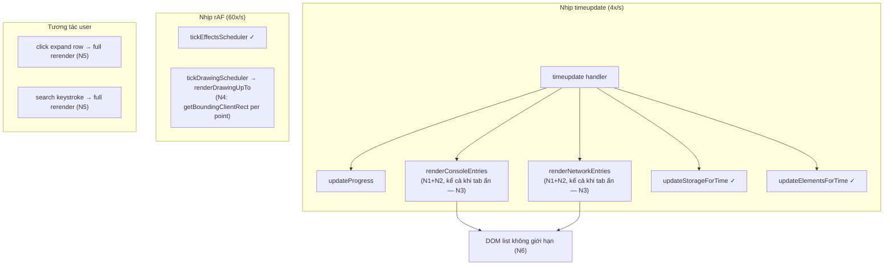

# Tối Ưu Rerender Trang Player

## Bối Cảnh

Trang player (`player/player.js`, dùng chung cho extension và standalone qua `scripts/sync-player.js`) hiển thị video đồng bộ với các panel log (Console, Network, Storage, Elements) cùng overlay hiệu ứng click/scroll và drawing. Khi video đang chạy, user thao tác với UI (click expand row, gõ search, scroll list, kéo splitter) bị lag rõ rệt, đặc biệt với recording có nhiều log entries.

Player viết bằng vanilla JS, không framework, nên "rerender" ở đây là toàn bộ chu trình: tính lại dữ liệu dẫn xuất từ state → đồng bộ DOM → đọc/ghi layout. Chu trình này chạy lặp lại trên hai nhịp:

- **Nhịp `timeupdate`** (throttle 250ms, tức 4 lần/giây khi video chạy): gọi `updateProgress()`, `renderConsoleEntries()`, `renderNetworkEntries()`, `updateStorageForTime()`, `updateElementsForTime()`.
- **Nhịp `requestAnimationFrame`** (60 lần/giây khi video chạy): `tickEffectsScheduler()` và `tickDrawingScheduler()` → `renderDrawingUpTo()`.

## Nguyên Nhân Và Lý Do Thiết Kế

Lag khi tương tác không phải do một bug đơn lẻ mà do mô hình render hiện tại: **mỗi tick tính lại toàn bộ dữ liệu dẫn xuất và đồng bộ toàn bộ DOM từ đầu, không có memo hóa**. Chi phí mỗi tick tỷ lệ thuận với kích thước recording, nên recording càng dài thì main thread càng bị chiếm lâu mỗi 250ms (và mỗi frame nếu có drawing). Input event (click, keystroke, scroll) phải xếp hàng sau các task này → cảm giác lag.

Các nguyên nhân gốc rễ cụ thể, xếp theo mức nghiêm trọng:

### N1. Tính lại search text cho toàn bộ entries mỗi tick (nặng nhất về CPU/GC)

`getVisibleConsoleEntries()` (player.js:1653) và `getVisibleNetworkEntries()` (player.js:1669) chạy `.map()` trên **toàn bộ** logs **trước khi** filter, và trong map gọi:

- `getConsoleSearchText(entry)` (player.js:1581): gọi `renderArgs()` (build HTML string!), `stringifyForSearch()` trên args, stack frames, source snippets.
- `getNetworkSearchText(entry)` (player.js:1606): nối cả **response body** (`content.text`, có thể tới hàng chục KB mỗi entry), `JSON.stringify` headers, redirect chain, initiator stack.

Nghĩa là mỗi 250ms, player build lại hàng MB string chỉ để... vứt đi (khi không có search query, kết quả không dùng đến filter nào). Đây là nguồn GC churn và long task chính.

### N2. Đồng bộ DOM O(n²) trong `syncLogRows`

`syncLogRows()` (player.js:4106) với mỗi item visible chạy `container.querySelector(\`[data-index="..."]\`)` — mỗi lần quét cả container. n rows → n lần quét full container mỗi tick, cho từng panel. Thêm nữa:

- `syncConsoleEntryState`/`syncNetworkEntryState` chạy trên **mọi** row mỗi tick (2–3 `querySelector` + nhiều `classList.toggle` mỗi row), dù mỗi tick thực tế chỉ có: rows mới xuất hiện + row `active-entry` cũ/mới thay đổi.
- `mountLunaPlaceholders()` (player.js:2069) chạy `querySelectorAll` trên cả container mỗi tick, dù chỉ rows mới cần mount.

### N3. Panel ẩn vẫn được đồng bộ mỗi tick

Handler `timeupdate` (player.js:5032) gọi cả `renderConsoleEntries()` lẫn `renderNetworkEntries()` bất kể tab nào đang active. Tab ẩn (class `hidden`, `showLogsTab` player.js:708) vẫn trả đủ chi phí N1 + N2 mỗi tick.

### N4. Drawing overlay đọc layout per-point per-frame

`renderDrawingUpTo()` (player.js:4938) chạy mỗi rAF frame khi video chạy và có strokes:

- `mapDrawingPoint()` (player.js:4914) gọi `getVideoContentRect()` (player.js:4727) cho **từng point** — mỗi lần 2 lần `getBoundingClientRect()`. Một stroke 500 điểm = 1000 lần đọc layout **mỗi frame** ở 60fps, xen kẽ với ghi canvas → layout thrash nghiêm trọng.
- Mỗi frame clear canvas và vẽ lại **toàn bộ** strokes từ đầu, kể cả khi không có gì thay đổi giữa hai frame.

### N5. Đường tương tác đi qua full rerender

- Click expand một row → `renderConsoleEntries()`/`renderNetworkEntries()` full (player.js:5338–5375), tức trả toàn bộ chi phí N1+N2 chỉ để toggle một row.
- Search input không debounce (player.js:5326): mỗi keystroke → full recompute N1.
- Row expanded của network render `renderNetworkDetail()` + `highlightJson` trên body tới 10KB đồng bộ — task dài ngay tại thời điểm click.

### N6. DOM list không giới hạn, không virtualization

Console/Network list giữ DOM node cho **mọi** entry đã qua (`relativeMs <= currentTimeMs`). Recording dài → hàng nghìn rows → mọi style recalc / layout (do toggle class active, scrollHeight read trong `isScrolledNearBottom`, hover CSS) đều đắt dần theo thời gian phát.

### Các điểm đã làm đúng (giữ nguyên)

- `updateStorageForTime`/`updateElementsForTime` đã guard bằng active-key/index, chỉ re-render khi snapshot đổi.
- Effects scheduler dùng cursor (`effectsCursorIdx`), không quét lại mảng.
- `syncLogRows` giữ row cũ sống (không rebuild innerHTML) — hướng đúng, chỉ sai ở cách tra cứu và phạm vi patch.
- Throttle 250ms trên `timeupdate`.

## Góc Nhìn Tổng Quan Và Phạm Vi Tập Trung

Phạm vi: chỉ `player/player.js` (nguồn chung) + có thể vài rule CSS trong `player/player.css`, sau đó sync sang `player-standalone/public/` bằng `node scripts/sync-player.js` (chạy trong `player-standalone`). Không đổi cấu trúc dữ liệu recording, không đổi giao diện.

## Mục Tiêu

1. Loại bỏ chi phí tính toán lặp lại theo tick: dữ liệu dẫn xuất per-entry (search text, level, filter type) chỉ tính **một lần** per entry.
2. Đồng bộ DOM incremental thật sự: mỗi tick chỉ chạm vào rows thay đổi (rows mới + active row cũ/mới), tra cứu row O(1).
3. Panel ẩn không tốn chi phí render; đồng bộ lại khi tab được mở.
4. Drawing overlay: tối đa 1 lần đọc layout mỗi frame; không redraw khi không có gì thay đổi.
5. Tương tác (expand, search, filter) chỉ trả chi phí tương xứng với thay đổi.
6. Kết quả cảm nhận: không còn long task > 50ms lặp lại trong lúc phát video với recording lớn; click/gõ phím phản hồi tức thì.

## Ngoài Phạm Vi

- Virtualization/windowing đầy đủ cho log list (chỉ áp dụng CSS containment; windowing thật để lại làm bước sau nếu vẫn cần).
- Web Worker cho parse/search.
- Thay đổi UX (giữ nguyên hành vi auto-stick-to-bottom, highlight active entry trong 1.5s, expand/collapse).
- Refactor kiến trúc sang framework.
- Tối ưu pipeline tải recording từ Drive.

## Logic Nghiệp Vụ Phải Bảo Toàn

- Danh sách log hiển thị = entries có `relativeMs <= currentTimeMs`, giao với filter level/type và search query.
- Active entry = entry gần `currentTimeMs` nhất trong khoảng 1.5s.
- Auto-scroll bám đáy chỉ khi user đang ở gần đáy (ngưỡng 8px).
- Khi seek lùi, rows tương lai phải biến mất; khi seek tiến, rows xuất hiện đủ.
- Expanded row giữ nguyên trạng thái qua các tick; network detail giữ tab/vendor-filter/JSON-preview state.
- Luna viewer mount cho mọi placeholder mới xuất hiện.
- Drawing replay đúng theo thời gian: stroke hiện dần theo `points[i].t`, tôn trọng clear events; vẽ đúng vị trí khi resize/letterbox.

## Cấu Trúc Giải Pháp

### Bước 1 — Memo hóa dữ liệu dẫn xuất per-entry (giải N1)

- Khi load xong recording (hoặc lazy lần đầu truy cập), build một lần mảng "prepared entries": `{ entry, index, level, filterLevel, searchText }` cho console và `{ entry, index, filterType, searchText }` cho network, websocket. Cache module-level, invalidate khi load recording mới.
- `searchText` tính **lazy** (getter cache hoặc chỉ build khi có query lần đầu) — recording lớn không trả chi phí build search text nếu user không search.
- `getVisibleConsoleEntries`/`getVisibleNetworkEntries` chỉ còn filter trên mảng đã memo. Vì logs sort theo `relativeMs`, thay `filter(relativeMs <= currentTimeMs)` bằng binary search tìm ranh giới → slice.

### Bước 2 — Đồng bộ DOM incremental (giải N2, N5 một phần)

- `syncLogRows` nhận thêm row map (`Map<string, Element>` per container, duy trì module-level): tra cứu O(1) thay vì `querySelector` per item; cập nhật map khi thêm/xóa row.
- Tách "diff theo tick" khỏi "rebuild": trong lúc playback tiến, visible set chỉ **append** (khi không đổi filter/search) → phát hiện fast-path: chỉ tạo + append rows mới, không đụng rows cũ.
- Active highlight: giữ `closestConsoleIndex`/`closestNetworkIndex` cũ, mỗi tick chỉ toggle class trên đúng 2 rows (cũ và mới) thay vì sync mọi row.
- `mountLunaPlaceholders` chỉ chạy trên rows mới tạo (gọi ngay khi tạo fragment), không quét cả container.
- Batch layout: đọc `isScrolledNearBottom` **trước** mọi ghi DOM của tick (đã đúng thứ tự, giữ nguyên và nêu rõ invariant bằng comment), tránh xen kẽ đọc/ghi.
- Full re-sync (đường chậm, dùng logic hiện tại + row map) chỉ khi: seek, đổi filter, đổi search, toggle expand.

### Bước 3 — Gate theo tab active + dirty flag (giải N3)

- `timeupdate` chỉ render panel đang visible; panel ẩn đánh dấu `dirty`.
- `showLogsTab` khi mở tab có `dirty` → render đầy đủ ngay lúc đó.
- Storage/Elements đã có guard riêng theo snapshot key, giữ nguyên (chi phí check là O(số snapshot), không đáng kể).

### Bước 4 — Tối ưu drawing overlay (giải N4)

- Cache geometry mỗi frame: trong `renderDrawingUpTo`, gọi `getVideoContentRect()` và `getEffectViewportSize()` **một lần**, truyền xuống `mapDrawingPoint` (đổi chữ ký hàm nhận `content` làm tham số).
- Cache geometry giữa các frame: chỉ tính lại khi ResizeObserver/`updateVideoFit`/fullscreen/layout-splitter báo thay đổi (dirty flag), vì trong lúc phát bình thường layout không đổi.
- Dirty check theo thời gian: lưu `lastRenderedDrawingState` (số stroke visible + last point index của stroke đang vẽ + active clear). Nếu không đổi giữa hai frame → skip clear/redraw hoàn toàn. Phần lớn frame sẽ skip vì stroke thưa theo thời gian.
- (Tùy chọn, nếu vẫn cần) Precompute mapped points khi geometry không đổi để tránh map lại từng điểm mỗi lần redraw.

### Bước 5 — Đường tương tác nhẹ (giải N5)

- Toggle expand: patch trực tiếp row liên quan (collapse row cũ nếu có + expand row mới) qua `syncConsoleEntryState`/`syncNetworkEntryState` hiện có, không gọi full render. Luna mount chỉ trong detail mới chèn.
- Search input: debounce 200ms; kết hợp Bước 1 nên mỗi lần chạy cũng đã rẻ hơn nhiều.
- Filter toggle: đi đường full re-sync (chấp nhận, tần suất thấp).

### Bước 6 — CSS containment cho log list (giảm nhẹ N6)

- Thêm `contain: content` cho row (`.console-entry`, `.network-row`, `.ws-row`) và `content-visibility: auto` + `contain-intrinsic-size` ước lượng chiều cao row cho rows ngoài viewport → browser skip layout/paint cho phần không nhìn thấy.
- Cần kiểm chứng hành vi với `scrollHeight` (auto-stick-to-bottom vẫn phải đúng — `content-visibility: auto` vẫn giữ size ước lượng trong scrollHeight nên kỳ vọng ổn, phải test thực tế).
- Windowing thật (chỉ render rows trong viewport) để lại làm follow-up riêng nếu sau các bước trên recording cực lớn vẫn lag.

## Hướng Tiếp Cận Đề Xuất — Thứ Tự Triển Khai

Ưu tiên theo tỷ lệ (tác động / rủi ro):

1. **Bước 1** (memo dẫn xuất + binary search) — tác động lớn nhất, rủi ro thấp, thuần data.
2. **Bước 3** (gate tab ẩn) — vài dòng, giảm ngay ~50% chi phí tick.
3. **Bước 4** (drawing geometry cache + dirty skip) — sửa điểm nóng 60fps.
4. **Bước 2** (row map + fast-path append + active-pair patch) — thay đổi DOM sync, cần test kỹ seek/filter.
5. **Bước 5** (expand patch trực tiếp + debounce search).
6. **Bước 6** (CSS containment) — làm cuối, đo trước/sau.

Mỗi bước là một commit riêng, chạy được độc lập, dễ bisect nếu regress.

## Chi Tiết Triển Khai

| Bước | Vùng sửa chính (player.js) | Ghi chú |
| --- | --- | --- |
| 1 | `getVisibleConsoleEntries`, `getVisibleNetworkEntries`, `getVisibleWebSocketEntries` (1653–1695); thêm module-level cache + hàm invalidate gọi tại nơi gán `consoleLogs`/`networkLogs`/`webSocketLogs` | Lazy searchText qua getter cache trên prepared entry |
| 2 | `syncLogRows` (4106), `renderConsoleEntries` (4139), `renderNetworkEntries` (4280), `syncConsoleEntryState` (3979), `syncNetworkEntryState` (4032) | Row map per container; fast-path append; patch cặp active rows |
| 3 | `timeupdate` handler (5032), `showLogsTab` (708) | Dirty flags `consolePanelDirty`/`networkPanelDirty` |
| 4 | `renderDrawingUpTo` (4938), `mapDrawingPoint` (4914), `tickDrawingScheduler` (4995), hook invalidate trong `updateVideoFit`/ResizeObserver | Geometry cache + render-state dirty check |
| 5 | Click handlers (5338–5375), search handlers (5326–5334) | Toggle không gọi full render; debounce 200ms |
| 6 | `player.css` | `contain` / `content-visibility` cho rows |

## Rủi Ro Và Ràng Buộc

- **Đồng bộ hai bản copy**: mọi thay đổi làm trên `player/player.js` rồi sync sang `player-standalone/public/player.js` qua `node scripts/sync-player.js`; không sửa tay bản standalone.
- **Fast-path append sai điều kiện** → row thiếu/thừa khi seek lùi hoặc đổi filter giữa chừng. Guard: fast-path chỉ khi (không seek, filter/search không đổi, visible set là superset tăng dần); mọi trường hợp khác đi đường full re-sync.
- **Cache dẫn xuất stale** khi load recording mới trong cùng session → phải invalidate tại đúng chỗ gán dữ liệu.
- **`content-visibility: auto`** có thể ảnh hưởng `scrollHeight`/auto-stick và tương tác với expand row → cần test thực tế trên cả hai layout (horizontal/vertical), rollback riêng bước này nếu lệch.
- **Drawing dirty-skip** phải không skip khi resize/fullscreen/seek — các sự kiện này set dirty tường minh.
- **Hành vi phải giữ nguyên pixel-perfect** với logic active highlight 1.5s và trạng thái expand/detail tab — test bằng recording thật có console + network + drawing.

## Kiểm Chứng

1. **Unit tests** (vitest, theo pattern test hiện có cho drawing helpers): tách các hàm pure mới (binary search ranh giới visible, quyết định fast-path/full-sync, drawing render-state signature) và test:
   - Ranh giới visible đúng với `currentTimeMs` biên (trước entry đầu, sau entry cuối, trùng mốc).
   - Seek lùi → visible set thu hẹp đúng.
   - Drawing dirty check: cùng state → skip; thêm point/stroke/clear/resize → redraw.
2. **Kiểm thử hiệu năng thủ công** (trước/sau từng bước, cùng một recording lớn):
   - Chrome DevTools Performance: ghi 10s phát video → so tổng thời gian scripting, số long task > 50ms.
   - Tương tác khi đang phát: click expand row network có body lớn, gõ search, scroll list — xác nhận không giật.
3. **Kiểm thử hành vi**: expand/collapse giữ state qua tick; auto-stick-to-bottom; active highlight di chuyển đúng; seek tiến/lùi; đổi filter + search khi đang phát; drawing replay đúng khi seek và resize; cả hai chế độ extension lẫn standalone (`task` dev flow với sync watch).
4. **Lint/typecheck** theo repo (biome) trên vùng sửa.
