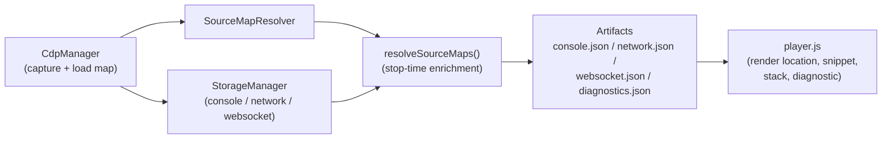

# Hoàn Thiện Source Map Trong Recording Và Hiển Thị Trong Player

## Bối Cảnh

Tính năng record đã hoạt động end-to-end: CDP thu console/network/WebSocket, thu
source map qua `Debugger.scriptParsed` (inline `data:` hoặc external `.map` qua
`Network.loadNetworkResource`/`IO.read`), resolve stack frame về vị trí source
gốc tại thời điểm stop, ghi diagnostics vào `diagnostics.json`, và player render
vị trí source-mapped, source snippet, cùng thông điệp chẩn đoán khi không
resolve được.

Audit toàn pipeline (capture → flush → resolve → artifact → player) cho thấy
kiến trúc đúng và nhất quán:

- Tọa độ zero-based thống nhất từ CDP qua resolver đến player (player cộng `+1`
  khi hiển thị).
- `flushSourceMaps()` chạy trước `cdp.detach()` nên external map vẫn load được
  qua CDP; resolver cache được release ngay sau enrichment.
- Console entry, console stack frame, Error argument stack
  (`SerializedRemoteObject.stackTrace`), và network initiator (location +
  stack, gồm parent async stack) đều được enrich.
- Frame không resolve được mang `sourceMapStatus` ở mức frame, và
  `diagnostics.json` giữ fallback ở mức package.

Tuy nhiên còn ba khoảng trống làm bằng chứng WebSocket và async network stack
hiển thị kém hơn dữ liệu đã thu được.

## Nguyên Nhân Và Lý Do Thiết Kế

Ba khoảng trống có chung một nguyên nhân gốc rễ: enrichment và rendering được
xây dựng theo từng loại evidence (console trước, network sau), còn WebSocket
initiator và parent async stack được thêm vào model dữ liệu
(`WebSocketEntry.initiator`, `CdpStackTrace.parent`) nhưng chưa được nối vào
hai điểm cuối của pipeline:

1. `StorageManager.resolveSourceMaps()` chỉ duyệt `#consoleLogs` và
   `#networkEntries`, bỏ qua `#webSocketEntries` — initiator của WebSocket
   (đã capture khi bật `captureWebSocketInitiator`) không bao giờ được
   source-map.
2. `renderWsDetail()` trong player chỉ render URL và frames, không render
   initiator — dữ liệu initiator có trong `websocket.json` nhưng người xem
   không thấy.
3. Detail network trong player render `initiator.stack.callFrames` rồi chỉ in
   nhãn `--- async ---` cho `stack.parent` mà không render frame của parent,
   dù storage đã resolve đệ quy toàn bộ parent chain.

Đây là triệu chứng "dữ liệu có nhưng không hiển thị", không phải lỗi của
resolver hay capture path.

## Góc Nhìn Tổng Quan Và Phạm Vi Tập Trung

Phạm vi tập trung: điểm nối `resolveSourceMaps()` → `websocket.json` và lớp
render trong `player/player.js`. Capture path, resolver, diagnostics, và
artifact schema giữ nguyên.

## Mục Tiêu

1. WebSocket initiator được source-map enrich tại stop time giống network
   initiator (location, stack frame, `sourceMapStatus`).
2. Player hiển thị initiator của WebSocket: type, vị trí source-mapped, stack
   frame, và thông điệp chẩn đoán source-map khi không resolve được.
3. Player hiển thị frame của parent async stack trong network initiator detail
   (sau nhãn async boundary), tái dùng cùng cách render frame hiện có.

## Ngoài Phạm Vi

- Thay đổi resolver, format source map hỗ trợ, hoặc cách load map qua CDP.
- Thay đổi schema artifact (`WebSocketEntry.initiator` đã tồn tại; chỉ thêm
  field enrichment cùng dạng với network initiator — player vốn đã tolerant
  với field optional).
- Redaction: initiator WebSocket đã đi qua `#filterInitiator` →
  `#redactInitiator`/`#redactStackTrace` lúc capture, không cần thêm.
- Diff đang dở trong worktree (`.env.example`,
  `src/shared/privacy-redaction.ts`) — không liên quan, không chạm.

## Logic Nghiệp Vụ

- Enrichment WebSocket initiator dùng đúng quy tắc của network initiator:
  resolve location-level nếu có `url + lineNumber`, resolve đệ quy
  `initiator.stack` (gồm parent), rồi promote frame resolve được đầu tiên lên
  initiator để renderer dùng trực tiếp.
- Frame không resolve được giữ nguyên nhãn generated và nhận
  `sourceMapStatus` khi resolver giải thích được lý do — player đã có
  `formatSourceMapReason` để hiển thị.
- Capture setting `captureWebSocketInitiator` tiếp tục quyết định initiator có
  tồn tại hay không; enrichment chỉ chạy khi initiator tồn tại.

## Cấu Trúc Giải Pháp

### 1. `src/background/storage-manager.ts`

Trong `resolveSourceMaps()`, thêm vòng duyệt `#webSocketEntries` dùng lại đúng
khối xử lý initiator của network entry (location → `#resolveCdpStack` →
`#promoteStackFrameLocation`). Nên tách khối xử lý initiator chung thành một
private method (`#resolveInitiatorSourceMaps(initiator, resolver,
diagnostics)`) để network và WebSocket không lặp code.

### 2. `player/player.js` — WebSocket detail

`renderWsDetail(ws)` thêm section "Initiator" khi `ws.initiator` tồn tại,
render bằng các helper sẵn có:

- `getNetworkInitiatorLocation(ws.initiator)` cho dòng vị trí.
- `getNetworkSourceMapDiagnostic(ws.initiator)` cho thông điệp chẩn đoán.
- Cùng cấu trúc stack-frame markup với network initiator (function name ưu
  tiên `originalName`, location qua `formatSourceLocation`).

Nên tách phần render initiator của network detail thành helper
`renderInitiatorSection(initiator, options)` để hai nơi dùng chung, tránh hai
bản copy markup.

### 3. `player/player.js` — parent async stack

Trong phần render initiator stack, sau nhãn async boundary của `stack.parent`,
render tiếp `parent.callFrames` (và đệ quy parent của parent) bằng cùng markup
frame. Giữ giới hạn hiển thị hợp lý (stack đã bị giới hạn 5 frame/parent-half
từ lúc capture nên không cần giới hạn thêm ở player).

## Hướng Tiếp Cận Đề Xuất

Làm theo thứ tự dữ liệu chảy: enrich trước (storage-manager), rồi render
(player). Mỗi bước tái dùng code hiện có thay vì viết mới — toàn bộ helper cần
thiết đã tồn tại ở cả hai phía.

## Công Việc Cần Làm

1. Tách `#resolveInitiatorSourceMaps()` trong `storage-manager.ts`, áp dụng cho
   network entries (giữ hành vi cũ) và WebSocket entries (hành vi mới).
2. Tách `renderInitiatorSection()` trong `player.js` từ markup network detail
   hiện có; thêm render parent async frames đệ quy.
3. Gọi `renderInitiatorSection()` trong `renderWsDetail()` khi có initiator.
4. Đồng bộ player standalone (`task player:sync` dùng chung `player/player.js`
   qua script sync, không cần sửa tay).
5. Cập nhật docs module (`docs/modules/replay-player.md`,
   `docs/modules/recording-runtime.md`) phản ánh WebSocket initiator được
   enrich và render.

## Bảo Đảm Hiệu Năng, Security, Và An Toàn Recording

### Hiệu năng

- Enrichment WebSocket chạy **một lần tại stop-time**, sau khi media capture đã
  dừng — không nằm trên đường nóng của capture, không ảnh hưởng FPS hay độ trễ
  CDP trong lúc record.
- Chi phí bị chặn sẵn: stack initiator đã bị giới hạn 5 frame (parent giảm
  một nửa mỗi cấp) từ lúc capture; mỗi frame resolve bằng binary search trên
  map đã parse trong cache. Không có fetch hay load map mới — chỉ tái dùng
  resolver trước khi `releaseSourceMaps()`.
- Player: `renderWsDetail()` chỉ chạy khi user expand một row (on-demand
  render, đã xác minh tại call site). Thêm section initiator không ảnh hưởng
  tốc độ render danh sách.

### Security

- **Không thêm bề mặt dữ liệu mới**: WebSocket initiator đã đi qua
  `#filterInitiator` → `#redactInitiator`/`#redactStackTrace` với cùng rule
  `network.initiator.*` lúc capture; enrichment chỉ thêm
  `originalSource/Line/Column/Name`, `sourceSnippet`, `sourceMapStatus` —
  cùng tập field network initiator đang xuất.
- URL chưa redact dùng để resolve nằm trong property
  `__gnSourceMapResolveUrl` được gắn bằng `Object.defineProperty` với
  `enumerable: false`, nên `JSON.stringify` không serialize nó vào
  `websocket.json` (đã xác minh trong `cdp-manager.ts`). Giữ nguyên pattern
  này cho WS.
- Source snippet bị chặn kích thước bởi resolver (3 dòng context, 500
  ký tự/dòng, 6000 ký tự tổng) — giống network initiator hiện hành. Console
  giữ policy riêng theo level (`#applyConsoleSourceSnippetPolicy`), không đổi.
- Player escape mọi giá trị động bằng `escapeHtml` theo đúng pattern hiện có;
  không dùng innerHTML với dữ liệu thô.

### Đúng patterns và flows

- Giữ nguyên flow stop-time: `flushSourceMaps()` → `detach()` →
  `resolveSourceMaps()` → build diagnostics → `releaseSourceMaps()` →
  `finalizeCurrentSession()`. Chỉ thêm một vòng duyệt bên trong
  `resolveSourceMaps()`, không đổi thứ tự hay contract nào.
- Tái dùng helper hiện hữu (`#resolveLocation`, `#resolveCdpStack`,
  `#promoteStackFrameLocation`, `formatSourceLocation`,
  `getNetworkInitiatorLocation`, `formatSourceMapReason`) thay vì viết logic
  mới; phần tách helper chung chỉ là di chuyển code, không đổi hành vi.

### Không ảnh hưởng record của user

- **Không chạm capture path**: không sửa CDP event handler, recorder,
  offscreen, hay injected collector. Mọi thay đổi extension nằm trong giai
  đoạn enrichment sau khi video đã dừng.
- **Không đổi schema artifact**: field enrichment là optional trên
  `NetworkInitiator` (type đã dùng chung cho WS); package cũ thiếu field vẫn
  render như hiện tại vì helper player đều null-safe.
- **Không tạo điểm fail mới trong `stopRecording()`**: vòng duyệt WS dùng
  cùng null-guard style với vòng network (`if (!entry.initiator) continue`),
  không throw khi initiator/stack vắng mặt.
- Recording đang chạy, đang upload, hoặc đã upload không bị ảnh hưởng — thay
  đổi player là pure-render phía viewer.

## Rủi Ro Và Ràng Buộc

- `websocket.json` cũ (trước thay đổi) không có field enrichment — player phải
  render tolerant như hiện tại (helper đã null-safe, rủi ro thấp).
- Stack WebSocket initiator có thể chứa URL nhạy cảm — đã redact lúc capture
  (`network.initiator.*` rules áp dụng qua `#filterInitiator`), không thêm bề
  mặt rò rỉ mới.
- Player là file JS đơn lớn (~4500 dòng); thay đổi render cần giữ đúng pattern
  escape HTML hiện có (`escapeHtml` cho mọi giá trị động).

## Kiểm Chứng

1. `task check` (Biome + docs hygiene) và `task typecheck`.
2. `task build:dev` để xác nhận extension bundle thành công.
3. Kiểm tra thủ công có chủ đích: record một trang có WebSocket khởi tạo từ
   bundle minified có source map (ví dụ app dev server có WS), mở replay,
   xác nhận:
   - WS detail hiển thị initiator với vị trí source gốc.
   - Network initiator detail hiển thị frame sau async boundary.
   - Frame không có map hiển thị thông điệp chẩn đoán như trước.
