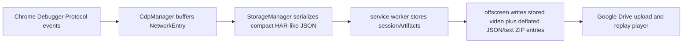

# Tối Ưu Dung Lượng Network Logs Khi Capture

## Bối Cảnh

Người dùng muốn giảm dung lượng network logs nhiều nhất có thể, nhưng không muốn áp dụng ngân sách, giới hạn tổng, truncate hoặc drop dữ liệu capture. Hướng đúng cho yêu cầu này là tối ưu lossless: giữ nguyên fidelity của dữ liệu người dùng chọn ghi lại, nhưng thay đổi cách serialize, đóng gói, nén và vận chuyển artifact để tốn ít dung lượng hơn.

Code hiện tại sau triển khai đang có các điểm chính:

- `CdpManager` thu thập network events từ Chrome Debugger Protocol cho tab chính và child targets.
- `StorageManager.finalizeCurrentSession()` serialize network, console và WebSocket artifacts thành compact JSON.
- `offscreen.createZipBlob()` tự viết ZIP, giữ video ở store method và nén JSON/text entries bằng DEFLATE khi kết quả nhỏ hơn raw bytes.
- ZIP password path mã hóa payload sau bước nén entry, còn player đọc được cả method `0` và method `8`.
- Capture privacy toggles trong code hiện tại đang mặc định bật request bodies, response bodies và WebSocket frames; người dùng có thể tắt trước khi record, nhưng plan này không dựa vào việc tắt dữ liệu để giảm dung lượng.

Luồng hiện tại:

## Triệu Chứng

- `network.json` phình lớn vì mỗi request lặp lại nhiều key và cấu trúc HAR-like dài, gồm request, response, headers, timing, initiator, redirect chain và body khi capture được bật.
- Pretty JSON từng làm artifact dễ đọc khi mở file thô, nhưng tăng byte size đáng kể trong service worker, chunk transfer và zip package; artifact hiện được ghi compact JSON.
- ZIP store method giữ nguyên kích thước JSON gần như tuyệt đối; JSON/text entries hiện được nén bằng DEFLATE khi có lợi.
- Khi ZIP password được bật, payload JSON/text hiện được compress-before-encrypt để vẫn tận dụng được nén.
- Service worker giữ artifact dưới dạng chuỗi JSON lớn trong `chrome.storage.session`, khiến local snapshot tốn dung lượng và dễ gặp quota hơn cần thiết.

## Nguyên Nhân Trực Tiếp

1. **Network artifact đang tối ưu cho khả năng đọc thô, chưa tối ưu cho lưu trữ**
   HAR-like JSON có nhiều key lặp lại ở từng entry. `JSON.stringify(..., null, 2)` thêm whitespace trên toàn bộ artifact. Đây là overhead thuần biểu diễn, có thể giảm mà không mất dữ liệu.

2. **Recording package cần nén JSON/text artifacts**
   ZIP writer dùng method `8` cho JSON/text entries khi compression giảm size và giữ method `0` cho video. Player đọc được cả hai method để package cũ và mới cùng replay được.

3. **Schema artifact chưa có compact representation**
   Header arrays dạng `{ name, value }`, nested HAR keys, và optional fields rỗng/null làm raw artifact lớn trước cả khi zip. DEFLATE sẽ xử lý nhiều phần lặp, nhưng compact schema vẫn giúp giảm memory/session storage/chunk transfer và tăng hiệu quả compression.

4. **Pipeline nhân bản artifact ở nhiều dạng lớn**
   Sau stop recording, network logs đi qua nhiều dạng: object trong memory, chuỗi JSON trong service worker/session storage, chunk string sang offscreen, Blob JSON, rồi bytes trong ZIP. Với network log lớn, vấn đề không chỉ là Drive size mà còn là transient storage và peak memory.

5. **Sourcemap fetch nội bộ có thể làm nhiễu network artifact**
   `CdpManager` có fallback `Runtime.evaluate(fetch(...))` để lấy sourcemap. Nếu fetch này xuất hiện trong CDP network events, nó là request do recorder tạo ra chứ không phải hành vi gốc của page. Loại request nội bộ này nên được cô lập khỏi artifact mà không xem là mất dữ liệu người dùng.

## Nguyên Nhân Gốc Rễ

Thiết kế hiện tại giữ fidelity tốt, nhưng thiếu một lớp artifact encoding/packaging chuyên cho lưu trữ. Hệ thống đang dùng format dễ inspect trực tiếp làm format upload chính, rồi đặt nó vào ZIP không nén. Vì vậy dung lượng tăng theo số request và kích thước payload thật, cộng thêm overhead biểu diễn, rồi gần như không được giảm khi upload.

Với yêu cầu mới, nguyên tắc thiết kế là:

- không đặt ngân sách tổng;
- không tự động truncate body, stack, headers hoặc WebSocket frames để tiết kiệm size;
- không drop request của page chỉ vì resource type hoặc URL;
- chỉ loại bỏ request do chính recorder tạo ra nếu xác nhận được đó là instrumentation noise;
- ưu tiên nén/compact/streaming để giảm dung lượng mà giữ nguyên dữ liệu capture.

## Mục Tiêu

- Giảm tối đa kích thước recording package, đặc biệt `network.json`, bằng tối ưu lossless.
- Giữ nguyên dữ liệu người dùng đã chọn capture theo privacy toggles hiện có.
- Giữ replay tương thích với package cũ store-only và schema HAR-like cũ.
- Giảm dung lượng tạm trong service worker/session storage/offscreen transfer, không chỉ dung lượng Drive upload.
- Không yêu cầu backend mới và không thay đổi quyền extension.

## Ngoài Phạm Vi

- Không thêm budget/cap tổng cho network artifact.
- Không truncate/drop/filter request của page để tiết kiệm dung lượng.
- Không đổi business rule của privacy toggles trong plan này, trừ khi user phê duyệt riêng.
- Không bỏ network tab hoặc response preview trong player.

## Hướng Tiếp Cận Đề Xuất

### 1. Đo Baseline Theo Thành Phần

- Đo raw object count: số network entries, số WebSocket frames, số headers, số redirect entries, số initiator frames.
- Đo byte size theo từng tầng: pretty JSON hiện tại, compact JSON, compact schema nếu có, ZIP store-only, ZIP DEFLATE.
- Đo riêng artifact types: `network.json`, `console.json`, `websocket.json`, manifest/index/metadata và video.
- Chạy trên ít nhất một capture thực tế nhiều network để tránh tối ưu nhầm vào dữ liệu không chiếm nhiều size.

### 2. Nén ZIP Lossless Cho JSON/Text Artifacts

- Thêm support ZIP method `8` DEFLATE cho JSON/text artifacts: `metadata.json`, `manifest.json`, `recording-index.json`, `console.json`, `network.json`, `websocket.json`.
- Giữ video WebM ở method `0` vì WebM đã nén, nén lại thường tốn CPU mà không giảm đáng kể.
- Với ZIP password, thực hiện đúng thứ tự ZIP truyền thống: serialize bytes -> DEFLATE -> tính metadata cần thiết -> encrypt compressed payload. Player/desktop unzip phải decrypt rồi inflate.
- Cập nhật player parser để đọc cả method `0` và method `8`, cả encrypted và unencrypted entries.
- Ưu tiên thư viện nhỏ, ổn định như `fflate` nếu native `CompressionStream`/`DecompressionStream` không đủ chắc cho extension + standalone + encrypted ZIP path.

### 3. Compact JSON Không Mất Dữ Liệu

- Đổi các artifact machine-readable từ pretty JSON sang compact JSON khi lưu/upload.
- Player vẫn format đẹp khi hiển thị response body/JSON preview, nên raw artifact không cần indent.
- Áp dụng cho network, console, websocket, manifest, index và metadata nếu không có lý do cần pretty trong file thô.
- Giữ khả năng debug bằng tool/script riêng nếu cần inspect package, thay vì trả giá dung lượng trong mọi recording.

### 4. Compact Schema Tương Thích Ngược

- Giới thiệu `network.json` schema version mới có representation gọn hơn nhưng lossless.
- Các hướng compact có thể kết hợp:
  - dùng top-level `entries` thay vì bọc HAR `log.entries` cho recording mới;
  - bỏ field rỗng/null thay vì ghi cấu trúc trống;
  - biểu diễn headers bằng tuple `[name, value]` thay vì object `{ name, value }`;
  - dictionary hóa string lặp nhiều như header names, resource types, mime types, origins hoặc URLs nếu đo baseline cho thấy có lợi;
  - giữ body nguyên vẹn, chỉ đổi cách đóng gói field.
- Player normalize cả schema cũ và schema mới về cùng model render hiện tại.

### 5. Cô Lập Request Nội Bộ Của Recorder

- Kiểm chứng xem sourcemap fallback `Runtime.evaluate(fetch(...))` có xuất hiện trong network artifact không.
- Nếu có, đánh dấu hoặc suppress request đó vì nó do GN Tracing tạo ra để enrich replay, không phải network behavior của page.
- Không dùng logic này để filter request thật của page; chỉ áp dụng cho request có nguồn gốc instrumentation rõ ràng.

### 6. Giảm Nhân Bản Artifact Trong Runtime

- Tránh lưu một chuỗi `networkRequests` khổng lồ duy nhất trong `chrome.storage.session`.
- Chuyển sang lưu artifact chunks, hoặc lưu compressed/base64 chunks với manifest nhỏ nếu cần khả năng recover sau service worker restart.
- Cân nhắc để offscreen giữ artifact Blob/bytes trực tiếp sau stop recording, còn service worker chỉ giữ descriptor và progress state.
- Khi upload, truyền artifact theo chunks byte-oriented thay vì ghép lại nhiều chuỗi lớn trong memory nếu trình duyệt API cho phép.

## Trạng Thái Triển Khai

- Đã đổi serialization của console, network và WebSocket artifacts sang compact JSON.
- Đã thêm ZIP DEFLATE cho JSON/text entries khi kết quả nén nhỏ hơn raw bytes, đồng thời giữ video WebM ở store method.
- Đã cập nhật ZIP password path để nén trước khi mã hóa entry payload.
- Đã cập nhật extension player và standalone player để đọc cả method `0` và method `8`, kể cả encrypted entries.
- Chưa triển khai compact schema riêng cho `network.json`; artifact mới vẫn giữ HAR-like structure để giảm rủi ro parser.
- Chưa refactor storage/transfer sang byte chunks hoặc compressed session storage; compact JSON và ZIP compression đã giảm phần lớn overhead dễ xử lý nhất.
- Chưa thêm instrumentation đo top contributors hoặc logic cô lập sourcemap fallback fetch; hai phần này cần capture thực tế để tránh kết luận nhầm.

## Rủi Ro Và Ràng Buộc

- DEFLATE tăng CPU lúc đóng gói và lúc mở replay; cần đo trên recording lớn để chọn mức compression hợp lý.
- ZIP password path phải xử lý đúng compressed size, uncompressed size, CRC, encryption header và player decrypt/inflate order.
- Thêm dependency zip/deflate có thể tăng bundle size; cần chọn thư viện nhỏ và dùng chung cho extension/standalone nếu có thể.
- Compact schema có thể gây regression player nếu normalizer không bao phủ đủ artifact cũ.
- Compression giảm Drive size mạnh, nhưng nếu vẫn lưu raw pretty JSON trong session storage thì local quota/memory vẫn còn vấn đề.

## Kiểm Chứng

- Capture cùng một trang trước/sau và so sánh: raw `network.json`, package ZIP size, upload bytes, peak artifact size trong runtime nếu đo được.
- Kiểm tra số network entries, headers, bodies, WebSocket frames trước/sau không giảm ngoài request instrumentation đã xác nhận.
- Kiểm tra package cũ store-only vẫn replay được.
- Kiểm tra package mới method `8` replay được trong extension player và standalone player.
- Kiểm tra package password-protected vẫn mở được bằng player và, nếu mục tiêu native ZIP password còn giữ, bằng công cụ unzip phổ biến.
- Kiểm tra response preview, copy cURL, search network và JSON preview vẫn hoạt động với schema mới.
