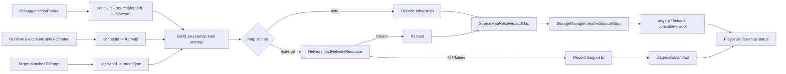

# Restore Request Call Stack Sourcemap Resolution

## Trạng Thái

- Trạng thái hiện tại là đã triển khai phần runtime/player cốt lõi: target-aware source-map acquisition, redacted `diagnostics.json`, resolver URL aliases, raw internal URL lookup trước artifact redaction, và player source-map status cho console/network detail.
- Runtime mặc định nên dùng hướng `protocol`: parse inline `data:` maps và tải external `.map` best-effort qua CDP `Network.loadNetworkResource`/`IO.read`, không dùng page-context `fetch(...)`.
- Player không tự resolve sourcemap. Player chỉ render `originalSource`, `originalLine`, `originalColumn`, `originalName`, và `sourceSnippet` nếu capture artifact đã được `StorageManager.resolveSourceMaps(...)` enrich trước đó.

## Bối Cảnh

Người dùng thấy player vẫn hiển thị generated bundle location thay vì original source location trong request call stack. Yêu cầu cần tìm nguyên nhân kỹ hơn cho cả extension và player.

Luồng source-map hiện tại:

1. `CdpManager` nhận `Network.requestWillBeSent` và lưu `initiator` hoặc `initiator.stack`.
2. `CdpManager` nhận `Debugger.scriptParsed`, đọc generated `scriptUrl` và `sourceMapURL`.
3. Runtime cố lấy sourcemap content:
   - inline `data:` map: decode trực tiếp;
   - external `.map`: tải qua CDP `Network.loadNetworkResource`, đọc stream bằng `IO.read`.
4. `SourceMapResolver.addMap(scriptUrl, rawMap)` lưu map theo generated script URL.
5. Khi stop recording, service worker gọi `cdp.flushSourceMaps()`, detach CDP, rồi `storage.resolveSourceMaps(cdp.sourceMapResolver)`.
6. `StorageManager` resolve console entry, stack frame, network initiator, và initiator call frames bằng URL/line/column generated.
7. Player đọc JSON artifact và render source-mapped location nếu các field `original*` tồn tại.

Vì vậy player không resolve được thường là do artifact không có `original*` fields, không phải do player thiếu parser sourcemap.

## Nguyên Nhân Và Lý Do Thiết Kế

### Triệu chứng

- Network item vẫn có generated initiator hoặc generated stack frame.
- Player không thấy `originalSource:originalLine:originalColumn`.
- Không có thông tin rõ ràng trong artifact/UI về việc sourcemap fail vì 404, thiếu `frameId`, target type sai, auth/CORS, parse JSON lỗi, hay URL key mismatch.

### Nguyên nhân trực tiếp đã xác nhận

Với staging URL đã từng xuất hiện trong log:

```text
https://staging.viclass.vn/main.f290ac542.js
```

File JS có dòng:

```text
//# sourceMappingURL=main.f290ac542.js.map
```

Nhưng:

```text
https://staging.viclass.vn/main.f290ac542.js.map
```

trả HTTP 404. Khi server không publish `.map`, extension không có mapping table `sources + mappings`, nên không thể tạo `originalSource/originalLine/originalColumn`. Player cũng không thể tự suy ra original location từ generated bundle.

### Nguyên nhân khi `.map` có tồn tại nhưng vẫn không resolve

Research bổ sung cho thấy parser/resolver nội bộ không phải nghi phạm đầu tiên. Khi nạp thử `dist/background/service-worker.js.map` vào `SourceMapResolver`, resolver tạo được `originalSource`, `originalLine`, `originalColumn`, và `sourceSnippet`. Nhưng nếu lookup URL khác key đã đăng ký dù chỉ khác query/hash/canonical form, resolver trả `null` ngay vì `SourceMapResolver` đang dùng `Map.get(url)` exact.

Vì vậy có hai nhóm nguyên nhân có khả năng cao hơn:

1. **Không nạp được map vào resolver dù file `.map` tồn tại.**
   `CdpManager` nhận `Debugger.scriptParsed`, lấy `sourceMapURL`, rồi gọi `Network.loadNetworkResource`. Với frame/page target, lệnh này cần `frameId` đúng; với worker target thì phải bỏ `frameId`. Code hiện tại chỉ truyền `frameId` nếu lấy được từ `executionContextAuxData` hoặc `Runtime.executionContextCreated`, nhưng không lưu `targetInfo.type` và không phân biệt target page/frame/worker. Khi thiếu hoặc truyền sai `frameId`, command có thể fail hoặc trả `resource.success = false`; sau đó `#fetchAndRegisterSourceMap` catch/return `null` im lặng nên nhìn từ player chỉ thấy generated location.
2. **Map đã nạp nhưng không match generated frame URL.**
   `SourceMapResolver.addMap(scriptUrl, raw)` lưu bằng generated `scriptUrl` từ `Debugger.scriptParsed`. `StorageManager.resolveSourceMaps(...)` lại resolve bằng `entry.url`, `entry.stackTrace[].url`, `entry.initiator.url`, hoặc `entry.initiator.stack.callFrames[].url`. Các URL này đã đi qua privacy redaction/normalization trước khi enrich, trong khi resolver key là raw `scriptParsed.url`. Nếu URL có query sensitive, encoded form khác, hash khác, redirect/CDN alias, hoặc một bên đã canonicalize còn bên kia chưa, exact lookup sẽ fail dù sourcemap content đã parse thành công.

Điểm quan trọng: hiện không có diagnostic nào phân biệt được ba trạng thái `map not loaded`, `map loaded but parse failed`, và `map loaded but URL/key mismatch`. Đây là lý do bug trông giống "player không resolve", trong khi failure thật nằm ở capture-time acquisition hoặc resolver lookup.

### Nguyên nhân gốc rễ trong hệ thống

Thiết kế hiện tại thiếu observability cho pipeline sourcemap:

- `CdpManager.#fetchAndRegisterSourceMap(...)` catch lỗi và bỏ qua, không ghi diagnostic.
- `Network.loadNetworkResource` là best-effort và có contract khác nhau theo target:
  - frame/page target cần `frameId`;
  - worker target phải omit `frameId`.
- Runtime chưa lưu target type theo CDP session nên không biết khi nào thiếu `frameId` là lỗi thật, khi nào omit là đúng.
- Resolver map lookup đang phụ thuộc exact key giữa `Debugger.scriptParsed.params.url` và `initiator.stack.callFrames[].url`.
- Console/network stack URL và network initiator URL có thể bị privacy redaction hoặc URL normalization trước khi resolve, làm lệch key so với map đã lưu.
- `redactUrl(...)` luôn trả `parsed.toString()` cho absolute URL, nên kể cả khi không có secret bị redact, URL vẫn có thể bị browser URL serializer chuẩn hóa trước khi vào artifact.
- Nếu sourcemap quá lớn, JSON có BOM/prefix, response không phải JSON, stream đọc lỗi, hoặc map v3 có shape parser chưa hỗ trợ, runtime cũng bỏ qua im lặng.
- Settings/help text và một số docs vẫn còn mô tả cũ kiểu “inline-only”, dễ khiến QA hiểu nhầm trạng thái thật.

### Vùng player bị ảnh hưởng

Player hiện làm đúng vai trò render artifact:

- `formatSourceLocation(...)` ưu tiên `originalSource` khi có.
- Network detail và console detail đều đọc field `original*` đã serialize.
- Player không tải `.map`, không parse source map, và không có đủ dữ liệu để resolve nếu artifact thiếu mapping result.

Điểm thiếu ở player là diagnostic UX: khi artifact thiếu `original*`, player không nói vì sao. Vì vậy lỗi capture-time trông giống lỗi player.

## Góc Nhìn Tổng Quan Và Phạm Vi Tập Trung

Phạm vi cần xử lý:

- `CdpManager`: target-aware sourcemap acquisition, diagnostics, URL key tracking.
- `SourceMapResolver`: hỗ trợ lookup/canonical key tốt hơn nếu cần, vẫn giữ invariant chỉ set original location từ mapping thật.
- `StorageManager`: resolve trước redaction hoặc dùng generated URL raw/canonical để tránh key mismatch.
- Artifact model: thêm diagnostic sourcemap tối thiểu, không lưu full sourcemap vào replay package.
- Player built-in và standalone: render diagnostic/source-map status, không fetch sourcemap mặc định.
- Settings/help/docs: wording phải phản ánh mode `protocol`, không còn nói mặc định chỉ inline-only.

Ngoài phạm vi:

- Không bắt buộc app under test publish sourcemap.
- Không tự upload local sourcemap từ máy dev.
- Không bật page-context sourcemap fetch mặc định.
- Không làm old recordings tự có source-mapped location nếu artifact cũ không chứa map result.

## Logic Nghiệp Vụ

- Có ba trạng thái source location:
  - generated-only: có `url`, `lineNumber`, `columnNumber`;
  - source-map-attempted-but-unresolved: có `sourceMapURL` hoặc diagnostic nhưng không có mapping result;
  - source-mapped: có `originalSource`, `originalLine`, `originalColumn`.
- Player chỉ được gọi một location là source-mapped khi có mapping thật.
- Missing `.map` là trạng thái hợp lệ, nhưng phải hiển thị rõ để người dùng biết nguyên nhân.
- Recording mặc định không được chạy page-context `fetch(...)` vì nó tạo request từ chính app đang được record.
- Nếu sau này cần fidelity giống DevTools “Load through website”, phải là opt-in có cảnh báo.

## Cấu Trúc Giải Pháp



## Hướng Tiếp Cận Đề Xuất

### 1. Thêm sourcemap diagnostics trước

Không tiếp tục debug mù. `CdpManager` cần ghi in-memory diagnostic cho mỗi `scriptParsed.sourceMapURL`:

- generated script URL;
- resolved source map URL;
- source type: `inline`, `external`;
- target type: page, iframe, worker, service_worker, shared_worker, unknown;
- session id hoặc root target marker;
- execution context id;
- frame id có/không;
- load status: skipped, success, failed;
- failure reason: `missing-frame-id`, `http-404`, `network-failed`, `stream-read-failed`, `json-parse-failed`, `unsupported-url`, `too-large`, `no-mapping-for-frame-url`;
- byte size khi load thành công;
- map sources count và có `sourcesContent` hay không.
- lookup status sau enrich: `mapped`, `no-map-for-generated-url`, `no-segment-for-line`, `no-original-segment`, `redacted-url-mismatch`, `canonical-url-mismatch`.

Diagnostic phải được redacted theo privacy policy trước khi serialize. Bước đầu có thể lưu vào optional `diagnostics.json` hoặc một phần `report.json` dành cho technical diagnostics.

### 2. Làm `Network.loadNetworkResource` target-aware

`CdpManager` cần lưu:

- `sessionId -> targetInfo.type` từ `Target.attachedToTarget`;
- root target type mặc định là page/frame;
- `sessionId + executionContextId -> frameId` từ `Runtime.executionContextCreated`.

Khi tải external map:

- page/frame target: chỉ gọi `Network.loadNetworkResource` khi có `frameId`; nếu thiếu thì record diagnostic `missing-frame-id`;
- worker target: omit `frameId`;
- unsupported/unknown target: record diagnostic thay vì gọi sai và nuốt lỗi.

### 3. Kiểm tra key matching giữa map và stack frames

`SourceMapResolver` hiện lưu map bằng exact `scriptUrl`. `StorageManager` resolve bằng frame URL. Cần đo và xử lý các mismatch:

- query/hash khác nhau;
- URL đã bị privacy redaction trước khi resolve;
- CDP stack frame dùng URL canonical khác `scriptParsed.url`;
- blob/eval/sourceURL scripts;
- chunk URL qua redirect/CDN.

Hướng an toàn:

- giữ raw generated URL nội bộ cho resolve, không serialize raw nếu privacy cần redact;
- thêm canonical key helper dùng cho resolver lookup;
- thử exact raw -> canonical raw -> normalized-without-hash -> normalized-query-safe aliases;
- lưu alias khi add map, gồm `scriptParsed.url`, resolved final response URL nếu có, và canonical URL conservative;
- enrich trước khi artifact-facing URL bị redact, hoặc lưu song song `generatedUrlForResolve` chỉ dùng nội bộ rồi xóa trước khi serialize;
- chỉ set `original*` khi resolver thật sự có mapping.

### 4. Bảo toàn request call stack

Full profile đã dùng `captureInitiator: "full-stack"`, nhưng balanced/lean chỉ có summary. Cần player/diagnostics phân biệt:

- không có stack vì setting không capture full stack;
- có stack nhưng không có map;
- có map nhưng URL key không match;
- map load thành công và đã resolve.

Có thể thêm best-effort `Network.setAttachDebugStack({ enabled: true })` sau `Network.enable`, fail-open nếu Chrome không support.

### 5. Player hiển thị trạng thái thay vì im lặng

Player không nên fetch `.map` mặc định. Thay vào đó:

- nếu frame có `original*`, hiển thị source-mapped location như hiện tại;
- nếu artifact có diagnostic cho generated URL, hiển thị ngắn trong console/network detail:
  - `Source map unavailable: 404`;
  - `Source map unavailable: missing frame id`;
  - `Source map loaded but frame URL did not match script URL`;
- nếu artifact cũ không có diagnostics, fallback hiện tại giữ nguyên.

Built-in player và `player-standalone/public/player.js` phải giữ parity.

### 6. Cập nhật wording Settings/docs

Các text còn stale cần sửa:

- Settings help cho `suppressRecorderInternalRequests` hiện còn nói “only inline sourcemaps by default”.
- `docs/shared/data-models.md` còn nói source-map cache chỉ cho inline maps.
- Một số spec về compact artifact vẫn nói mode mặc định không fetch external sourcemap.

Docs phải nói rõ mode mặc định là protocol-only external map acquisition, không phải player-side sourcemap resolving.

## Chi Tiết Triển Khai

1. Thêm kiểu dữ liệu `SourceMapDiagnostic` trong `src/types/recording.ts`.
2. Thêm diagnostic buffer trong `CdpManager`, reset theo session.
3. Mở rộng `CdpScriptParsedParams` và target/session registry.
4. Cập nhật `#fetchAndRegisterSourceMap`:
   - tạo diagnostic attempt ngay khi thấy `sourceMapURL`;
   - phân loại inline/external;
   - record status/failure reason thay vì `catch {}` trống.
5. Cập nhật `#loadSourceMapResource`:
   - target-aware frame id rule;
   - đọc `resource.success`, HTTP status/net error nếu CDP trả;
   - close stream trong mọi path.
6. Cập nhật resolver key handling:
   - thêm helper canonical key;
   - add aliases cho script URL;
   - resolve bằng raw/canonical URL trước khi artifact redaction;
   - expose debug-only counters cho số map loaded, số lookup hit/miss, số frame không có segment.
7. Serialize diagnostics vào optional artifact:
   - ưu tiên `diagnostics.json` hoặc field kỹ thuật trong `report.json`;
   - redact URL/query theo privacy settings;
   - giới hạn số lượng và string length.
8. Cập nhật player:
   - load optional diagnostics artifact;
   - index diagnostic theo generated script URL/source map URL;
   - render source-map status trong console/network detail;
   - giữ compatibility với recordings cũ.
9. Cập nhật Settings help/docs stale.

## Công Việc Cần Làm

- Verify lại capture staging: expected là `.map` 404 được report rõ, không còn hiểu nhầm là player không resolve.
- Verify với fixture/local page có external `.map` public: artifact phải có `originalSource/originalLine/originalColumn`, player hiển thị original location.
- Verify với fixture external `.map` public nhưng script/stack URL có query/hash khác nhau: diagnostic phải cho biết exact lookup fail hay alias resolve thành công.
- Verify với fixture map load thành công nhưng URL bị privacy redaction trước enrich: resolver vẫn dùng raw/canonical internal key, artifact vẫn chỉ serialize URL đã redacted.
- Verify iframe/worker nếu có: target-aware `frameId` rule không fail im lặng.
- Verify balanced/lean profile: player nói không có full call stack khi setting không capture stack.
- Verify old recording: player vẫn load bình thường, chỉ không có diagnostic mới.

## Rủi Ro Và Ràng Buộc

- Nếu app không publish `.map`, không thể resolve original location nếu không có map content từ nguồn khác.
- CDP `Network.loadNetworkResource` là experimental; behavior có thể khác giữa Chrome versions.
- Diagnostic URL có thể chứa query nhạy cảm, phải redacted trước khi lưu.
- Nếu canonicalization quá rộng, có thể map nhầm generated script; cần conservative aliases.
- Page-context fallback cho sourcemap có thể khôi phục fidelity trong vài site nhưng tái tạo request/log noise, nên không bật mặc định.

## Kiểm Chứng

- `curl -I` hoặc capture thực tế với `.map` missing phải cho diagnostic `http-404`.
- Local fixture có `.js` + external `.js.map` hợp lệ phải resolve được console stack và network initiator stack.
- Fixture có inline `data:` map vẫn resolve như cũ.
- Fixture có generated URL khác query/hash phải kiểm tra canonical matching.
- Unit-level probe cho `SourceMapResolver` phải chứng minh parser resolve được khi `scriptUrl` exact, và fail có kiểm soát khi URL mismatch trước khi thêm alias.
- Capture-level probe phải ghi được `mapLoadStatus=success` trước khi kiểm tra `original*`, để không nhầm giữa acquisition failure và lookup failure.
- `npx tsc --noEmit` pass.
- `npx biome check` cho các file chạm pass hoặc chỉ còn warning pre-existing được nêu rõ.
- `cmp -s player/player.js player-standalone/public/player.js` pass sau khi sửa player.
