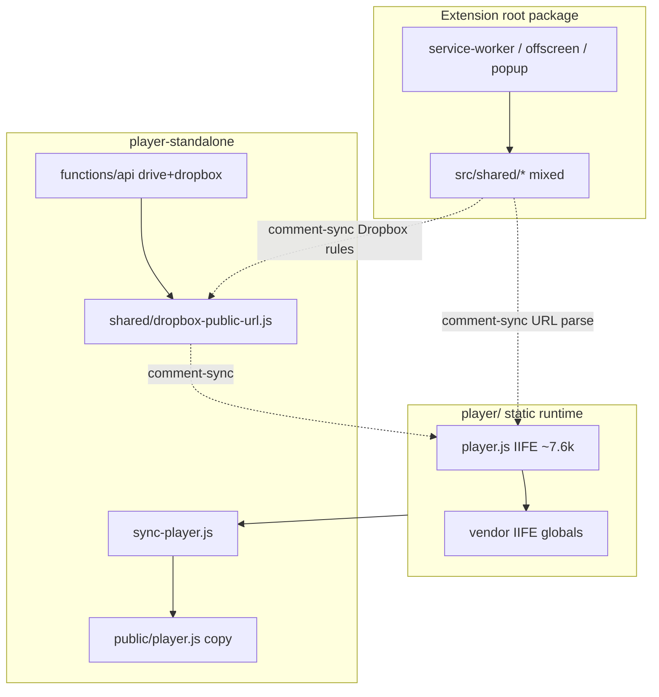
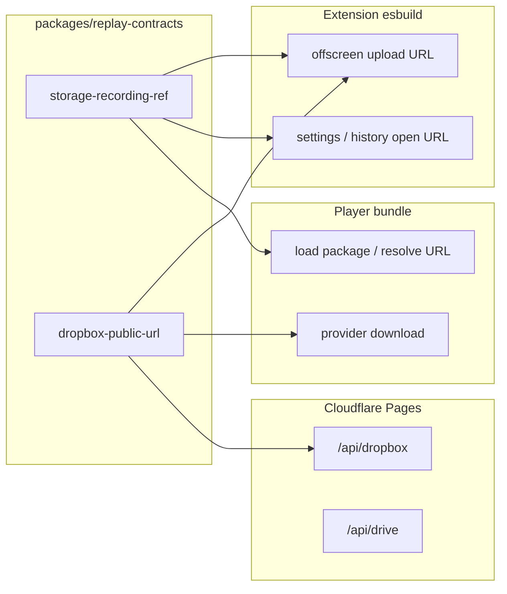

# Có Nên Tách Code Dùng Chung Extension/Player Ra Package Riêng?

## Bối Cảnh

Repo hiện có **ba runtime độc lập**, không phải monorepo có workspace:

| Runtime | Package | Build | Vai trò |
| --- | --- | --- | --- |
| Extension MV3 | root `gn-tracing` | esbuild (`esbuild.config.mjs`) | capture, OAuth, zip upload, UI popup/settings/history |
| Built-in player | folder `player/` (static, không npm package) | copy nguyên file vào `dist/player/` | replay trong extension |
| Standalone player | `player-standalone` | Vite + Cloudflare Pages | replay public tại `tracing.gnas.dev` |

Cách “dùng chung” hiện tại:

1. **`player/player.js` + `player.css` + `vendor/`** là source of truth cho **cả** extension player và standalone player. Standalone mirror bằng `player-standalone/scripts/sync-player.js` (và theme từ root `shared/`).
2. **`src/shared/*`** là shared **bên trong extension** (service worker, offscreen, popup, settings, content). Player raw JS **không import** được TS này nếu không có bước bundle riêng.
3. Một số rule “phải giữ sync bằng comment” đã **triple-copy**:
   - `parseStorageRecordingRef` (`src/shared/storage-provider.ts`) ↔ `resolveReplayRecordingRef` (`player/player.js`)
   - Dropbox public URL / SSRF allowlist: `src/shared/dropbox-api.ts` + `player-standalone/shared/dropbox-public-url.js` + inline trong `player/player.js`
4. Một số logic “shared” đã đi theo pattern **vendor IIFE** (đúng hướng nhưng ad-hoc):
   - `src/shared/webm-seek-fix.ts` → `player/vendor/webm-seek-fix/` (`window.gnMakeWebmSeekable`)
   - `src/shared/player-timeline-seek.ts` → vendor global tương tự

Plan liên quan: `repo-code-quality-cleanup.md` (Phase 4 — player modularization, dual-track `player.js`), `multi-cloud-storage-providers.md` (URL namespace + proxy rules).

## Nguyên Nhân Và Lý Do Thiết Kế

### Triệu chứng dễ nhầm

- “Extension và player đều có `shared`” → muốn gộp hết thành một npm package.
- “Standalone copy `player.js`” → tưởng cần package publish để publish player.

### Nguyên nhân gốc rễ

1. **Hai toolchain không cùng module graph**
   - Extension: TypeScript + esbuild, có `chrome.*`, define env (`__GOOGLE_CLIENT_ID__`…).
   - Player: vanilla JS IIFE ~7.6k dòng, không bundler, chạy cả extension page lẫn hosted page.
   - Standalone: Vite + Pages Functions (Node edge) riêng.

2. **“Shared” hiện tại trộn nhiều tầng**
   - **Pure contract** (URL parse, Dropbox id allowlist) — *nên* dùng chung thật.
   - **Capture/redaction/upload helpers** (`privacy-redaction`, Drive/Dropbox *upload* API, folder parse) — chỉ extension.
   - **Extension UI chrome** (`upload-history-ui`, `feedback-ui`, `page-nav`, theme toggle) — chỉ extension pages.
   - **Player UI/runtime** (zip decrypt, timeline, panels, effects) — chỉ player; đã “shared” qua copy file, không qua package.

3. **Drift được bảo vệ bằng comment, không bằng type/import**
   - Comment “Keep in sync with …” là smell kiến trúc: compiler không bắt khi một bên đổi.
   - Đặc biệt nguy hiểm với Dropbox SSRF allowlist (proxy + player + extension upload id encoding).

4. **Package riêng không giải quyết monolith player**
   - Bottleneck lớn nhất vẫn là `player/player.js` untyped + dual-track copy (`repo-code-quality-cleanup` Phase 4).
   - Tách package mà player vẫn IIFE hand-written thì package chỉ phục vụ extension + proxy, player vẫn copy tay.

## Góc Nhìn Tổng Quan Và Phạm Vi Tập Trung



**Phạm vi tập trung của plan này:** quyết định kiến trúc — *có nên / khi nào / tách cái gì* thành package dùng chung giữa extension và player (và proxy standalone).

**Không** nhằm redesign toàn bộ monorepo hay rewrite player sang framework.

## Mục Tiêu

1. Trả lời rõ: **có nên tách package riêng không**, với tiêu chí lợi/hại cụ thể cho repo này.
2. Phân loại **nên share / không nên share / share bằng cách khác**.
3. Đề xuất lộ trình **incremental** (extract pure contracts trước, monorepo sau nếu cần), gắn với Phase 4 player modularization.
4. Giữ nguyên behavior replay URL, Dropbox SSRF rules, extension packaging, standalone deploy.

## Ngoài Phạm Vi

- Publish package lên npm public (không cần; private workspace là đủ nếu làm).
- Gộp `worker/` OAuth proxy vào cùng package shared client (worker có secret/edge runtime khác).
- Rewrite player bằng React/Vue hoặc tách toàn bộ `src/shared` sang package trong một PR.
- Thêm cloud provider mới.
- Dọn dual-track `public/player.js` committed (có thể làm song song nhưng là concern riêng của Phase 4).

## Logic Nghiệp Vụ / Tiêu Chí Quyết Định

Tách package **chỉ khi** module thỏa **cả** các điều kiện sau:

| # | Điều kiện | Ý nghĩa |
| --- | --- | --- |
| C1 | **Dùng bởi ≥ 2 runtime** trong {extension TS, player browser, Pages proxy} | Một consumer → giữ nơi consumer sống |
| C2 | **Pure** (không `chrome.*`, không DOM UI, không env secret) | Import được từ esbuild, Vite, và (nếu cần) IIFE vendor |
| C3 | **Drift có hậu quả bảo mật hoặc contract** | URL replay, SSRF allowlist, schema entry names… |
| C4 | **API ổn định / nhỏ** | Package rẻ bảo trì; tránh “shared kitchen sink” |

Nếu chỉ thỏa C1 qua **cùng một file player** (extension player = standalone player), thì **không cần package** — chỉ cần **single source + build sync** (đã có `sync-player.js`).

## Phân Loại Code Hiện Tại

### A. Nên share bằng package/module pure (ưu tiên cao)

| Module / rule | Consumers hiện tại | Rủi ro nếu drift |
| --- | --- | --- |
| `parseStorageRecordingRef` / `buildStorageRecordingPath` / path segments | extension upload URL + player resolve | Replay link sai provider / fail open OneDrive legacy |
| Dropbox public id → download URL + host/path allowlist | extension encode id, player download, Pages `/api/dropbox` | **SSRF / open proxy** |
| Hằng số package entries (`recording-index.json`, `video.part-XXX.webm`, …) nếu xuất hiện ở nhiều nơi | capture zip + player parse | Parser im lặng bỏ artifact |

### B. Đang share đúng cách (giữ pattern, không cần package npm)

| Surface | Cách share | Ghi chú |
| --- | --- | --- |
| `player/player.js` UI runtime | single source + `sync-player` + esbuild static copy | Đúng; vấn đề là monolith + dual-commit, không phải thiếu package |
| Theme CSS (`shared/theme.css`) | copy static | Ổn; CSS package ít giá trị |
| WebM seek / timeline seek | TS source + vendor IIFE script | Pattern vendor ổn cho pre-modular player; sau modular hóa thì import trực tiếp |

### C. Không nên đưa vào package “chung extension+player”

| Module | Lý do |
| --- | --- |
| `privacy-redaction` | Capture-time only; player chỉ render artifact đã redact |
| `google-drive-api` / `dropbox-api` **upload/session** | Extension + token; player chỉ cần public download helpers |
| `upload-history-ui`, `feedback-ui`, `page-nav`, `theme.ts` controllers | Extension pages + `chrome.runtime` |
| `drawing`, `recording-target`, CDP types | Capture pipeline |
| Toàn bộ `src/shared` gộp một package | Trộn boundary → package thành dumping ground |

### D. Mirror test / adapter (xử lý bằng modular player, không bằng package trước)

- Luna adapter logic mirror trong `src/shared/luna-adapter.test.ts` vs `player/player.js` — hết mirror khi player import được module typed.

## Cấu Trúc Giải Pháp (Các Phương Án)

### Phương án 0 — Status quo + comment sync

- **Ưu:** zero cost.
- **Nhược:** triple Dropbox rules; URL parse drift; đã có comment cảnh báo nhưng không enforce.
- **Kết luận:** chấp nhận được ngắn hạn, **không** là đích kiến trúc.

### Phương án 1 — Extract package thin `packages/replay-contracts` (hoặc `packages/gn-tracing-contracts`) — **đề xuất**

Private package trong repo (npm workspaces **chỉ** nếu cần; hoặc path import/`file:` cũng được):

```text
packages/replay-contracts/
  package.json          # name: @gn-tracing/replay-contracts, private, type: module
  src/
    storage-recording-ref.ts   # parse/build URL
    dropbox-public-url.ts      # allowlist + buildDropboxPublicDownloadUrl
    package-entries.ts         # optional constants
  src/*.test.ts
```

**Consumers:**

| Consumer | Cách dùng |
| --- | --- |
| Extension (`src/**`) | `import { parseStorageRecordingRef } from "@gn-tracing/replay-contracts"` (workspace) hoặc relative re-export từ `src/shared/*` thin wrapper |
| Player | **Sau** modular + esbuild/vite bundle: import ES module. **Trước** modular: `scripts/vendor-contracts.mjs` emit IIFE `window.gnReplayContracts` (cùng pattern webm-seek) |
| Pages Functions + Vite proxy | import ESM từ package (Functions hỗ trợ bundle hoặc copy build) |

**Không** nhét redaction/UI/upload vào package này.

### Phương án 2 — Full monorepo workspaces (root + player-standalone + packages/*)

- **Ưu:** một `npm install`, knip/test thống nhất về sau.
- **Nhược:** chi phí tooling lớn (Taskfile, CI, knip, husky, Cloudflare deploy path); `worker/` vẫn edge riêng; **không** tự hết dual `player.js`.
- **Kết luận:** **trì hoãn** cho đến khi (1) contracts package đã sống ổn và (2) player đã modular đủ để import package. Không làm monorepo chỉ vì câu hỏi “có nên share không”.

### Phương án 3 — Chỉ modularize player, không package

- Split `player/` thành modules, bundle ra một `player.js` cho extension + standalone.
- Shared contracts vẫn có thể nằm `src/shared` và bị **import ngược** từ player build — nhưng extension `src/` mang semantic “extension source”; player build phụ thuộc `src/` tạo coupling lạ (player → extension tree).
- **Kết luận:** modular player **vẫn nên làm** (Phase 4), nhưng pure contracts **nên nằm ngoài** cả `src/` extension và `player/` UI — tức Phương án 1 là boundary sạch hơn.

### Phương án 4 — Publish shared lên npm / git submodule

- Overkill cho product single-repo, GPL, private app. **Loại.**

## Mô Hình C4 (Target — Phương án 1)



## Hướng Tiếp Cận Đề Xuất

### Quyết định chính

| Câu hỏi | Trả lời |
| --- | --- |
| Có nên tách **toàn bộ** shared extension+player ra một package? | **Không.** Hầu hết `src/shared` chỉ là extension-internal. |
| Có nên tách **package riêng** cho phần dùng chung thật? | **Có, nhưng mỏng** — pure contracts (URL + Dropbox public URL + optional package constants). |
| Có nên monorepo workspaces ngay? | **Chưa.** Làm contracts trước; workspace chỉ khi friction import/build rõ. |
| Player UI có nên là package riêng? | **Không bắt buộc.** Single source `player/` + build emit là đủ; packageize player chỉ khi publish/reuse ngoài repo. |
| Việc quan trọng hơn package? | **Modularize `player.js` + single generated artifact** (Phase 4 quality plan) — package contracts **bổ trợ**, không thay thế. |

### Thứ tự khuyến nghị

```text
Bước 0 (now, optional quick win)
  Không tạo package; thêm test contract “golden” so khớp behavior
  giữa storage-provider.ts, player resolve, dropbox-public-url.js
  → chặn drift trước khi extract.

Bước 1 (P0 extract)
  packages/replay-contracts với storage-recording-ref + dropbox-public-url
  Extension import; proxy import; player vendor IIFE hoặc import sau bundle.

Bước 2 (P1 player modular)
  Bundle player từ modules; bỏ dual-commit public/player.js nếu practical;
  player import contracts trực tiếp, gỡ vendor globals khi không cần.

Bước 3 (P2 optional)
  npm workspaces root + packages/* + player-standalone nếu tooling đau.
  Chỉ khi Bước 1–2 đã chứng minh shared surface ổn định.
```

### Nguyên tắc thiết kế package

1. **Zero Chrome / zero DOM / zero secrets** trong contracts package.
2. **Một implementation, nhiều entry** (ESM cho TS; optional IIFE vendor cho pre-bundle player).
3. **Không** re-export extension types messages/recording bulk — player không cần service-worker message envelope.
4. **API surface nhỏ hơn 10 exports** lúc đầu; expand khi có consumer thứ 3 thật.
5. Mọi thay đổi URL/Dropbox rules: một PR, một module, test trong package.

## Chi Tiết Triển Khai (Khi Được Duyệt)

### Phase A — Inventory + golden contract tests (thấp rủi ro)

1. Liệt kê export pure trong `storage-provider.ts` và Dropbox public helpers; so khớp table behavior với `player.js` + `dropbox-public-url.js`.
2. Thêm test matrix dùng chung input (path, `?id=`, `/onedrive/`, absolute Dropbox URL reject, prefixes `s/scl/sh/sm`).
3. Chưa move file; test có thể import TS + eval mirror hoặc run fixtures JSON.

### Phase B — Tạo `packages/replay-contracts`

1. Scaffold package private, TypeScript strict, vitest.
2. Move/copy implementations:
   - từ `storage-provider.ts` phần parse/build path (giữ `StorageProviderId` ở đây hoặc type-only)
   - từ `dropbox-api.ts` / `dropbox-public-url.js` phần public URL pure
3. `src/shared/storage-provider.ts` và `dropbox-api.ts` trở thành **re-export hoặc thin wrapper** (upload-specific API vẫn ở extension).
4. `player-standalone/shared/dropbox-public-url.js` → import package (hoặc generate file).
5. Player: vendor script `window.gnReplayContracts` **hoặc** (nếu Bước 2 sẵn) import trong bundle.

### Phase C — Player modularization (phối hợp Phase 4 quality)

1. esbuild/vite entry cho player modules → một `player.js` artifact.
2. Extension copy artifact; standalone sync/gitignores generated copy.
3. Contracts thành dependency thật của player graph.

### Phase D — Workspaces (optional)

1. Root `"workspaces": ["packages/*", "player-standalone"]` nếu muốn.
2. Cập nhật Taskfile, knip, docs build-from-scratch.

## Công Việc Cần Làm (Checklist Khi Triển Khai)

- [ ] Chốt scope package = pure contracts only (không dump `src/shared`)
- [ ] Golden tests chặn drift URL + Dropbox (Phase A)
- [ ] Scaffold `packages/replay-contracts`
- [ ] Wire extension imports + xóa duplicate implementation
- [ ] Wire Pages proxy / Vite middleware
- [ ] Wire player (vendor IIFE hoặc bundle import)
- [ ] Cập nhật docs: `drive-and-player.md`, `replay-player.md`, `build-from-scratch/07`, DEVELOPER
- [ ] Không bắt đầu full monorepo trừ khi Phase B–C xong và còn friction

## Rủi Ro Và Ràng Buộc

| Rủi Ro | Mức | Mitigation |
| --- | --- | --- |
| Over-extract: mọi thứ vào `packages/shared` | Cao | Gate C1–C4; review từ chối module extension-only |
| Player vẫn IIFE → package “nửa sống” | Trung | Vendor IIFE tạm; ưu tiên Phase C |
| Đổi path import làm vỡ esbuild/Pages | Trung | Thin re-export tại chỗ cũ; test upload + proxy + player |
| Dual-track `public/player.js` vẫn phình git | Trung | Xử lý trong Phase C, không trộn vào PR contracts nếu có thể |
| Type `StorageProviderId` lan ra worker/player | Thấp | Package chỉ export id union + parse; không export OAuth types |
| Chi phí maintain workspace cho team nhỏ | Trung | Trì hoãn Phase D |

## Impact Nghiệp Vụ / Acceptance

- **User-facing:** không đổi. Replay URL `/gdrive/…`, `/dropbox/…`, legacy bare id, password zip, proxy behavior giữ nguyên.
- **Dev-facing:** sửa rule URL/Dropbox **một nơi**; hết “remember to update player.js”.
- **Acceptance khi làm Phase B:**
  1. `npm test` (root + package + player-standalone) pass.
  2. Unit: matrix parse URL + reject Dropbox absolute id.
  3. Manual: upload Drive + Dropbox → mở extension player + standalone URL.
  4. Proxy `/api/dropbox` vẫn reject absolute URL / path `..` / non-shared prefix.
  5. Không tăng surface `chrome` permission hay bundle secret.

## Kiểm Chứng

```bash
# Sau Phase A/B
npm test
npm run deadcode
npx biome check . --files-ignore-unknown=true
task build
task player:sync   # hoặc player:build
cd player-standalone && npm test
```

Manual matrix:

- URL: `/gdrive/<id>`, `/dropbox/<id>`, `?id=`, bare legacy id, `/onedrive/…` fail closed
- Dropbox id: `scl/…?rlkey=`, reject `https://evil.com/…`
- Extension token download vs public/proxy fallback
- Password-protected zip unlock

## Tóm Tắt Quyết Định (Cho Reviewer)

**Không** tách “mọi thứ dùng chung extension và player” thành một package lớn.

**Có** nên tách **một package contracts mỏng** cho:

1. Replay URL parse/build
2. Dropbox public download URL + SSRF allowlist
3. (Tuỳ chọn) hằng số entry package

**Song song / quan trọng hơn về maintainability:** modularize `player/player.js` và coi `player/` (+ build emit) là shared **runtime**, không cần npm package cho UI.

**Không** monorepo workspaces ngay; **không** move `privacy-redaction` / upload APIs / extension UI vào package player-facing.

---

**Status:** chờ phê duyệt. Không chỉnh source cho đến khi user chốt phương án (khuyến nghị: **Phương án 1 + thứ tự Bước 0→1→2**, trì hoãn Bước 3).
