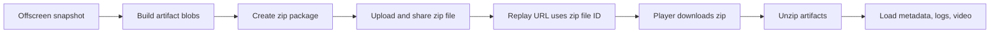

# Upload Recording As Zip

## Bối Cảnh

Luồng hiện tại upload từng artifact của một recording lên Google Drive: metadata, manifest, recording index, các log tùy chọn và từng phần video. Replay link dùng một file ID để player tải `recording-index.json`, rồi tiếp tục tải các file còn lại theo ID trong index.

Yêu cầu mới là gom toàn bộ artifact của recording thành một file zip trước khi upload. Replay link phải trỏ tới file zip đó, và player phải tải zip về rồi unzip để load playback.

## Nguyên Nhân Và Lý Do Thiết Kế

Triệu chứng là replay đang phụ thuộc vào nhiều Drive file công khai. Nguyên nhân trực tiếp là upload queue hiện chạy theo artifact riêng lẻ và index chỉ đóng vai trò entrypoint. Nguyên nhân gốc rễ là storage contract đang folder-scoped, khiến một recording không còn là một artifact nguyên tử.

Hướng zip biến recording thành một package duy nhất: upload một file, share một file, replay một file. Manifest và index vẫn nên nằm trong zip để giữ schema tự mô tả và tránh phải viết lại toàn bộ player parser.

## Phạm Vi

- Offscreen upload tạo `metadata.json`, `manifest.json`, `recording-index.json`, log JSON và video parts trong bộ nhớ, đóng gói thành `gn-tracing-*.zip`, rồi upload zip lên Drive.
- Replay URL dùng ID của zip file.
- Player khi nhận ID sẽ tải file đó, detect zip, unzip và đọc artifact trong package.
- Legacy replay bằng `recording-index.json` vẫn nên được giữ như fallback để các link cũ không hỏng.

## Cấu Trúc Giải Pháp

## Công Việc Cần Làm

- Thêm helper tạo zip tối giản trong offscreen runtime.
- Đổi upload progress để hiển thị bước package zip và upload zip thay vì từng file Drive.
- Mở rộng player loader để đọc artifact descriptor từ blob/json nội bộ hoặc từ Drive file ID legacy.
- Thêm parser zip tối giản trong player runtime, không thêm dependency vào shared player JS.
- Sync `player/player.js` sang standalone public asset.

## Rủi Ro Và Kiểm Chứng

- Zip dùng store method không nén để tránh dependency và giữ runtime đơn giản; cần CRC32 đúng để zip hợp lệ.
- Player unzip cần validate tên file và local header để lỗi zip hỏng hiển thị rõ.
- Kiểm chứng mục tiêu: TypeScript check cho extension và standalone, plus static sync của player asset.
