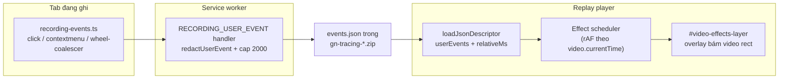

# Hiệu Ứng Click Trái, Click Phải Và Scroll Trên Video Replay

## Bối Cảnh

Replay player hiện phát lại video quay màn hình tab kèm evidence (console, network, WebSocket, user events). Người xem replay không nhìn thấy trực quan **khi nào và ở đâu** người dùng đã click hoặc scroll — chỉ có thể suy đoán qua timeline marker màu xanh lá và danh sách event (tối đa 12 dòng) ở tab Report.

Yêu cầu: khi playback chạy đến thời điểm người dùng đã click chuột trái, click chuột phải hoặc scroll, player phải hiển thị hiệu ứng trực quan (visual effect) đè lên đúng vị trí tương ứng trên video — tương tự click ripple của các công cụ session replay.

## Nguyên Nhân Và Lý Do Thiết Kế

Nguyên nhân gốc rễ nằm ở **cả hai đầu pipeline**:

1. **Capture chưa đủ dữ liệu.** `src/content/recording-events.ts` hiện chỉ bắt `click` (chuột trái, có `clientX`/`clientY`), `focusin`, `submit`, `navigation`. Chưa có listener cho `contextmenu` (chuột phải) và chưa có bất kỳ tín hiệu scroll nào. Không thể vẽ hiệu ứng cho dữ liệu không tồn tại.
2. **Player chưa có lớp render hiệu ứng.** `player/player.js` đã load `events.json` thành `userEvents` kèm `relativeMs` (đồng bộ với video timeline) nhưng chỉ dùng cho marker trên progress bar và event list — không có overlay nào trên vùng video.

Điều kiện thuận lợi đã có sẵn:

- Video là tab capture (`getUserMedia` với `chromeMediaSource: "tab"`, max 1920×1080) nên khung hình video **trùng tỷ lệ với viewport** của tab; tọa độ `clientX`/`clientY` (CSS px) ánh xạ tuyến tính sang tọa độ hiển thị của video.
- `report.json` chứa `environment.viewport { width, height, devicePixelRatio }` — đủ để quy đổi tọa độ.
- Cơ chế fit video (`updateVideoFit`, class `video-fit-width`/`video-fit-height`) làm cho chính element `<video>` khớp đúng vùng hiển thị video, nên overlay chỉ cần bám theo bounding box của element này.

## Góc Nhìn Tổng Quan Và Phạm Vi Tập Trung

Pipeline liên quan: content script capture → service worker buffer/redaction (`RECORDING_USER_EVENT`, cap 2000 events) → `events.json` trong zip package → player parse → render.

Vùng chạm:

- `src/content/recording-events.ts` — thêm listener `contextmenu` và `wheel`.
- `src/types/recording.ts` — mở rộng union `RecordingUserEvent`.
- `src/shared/privacy-redaction.ts` — `redactUserEvent` xử lý text/selector cho event type mới.
- `player/player.js`, `player/player.css`, `player/player.html`, `player-standalone/index.html` — overlay layer, scheduler, hiệu ứng, label/marker.
- Docs: `docs/modules/recording-runtime.md`, `docs/modules/replay-player.md`, `docs/shared/data-models.md`.

Không chạm: service worker (đường `RECORDING_USER_EVENT` là generic, dùng lại nguyên trạng — DOM snapshot chỉ trigger trên `navigation` nên event type mới không gây side effect), upload orchestrator, Drive/proxy, zip parser.

## Mục Tiêu

1. Bản ghi mới chứa event `contextmenu` (chuột phải) và `scroll` (cuộn) với tọa độ, bên cạnh `click` hiện có.
2. Trong lúc playback, player hiển thị hiệu ứng tại đúng vị trí và đúng thời điểm trên video:
   - Click trái: vòng ripple lan tỏa (màu accent).
   - Click phải: ripple phân biệt được (màu khác / vòng kép).
   - Scroll: chỉ báo hướng (mũi tên lên/xuống) fade tại vị trí con trỏ.
3. Event mới xuất hiện nhất quán trong event list và timeline marker hiện có.
4. Tương thích hai chiều: package cũ (không có event mới) phát bình thường; player cũ gặp event type mới không vỡ (event list fallback hiển thị `event.type`, marker vẫn render).

## Ngoài Phạm Vi

- Vẽ đường di chuyển chuột (mouse trail) — cần capture `mousemove` liên tục, khác hẳn chi phí/khối lượng dữ liệu.
- Bắt scroll qua kéo scrollbar hoặc phím (PageDown/Space) — `wheel` chỉ phủ cuộn bằng chuột/trackpad; các nguồn scroll khác để giai đoạn sau nếu cần.
- Toggle bật/tắt hiệu ứng trong UI player (mặc định luôn bật; thêm sau nếu có nhu cầu).
- Thay đổi schema version của `events.json` (thay đổi thuần additive).

## Logic Nghiệp Vụ

- **Chuột phải** dùng event DOM `contextmenu` (event `click` không phát cho nút phải), giữ nguyên bộ metadata an toàn như click: `selector`, `text` (đã qua safe-text filter), `role`, `x`, `y`.
- **Scroll** dùng event `wheel` (passive, capture) vì nó mang sẵn `clientX`/`clientY` và `deltaY`. Scroll phát rất dày nên phải **coalesce phía content script**: gộp một "burst" cuộn liên tục thành một event duy nhất (vị trí đầu burst, hướng theo tổng delta, kết thúc burst khi ngừng cuộn ~400ms hoặc đổi hướng). Điều này giữ event volume dưới cap `MAX_RECORDED_USER_EVENTS = 2000` và tránh spam timeline.
- **Ánh xạ tọa độ khi replay**: `xDisplay = (event.x / viewport.width) × videoRect.width` (tương tự cho y), với `viewport` lấy từ `report.environment.viewport`. Tỷ lệ CSS-px/CSS-px nên `devicePixelRatio` tự triệt tiêu. Nếu thiếu viewport (package cũ/report hỏng), fallback quy đổi theo kích thước intrinsic của video (`videoWidth`/`devicePixelRatio` nếu có, mặc định dpr = 1) và luôn clamp vào biên video.
- **Đồng bộ thời gian**: event đã có `relativeMs = timestamp − startTime` do player tính sẵn khi load `events.json`. Hiệu ứng bắn khi `video.currentTime` vượt qua `relativeMs`. Khi user seek, không phát dồn các hiệu ứng bị bỏ qua — chỉ phát event nằm trong cửa sổ trailing ngắn (~300ms) để thao tác "click vào event list để nhảy tới event" vẫn thấy hiệu ứng.
- **Privacy**: event mới đi qua `redactUserEvent` như click hiện tại (redact `selector`, `text`); tọa độ x/y không phải dữ liệu nhạy cảm theo policy hiện hành (click đã lưu x/y từ trước).

## Cấu Trúc Giải Pháp

## Mô Hình C4



## Hướng Tiếp Cận Đề Xuất

Thêm hai variant mới vào union `RecordingUserEvent` thay vì nhét cờ `button` vào event `click`:

```ts
| { type: "contextmenu"; timestamp: number; selector?: string; text?: string; role?: string; x?: number; y?: number }
| { type: "scroll"; timestamp: number; selector?: string; x?: number; y?: number; direction: "up" | "down"; deltaY?: number }
```

Lý do: `contextmenu` là event DOM riêng biệt (không đi qua handler `click`), và union theo `type` giữ cho `redactUserEvent`, `getEventLabel`, marker rendering phân nhánh sạch — nhánh generic `"selector" in cloned` trong redaction tự phủ hai type mới.

Phía player, dựng một **overlay layer duy nhất** (absolute, `pointer-events: none`) bên trong `#video-container`, đồng bộ kích thước/vị trí với bounding box của `<video>` (đã được `updateVideoFit` co đúng vùng hiển thị). Hiệu ứng là các element ngắn hạn (~600–800ms) gắn CSS animation, tự remove khi `animationend`.

Scheduler chạy bằng `requestAnimationFrame` khi video đang play (không dùng handler `timeupdate` hiện có vì throttle 250ms làm hiệu ứng lệch nhịp), giữ con trỏ index trên mảng effect-events đã sort theo `relativeMs`; `seeking`/`seeked` chỉ reposition con trỏ.

## Chi Tiết Triển Khai

### 1. Capture — `src/content/recording-events.ts`

- `onContextMenu(event: MouseEvent)`: giống `onClick` nhưng `type: "contextmenu"`; đăng ký `document.addEventListener("contextmenu", ..., true)` và remove trong `cleanup`.
- Wheel coalescer:
  - Listener `wheel` trên `document` với `{ capture: true, passive: true }`.
  - State burst: `{ startTimestamp, x, y, accumulatedDeltaY, selector }` lấy từ wheel event đầu tiên.
  - Flush burst (gửi một `RECORDING_USER_EVENT`) khi: không có wheel mới trong 400ms (timer), hoặc dấu của `deltaY` đảo chiều (flush burst cũ, mở burst mới).
  - `direction` = `accumulatedDeltaY < 0 ? "up" : "down"`; `timestamp` = thời điểm đầu burst.
  - `cleanup` phải clear timer và flush burst đang treo để không mất event cuối khi stop recording.

### 2. Types — `src/types/recording.ts`

- Thêm hai variant như trên vào `RecordingUserEvent`. `RecordingUserEventArtifact` giữ `schemaVersion: 1`.

### 3. Redaction — `src/shared/privacy-redaction.ts`

- `redactUserEvent`: mở rộng điều kiện redact `text` từ `cloned.type === "click"` thành click **hoặc** contextmenu. Nhánh selector generic đã tự phủ.

### 4. Player markup — `player/player.html` và `player-standalone/index.html`

- Thêm `<div id="video-effects-layer" class="video-effects-layer" aria-hidden="true"></div>` ngay sau `<video id="video-player">` trong `#video-container` (cả hai file có markup trùng nhau, cập nhật đồng bộ).

### 5. Player logic — `player/player.js`

- `elements.videoEffectsLayer` trong khối cache elements.
- Khi load xong `events.json`: build `effectEvents` = các `userEvents` có type `click`/`contextmenu`/`scroll` và có tọa độ hữu hạn, sort theo `relativeMs`.
- `syncEffectsLayerBox()`: đặt overlay trùng `getBoundingClientRect()` của `<video>` (tương đối với `#video-container`); gọi từ `updateVideoFit` (đã có sẵn resize/ResizeObserver hook).
- Scheduler:
  - rAF loop chạy khi `play`, dừng khi `pause`/`ended`.
  - Mỗi frame: phát mọi event có `relativeMs ∈ (lastTimeMs, currentTimeMs]`, nhưng bỏ qua event cũ hơn `currentTimeMs − 300ms` (chặn phát dồn sau seek/lag).
  - `seeking`: reset `lastTimeMs = currentTimeMs` mới; sau `seeked`, nếu có event trong cửa sổ trailing 300ms thì phát (phục vụ jump từ event list).
- `spawnEffect(event)`: tính vị trí theo công thức ánh xạ ở phần Logic Nghiệp Vụ, tạo element hiệu ứng theo type, remove khi `animationend` (kèm hard-cap số node đang sống, ví dụ 20, tránh rò khi tua với tốc độ cao).
- `getEventLabel`: thêm nhánh `contextmenu` ("Right click …") và `scroll` ("Scroll up/down …").
- Marker: giữ chung màu user-event hiện tại (`#3fb950`) — không cần phân màu ở progress bar.

### 6. Player styles — `player/player.css`

- `.video-effects-layer`: absolute, `overflow: hidden`, `pointer-events: none`, z-index trên video nhưng dưới controls.
- Keyframes: `effect-click-ripple` (vòng tròn scale + fade), `effect-rclick-ripple` (vòng kép/màu phân biệt), `effect-scroll` (chip mũi tên trượt nhẹ theo hướng + fade). Tôn trọng `prefers-reduced-motion: reduce` (rút gọn thành fade tĩnh).

### 7. Docs

- `docs/shared/data-models.md`: bổ sung hai variant event mới.
- `docs/modules/recording-runtime.md`: mô tả capture contextmenu + wheel coalescing.
- `docs/modules/replay-player.md`: bổ sung mục hiệu ứng input overlay trong Inspection UX.

## Công Việc Cần Làm

1. Mở rộng `RecordingUserEvent` (types) + cập nhật `redactUserEvent` + test redaction cho `contextmenu`/`scroll`.
2. Capture: listener `contextmenu` và wheel coalescer trong `recording-events.ts` (kèm cleanup/flush).
3. Player: overlay markup (2 file HTML), CSS hiệu ứng, effect scheduler + coordinate mapping + label mới trong `player.js`.
4. Cập nhật 3 file docs nêu trên.
5. Kiểm chứng end-to-end (mục Kiểm Chứng).

## Rủi Ro Và Ràng Buộc

- **Lệch tọa độ khi resize giữa phiên ghi**: viewport trong `report.environment` là snapshot tại navigation gần nhất; nếu user resize cửa sổ giữa chừng, tab capture giữ kích thước stream ban đầu còn tọa độ CSS mới sẽ lệch. Chấp nhận sai số này (giới hạn sẵn có của kiến trúc capture), hiệu ứng luôn clamp trong biên video.
- **Trang zoom (Ctrl +/-)**: `clientX/clientY` theo CSS px sau zoom, viewport `innerWidth` cũng theo CSS px sau zoom — tỷ lệ vẫn khớp, không cần xử lý riêng.
- **Event flood từ wheel**: đã chặn bằng coalescing 400ms phía content script; vẫn còn cap cứng 2000 event ở service worker nên phiên cuộn cực dài chỉ mất event cũ nhất (hành vi cap hiện hữu, không đổi).
- **`contextmenu` trên trang chặn menu**: trang gọi `preventDefault()` vẫn phát `contextmenu` ở capture phase — không mất event.
- **Player cũ đọc package mới**: `getEventLabel` fallback trả về `event.type`, marker/event list không vỡ — đã kiểm tra nhánh fallback hiện có.
- Player runtime là JS thuần dùng chung extension/standalone — không thêm dependency, không đổi cách sync (`sync-player.js` mirror nguyên trạng).

## Kiểm Chứng

1. `npx vitest run src/shared/privacy-redaction.functions.test.ts` — case mới cho `contextmenu`/`scroll` (selector/text redaction).
2. `npx biome check` trên các file đã sửa; `npm run build` (hoặc task build tương ứng) để chắc bundle content script không vỡ.
3. Thủ công end-to-end: ghi một phiên có click trái, click phải, cuộn lên/xuống → mở replay → xác nhận (a) hiệu ứng xuất hiện đúng vị trí/thời điểm ở cả layout ngang/dọc và immersive mode, (b) seek qua event list vẫn thấy hiệu ứng, (c) tua nhanh 4x không tích tụ node hiệu ứng.
4. Mở một package cũ (không có event mới) → player hoạt động như trước, không lỗi console.
